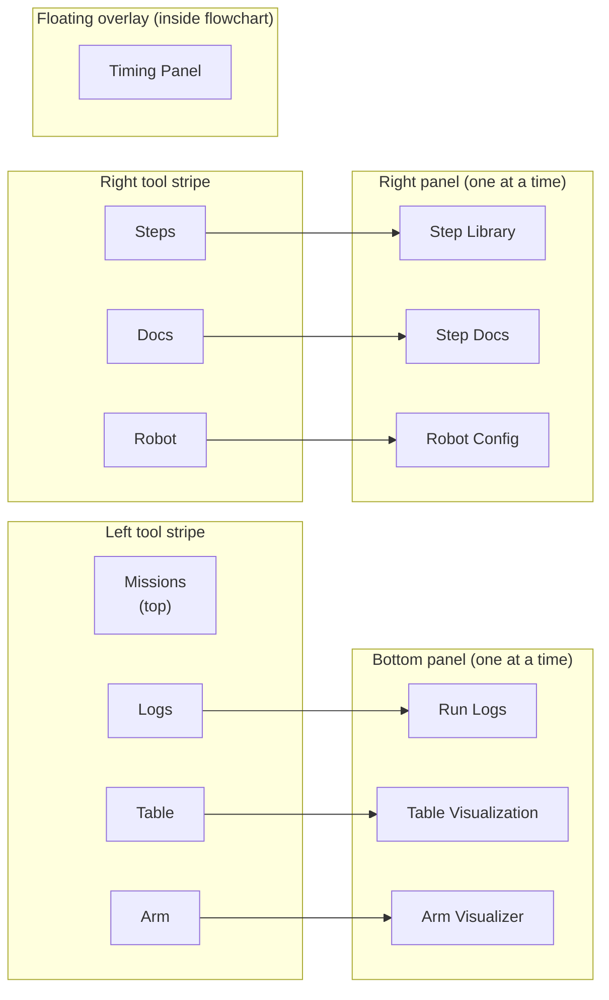

## Tool Panels

The Web IDE's supplementary views are **docked tool panels** — they slide open from the bottom or the right side of the editor and are resizable. Only the **Timing Panel** is a floating, draggable overlay (inside the flowchart canvas itself).

**Bottom panels** are for observing — Logs (what is the robot printing?), Table Visualization (where is the robot?), and Arm Visualizer (what are the joint angles?).

**Right panels** are for building — Step Library (what steps can I use?), Step Docs (what does this step do?), and Robot Config (what is my robot's geometry?).

Only one bottom panel and one right panel can be open at a time. The selection and sizes survive page reloads (stored in `localStorage`).

### How to toggle panels

| Panel | Location | Toggle icon | Stripe position |
|-------|----------|-------------|-----------------|
| **Logs** | Bottom | Code brackets `</>` | Left stripe, bottom |
| **Table Visualization** | Bottom | Map icon | Left stripe, bottom |
| **Arm Visualizer** | Bottom | Android / robot arm icon | Left stripe, bottom |
| **Steps** (Step Library) | Right | Grid icon | Right stripe, top |
| **Docs** (Step Docs) | Right | Book icon | Right stripe, top |
| **Robot Config** | Right | Box icon | Right stripe, top |

*Each stripe button toggles exactly one panel. Clicking an already-open panel closes it.*

Click the icon once to open the panel; click again to close it. Only one bottom panel and one right panel can be open at a time. Panel selections and sizes are saved in `localStorage`.

---

## Run Logs (Bottom Panel)

The Logs panel shows the live output stream from the robot while a mission is running — the same log stream you see in the terminal when running `raccoon run`.

**Auto-open:** When a run starts, the Logs panel opens automatically so you can see output immediately without manually toggling it.

Key states:

| State | Display |
|-------|---------|
| No mission running | "Idle" (lowercase) |
| Run in progress | Live log lines appended in real time |
| Run completed | Final log lines remain visible |

Each log line shows the timestamp, level, and message from the raccoon runner. Errors appear in red.

---

## Table Visualization (Bottom Panel)

A live top-down view of the competition table showing:

- The **robot's current position and heading** (updated in real time during a run)
- The **planned path** computed by the fast heuristic simulator or libstp
- The **start pose** indicator
- Recorded localization data from previous runs (if loaded)

### Panel header controls

| Control | Icon | Function |
|---------|------|---------|
| Fit to view | Expand | Zoom to fit the whole table |
| Edit start pose | Flag (🚩) | Toggle start-pose edit mode (see [Settings]()) |
| Edit map | Pencil (✏) | Switch to the map editor (TableEditorView) |
| Close | Minus | Close the bottom panel |

### Path Planning Mode

The Table Visualization panel has an **Edit Path** button (map-marker icon) that opens a full-screen path planning overlay. This button is visible in the panel header when the panel is used in standalone mode. When path planning is active, it temporarily replaces the flowchart view so you can place waypoints on the full table.

**How path planning works:**

1. Open the Table Visualization bottom panel.
2. Click **Edit Path** (map-marker icon) in the panel header.
3. The center of the IDE switches to a full-screen planning overlay showing the table.
4. Click on the table canvas to place **waypoints** (numbered markers).
5. The IDE computes a path between waypoints and shows a preview.
6. Click **Add Steps** to insert the generated steps into the flowchart, then click **Close**.

#### Path modes

| Mode | Description |
|------|-------------|
| `linear` | Waypoints connected by straight-line segments. Each segment becomes a `drive_forward` or `drive_arc` step. |
| `spline` | Waypoints connected by a **Catmull-Rom spline**, producing smooth curves through all waypoints. |

#### Spline heading mode

When using spline mode, you can control how the robot's heading is computed at each waypoint:

| Heading mode | Description |
|-------------|-------------|
| `tangent` | Heading automatically follows the direction of the spline curve at each point. Good for smooth, consistent curves. |
| `explicit` | You set the heading at each waypoint manually. Use this when the robot needs to enter or leave a waypoint at a specific angle regardless of the path curve. |

#### A* pathfinding

When **A*** is enabled (default: on), the IDE uses A* search to route each linear segment around walls and obstacles defined in the map. This prevents the planner from generating paths that clip through map walls.

When A* is disabled, segments are direct straight lines between waypoints regardless of obstacles.

#### Strafe (Mecanum)

For robots with a **Mecanum** drivetrain, the **Allow Strafe** option allows the path planner to generate lateral (sideways) movement steps in addition to forward/backward movement. Disable if your robot should only move forward and rotate.

---

## Arm Visualizer (Bottom Panel)

The Arm Visualizer is a **Three.js 3D panel** for robotic arm chains. Open it with the robot arm icon (Android icon) in the left tool stripe.

It provides:

- A 3D rendered view of the arm chain geometry using OrbitControls (rotate, pan, zoom with mouse)
- **FK (Forward Kinematics)** view: set joint angles, see the end-effector position
- **IK (Inverse Kinematics)** view: drag the end-effector to a target, see the required joint angles
- **Live control**: send joint angle commands directly to the robot while it is connected

The arm configuration (joint count, lengths, axis directions) is read from the project's device info. The panel communicates with the IDE backend arm routes for IK computation and the Pi server for live hardware commands.

---

## Timing Panel (Floating, Inside Flowchart)

The Timing Panel is the one remaining **floating overlay** in the Web IDE. It appears inside the flowchart canvas after a run completes and shows per-step execution data.

**Content:**

- **List view**: step name, duration (seconds), elapsed time from mission start
- **Chart view**: bar chart of step durations for quick visual identification of slow steps

**Interaction:**

- Drag the panel to any position within the flowchart canvas. The position is remembered within the session.
- Toggle between list and chart view using the view-mode control in the panel.
- The panel is hidden while no run data is available.

Use the Timing Panel to identify which steps are taking longer than expected and to verify that step durations match your mission timing budget.

---

## Cross-references

- [Running a Mission]() — logs panel auto-opens when a run starts
- [Localization Replay]() — loading a recording into the Table Visualization panel
- [Arm Visualizer Panel]() — full reference for the Arm Visualizer
- [Settings Modal]() — map editing lives inside the Table Visualization panel header
