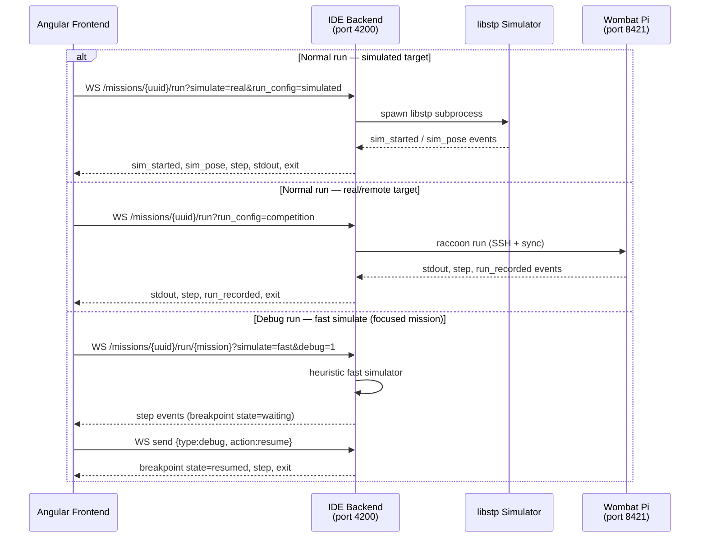
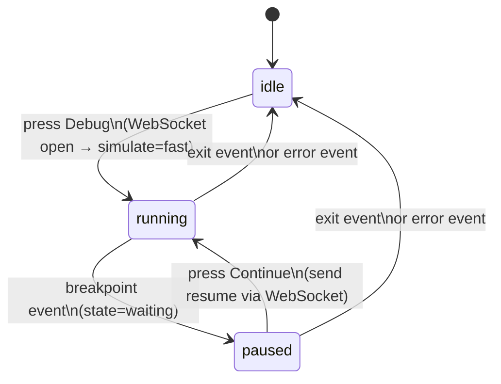

## Concept: How running works

The Web IDE uses an **IntelliJ/PyCharm-style run-configuration model**. Instead of a "Sim on/off" toggle, you choose a named run configuration that encodes everything: where to run (simulated, local, remote robot), what flags to set, and which environment variables to inject.

There is no inline Sim toggle in the current UI — it was removed. Run mode is controlled entirely by the active run configuration's `target` field.

When you press **Run**, the IDE sends a request to the local IDE backend, which either:
- spawns a local simulator process, or
- invokes `raccoon run` on the laptop (which in turn syncs to and executes on the robot).

The whole project runs (all missions in order), not just the selected one. The only exception is **Debug**, which always targets the single mission selected in the left panel.

*End-to-end sequence for the three run paths: simulated, real robot, and debug.*



See [Architecture]() for the sequence diagram showing what happens end-to-end when you press Run.

Run configurations are shared between the Web IDE and the `raccoon run` CLI. Any configuration you save in the IDE is written to `run_configurations:` in `raccoon.project.yml` and immediately available from the command line.

---

## Selecting a run configuration

The navbar contains a **run-configuration chip** — a labelled button showing the currently active configuration. Click it to open a dropdown listing every configuration available for the open project.

Each entry shows:
- The configuration name
- A short description or auto-generated summary of its settings
- A `builtin` badge for the three always-available presets

Select a configuration to activate it. Your selection is persisted to `localStorage` so it survives page reloads.

To create or edit configurations, choose **Edit Configurations…** at the bottom of the dropdown. This opens the full [Run Configurations](../11-run-configurations/) dialog.

### Built-in presets

| Name | Target | Effect |
|------|--------|--------|
| `simulated` | `simulated` | Runs the whole project under the libstp simulator. This is the default. |
| `default` | `auto` | Runs on the robot if connected, falls back to local otherwise. |
| `dev` | `auto` | Like `default` but skips codegen and checkpoints for faster iteration. |

---

## Running the project

Once you have selected a configuration, the navbar shows three controls:

| Control | Appearance | Action |
|---------|-----------|--------|
| Run | Green triangle | Starts a normal run using the active configuration. |
| Stop | Red square | Stops a run that is in progress. Replaces Run while running. |
| Debug | Bug icon | Starts a debug run of the currently selected mission (see below). |

Pressing **Run** with a `simulated` target launches the whole project — every mission, in order — under the libstp simulator. No mission needs to be selected in the left panel. The simulator emits real pose and sensor state updates to the Table Visualization panel.

Pressing **Run** with a `real`, `local`, or `remote` target invokes `raccoon run` on the laptop (which in turn syncs and executes on the Wombat if connected). Again, the whole project is targeted — not just the selected mission.

### Logs panel auto-opens

When any run starts the IDE automatically opens the **Logs** bottom panel so you can see output immediately. You do not need to open it manually.

---

## Debug mode

The **Debug** button (bug icon) runs the **currently focused mission** through the fast heuristic simulator with breakpoint support. Unlike a normal run, debug mode:

- Always uses the `fast` simulation mode regardless of the active run configuration
- Targets only the single mission selected in the left panel (not the whole project)
- Supports breakpoints placed in the flowchart
- Pauses execution at each breakpoint and waits for you to continue

### Debug state machine

The debug button changes behaviour depending on `debugState`:

| `debugState` | Button label | Button action |
|-------------|-------------|---------------|
| `idle` | Debug (bug icon) | Start a new debug run |
| `running` | Debug (greyed out, disabled) | No action while running |
| `paused` | Continue (step-forward icon) | Resume from the current breakpoint |

*`debugState` transitions driven by WebSocket events from the IDE backend.*



When execution pauses at a breakpoint, the step node in the flowchart is highlighted and the Continue button appears in place of the debug icon.

### Simulation modes in detail

The run pipeline uses two internal simulation modes:

| Mode | When used | What it does |
|------|-----------|-------------|
| `fast` | Debug runs | Heuristic local simulator. Cheap, instant, used for per-mission breakpoint debugging and planning previews. Pose updates are approximate. |
| `real` | Normal simulated runs (active config target = `simulated`) | Spawns the actual libstp simulator. Emits real pose and sensor state updates. Slower to start but behaviorally accurate. |

You do not choose between these modes directly. The mode is selected automatically based on whether you press Run or Debug.

---

## Stopping a run

While a run is active the Run button is replaced by a **Stop** button (square icon). Pressing Stop sends a stop request to the IDE backend, which terminates the running process. The Logs panel shows any final output.

You can also stop a run from the CLI using Ctrl+C in the terminal where `raccoon web` was started, but the IDE Stop button is the preferred method during normal use.

---

## Simulation vs real robot

> **Important:** Running from the Web IDE with a `simulated` configuration does NOT sync files to the robot, does NOT create checkpoints, and does NOT calibrate motors. For competition runs use `raccoon run` from the terminal, which handles all of those steps.

| | Simulated run | Real run (Web IDE) | `raccoon run` (CLI) |
|-|--------------|-------------------|---------------------|
| Syncs to Pi | No | Yes (if connected) | Yes |
| Creates checkpoint | No | Depends on config | Yes (by default) |
| Calibrates motors | No | Depends on config | Yes (by default) |
| Localization recording | No | Optional (config) | Optional (`--record-localization`) |

---

## Localization recording

Some configurations have `record_localization: true`. When a real run completes with recording enabled, the IDE receives a `run_recorded` event and automatically opens the **Table Visualization** panel, loading the `localization.jsonl` file for replay. See [Localization Replay](../12-localization-replay/) for details.

---

## Competition workflow tip

For competition runs, use a dedicated run configuration with `target: remote` and `record_localization: true`. This ensures every run is recorded for post-run analysis without any manual steps:

```yaml
# in raccoon.project.yml
run_configurations:
  competition:
    description: "Full competition run"
    target: remote
    record_localization: true
    record_hz: 30
```

Then from the Web IDE: select **competition** in the run-configuration dropdown, press **Run**. The recording auto-loads in the Table Visualization panel after the run finishes.

For quick iteration during development, use the built-in `dev` preset or create a custom one:

```yaml
  tune:
    description: "Fast test — no calibration or checkpoints"
    target: remote
    no_calibrate: true
    no_checkpoints: true
```

---

## Cross-references

- [Run Configurations]() — creating and editing run configurations
- [Localization Replay]() — replaying a recorded run
- [Architecture]() — what happens at the backend when you press Run
