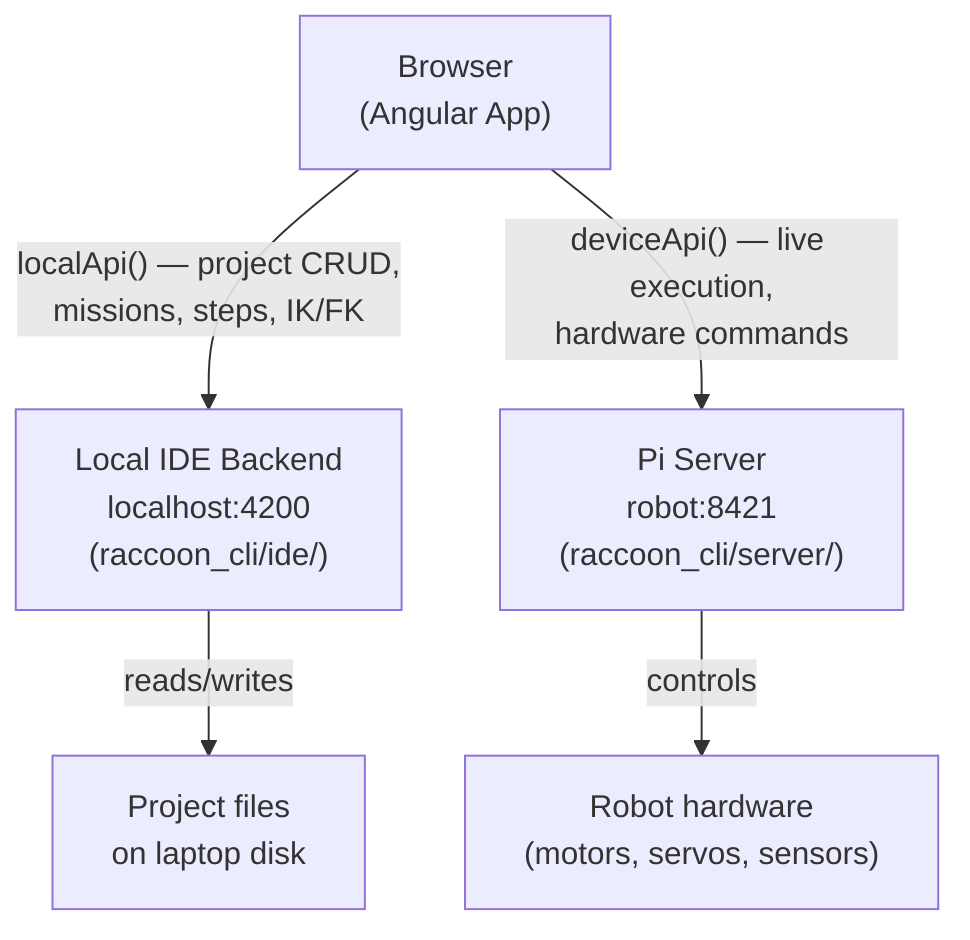
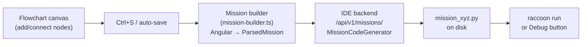
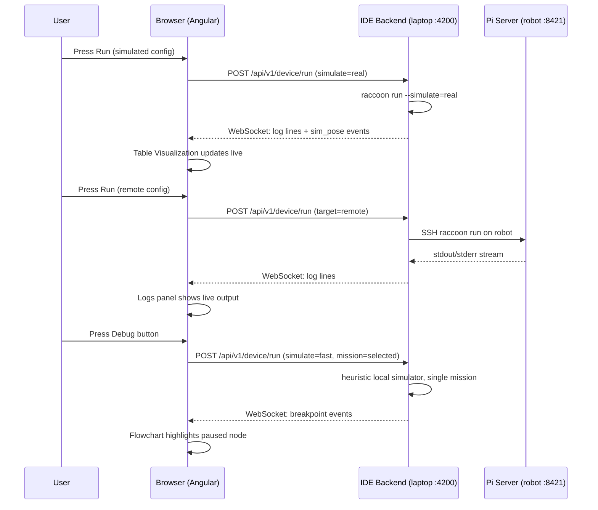
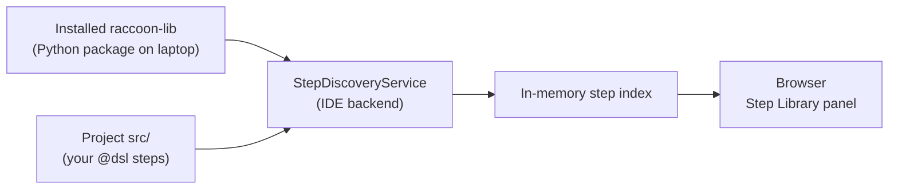

## Concept: What is the Web IDE?

The Web IDE is a browser-based editor that runs on **your laptop**, not on the robot. It gives you a visual flowchart editor, a Python code editor, and real-time tools for running and inspecting missions. Understanding one key fact up front saves a lot of confusion:

> **There are two backends — the local IDE backend (laptop) and the Pi server (robot). They own completely different things and you cannot swap them.**

When something gives a 404, the first question is always: _"Did the request go to the right backend?"_

---

## The Three-Tier Model



| Layer | What it owns |
|-------|-------------|
| **Angular frontend** | UI rendering, state management (Angular signals), WebSocket mission streaming |
| **Local IDE backend** | Project files on disk, mission code generation, step discovery/indexing, FK/IK math, run recordings |
| **Pi server** | Real-time execution, motor/servo/sensor hardware, live telemetry |

The split is intentional: the IDE backend runs locally so it works **offline** (you can browse steps, edit flowcharts, and run simulations without a robot connected). The Pi server is only needed for real robot execution.

---

## Starting the Web IDE

```
raccoon web          # serves on localhost:4200, auto-opens browser
raccoon web -p 8080  # custom port
```

`raccoon web` starts the FastAPI IDE backend (`raccoon_cli/ide/app.py`), which also serves the pre-built Angular frontend as static files under `/WebIDE/`. When run inside a project directory, the browser opens directly to that project.

During Angular development (`npm start`), the Angular dev server runs on port **4300** and proxies API calls to the backend on **4200**. Production (`raccoon web`) serves everything from **4200**.

---

## How a Flowchart Edit Becomes Python

This is the core content-creation loop:



1. You drag steps onto the flowchart canvas and connect them.
2. `Ctrl+S` (or auto-save) serializes the current canvas to a `ParsedMission` JSON payload and `PUT`s it to the IDE backend.
3. The IDE backend's `MissionCodeGenerator` renders the `ParsedMission` into valid Python — importing the correct raccoon DSL functions, building the `seq()` / `parallel()` call tree, and writing the class.
4. The generated `.py` file lands on disk in your project's `src/missions/` directory.
5. When you press **Run** or `raccoon run`, this Python file is what executes (after codegen and sync).

The flowchart **is** the source of truth for missions you build visually. If you also edit the Python directly in the Code view, be aware that the next flowchart save will overwrite your manual changes.

---

## Running and Debugging a Mission



The simulation mode is chosen automatically:

| Button | Target config | simulate flag | Scope |
|--------|--------------|--------------|-------|
| Run | `simulated` | `real` (libstp subprocess) | whole project |
| Run | `remote` / `auto` | `false` (real hardware) | whole project |
| Debug | any | `fast` (heuristic, cheap) | selected mission only |

---

## Step Indexing

The Step Library panel lists all available steps. These come from the **local IDE backend**, not the robot:



The `StepDiscoveryService` scans the locally installed `raccoon` package for `@dsl`-decorated functions and also scans your project's `src/` directory for custom steps. The result is an in-memory index served to the browser over `/api/v1/steps`. **No robot connection is needed to browse or search steps.**

Custom steps decorated with `@dsl` appear automatically in the Step Library. Unannotated helper functions remain private (not shown in the UI).

---

## What Runs Locally vs. On the Robot

| Action | Runs on |
|--------|---------|
| Browse / search steps | Laptop (IDE backend) |
| Edit flowchart, save mission | Laptop (IDE backend) |
| FK / IK calculations | Laptop (IDE backend) |
| Simulated run (libstp) | Laptop (IDE backend spawns simulator) |
| Debug run (fast heuristic) | Laptop (IDE backend) |
| Real run on robot | Robot (Pi server) |
| Live servo commands (Arm panel Live Preview) | Robot (Pi server) |
| Localization recording | Laptop disk (IDE backend collects via WebSocket) |

---

## Key Source Locations

| Component | Path |
|-----------|------|
| `raccoon web` CLI command | `toolchain/raccoon_cli/commands/web.py` |
| IDE backend FastAPI app | `toolchain/raccoon_cli/ide/app.py` |
| Mission code generator | `toolchain/raccoon_cli/ide/core/mission_code_generator.py` |
| Step discovery service | `toolchain/raccoon_cli/ide/services/step_discovery_service.py` |
| Angular frontend root | `toolchain/web-ide/src/app/` |
| Flowchart run manager | `toolchain/web-ide/src/app/project-view/flowchart/flowchart-run-manager.ts` |
| HTTP/WebSocket client | `toolchain/web-ide/src/app/services/http-service.ts` |

---

## Cross-references

- [Starting the Web IDE]() — `raccoon web` options
- [Interface Overview]() — panel layout and controls
- [Running a Mission]() — run/debug flow in detail
- [Run Configurations]() — how to configure targets and flags
- [Advanced Internals]() — backend routing, map format, replay
