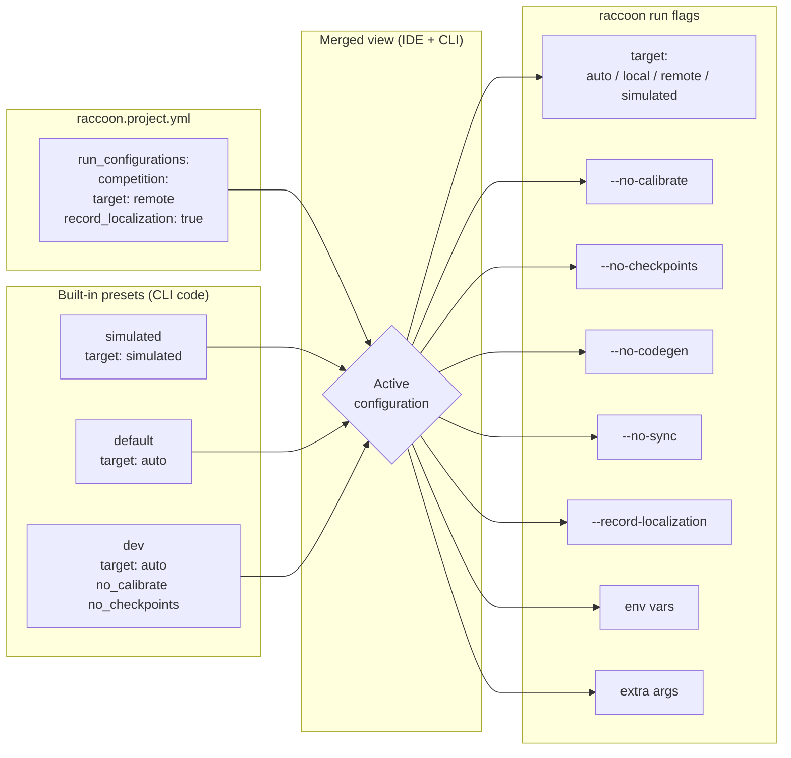

## Concept: Why run configurations?

Different situations need different run behaviour. During development you want fast iteration — skip calibration, skip checkpoints, maybe skip codegen. During competition you want full safety checks, localization recording, and a guaranteed clean checkpoint. During tuning you might want to bypass the pre-start gate entirely.

Run configurations solve this by letting you **name a bundle of flags** once and then just select the name. No flag-hunting at the command line, no accidental competition run without recording.

They work like PyCharm/IntelliJ run configurations: you select a name from the navbar dropdown and that name resolves to a fixed set of flags, environment variables, and a target.

Configurations are stored in `raccoon.project.yml` under `run_configurations:` and are **shared between the Web IDE and the `raccoon run` CLI**. A configuration you create in the IDE is immediately available from the terminal, and vice versa.

---

## Built-in presets

Three presets are always available for every project, even if the YAML file has no `run_configurations:` section. They are implemented in the CLI's shared `run_configurations.py` and surfaced by the IDE backend.

| Name | Target | Behavior |
|------|--------|----------|
| `simulated` | `simulated` | Runs the whole project under the libstp simulator. No robot connection required. |
| `default` | `auto` | Standard run: codegen + calibrate + checkpoints. Uses the robot if connected, falls back to local. |
| `dev` | `auto` | Fast iteration: `--dev --no-calibrate --no-checkpoints`. Skips slow steps for quicker edit cycles. |

The `simulated` preset is the default selection when you first open a project.

---

*How configuration fields flow from the YAML file through to the actual run command.*



## Configuration fields

Each run configuration has the following fields:

| Field | Type | Default | Description |
|-------|------|---------|-------------|
| `name` | string | — | Unique identifier used on the CLI (`raccoon run <name>`) and in the IDE dropdown. |
| `description` | string | `""` | Human-readable explanation shown in the dropdown tooltip. |
| `target` | enum | `auto` | Where to run: `auto`, `local`, `remote`, or `simulated`. |
| `dev` | bool | `false` | Passes `--dev` to `raccoon run` (skips non-essential setup steps). |
| `no_calibrate` | bool | `false` | Skips motor calibration (`--no-calibrate`). |
| `no_checkpoints` | bool | `false` | Skips git checkpoint creation (`--no-checkpoints`). |
| `no_codegen` | bool | `false` | Skips code generation (`--no-codegen`). |
| `no_sync` | bool | `false` | Skips file sync to the Pi (`--no-sync`). |
| `record_localization` | bool | `false` | Records particle filter state to `localization.jsonl` during real runs. |
| `record_hz` | float or null | `null` | Recording sample rate in Hz. `null` uses the default (typically 20 Hz). |
| `args` | list of strings | `[]` | Extra CLI arguments passed verbatim to `raccoon run`. |
| `env` | mapping | `{}` | Environment variables set for the child process. |

### Target values

| Value | Meaning |
|-------|---------|
| `auto` | Use the robot if a Pi is connected; run locally otherwise. |
| `local` | Always run locally, even if a Pi is connected. |
| `remote` | Always run on the connected Pi. Fails if no Pi is connected. |
| `simulated` | Run under the libstp simulator. No Pi required. |

---

## YAML format

Configurations live under `run_configurations:` in `raccoon.project.yml`:

```yaml
run_configurations:
  competition:
    description: "Full competition run with all safety checks"
    target: remote
    record_localization: true
    record_hz: 30

  quick-test:
    description: "Fast local test, no calibration or checkpoints"
    target: local
    no_calibrate: true
    no_checkpoints: true
    no_codegen: true

  with-debug-env:
    description: "Verbose logging via environment variable"
    target: auto
    env:
      RACCOON_LOG_LEVEL: debug
      LIBSTP_VERBOSE: "1"
    args:
      - "--no-m0"   # skip setup mission
```

Builtin presets (`default`, `dev`, `simulated`) do not appear in this section unless you have overridden them. Editing a builtin in the IDE creates a user override entry that shadows the builtin.

---

## Opening the Run Configurations dialog

From within a project:

1. Click the run-configuration chip in the navbar (shows the current config name and a down-arrow)
2. Choose **Edit Configurations…** at the bottom of the dropdown

The dialog opens with a list of all configurations in the left pane and the selected configuration's settings in the right pane.

### Dialog structure

**Left pane** — configuration list:
- Each entry shows the name and a `builtin` badge for presets
- Click an entry to select it and see its settings
- **+** button adds a new blank configuration
- **Duplicate** copies the selected configuration with a `-copy` suffix
- **Remove** deletes the selected configuration. For builtins this creates a tombstone in `hidden_run_configurations:` so neither the CLI nor the IDE sees the builtin until you add a new entry with the same name
- **Reset to builtin** (shown when you have overridden a builtin) restores the original preset values

**Right pane** — configuration editor:
- **Name** — editable; renaming a builtin creates a new user entry
- **Description** — shown as a tooltip in the navbar dropdown
- **Target** — dropdown with `auto`, `local`, `remote`, `simulated`
- Toggle checkboxes for `dev`, `no_calibrate`, `no_checkpoints`, `no_codegen`, `no_sync`, `record_localization`
- **Record Hz** — number field, shown when `record_localization` is on
- **Extra args** — space-separated CLI arguments, one per token
- **Environment variables** — `KEY=VALUE` pairs, one per line

**YAML preview** — the dialog shows a live preview of the YAML snippet that would be written for the selected configuration. Builtins that have not been modified show a notice that nothing is persisted. Copy this snippet to share a configuration between projects.

### Saving

Click **Save** to persist all changes. The dialog:
1. Sends `DELETE` requests for removed configurations (including tombstoning removed builtins)
2. Sends `PUT` requests for all user-defined (non-builtin) configurations
3. Reloads the configuration list from the server
4. Closes the dialog and updates the navbar dropdown

---

## Using configurations from the CLI

The same names are available in the terminal:

```bash
# Run using the 'competition' configuration
raccoon run competition

# Run using the 'dev' preset
raccoon run dev

# Run using the default configuration
raccoon run
# or explicitly:
raccoon run default
```

Name lookup is case-insensitive. `raccoon run Dev` and `raccoon run dev` resolve to the same configuration.

---

## Tombstones and `hidden_run_configurations`

When you remove a builtin preset from the IDE, the backend writes its name to a `hidden_run_configurations:` list in `raccoon.project.yml`:

```yaml
hidden_run_configurations:
  - simulated
```

This tells both the IDE and the CLI to hide that builtin. The entry disappears from the navbar dropdown and from `raccoon run --help`. To restore a tombstoned builtin, add a new entry with the same name under `run_configurations:` or simply delete the entry from `hidden_run_configurations:` manually.

---

## Real-world examples from competition bots

### Feature-flag configurations

Competition bots use run configurations to switch between real and fake hardware without changing mission code. A `DRUMBOT_FAKE_CAMERA=1` environment variable in the run config enables a fake camera service, while the default config uses real hardware:

```yaml
run_configurations:
  competition:
    description: "Full competition run with real camera"
    target: remote
    record_localization: true
    record_hz: 30

  test-no-camera:
    description: "Desktop test with fake camera service"
    target: local
    no_calibrate: true
    no_checkpoints: true
    env:
      DRUMBOT_FAKE_CAMERA: "1"

  tune-long:
    description: "Long tuning session (15 min timeout)"
    target: remote
    no_checkpoints: true
    env:
      RACCOON_SHUTDOWN_IN: "900"
```

The `env:` values are read with `os.getenv()` in your mission code:

```python
import os

if os.getenv("DRUMBOT_FAKE_CAMERA"):
    install_fake_color_service(robot)
```

### Skipping missions during development

When iterating on a late mission, skip the time-consuming setup mission:

```yaml
  tune-from-m020:
    description: "Skip setup, start from M020"
    target: remote
    no_calibrate: true
    no_checkpoints: true
    args:
      - "--no-m0"  # skip the M000 setup mission
```

---

## Tips

- Use `record_localization: true` on your `competition` config so every real run automatically records a replay file for post-run analysis.
- The `dev` preset's `no_codegen` equivalent is toggled separately (`no_codegen: true`). Add it to a custom config when you know the code has not changed and want to skip the generation step entirely.
- `args: ["--no-m0"]` skips the setup mission (mission at order index 0) during development — useful when the setup mission takes a long time and you are iterating on a later mission.
- Environment variables in `env:` are passed to the raccoon process and therefore visible to the running Python code. Use them for feature flags or logging verbosity without changing source code.
- Each developer on a team can have their own custom configurations without conflicting, since configurations are just YAML keys under `run_configurations:`.

---

## Cross-references

- [Running a Mission]() — selecting a run configuration and pressing Run
- [Localization Replay]() — `record_localization: true` enables recording
