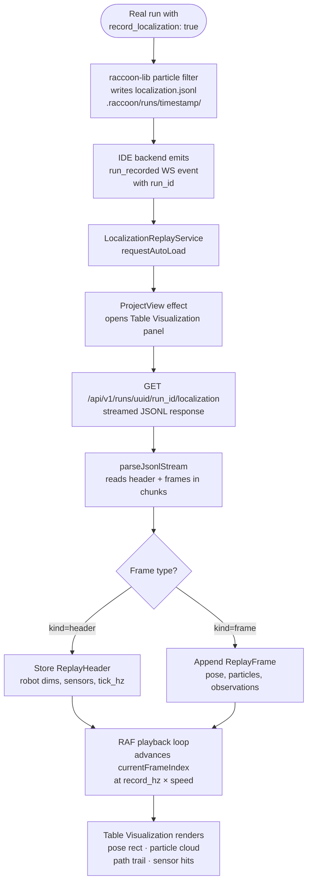

## Overview

When a real robot run is recorded with localization tracking, the Web IDE can load that recording and play it back in the **Table Visualization** panel. The playback shows the robot's historical path, particle cloud, and sensor hit events — giving you a frame-by-frame view of what the localization filter saw during the run.

This is useful for:

- Diagnosing why the robot lost its position
- Verifying that the particle filter converged correctly
- Reviewing path deviations between planned and actual routes
- Sharing post-run analysis with teammates

## How it works

Recording is enabled by the `record_localization: true` flag in a run configuration. When a real run completes:

1. The IDE backend emits a `run_recorded` WebSocket event
2. The Angular frontend's `LocalizationReplayService` receives it via `requestAutoLoad()`
3. An Angular `effect()` in `ProjectView` watches the auto-load signal, switches the bottom panel to Table Visualization, and loads the recording

The recording file (`localization.jsonl`) lives on the **laptop disk** at `.raccoon/runs/<timestamp>/localization.jsonl`. It is never stored on the robot.

*Full pipeline from a real run to rendered replay in the Table Visualization panel.*



Add `record_localization: true` to your competition run configuration and it records automatically every run — see [Run Configurations]() for how to set this up.

---

## Recording a run

Localization recording is controlled by a run configuration flag. Add `record_localization: true` to any run configuration that targets a real robot:

```yaml
run_configurations:
  competition:
    target: remote
    record_localization: true
    record_hz: 20    # optional; default is ~20 Hz
```

Alternatively, enable recording from the CLI:

```bash
raccoon run --record-localization
raccoon run --record-localization --record-hz 30
```

The recording is saved to:
```
.raccoon/runs/<timestamp>/localization.jsonl
```

inside the project directory on the laptop. The IDE backend serves these files under `/api/v1/runs/<project-uuid>/`.

### Environment variables

The recording system uses three environment variables that the CLI sets automatically. You can also set them manually for custom tooling:

| Variable | Description |
|----------|-------------|
| `LIBSTP_RECORD_LOCALIZATION` | Set to `1` to enable recording |
| `LIBSTP_RECORDING_PATH` | Absolute path to the output `.jsonl` file |
| `LIBSTP_RECORDING_HZ` | Sample rate in Hz (e.g. `20`) |

---

## Auto-loading after a run

When a run with `record_localization: true` completes, the IDE backend emits a `run_recorded` WebSocket event to the frontend. The Web IDE responds automatically:

1. The **Table Visualization** bottom panel opens
2. The recording for that run is loaded and displayed
3. Playback starts from frame 0

You do not need to navigate to the Table Visualization panel manually — it opens on its own.

---

## Loading a recording manually

If you want to load an older recording or one from a different project:

1. Open the **Table Visualization** panel (map icon in the left tool strip)
2. Look for the **Replay** section in the panel header or controls area
3. Select a run from the **Available runs** dropdown (runs are listed by timestamp)
4. Click **Load** or the run entry to load it

The replay service fetches the `localization.jsonl` file as a streaming JSONL response and parses it in chunks so large recordings do not block the UI.

---

## The recording format

The `localization.jsonl` file is a newline-delimited JSON stream. The first line is a header object; every subsequent line is a frame object.

### Header (`kind: "header"`)

```json
{
  "kind": "header",
  "format_version": 1,
  "started_at_unix_ns": 1716476212000000000,
  "tick_hz": 100,
  "record_hz": 20,
  "particle_count": 500,
  "units": {
    "position": "cm",
    "heading": "rad",
    "sensor_offset": "cm"
  },
  "robot": {
    "width_cm": 30.0,
    "length_cm": 25.0,
    "sensors": [
      { "name": "line_front", "kind": "line", "forward_cm": 12.0, "strafe_cm": 0.0 }
    ]
  }
}
```

| Field | Description |
|-------|-------------|
| `format_version` | Always `1` for RLREC v1 |
| `started_at_unix_ns` | Unix timestamp in nanoseconds when the run started |
| `tick_hz` | Localization filter tick rate |
| `record_hz` | Actual recording sample rate |
| `particle_count` | Number of particles in the filter |
| `units` | Unit system used in this file (positions in cm, heading in radians) |
| `robot.width_cm` / `robot.length_cm` | Robot physical dimensions |
| `robot.sensors` | Sensor descriptors used for observation rendering |

### Frame (`kind: "frame"`)

```json
{
  "kind": "frame",
  "t_ns": 1716476212050000000,
  "pose": [45.2, 80.1, 1.57],
  "sigma": [2.1, 2.1, 0.05],
  "particles": [
    [45.0, 79.8, 1.56, 0.0021],
    [45.5, 80.3, 1.58, 0.0019]
  ],
  "observations": [
    {
      "surface_kind": "line",
      "detected": true,
      "sensor_offset_cm": [12.0, 0.0],
      "sigma_cm": 1.0
    }
  ],
  "resampled": false
}
```

| Field | Description |
|-------|-------------|
| `t_ns` | Timestamp in nanoseconds |
| `pose` | `[x_cm, y_cm, heading_rad]` — best-estimate robot pose |
| `sigma` | `[sigma_x, sigma_y, sigma_theta]` — pose uncertainty |
| `particles` | Array of `[x_cm, y_cm, heading_rad, weight]` for all particles |
| `observations` | Sensor observations this tick (line or wall detections) |
| `resampled` | `true` if the particle filter was resampled this frame |

---

## Playback controls

Once a recording is loaded in the Table Visualization panel:

| Control | Action |
|---------|--------|
| Play / Pause | Start or pause time-based playback |
| Step forward / backward | Advance or retreat one frame at a time |
| Speed slider | Adjust playback speed (e.g. 2× or 0.5×) |
| Timeline scrubber | Jump to any frame by dragging |
| Unload | Remove the current recording and return to live visualization |

Playback is time-based: the player uses the recording's `record_hz` and wall-clock elapsed time to advance frames smoothly, even at non-integer speeds. If the browser tab is backgrounded and then restored, the player caps the catch-up to 500 ms so it does not jump the entire recording in one tick.

---

## What is rendered

The Table Visualization panel renders the following during playback:

| Element | Visual | Source |
|---------|--------|--------|
| Best-estimate pose | Solid robot rectangle with heading arrow | `frame.pose` |
| Path trail | Fading line connecting past poses | `trailUpToNow` (computed signal, frames 0 to current) |
| Particle cloud | Small dots, color-coded by weight | `frame.particles` |
| Sensor hit markers | Colored dots at the sensor position relative to the robot | `frame.observations` where `detected = true` |
| Map lines / walls | Static background | Loaded from `robot.physical.table_map` |

High-weight particles cluster tightly around the best-estimate pose when the filter is confident. A spread-out cloud indicates localization uncertainty.

---

## Listing available runs

The IDE backend exposes a run listing endpoint. The replay service calls it automatically when the Table Visualization panel opens, populating the available runs dropdown:

```
GET /api/v1/runs/<project-uuid>
```

Response:

```json
[
  {
    "run_id": "2026-05-23T14-30-12Z",
    "started_at": "2026-05-23T14:30:12Z",
    "has_localization": true,
    "file_size_bytes": 4194304,
    "duration_ms": null,
    "frame_count": null
  }
]
```

`duration_ms` and `frame_count` are `null` until the backend lazily computes them by reading the file header.

---

## Troubleshooting

**The Table Visualization panel does not open automatically after a run**

- Check that `record_localization: true` is set in the active run configuration
- The auto-load only triggers for `real` target runs. Simulated runs do not produce a `localization.jsonl`
- Verify the WebSocket connection is active (check the browser console for connection errors)

**"Recording is missing the header line"**

- The `localization.jsonl` file is empty or corrupted, or the run terminated before the header was flushed
- Check disk space on the laptop; the JSONL writer requires write access to `.raccoon/runs/`

**"Failed to load run (404)"**

- The run directory may have been cleaned up. Check `.raccoon/runs/` in the project folder
- The IDE backend must be running and the project UUID must match

**Particles are all in one spot / no spread**

- Normal behavior at the start of a run — the filter initializes at the configured start pose
- If the cloud never spreads, the filter may be receiving no observations (sensors not detecting lines or walls). Check that `record_hz` is high enough to capture observations and that the sensor positions in the recording header match the physical robot

**Playback is jerky at high speeds**

- The player renders at browser requestAnimationFrame rate (~60 fps)
- At very high playback speeds (10×+) multiple frames advance per render tick, which can appear skippy. This is expected; reduce the speed for frame-accurate review

---

## Cross-references

- [Run Configurations]() — enabling `record_localization: true`
- [Tool Panels]() — Table Visualization panel overview
- [Running a Mission]() — auto-open behavior after a recorded run
