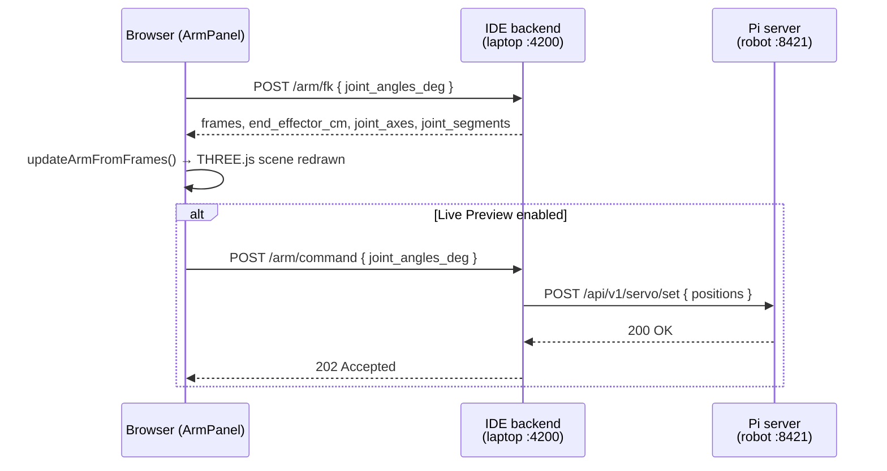
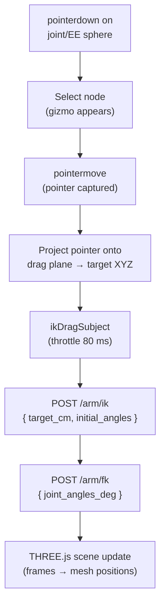

## Overview

The **Arm Visualizer** is a 3D panel for inspecting and controlling robotic arm chains. FK/IK calculations run on the **local IDE backend** (your laptop), while live servo commands go to the **Pi server** (your robot). The panel is only useful when your project has an `ArmChain` definition.

It renders the arm's joint structure in a THREE.js WebGL scene and lets you:

- Move joints by setting individual joint angles (forward kinematics, FK)
- Drag the end-effector or a joint node to a target position (inverse kinematics, IK)
- Save and load named positions
- Send joint angles to the physical servos in real time (live preview mode)
- Edit the arm's structural parameters (segment lengths, joint axes, ranges)

The panel communicates with the IDE backend's arm API for FK/IK calculations and with the Pi server for live servo commands.

---

## Opening the panel

Click the **Arm Visualizer** button in the bottom-left tool strip (android/robot icon). The panel opens as a docked bottom panel, sharing the bottom area with the Logs and Table Visualization panels.

If the project has no arm chain definition the panel shows a message. If the `[arm]` extra is not installed, it shows an installation hint.

---

## Prerequisites

The arm panel requires:

1. An `ArmChain` definition in the project's `src/hardware/defs.py` (generated by `raccoon codegen` from `raccoon.project.yml`)
2. The `raccoon-cli[arm]` extra installed on the laptop (`pip install raccoon-cli[arm]`). This provides `ikpy` for IK solving.

If either is missing, the panel shows an error state with the specific reason.

---

## The 3D scene

The viewer uses a **Z-up coordinate system** (robotics convention). The camera starts at position (40, −40, 30) looking at the origin.

| Scene element | Color / appearance | Meaning |
|--------------|-------------------|---------|
| Blue cylinders | Blue `#4ea1ff`, fat bars | Primary structural arm segments (one per joint with non-zero length) |
| Orange thin bars | Orange `#ffae5a` | Offset brackets connecting a segment end to the next joint's pivot |
| Blue spheres | `#66aaff` | Joint pivot points |
| Red/pink sphere | `#ff5577` | End-effector (tool center point) |
| Yellow arrows | `#ffcc33` | Joint rotation axes (one per joint) |
| Wireframe sphere | Blue `#44aaff`, 12% opacity | Workspace envelope (max reach radius) |
| Floor grid | Dark grid in XY plane | Reference ground |
| XYZ axes | Small red/green/blue arrows at origin | World coordinate frame |

### Orbit controls

- **Left drag** — rotate the camera around the scene
- **Right drag** — pan
- **Scroll wheel** — zoom in / out

---

## Forward kinematics (FK)

The **Joint angles** section shows a slider and number input for each joint. Changing any value sends the new angles to the IDE backend's FK endpoint:

```
POST /api/v1/projects/{uuid}/arm/fk
Body: { "joint_angles_deg": [45.0, -30.0, 60.0] }
```

The response contains:
- `frames` — world-space positions of each joint pivot and the end-effector
- `end_effector_cm` — the end-effector position `[x, y, z]` in cm
- `joint_axes` — rotation axis vectors for visualization
- `joint_segments` — origin/end pairs for segment bars

The 3D scene updates immediately to reflect the new pose.



*FK and the live-preview proxy both go through the IDE backend. The browser never talks directly to the Pi for arm commands.*

---

## Inverse kinematics (IK)

IK lets you specify a **target position** in 3D space and have the solver compute joint angles that reach it.

### Manual IK

1. Enter target X, Y, Z coordinates in the **Target XYZ** fields (in cm)
2. Click **Solve IK**

The solver posts to:

```
POST /api/v1/projects/{uuid}/arm/ik
Body: {
  "target_cm": [x, y, z],
  "initial_angles_deg": [current joint angles]
}
```

If the target is reachable the joint angles update and the scene animates to the new pose. If unreachable, a "not reachable" indicator appears.

### Interactive drag IK

Click a **joint sphere** or the **end-effector sphere** in the 3D scene to select it. A selected node shows:

- An XYZ gizmo (colored axis arrows) for constrained-axis dragging
- Pointer-capture drag on the node itself for free-plane IK

**Gizmo drag** — click and drag one of the colored axis arrows (red=X, green=Y, blue=Z) to constrain movement to that axis. The IK solver is called at up to ~12.5 calls/second (throttled to 80 ms) during drag.

**Free drag** — click and drag the node directly. Movement is projected onto a plane perpendicular to the camera direction, passing through the node. The IK solver runs continuously during drag.



*Drag throttling caps IK calls to ~12.5/s to keep dragging smooth without flooding the backend.*

**Keyboard nudge** — with a node selected, use arrow keys to nudge in X/Y, and Page Up/Down for Z:

| Key | Movement |
|-----|---------|
| Arrow Left | −X by 0.5 cm (or 2 cm with Shift) |
| Arrow Right | +X |
| Arrow Up | +Y |
| Arrow Down | −Y |
| Page Up | +Z |
| Page Down | −Z |
| Escape | Deselect node |

---

## Named positions

Named positions are saved poses associated with the arm chain, stored in the project configuration. They let you recall common arm configurations without re-entering angles every time.

### Saving a position

1. Set the desired joint angles (by FK sliders, IK, or drag)
2. Type a name in the **Save position** field
3. Click **Save**

The IDE backend persists the position alongside the arm chain definition.

### Loading a position

Select a name from the **Positions** dropdown. The joint angles update to the saved values and FK is recalculated.

### Deleting a position

Select the position from the dropdown and click **Delete**.

---

## Live preview mode

When **Live Preview** is enabled, every FK result is also sent to the Pi server as a servo command:

```
POST /api/v1/device/arm/command   (device backend, Pi)
Body: { "joint_angles_deg": [...] }
```

This moves the physical servos in real time as you drag sliders or nodes in the 3D scene. The command is throttled to at most 10 calls/second (100 ms throttle, trailing edge included).

> **Warning:** Live preview sends commands directly to the servos. Keep clear of the robot's workspace before enabling it. Disable live preview before making large position changes.

---

## Structure editor

The **Structure** section (toggleable) exposes the physical parameters of each joint. Changes are saved automatically with a 350 ms debounce.

| Parameter | Description |
|-----------|-------------|
| `length_cm` | Segment length from this joint's pivot to the next joint's pivot |
| `axis` | Rotation axis as an `[x, y, z]` unit vector. Presets: X, Y, Z buttons |
| `mount_rpy_deg` | Roll/pitch/yaw of the joint mount relative to the parent (in degrees) |
| `offset_cm` | Optional offset vector `[x, y, z]` from the segment end to the next pivot (bracket) |
| `joint_range_deg` | `[min, max]` allowed joint angles in degrees |
| `servo_range_deg` | `[min, max]` servo travel range (maps joint_range to servo signal range) |

The **Tip offset** field adds a fixed offset from the last joint to the actual tool center point (e.g. the tip of a gripper).

Structure edits call:

```
PATCH /api/v1/projects/{uuid}/arm/structure
Body: {
  "joints": [{ "length_cm": ..., "axis": [...], ... }],
  "tip_offset_cm": [x, y, z]  # or [] to clear
}
```

After saving, the arm chain is reloaded from the server and the 3D scene is rebuilt.

Click **Reset** to discard unsaved structure changes and return to the last saved state.

---

## Error states

| Error | Cause | Resolution |
|-------|-------|-----------|
| "ArmChain kinematics require the [arm] extra" | `ikpy` is not installed | `pip install raccoon-cli[arm]` |
| "No ArmChain definition in this project" | The project's `defs.py` has no `ArmChain` class | Define an `ArmChain` in `raccoon.project.yml` and run `raccoon codegen` |
| Generic error | Backend returned an unexpected error | Check the IDE backend logs (`raccoon web` terminal output) |

---

## API reference

All arm endpoints are on the **IDE backend** (laptop, port 4200) except `/command`, which goes to the **Pi server** (port 8421):

| Endpoint | Backend | Description |
|----------|---------|-------------|
| `GET /api/v1/projects/{uuid}/arm/chain` | IDE | Load the arm chain definition |
| `POST /api/v1/projects/{uuid}/arm/fk` | IDE | Forward kinematics |
| `POST /api/v1/projects/{uuid}/arm/ik` | IDE | Inverse kinematics |
| `PUT /api/v1/projects/{uuid}/arm/positions/{name}` | IDE | Save a named position |
| `DELETE /api/v1/projects/{uuid}/arm/positions/{name}` | IDE | Delete a named position |
| `PATCH /api/v1/projects/{uuid}/arm/structure` | IDE | Update joint structure |
| `POST /api/v1/device/arm/command` | Pi server | Send live servo command |

---

## Cross-references

- [Architecture]() — why FK/IK is on the IDE backend but `/command` is on the Pi
- [Tool Panels]() — how to open the Arm Visualizer from the tool stripe
