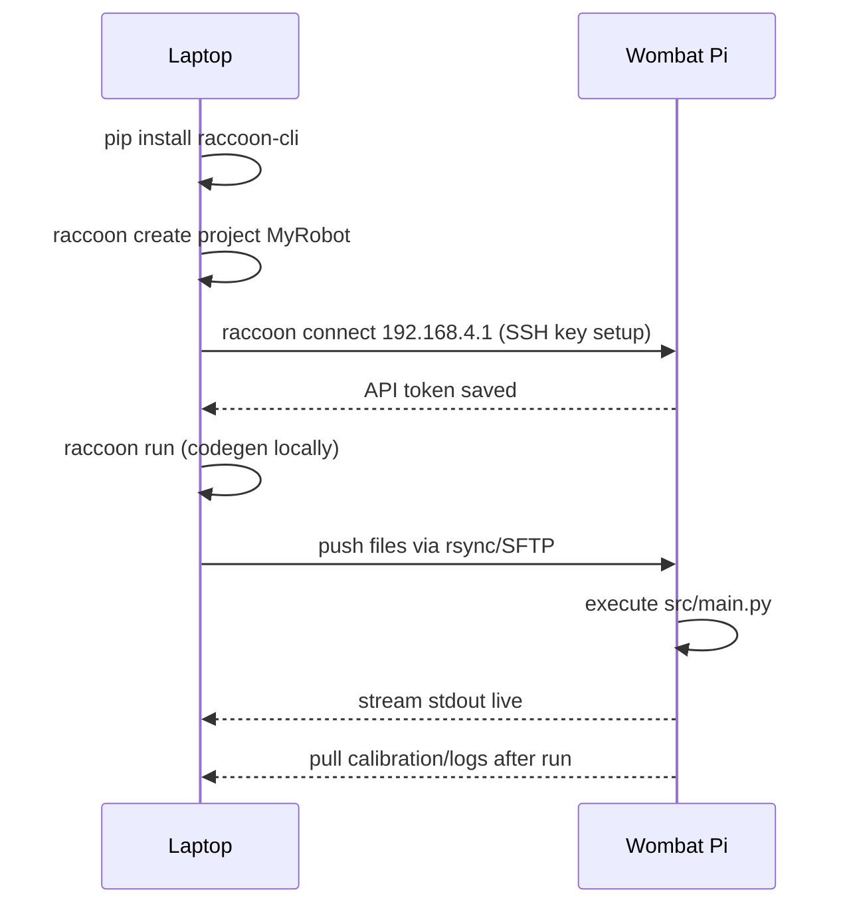

# Quick Start

This page walks through the minimum steps to get a robot project running with the Raccoon CLI.

## How the five steps connect



After `raccoon connect` succeeds once, every subsequent `raccoon run` is fully automated — no password prompts, no manual file copying.

## Prerequisites

- Python 3.13 or newer
- `git` on your PATH (needed for project creation and checkpoints)
- Your laptop on the same network as the Wombat robot

## Install

```bash
pip install raccoon-cli
```

## Create a project

```bash
raccoon create project MyRobot
```

This clones the example project from GitHub (`htl-stp-ecer/raccoon-example`), assigns it a unique UUID, initialises a git repository, and immediately launches the setup wizard.

> Requires internet access and `git`. If you want to skip the wizard and configure manually later, add `--no-wizard`.

## Connect to the robot

```bash
raccoon connect 192.168.4.1
```

Replace the IP with the address shown in BotUI. raccoon will check connectivity, set up SSH key authentication (one-time password prompt), and save the address to both the project config and `~/.raccoon/config.yml`.

Default Wombat credentials: user `pi`, password `raspberrypi`.

## Run the project

```bash
cd MyRobot
raccoon run
```

raccoon will:

1. Validate the project config
2. Generate `defs.py`, `defs.pyi`, and `robot.py` from your YAML definitions (runs locally on the laptop)
3. Push the project files to the Pi
4. Execute the project on the Pi

## Verify your environment

```bash
raccoon doctor
```

This checks that all required tools (`ssh`, `git`, `paramiko`, `black`) are present, shows the current connection state, and compares installed package versions against the bundle manifest.

## Next steps

- [raccoon create]() — full reference for project and mission creation
- [raccoon connect]() — SSH key setup and connection options
- [raccoon doctor]() — full system health check reference