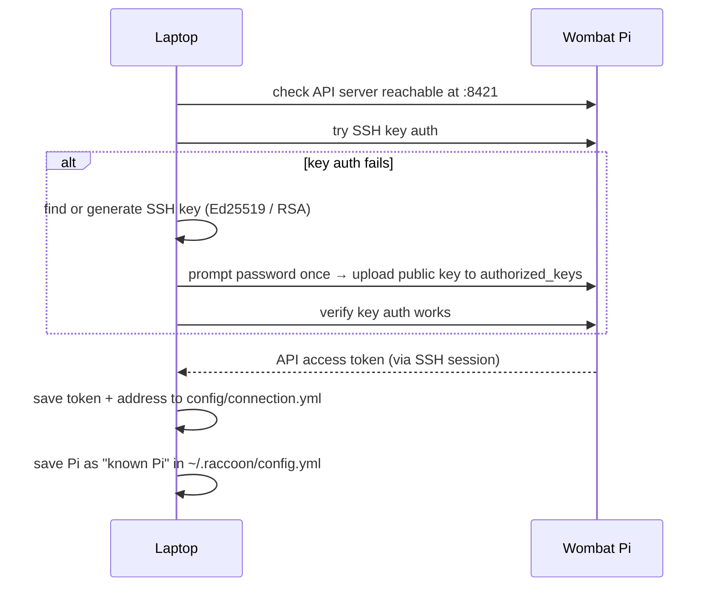

# raccoon connect

```bash
raccoon connect <IP>
raccoon connect <IP> --port 8421 --user pi
```

Connects raccoon to your Wombat robot and sets up SSH key authentication so that every subsequent command (`run`, `sync`, `codegen`, etc.) works without prompting for a password.

## How SSH key setup works



After this one-time handshake, every subsequent `raccoon run`, `raccoon sync`, and `raccoon shell` uses the stored key — no password ever again.

## What it does

1. Checks that the robot's API server is reachable at `<IP>:8421`
2. Attempts SSH key authentication to retrieve an API access token
3. If SSH key authentication fails, offers to set up key authentication automatically (see [SSH key auto-setup](#ssh-key-auto-setup) below)
4. Saves the connection config to two locations:
   - **Project config:** `config/connection.yml` (included in `raccoon.project.yml`) — used when you run commands from this project directory
   - **Global config:** `~/.raccoon/config.yml` — records the Pi as a "known Pi" for use across all projects

After a successful connect, all other raccoon commands use the saved connection automatically.

## Options

| Option | Default | Description |
|--------|---------|-------------|
| `ADDRESS` | _(required)_ | IP address or hostname of the Pi |
| `-p, --port PORT` | `8421` | Pi server port |
| `-u, --user USERNAME` | `pi` | SSH username |
| `--save / --no-save` | `--save` | Save the connection to project and global config |

## Default credentials

The Wombat ships with:
- **User:** `pi`
- **Password:** `raspberrypi`

> **Security note:** Change the default password after your first successful connection.

## SSH key auto-setup

When SSH key authentication is not yet configured, raccoon offers to set it up automatically. The process:

1. Looks for an existing SSH key in `~/.ssh/id_ed25519` or `~/.ssh/id_rsa`
2. If no key is found, generates a new **Ed25519** key pair (falls back to RSA 4096 if the installed paramiko version does not support Ed25519 key generation)
3. Prompts once for the Pi password
4. Uploads the public key to `~/.ssh/authorized_keys` on the Pi, tagged with the comment `raccoon-client`
5. Verifies that key authentication now works by making a test connection
6. Fetches an API access token via the newly working SSH session

After this one-time setup, raccoon never asks for a password again.

## When to re-run

- First time setting up a project on a new machine
- When the robot's IP address changes (common when switching networks or switching between Access Point and infrastructure mode)
- When SSH authentication stops working (run `raccoon disconnect` first, then `raccoon connect <IP>` again)

## Examples

```bash
# Connect using defaults (port 8421, user pi)
raccoon connect 192.168.4.1

# Connect using a custom port and user
raccoon connect 192.168.4.1 --port 8222 --user robot

# Connect but do not save to config (useful for one-off checks)
raccoon connect 192.168.4.1 --no-save
```

## Troubleshooting

**"Failed to connect" / API unreachable**
Make sure your laptop is on the same network as the robot and the IP shown in BotUI matches what you typed. The raccoon-server must be running on the Pi (`raccoon-server start` or `sudo raccoon-server install` to run it as a systemd service).

**SSH authentication keeps failing after key setup**
Run `raccoon disconnect` then `raccoon connect <IP>` again to redo the key upload. If the problem persists, check that `sshd` on the Pi allows `PubkeyAuthentication` and that the Pi's disk is not full.

**"paramiko version" error**
Run `pip install --upgrade paramiko` on your laptop. raccoon requires a minimum paramiko version for Ed25519 support.

For a full system health check, run `raccoon doctor` — it lists the state of all required tools and the current connection.
