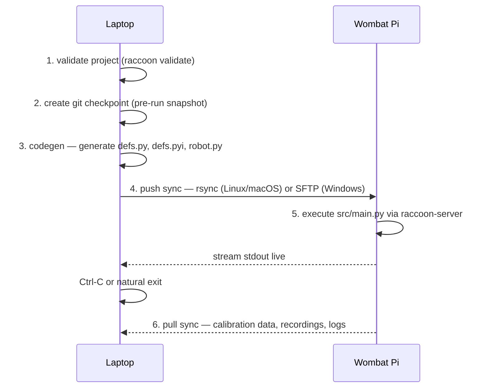

# raccoon run

```bash
raccoon run
```

The command you will use most. On a connected Pi it syncs your project, runs code generation locally, executes the program on the robot, and pulls results back — all in one step.

## How it works



The **codegen happens on the laptop**, not on the Pi. This matters: YAML is never transferred. The Pi only receives ready-to-run Python. If anything is wrong with your YAML, you find out on the laptop before any file transfer happens.

## What it does

The exact sequence depends on whether you are connected to a Pi.

### Remote run (Pi connected — the normal case)

1. **Checkpoint** — creates a local git snapshot of your current files (silent if git is unavailable or the project has no changes)
2. **Codegen** — generates `defs.py`, `defs.pyi`, and `robot.py` from your YAML config **on the laptop**, not on the robot. The generated files land in `src/hardware/` before the next step
3. **Sync (push)** — uploads the project (including the freshly generated hardware files) to the Pi. On Linux and macOS this uses `rsync` over SSH; on Windows it uses SFTP via Paramiko because cwRsync is too unreliable to depend on
4. **Execute** — tells the Pi's `raccoon-server` daemon to run `src/main.py`, streaming output live to your terminal
5. **Sync (pull)** — after the program exits (or you press Ctrl+C), downloads any files written during the run (e.g. calibration data, recordings)

There is **no post-run checkpoint** — only the single pre-run snapshot at step 1.

### Local run

When you are not connected to a Pi, or when you pass `--local`, raccoon skips sync entirely and runs `src/main.py` on your laptop.

## Typical output

```
Checkpoint e4b6191 saved
Syncing 'MyRobot' (pushing to ConeBot)...
Sync complete!
  Uploaded Files:  16
  Bytes Total: 8978

Running 'MyRobot' on ConeBot...
Press Ctrl+C to stop

2026-06-18 12:03:42 | info | [Robot]: Starting robot
...robot output streams here...

^C
Cancelling...
Sync complete!
  Downloaded: 4
```

## Stopping a run

Press **Ctrl+C**. raccoon sends a shutdown signal to the robot, waits for it to stop cleanly (motors disabled), then pulls files back.

## Sync backend selection

The push sync backend is chosen automatically:

| Platform | Backend | Notes |
|----------|---------|-------|
| Linux / macOS | `rsync` over SSH | Efficient delta transfer |
| Windows | SFTP via Paramiko | cwRsync is excluded by design — its Cygwin path and SSH-key handling are too fragile |

The same selection logic applies whether sync is triggered by `raccoon run` or by `raccoon sync` directly.

## Options reference

| Flag | Default | Description |
|------|---------|-------------|
| `--dev` | off | Dev mode: uses button press instead of wait-for-light to start a mission |
| `--local`, `-l` | off | Force local execution — skip remote even if a Pi is connected |
| `--no-sync` | off | Skip the pre-run push sync (useful if you just synced manually) |
| `--no-calibrate` | off | Skip calibration steps; use stored calibration values |
| `--no-codegen` | off | Skip code generation entirely (used internally by the server when codegen was already run client-side) |
| `--no-checkpoints` | off | Skip time-checkpoint waiting (wait_for_checkpoint steps return immediately) |
| `--debug` | off | Enable debug mode: `breakpoint()` steps pause and wait for a button press instead of being a no-op |
| `--record-localization` | off | Record particle filter state to `.raccoon/runs/<timestamp>/localization.jsonl` for replay in the Web-IDE |
| `--record-hz` | 20 Hz | Downsample rate for localization recording; only effective with `--record-localization` |

## Skipping individual missions with `--no-mN`

During development you often want to skip the slow setup mission and jump straight to testing a specific one. Use `--no-m<index>` flags:

```bash
# Skip the first mission (order index 0) — typically the setup mission
raccoon run --no-m0

# Skip missions at indices 0 and 2 simultaneously
raccoon run --no-m0 --no-m2
```

The index is the **order index** of the mission in your project config, zero-based. Mission M010 is index 0, M020 is index 1, and so on. The `LIBSTP_SKIP_MISSIONS` environment variable carries the indices to the runtime.

Skipping missions is entirely a runtime skip — the files are still synced and compiled, so you can re-run without `--no-mN` at any time without a fresh sync.

## Run configurations

`raccoon run` supports named run configurations that bundle multiple flags together. See [Run Configurations](../13-run-configurations) for full details.

The three built-in presets are always available:

```bash
raccoon run           # same as raccoon run default
raccoon run dev       # --dev --no-calibrate --no-checkpoints (fast iteration)
raccoon run simulated # runs under the libstp simulator
```

Pass the configuration name as the first positional argument:

```bash
raccoon run dev
raccoon run dev --no-m0   # combine config with extra flags
```

## Recording localization for replay

To capture the robot's particle filter state during a run so you can replay it in the Web-IDE:

```bash
raccoon run --record-localization
raccoon run --record-localization --record-hz 10   # lower rate = smaller file
```

The recording is saved to `.raccoon/runs/<timestamp>/localization.jsonl` relative to the project root. On a remote run the file is written on the Pi and pulled back during the post-run sync.

The runtime reads three environment variables set automatically by `raccoon run`:

| Variable | Purpose |
|----------|---------|
| `LIBSTP_RECORD_LOCALIZATION` | `1` to enable recording |
| `LIBSTP_RECORDING_PATH` | Relative path to the `.jsonl` output file |
| `LIBSTP_RECORDING_HZ` | Optional downsample rate |

## Version mismatch warning

If the client and server versions differ, raccoon prints a warning before running:

```
Warning: version mismatch
  Client: 0.1.25  Server: 0.1.23
  Run raccoon update to keep both sides in sync.
```

Things usually still work across minor versions, but run `raccoon update` to eliminate the mismatch.

## Running individual steps manually

```bash
raccoon codegen   # regenerate defs.py / robot.py only
raccoon sync      # push or pull files only
```

These are rarely needed — `raccoon run` covers both.

## Related pages

- [sync]() — what the push/pull steps do in detail, including fingerprint verification
- [Run Configurations]() — how to name `dev` vs `competition` mode configurations
- [checkpoint]() — the automatic pre-run snapshots
- [logs]() — browsing output from previous runs
