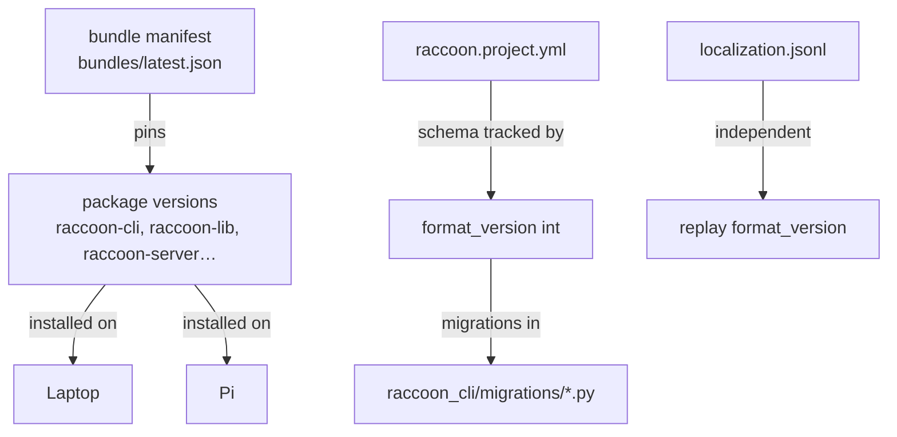

# Versioning And Upgrades

There are several different versioning layers in the raccoon ecosystem. They do different jobs, and mixing them up causes confusion.

This page documents the real behavior implemented by `raccoon-cli`.

Source of truth:

- [update.py](/media/tobias/TobiasSSD/projects/Botball/raccoon/toolchain/raccoon_cli/commands/update.py)
- [version_checker.py](/media/tobias/TobiasSSD/projects/Botball/raccoon/toolchain/raccoon_cli/version_checker.py)
- [migrate.py](/media/tobias/TobiasSSD/projects/Botball/raccoon/toolchain/raccoon_cli/commands/migrate.py)
- [raccoon/__init__.py](/media/tobias/TobiasSSD/projects/Botball/raccoon/raccoon-lib/python/raccoon/__init__.py)

## The four versioning layers



**Practical rule:** "my packages are up to date" and "my project format is current" are independent questions. `raccoon doctor` answers the first; `raccoon migrate --dry-run` answers the second. Both must be green before competition.

## There are four different version concepts

### Package versions

Examples:

- `raccoon-cli`
- `raccoon-transport`
- `raccoon-lib`
- `raccoon-stubs`
- `botui`
- `stm32-data-reader`
- `raccoon-cam`

These are the versions shown by `raccoon doctor` and compared against a target bundle.

### Bundle version

`raccoon update` does not just ask "what is the newest release of every repo?"

Its primary model is a **bundle manifest** fetched from `raccoon-image`, such as:

- `bundles/latest.json`
- `bundles/dev.json`
- a specific bundle file like `2026.4.25.1.json`

That bundle defines which component versions belong together.

### Project `format_version`

This is not a package version. It is the schema version of `raccoon.project.yml` and related project layout assumptions.

It is used by:

- `raccoon migrate`
- `raccoon run` preflight warnings
- `raccoon-lib` minimum compatibility checks

### Feature-specific file format versions

Some artifacts have their own format versions independent of project schema.

Example:

- localization replay header uses `format_version: 1` in `localization.jsonl`

This is separate from project `format_version`.

## How `raccoon update` works

By default:

```bash
raccoon update
```

the CLI:

1. fetches the stable bundle manifest from `raccoon-image` via the GitHub REST API (no `gh` CLI required)
2. checks installed versions on laptop and Pi
3. compares them against the bundle target versions
4. installs updates for packages that are behind the bundle

Important flags:

- `--check`
  Dry-run only
- `--laptop-only`
  Only update local packages
- `--pi-only`
  Only update Pi packages
- `--force`
  Reinstall even if versions match, and allow downgrading packages that are ahead of the bundle
- `--bundle <name>`
  Pin to a specific bundle
- `--dev`
  Use the dev manifest instead of the stable one

## "Ahead of bundle" behavior

If a package is newer than the target bundle version, `raccoon update` does not automatically downgrade it.

That package is treated as "ahead of bundle" and skipped unless `--force` is used.

This is important because "latest everywhere" is not the same thing as "known-good set of versions".

## What `raccoon doctor` shows

`raccoon doctor` is the system health check command. Among other things, it performs version checks.

It shows:

- connection status (SSH, raccoon-server)
- known Pis
- local project information
- package versions on laptop and Pi compared to the bundle
- whether anything is outdated
- status of required external tools (SSH, git, Paramiko, black, rsync, uv, PyCharm)

If something is behind, it tells you to run:

```bash
raccoon update
```

Note: `raccoon status` is **not** a registered CLI command. Use `raccoon doctor` for system health information.

## What `format_version` is for

`format_version` belongs to the **project structure/schema**, not to package installation.

`raccoon migrate` loads numbered migration scripts from:

- `raccoon_cli/migrations/`

Current in-tree migrations:

- `0001_initial.py`
- `0002_add_uv.py`

Each migration module must define a `NUMBER` integer and a `run(project_root)` function. The `DESCRIPTION` attribute is used in the pending-migrations table.

`raccoon migrate`:

1. reads current `format_version` from `raccoon.project.yml`
2. finds migration modules with a higher `NUMBER`
3. runs them in numeric order
4. writes the new `format_version` back into `raccoon.project.yml` after each successful migration

## `raccoon migrate` in detail

```bash
raccoon migrate
```

### Flags

| Flag | Default | Description |
|------|---------|-------------|
| `--dry-run` | off | Show the pending migrations table without applying any of them |
| `--target <version>`, `-t` | latest | Migrate only up to this version number; stop there even if higher migrations exist |

### How it works

Before applying anything, `raccoon migrate` shows a table of pending migrations:

```
 Pending migrations
 Nr.  Description
 0002 Add uv to pyproject.toml
```

Migrations are applied one at a time. After each successful migration, `format_version` in `raccoon.project.yml` is updated immediately. If a migration fails, the command exits — but the `format_version` already reflects the last successful step, so re-running `raccoon migrate` after fixing the issue will continue from where it left off rather than re-applying completed steps.

### Pinning to a specific version with `--target`

```bash
raccoon migrate --target 1
```

Applies only migrations with `NUMBER <= 1`, even if migration 2 is also pending. Useful when you need to step through migrations one at a time for debugging.

### Inspecting pending migrations without changes

```bash
raccoon migrate --dry-run
```

Prints the pending migration table and exits without touching the project.

## How `raccoon run` enforces schema compatibility

Before running, `raccoon run` checks:

1. the project's current `format_version`
2. the latest known CLI migration number
3. `raccoon.MIN_FORMAT_VERSION`

If the project format is older than the library's required minimum, that is a hard stop.

If the project format is merely behind available CLI migrations, that is a warning telling you to run:

```bash
raccoon migrate
```

## Practical upgrade workflows

### Check health first

```bash
raccoon doctor
```

### Routine update

```bash
raccoon update
```

### Check only, no changes

```bash
raccoon update --check
```

### Upgrade just the laptop

```bash
raccoon update --laptop-only
```

### Upgrade just the robot

```bash
raccoon update --pi-only
```

### Follow the dev bundle

```bash
raccoon update --dev
```

### Inspect pending project migrations without applying them

```bash
raccoon migrate --dry-run
```

### Apply project layout/schema migrations

```bash
raccoon migrate
```

### Migrate to a specific version

```bash
raccoon migrate --target 1
```

## Common confusion to avoid

- "My package versions are current" does not mean project `format_version` is current.
- "My project migrated successfully" does not mean laptop/Pi package versions match.
- "Replay `format_version` changed" does not imply `raccoon.project.yml` changed.
- `raccoon status` is not a registered CLI command. Use `raccoon doctor` instead.
