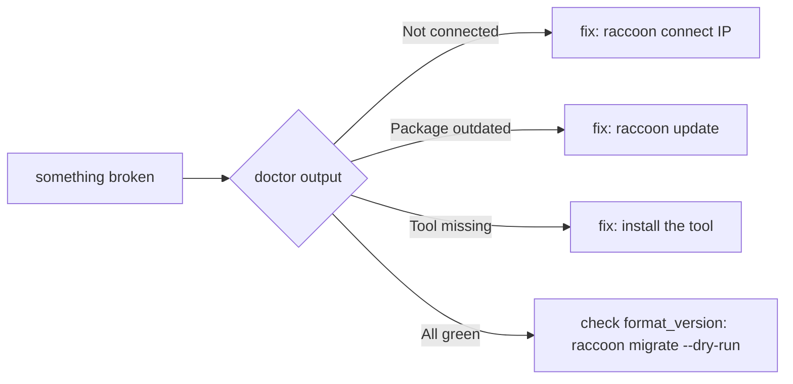

# raccoon doctor

```bash
raccoon doctor
```

`raccoon doctor` is your first-line diagnostic tool. It runs a structured health check of your development environment and reports three things:

1. **Connection state** — whether raccoon can reach the Pi, and the current project state on both sides
2. **Package versions** — compares installed raccoon package versions against the bundle manifest to flag anything outdated
3. **External tools** — verifies that every binary and Python library raccoon depends on is present

Run this command whenever something is not working before reaching for deeper debugging.

## Three failure categories

Most raccoon failures fall into exactly one of these buckets. `raccoon doctor` tells you which:



If `raccoon doctor` is fully green and things still fail, the next step is `raccoon migrate --dry-run` to check for project schema drift — that is a different layer entirely. See [Versioning And Upgrades]() for the full picture.

## What it checks

### Connection & project state

`raccoon doctor` first attempts to establish a connection if one is not already active. It reads the Pi address from:

1. The active session (if you already ran `raccoon connect` in this shell)
2. The current project's `raccoon.project.yml`
3. The first known Pi in `~/.raccoon/config.yml`

It then displays a panel for each of the following:

| Panel | What it shows |
|-------|---------------|
| **Pi Connection** | Connected / Not connected; address, port, user, Pi raccoon-server version, API token status |
| **Local Project** | Project name, UUID, path, and which Pi address is saved in the project config |
| **Remote Project (on Pi)** | Whether this project UUID exists on the Pi; path and last-modified date |
| **Known Pis** | A table of all Pis ever connected to, with hostname, address, port, and last-seen date |

### Package versions

raccoon fetches the current **bundle manifest** from `https://github.com/raccoon-image` (public GitHub REST API, no authentication required) and compares it against the versions installed on your laptop and — if connected — on the Pi.

Packages checked include `raccoon`, `raccoon-cli`, `raccoon-server`, and related libraries. The output table shows for each package:

- Installed version (laptop)
- Installed version (Pi, if connected)
- Bundle target version
- Status: up to date / outdated / ahead

If any package is outdated, doctor prints:

```
Run raccoon update to install updates.
```

### External tools

Doctor checks each of the following tools. Required tools cause doctor to exit with code 1 if missing; optional tools print a warning only.

| Tool | Required | Used for | Install hint |
|------|----------|----------|--------------|
| `ssh` | Yes | `raccoon shell`, SSH key setup | `sudo apt install openssh-client` / `brew install openssh` |
| `git` | Yes | Project creation, checkpoints | `sudo apt install git` / `brew install git` |
| `paramiko` (Python) | Yes | SSH/SFTP connections, sync | `pip install paramiko` |
| `black` (Python) | Yes | Formatting codegen output | `pip install black` |
| `rsync` | No | Faster sync (falls back to SFTP without it) | `sudo apt install rsync` / `brew install rsync` |
| `uv` | No | Fast package manager for local project runs | `pip install uv` |
| `pycharm` | No | `raccoon open` command | [jetbrains.com/pycharm](https://www.jetbrains.com/pycharm/) |

## Reading the output

A healthy environment looks like this:

```
╭──────────────── Pi Connection ────────────────╮
│ Connected to raspberrypi                       │
│ Address: 192.168.4.1:8421                      │
│ User:    pi                                    │
│ Version: 2.1.3                                 │
│ Auth:    authenticated                         │
╰────────────────────────────────────────────────╯

╭──────────────── Local Project ────────────────╮
│ Name: MyRobot                                  │
│ UUID: 3f2a1b9c-...                             │
│ Path: /home/user/robots/MyRobot                │
│ Saved Pi: 192.168.4.1                          │
╰────────────────────────────────────────────────╯

╭────────── Remote Project (on Pi) ─────────────╮
│ Name: MyRobot                                  │
│ Path: /home/pi/projects/MyRobot                │
│ Last Modified: 2026-06-18T10:23:05             │
╰────────────────────────────────────────────────╯

External tools
  ✓  ssh       /usr/bin/ssh
  ✓  git       /usr/bin/git
  ✓  paramiko  /usr/lib/python3/dist-packages/paramiko/__init__.py
  ✓  black     /usr/local/lib/python3.13/site-packages/black/__init__.py
  ✓  rsync     /usr/bin/rsync
  −  uv        not found — pip install uv (optional)
  −  pycharm   not found — jetbrains.com/pycharm (optional)
```

The icon meanings:

| Icon | Meaning |
|------|---------|
| `✓` (green) | Found and working |
| `✗` (red) | Missing — required, doctor exits with code 1 |
| `−` (yellow) | Missing — optional, raccoon will work without it |

## Exit codes

| Code | Meaning |
|------|---------|
| `0` | All required tools present (warnings may still appear) |
| `1` | One or more required tools are missing |

## Common workflows

### First-time environment check

After installing raccoon on a new machine, run doctor before doing anything else:

```bash
raccoon doctor
```

If it shows missing required tools (red `✗`), install them and re-run until all required items are green.

### Debugging a failed `raccoon connect`

```bash
raccoon doctor
```

If doctor shows "Not connected" and the Pi is on the network, check:

- The Pi address and port (use `raccoon connect <IP>` to set it)
- Whether `raccoon-server` is running on the Pi (`sudo systemctl status raccoon-server`)
- Whether the Pi is on the same network as your laptop

### Checking for updates before a competition

```bash
raccoon doctor
```

The package version table will flag anything outdated. If updates are available:

```bash
raccoon update
```

### Checking from outside a project directory

`raccoon doctor` works outside a project directory. In that case the Local Project and Remote Project panels are omitted, and only the connection state (based on `~/.raccoon/config.yml`) and tool checks are shown.

## Relationship to `raccoon status`

`raccoon doctor` is the current system diagnostic command. An earlier command called `raccoon status` (visible in old documentation) was never shipped as a working command — its functionality was fully absorbed into `raccoon doctor`. If you see references to `raccoon status` in older notes or tutorials, use `raccoon doctor` instead.
