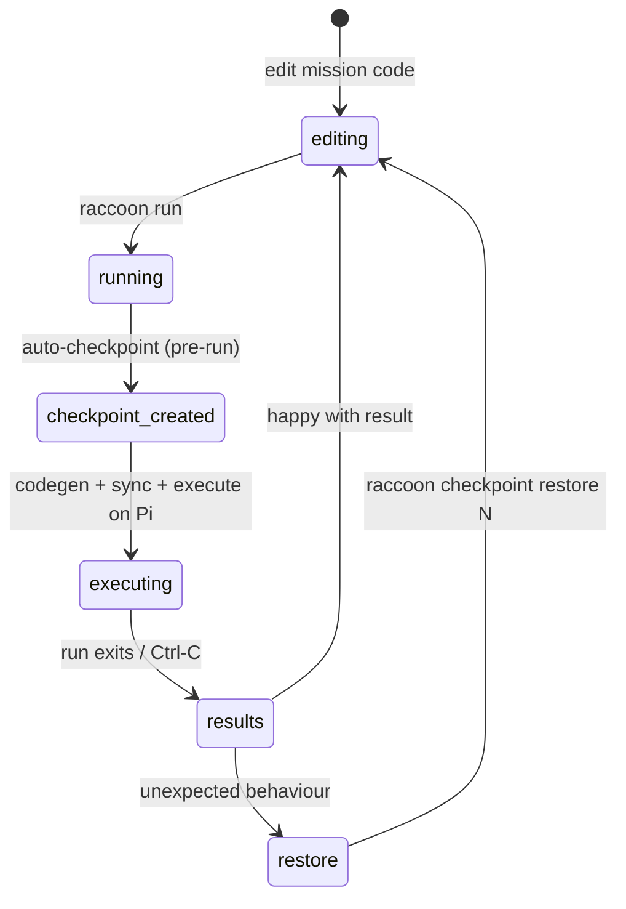

# raccoon checkpoint

```bash
raccoon checkpoint <subcommand>
```

`raccoon checkpoint` manages invisible git snapshots of your project's working tree. These snapshots let you roll back to an earlier state without polluting your git history, branch list, or stash list.

## How checkpoints fit into the run lifecycle



Checkpoints are stored under `refs/raccoon/checkpoints/` — a git ref namespace invisible to `git log`, `git branch`, and `git stash`. They survive `git clean` and `git checkout` because the ref holds the object alive, but a maximum of 100 are kept before older ones are auto-pruned.

> **Checkpoints vs. commits:** checkpoints are ephemeral recovery tools. For deliberate history, use `git commit`. For transferring code to the Pi, use `raccoon sync`.

## Why checkpoints exist

During development you frequently make a small change, run it on the robot, and find it broke something. Without checkpoints you would have to manually `git stash` or make a commit before every run, then undo it afterward.

raccoon creates a checkpoint automatically before each `raccoon run` (and before `raccoon sync` if `auto_checkpoints` is enabled in your project config). The checkpoint captures both staged and unstaged changes so nothing is lost.

Checkpoints are stored as lightweight git refs under `refs/raccoon/checkpoints/` — a namespace that is invisible to `git log`, `git branch`, and `git stash list`. They survive `git clean` and `git checkout` because they are not reachable from any branch, but they are also not garbage-collected because the ref keeps the object alive.

A maximum of 100 checkpoints are kept; older ones are pruned automatically once the limit is reached.

## Subcommands

### `raccoon checkpoint list`

List all saved checkpoints, most recent last.

```bash
raccoon checkpoint list
```

Example output:

```
  #  SHA        Label      Created
  1  a3f1c2e    pre-run    2026-06-18 10:14:02
  2  b8d04f1    pre-run    2026-06-18 11:32:45
  3  c7a91b3    pre-run    2026-06-18 12:05:17
```

The `#` column is the index you pass to `show`, `restore`, and `delete`. Index 1 is the oldest checkpoint; the highest index is the most recent.

### `raccoon checkpoint show`

Show the diff stored in a checkpoint without changing your working tree.

```bash
raccoon checkpoint show <IDENTIFIER>
```

`IDENTIFIER` is either the `#` index from `list` or a short SHA.

```bash
raccoon checkpoint show 3       # by index
raccoon checkpoint show c7a91b3 # by SHA
```

The output is a standard `git diff` showing what had changed from the committed HEAD at the time the checkpoint was created.

### `raccoon checkpoint restore`

Apply a checkpoint to your current working tree, replacing any uncommitted changes.

```bash
raccoon checkpoint restore <IDENTIFIER>
```

```bash
raccoon checkpoint restore 2   # roll back to checkpoint #2
```

This does **not** create a git commit. It resets your working tree to match the snapshot. If you have uncommitted work you want to keep, create a checkpoint first:

```bash
raccoon checkpoint list              # make a mental note of your current state
raccoon checkpoint restore 2         # apply the older snapshot
```

### `raccoon checkpoint delete`

Delete a single checkpoint by index or SHA.

```bash
raccoon checkpoint delete <IDENTIFIER>
```

```bash
raccoon checkpoint delete 1
```

This removes the git ref. The underlying git object will be garbage-collected on the next `git gc`.

### `raccoon checkpoint clean`

Prune multiple checkpoints at once.

```bash
raccoon checkpoint clean [--older-than DAYS] [--all]
```

| Flag | Default | Description |
|------|---------|-------------|
| `--older-than DAYS` | 7 | Delete checkpoints older than this many days |
| `--all` | off | Delete all checkpoints regardless of age |

Examples:

```bash
# Delete checkpoints older than one week (default)
raccoon checkpoint clean

# Delete checkpoints older than 2 days
raccoon checkpoint clean --older-than 2

# Delete every checkpoint
raccoon checkpoint clean --all
```

## Automatic checkpoint creation

raccoon creates a checkpoint automatically with the label `pre-run` whenever `raccoon run` executes (provided git is available and there are changes to capture).

Automatic checkpointing can be disabled in `raccoon.project.yml`:

```yaml
auto_checkpoints: false
```

When git is unavailable, the project directory is not a git repository, or the working tree has no changes, checkpoint creation is silently skipped — it is never a fatal error.

## Practical workflows

### Roll back after a bad run

```bash
# Run produced unexpected behavior — inspect what changed
raccoon checkpoint list
raccoon checkpoint show 3   # see what was in the latest auto-checkpoint

# Roll back working tree to that state
raccoon checkpoint restore 3
```

### Save a known-good state manually before risky edits

There is no explicit "create" subcommand — use `raccoon sync` or `raccoon run` to trigger an automatic checkpoint, or use standard `git stash` / `git commit` for manual checkpoints. The checkpoint system is designed for automatic use; for deliberate manual snapshots, a real git commit is more appropriate.

### Keep disk usage low

If your project runs frequently, checkpoints accumulate. Schedule a periodic cleanup:

```bash
raccoon checkpoint clean --older-than 3
```

Or wipe them all before a competition to start fresh:

```bash
raccoon checkpoint clean --all
```

## What checkpoints do not do

- They do not replace `git commit`. Checkpoints are ephemeral recovery tools, not a version history.
- They do not sync to the Pi. A checkpoint captures your local working tree only.
- They do not capture files excluded by `.gitignore`. If your calibration data or recordings are gitignored, checkpoints will not include them.
- They do not create a new branch or show up in `git log`. The only way to inspect them is through the `raccoon checkpoint` commands.
