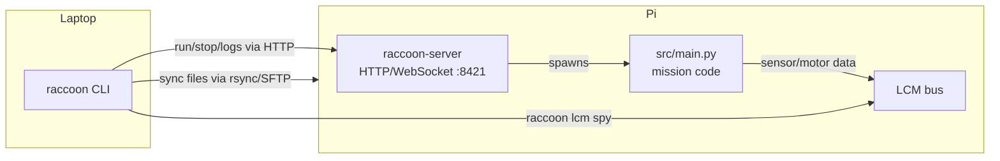

# raccoon-server

`raccoon-server` is the daemon that runs **on the Raspberry Pi (Wombat)**. It exposes a local HTTP/WebSocket API that the laptop-side `raccoon` CLI uses to sync files, execute missions, read encoder positions, and stream logs. Without it running on the Pi, `raccoon run`, `raccoon sync`, and `raccoon lcm` will not work.

`raccoon-server` is a separate entry point from `raccoon` — it is only installed and used on the Pi, not on your laptop.

## Architecture: laptop CLI ↔ Pi daemon



The server spawns `src/main.py` as a child process and streams its stdout back to the laptop in real time. When you press Ctrl-C, the CLI sends a shutdown signal through the server API — it does not kill the SSH session.

> Note: `raccoon-server` is only relevant if you need to install or manage the daemon manually. When you run `raccoon run` from the laptop, the server is already running (installed by `sudo raccoon-server install` during initial setup) and the CLI talks to it automatically.

## Commands

### `raccoon-server start` — run in the foreground

```bash
raccoon-server start
```

Starts the FastAPI server in the foreground using uvicorn. The server logs to stdout. This is the quickest way to get the server running for testing. Press **Ctrl-C** to stop.

Output:

```
Starting Raccoon Server on port 8421...
Projects directory: /home/pi/programs

INFO:     Started server process [1234]
INFO:     Waiting for application startup.
INFO:     Application startup complete.
INFO:     Uvicorn running on http://0.0.0.0:8421 (Press CTRL+C to quit)
```

### `sudo raccoon-server install` — install as a systemd service

```bash
sudo raccoon-server install [--user USER]
```

Installs the server as a `raccoon.service` systemd unit, enables it, and starts it immediately. **Requires root (`sudo`).**

| Option | Default | Description |
|--------|---------|-------------|
| `--user` | `pi` | The Linux user the service runs as. The service sets `RACCOON_PROJECTS_DIR` to `/home/<user>/programs`. |

What `install` does:

1. Writes the systemd unit file to `/etc/systemd/system/raccoon.service`.
2. Creates `/home/<user>/programs/` (the projects directory) if it does not exist.
3. Runs `systemctl daemon-reload`, `systemctl enable raccoon`, `systemctl start raccoon`.
4. Installs optional Wi-Fi fix services (`wifi-power-save-off.service`, `gratuitous-arp.service`) to improve Pi connectivity stability.
5. Installs `uv` for the specified user if not already present.
6. Prints the service status after installation.

```bash
sudo raccoon-server install          # install for user 'pi' (default)
sudo raccoon-server install --user robot  # install for a different user
```

### Other management commands

| Command | Requires root | Description |
|---------|--------------|-------------|
| `raccoon-server status` | no | Show whether the service is running, with `systemctl status` output |
| `raccoon-server restart` | yes | Restart the systemd service (`systemctl restart raccoon`) |
| `raccoon-server logs` | no | Show the 50 most recent log lines (`journalctl -u raccoon -n 50`) |
| `raccoon-server tail [-f]` | no | Show the last 20 log lines; `-f` follows live output |
| `raccoon-server config` | no | Print the current effective server configuration |
| `raccoon-server uninstall` | yes | Stop, disable, and remove the systemd unit |
| `sudo raccoon-server post-install` | yes | Re-install systemd unit and run migrations after a package update |

## Configuration — `/etc/raccoon/server.yml`

The server reads configuration from two locations, merged in this order (later values override earlier ones):

1. `/etc/raccoon/server.yml` — system-wide config (used when installed as a service)
2. `~/.raccoon/server.yml` — per-user override
3. Environment variables — override any file value

### `server.yml` reference

```yaml
# /etc/raccoon/server.yml

# Network interface and port to listen on.
# Use 0.0.0.0 to accept connections from all interfaces (required for laptop access).
host: "0.0.0.0"
port: 8421

# Absolute path to the directory where project folders are stored on the Pi.
projects_dir: "/home/pi/programs"
```

| Key | Default | Description |
|-----|---------|-------------|
| `host` | `"0.0.0.0"` | Listen address. `"0.0.0.0"` means all interfaces; `"127.0.0.1"` would restrict to local only. |
| `port` | `8421` | TCP port. The laptop-side `raccoon connect` default port matches this. |
| `projects_dir` | `~/programs` | Directory where project folders live on the Pi. Must be writable by the service user. |

### Environment variables

Environment variables take precedence over config files and are set in the systemd unit:

| Variable | Overrides | Example |
|----------|-----------|---------|
| `RACCOON_HOST` | `host` | `RACCOON_HOST=0.0.0.0` |
| `RACCOON_PORT` | `port` | `RACCOON_PORT=8421` |
| `RACCOON_PROJECTS_DIR` | `projects_dir` | `RACCOON_PROJECTS_DIR=/home/pi/programs` |

## API token

On first start, the server generates a random API token and stores it at `~/.raccoon/api_token` (readable only by the service user). The laptop-side `raccoon connect` reads this file over SSH and uses the token in all subsequent requests. The token file has permissions `0600` and is never transmitted in clear text outside the SSH session.

## Typical Pi setup workflow

1. Flash your Pi image and SSH in:
   ```bash
   ssh pi@192.168.4.1
   ```

2. Install raccoon on the Pi (if not already on the image):
   ```bash
   pip3 install raccoon-cli
   ```

3. Install and start the server as a service:
   ```bash
   sudo raccoon-server install
   ```

4. Verify it is running:
   ```bash
   raccoon-server status
   ```

5. From your **laptop**, connect:
   ```bash
   raccoon connect 192.168.4.1
   ```

The server starts automatically on every boot after `install`.

## Troubleshooting

### Server is not reachable

```bash
# On the Pi — check if the service is running
raccoon-server status

# Check what port is actually listening
ss -tlnp | grep 8421

# View recent logs for errors
raccoon-server logs
```

### Port conflict

If port 8421 is in use by another process, change `port:` in `/etc/raccoon/server.yml` and run:

```bash
sudo raccoon-server restart
```

Update the port on the laptop side too — pass `-p <port>` to `raccoon connect`.

### After updating raccoon on the Pi

Run the post-install command to refresh the systemd unit and apply any required migrations:

```bash
sudo raccoon-server post-install
```
