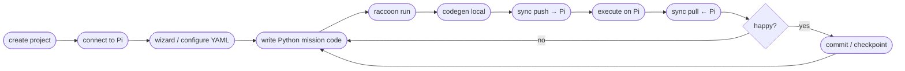

# Raccoon CLI

raccoon-cli is the command-line tool for managing robot projects. It handles everything from project scaffolding to running code on the robot.

## The developer workflow lifecycle

Every raccoon session follows the same lifecycle. Understanding the shape of this loop answers "which command do I run next?" at every step.



The key insight: **code generation and all validation happen on your laptop**. The Pi only receives the final Python files, never the raw YAML. This makes the edit–run loop fast even over a slow Wi-Fi link.

### Where each command fits

| Phase | Command | What happens |
|-------|---------|--------------|
| Setup | `raccoon create project` | Clone example repo, assign UUID, init git |
| Setup | `raccoon connect <IP>` | SSH key auth, save connection config |
| Setup | `raccoon wizard` | Write YAML hardware config interactively |
| Iterate | `raccoon run` | Codegen → push → execute → pull (all-in-one) |
| Inspect | `raccoon logs` | Browse run logs from Pi |
| Recover | `raccoon checkpoint restore` | Roll back to a pre-run snapshot |
| Update | `raccoon update` | Bring laptop + Pi to the same bundle |
| Diagnose | `raccoon doctor` | Check connection, tools, versions |

## Command Overview

| Command | What it does |
|---------|-------------|
| `raccoon create project <name>` | Scaffold a new project (clones the example repo from GitHub) |
| `raccoon create mission <name>` | Add a new mission to the current project |
| `raccoon connect <ip>` | Connect to a robot (sets up SSH auth, saves config) |
| `raccoon disconnect` | Remove the saved connection |
| `raccoon shell` | Open an interactive SSH shell on the connected Pi |
| `raccoon run` | Sync, generate code locally, and execute the project on the robot |
| `raccoon sync` | Push/pull files between laptop and robot |
| `raccoon codegen` | Generate `defs.py`, `defs.pyi`, and `robot.py` from YAML config |
| `raccoon wizard` | Interactive hardware configuration wizard |
| `raccoon update` | Update raccoon packages on both laptop and robot |
| `raccoon doctor` | Show system health: connection, tools, and package versions |
| `raccoon calibrate` | Run motor calibration routine |
| `raccoon web` | Start the Web IDE |
| `raccoon list projects` | List all raccoon projects |
| `raccoon list missions` | List missions in the current project |
| `raccoon remove project <name>` | Delete a project |
| `raccoon remove mission <name>` | Remove a mission from config |
| `raccoon checkpoint` | Manage invisible git snapshots (list, show, restore, delete, clean) |
| `raccoon reorder missions` | Reorder and renumber missions interactively |
| `raccoon lcm` | LCM traffic inspection (spy, record, playback, list, delete, status) |
| `raccoon migrate` | Apply project schema migrations to update the project format |
| `raccoon validate` | Run project validation checks (config, missions, imports) |

All commands support `-h` / `--help` for usage details.

## Auto-validation

Before every command (except `create`, `connect`, `disconnect`, `update`, `doctor`, `migrate`, `validate`, and `web`), raccoon automatically runs `raccoon validate` against your project. This catches config errors early, before any sync or execution happens.

To bypass auto-validation for a single invocation, use the global `--no-validate` flag:

```bash
raccoon --no-validate run
raccoon --no-validate sync
```

This is useful when you intentionally have an incomplete config and want to force a run anyway.

## Reading order

If you are new to raccoon-cli, read pages in this order:

1. **[Quick Start]()** — install, create, connect, run in 5 minutes
2. **[create]()** — project scaffolding and mission creation
3. **[connect]()** — SSH key setup
4. **[run]()** — the daily driver command in depth
5. **[Run Configurations]()** — how competition bots parameterise `dev` vs `competition` modes
6. **[sync]()** — what actually happens under the hood
7. **[checkpoint]()** — automatic safety snapshots

For troubleshooting and maintenance, jump directly to:

- **[Versioning And Upgrades]()** — bundles, migrations, format_version
- **[Troubleshooting And Recovery]()** — playbooks for common failures
- **[doctor]()** — system health check

## Deep Dives

- [Versioning And Upgrades]()
- [Troubleshooting And Recovery]()
- [sync]()
- [logs]()
- [doctor]()
- [checkpoint]()
- [Run Configurations]()
- [wizard]()
- [validate]()
- [raccoon-server]()
- [lcm]()
- [reorder missions]()
- [completion]()

## Installation

See the [Quick Start]() for install instructions.

**Requires Python 3.13+.**
