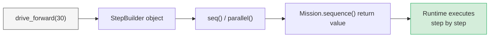

# Available Steps

## Concept: what a step is

A **step** is the atomic unit of robot behavior in `raccoon`. Every action — driving a centimeter, turning, moving a servo, waiting for a sensor — is represented as a step object. You build missions by composing steps into sequences, parallel groups, and loops.

Steps are not executed immediately when you write them. Calling `drive_forward(30)` returns a builder object. The runtime resolves that builder when the mission runs, which is why `defer()` (runtime branching) and `.until()` (stop conditions) work — they are evaluated at execution time, not at import time.



The step catalog below covers all **110** public steps currently in the library. They are generated automatically from the `raccoon-lib` source on every release.

---

## How to import steps

All steps are re-exported from the top-level `raccoon` package. The simplest approach is a star import at the top of every mission file:

```python
from raccoon import *
```

This is the recommended pattern for mission code. It brings in every step factory, the `Mission` and `SetupMission` base classes, `seq()`, `parallel()`, and all other DSL helpers.

If you prefer explicit imports, every step can also be imported from its specific module path:

```python
from raccoon.step.motion import drive_forward, turn_right, drive_arc_left, drive_arc_right
from raccoon.step.motion import mark_heading_reference, turn_to_heading_left, turn_to_heading_right
from raccoon.step.motor import set_motor_power, set_motor_velocity, set_motor_dps
from raccoon.step.motor import motor_brake, motor_off, motor_passive_brake
from raccoon.step.motor import move_motor_relative, move_motor_to
from raccoon.step.calibration import calibrate
from raccoon.step.timing import wait_for_checkpoint
```

> **Important — removed steps:** The step `drive_arc(radius_cm, degrees, speed)` and the step `turn_to_heading(degrees)` no longer exist. They were replaced by explicit directional variants. Use `drive_arc_left` / `drive_arc_right` instead of `drive_arc`, and `turn_to_heading_left` / `turn_to_heading_right` instead of `turn_to_heading`.

---

## Quick usage example

```python
from raccoon import *


class M010DriveMission(Mission):
    def sequence(self) -> Sequential:
        return seq([
            # Drive and turn
            drive_forward(30),
            turn_right(90),

            # Arc moves — always explicit about direction
            drive_arc_left(radius_cm=20, degrees=90),

            # Absolute heading with mark_heading_reference
            mark_heading_reference(),
            # ... robot drives around ...
            turn_to_heading_right(180),  # face 180° from origin

            # Follow a line until black
            drive_forward(50).until(on_black(Defs.front.right)),
        ])
```

---

## Step categories

Steps are tagged with one or more category labels. The interactive catalog below lets you filter by tag or search by name. Common categories:

| Tag | What it covers |
|-----|----------------|
| `motion` | Drive, turn, strafe, arc, path planning, wall alignment, line following |
| `motor` | Individual motor control — power, velocity, DPS, position, brake |
| `servo` | Servo angle and preset steps |
| `calibration` | Distance calibration, IR calibration, auto-tune, BEMF characterization |
| `control` | Loops, timeouts, background steps, conditional logic (`if_then`) |
| `timing` | Checkpoint-based synchronisation between two robots |
| `watchdog` | Hardware watchdog for safety-critical motions |
| `sensor` | Sensor-triggered motion steps |
| `localization` | Resync steps — realign odometry using wall, line, or start pose |
| `logic` | Environment gates (`run_if_debug`, `run_unless_no_calibrate`, etc.) |

---

## Heading reference steps

The heading reference system lets you make absolute turns regardless of how the robot has moved between steps.

| Step | Description |
|------|-------------|
| `mark_heading_reference(origin_offset_deg=0.0, positive_direction="left")` | Captures the current IMU heading as a reference origin. `origin_offset_deg` shifts the reference; `positive_direction` controls which way positive angles face. |
| `turn_to_heading_left(degrees)` | Turn so the heading is `degrees` counter-clockwise from the reference. Takes a positive number. |
| `turn_to_heading_right(degrees)` | Turn so the heading is `degrees` clockwise from the reference. Takes a positive number. |

```python
from raccoon.step.motion import mark_heading_reference, turn_to_heading_right

# After light start, capture heading origin
mark_heading_reference()

# Robot does other things ...

# Always face the same absolute direction
turn_to_heading_right(90)
```

---

## Diagonal drive steps (mecanum only)

Three variants let mecanum robots move at arbitrary angles. All three require a mecanum or omni-wheel drivetrain — they will not work on a differential (two-wheel) robot.

**`drive_angle(angle_deg, cm=None, speed=1.0)`** — drive at any robot-centric angle:

| `angle_deg` value | Direction |
|-------------------|-----------|
| `0` | Forward |
| `90` | Right (pure strafe) |
| `-90` | Left (pure strafe) |
| `180` | Backward |
| `45` | Forward-right diagonal |
| `-130` | Backward-left diagonal |

```python
from raccoon import *

# Fixed distance — diagonal forward-right
drive_angle(45, cm=30)

# Condition-only — backward-left until sensor
drive_angle(-130).until(on_black(Defs.front.right))
```

**`drive_angle_left(angle_deg, cm=None, speed=1.0)`** and **`drive_angle_right(angle_deg, cm=None, speed=1.0)`** are convenience wrappers where `angle_deg` is always a positive number of degrees to the left or right of forward (`90` = pure left or right strafe). Use whichever reads most clearly in your mission.

Real competition usage (adapted from the cube-bot):

```python
from raccoon import *

# Diagonal backward-left to approach the loading dock
drive_angle(-130, cm=19)

# Or equivalently with the direction-explicit variant
drive_angle_left(130, cm=19)
```

---

## Real examples from competition robots

These patterns come from real Botball competition bots and show how steps compose in practice.

### Parallel drive + arm trigger

Start a 40 cm drive and lower the arm at the 7 cm mark, so both finish at the same time (adapted from the examplebot):

```python
parallel(
    drive_forward(cm=40),
    seq([
        wait_until_distance(7),   # fires when 7 cm into the drive step
        Defs.arm_servo.hold(),    # arm reaches pick-up position just in time
    ]),
)
```

### Stop condition chain with minimum-distance guard

Prevent false triggers from start-line tape with an `after_cm()` guard (adapted from the examplebot):

```python
follow_line_single(
    Defs.front.left,
    speed=0.8,
    side=LineSide.LEFT,
    kp=0.5,
    kd=0.1,
).until(after_cm(20) & on_black(Defs.front.right))
# & requires BOTH conditions to be true simultaneously
```

### Three-step THEN chain

`over_line()` works as a middle element in a `+` chain, not just as a terminal condition (adapted from the conebot):

```python
drive_backward().until(
    after_cm(10) +               # 1. clear the starting position
    over_line(Defs.front.right) + # 2. cross the black line (black → white)
    after_cm(20)                 # 3. travel 20 cm past the line
)
```

### Heading hold on a long drive

Use the `heading` parameter on `drive_backward` to hold an absolute angle and prevent drift on a 200 cm run (adapted from the conebot):

```python
drive_backward(cm=30),
turn_to_heading_right(180),
drive_backward(cm=200, heading=180),  # holds 180° for the entire 200 cm
```

The `heading` parameter is available on `drive_forward`, `drive_backward`, `strafe_left`, and `strafe_right`. It takes an absolute heading in degrees from the current heading reference (set by `mark_heading_reference()`).

---

## Step catalog


