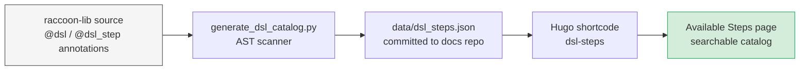

# API Reference

Complete reference for the `raccoon` library surface. Everything in this section is generated from source — signatures, docstrings, and the step catalog are always in sync with the released library.

---

## Concept: where the step catalog comes from

The step catalog is not hand-written. Every public step in `raccoon-lib` is annotated with `@dsl` or `@dsl_step`, which registers it with a name, a signature, and documentation. On every library release, a scanner (`docs/generate_dsl_catalog.py`) walks every module, extracts those annotations, and writes them to a JSON file (`data/dsl_steps.json`). The Hugo site reads that JSON and renders the searchable catalog below.

**What this means for you:** the catalog is a snapshot of the latest release. If you are running an older version of `raccoon-lib`, some entries may not exist yet. Use `raccoon update` to stay current.

---

## Available Steps

All steps available in the `raccoon` DSL, grouped by category. These are the building blocks you use to compose robot missions. The catalog currently covers approximately **110** public steps across motion, motor, servo, sensor, calibration, control-flow, timing, and watchdog categories.

[View Available Steps]()

---

## Python API

Complete reference for all Python modules — motors, servos, sensors, motion steps, missions, calibration, and more.

<a href="/api/autoapi/index.html" class="api-link" target="_blank">Open Python API Reference</a>

> **Local development note:** The Python API reference at `/api/autoapi/` and the C++ reference at `/api/doxygen/` are populated from a release artifact (`raccoon-docs-*.zip`) that the CI workflow downloads from GitHub on each build. These paths do **not** exist after a fresh `git clone` — a local `hugo server -D` will produce broken links for those two buttons. The Available Steps catalog (`data/dsl_steps.json`) is committed and works locally.

---

## C++ API (Doxygen)

Low-level C++ class and function reference for the native library internals.

<a href="/api/doxygen/index.html" class="api-link" target="_blank">Open C++ API Reference</a>
