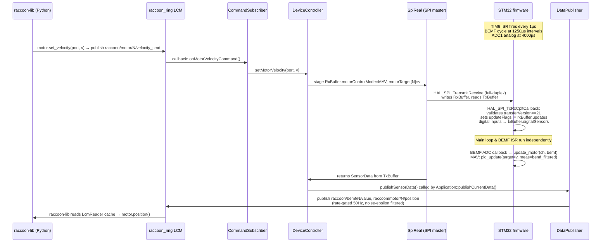

## What is the firmware section?

This section covers the full embedded firmware stack: from the STM32F427 microcontroller that runs motor loops and reads sensors in hard real-time, through the SPI wire protocol that connects it to the Raspberry Pi, through the C++ bridge process that publishes sensor data and routes commands, all the way to the Python API that user mission code calls.

It is written for an embedded engineer joining the team. Every number, struct field, and function name is sourced directly from the code.

## The two-processor model — a 30-second orientation

The Wombat robot uses two processors that collaborate over SPI:

```mermaid
graph LR
    subgraph STM32["STM32F427 — Hard Real-Time (bare metal)"]
        direction TB
        PWM["Motor PWM\n~25 kHz TIM1/TIM8"]
        BEMF["BEMF sampling\nADC2, 200 Hz per motor"]
        PID["Velocity PID\ndt-explicit, 200 Hz"]
        IMU["IMU fusion\nMPU-9250 DMP, 50 Hz"]
        ADC1["Analog sensors\nADC1 DMA, 250 Hz"]
        ODOM["Odometry\nBEMF + IMU midpoint integration"]
    end

    subgraph PI["Raspberry Pi — Linux user-space"]
        READER["stm32-data-reader\nC++ SPI master bridge"]
        LCM["raccoon_ring LCM bus\ntyped pub/sub channels"]
        LIB["raccoon-lib\nPython HAL + mission runner"]
    end

    STM32 <-->|"SPI2 full-duplex DMA\nTxBuffer ← sensors\nRxBuffer → commands\nTRANSFER_VERSION = 21"| READER
    READER <-->|"raccoon/* LCM channels"| LCM
    LCM <-->|"subscribe / publish"| LIB
```

The STM32 guarantees microsecond-level timing for the BEMF cycle that back-EMF position tracking depends on. The Pi handles everything that Linux is good at. The SPI link is the only shared boundary.

The data flows **simultaneously in both directions** on every SPI transfer: the STM32 streams the latest sensor snapshot outward (`TxBuffer`) while the Pi writes the latest actuator commands inward (`RxBuffer`). Neither side blocks waiting for the other.

## Why this split is not optional

Back-EMF based position tracking requires the STM32 to stop one motor every 1250 µs, wait exactly 500 µs for the back-EMF signal to stabilise, then fire an ADC conversion. Each individual motor is sampled every 5000 µs (200 Hz) using a round-robin across all four motors. If any step in this cycle is delayed by even a few hundred microseconds, the ADC reads PWM switching noise instead of the motor's actual back-EMF, and position tracking breaks.

Linux on the Pi cannot reliably meet that constraint without a PREEMPT-RT kernel patch (which the Wombat image does not use). The STM32, with no operating system, fires its TIM6 ISR within nanoseconds of the programmed period. The split is load-bearing.

## System-level data flow

## Learning path

Work through the pages in this order. Each one builds on the previous:

### 1. [Architecture Overview](architecture/)

The mental model, responsibility split, the two-processor rationale, the full component map with real file names and function names, motor control modes, the LCM channel taxonomy, and a glossary of every term used across the stack. **Start here.**

Key questions answered:
- Why does the STM32 need its own processor?
- What does each source file do?
- What is the SPI protocol boundary?
- What is a TRANSFER_VERSION and why does it matter?

---

### 2. [Firmware Runtime and Scheduling](firmware-runtime/)

The bare-metal super-loop, interrupt hierarchy, all five hardware timers, BEMF orchestration inside the TIM6 ISR, ADC architecture, the main loop task table, and real-time hazards (blocking UART, SPI idle guard, updateFlags race).

Key questions answered:
- What runs in an ISR vs. the super-loop?
- Why is TIM6 lower priority than SPI2 DMA?
- What can block the main loop and what cannot?

---

### 3. [SPI Communication Protocol](spi-protocol/)

The wire contract between the STM32 and the Pi: the `TxBuffer` and `RxBuffer` packed structs, how the DMA circular mode works, the version handshake, the `updateFlags` bitmask, and the per-transfer timing.

Key questions answered:
- What exactly crosses the wire on every SPI transfer?
- How does the Pi know a new sensor snapshot has arrived?
- How does the STM32 know which RxBuffer fields to act on?

---

### 4. [Data Pipeline](data-pipeline/)

The complete path from a physical signal to a Python API call, with latency budget at each stage: ADC → BEMF processing → TxBuffer → SPI transfer → `DeviceController` → `DataPublisher` → LCM → raccoon-lib.

Key questions answered:
- How long does it take for a motor position change to reach Python?
- What is the publish rate gate and why does it exist?
- What channels are retained (late-subscribe gets last value)?

---

### 5. [Pi Bridge Internals](pi-bridge-internals/)

Deep dive into the `stm32-data-reader` process: `Application` lifecycle, `SpiReal` vs `SpiMock`, `DeviceController` state caching and smooth servo interpolation, `DataPublisher` gate logic, `CommandSubscriber` timestamp deduplication, `MotorWatchdog`, `LcmBroker`, and the `raccoon_ring` shared memory transport.

Key questions answered:
- How does the bridge restart transparently without disconnecting subscribers?
- What is the raccoon_ring SeqLock and why does it matter?
- How are continuous motor commands handled differently from discrete position commands?

---

### 6. [Motor Control](motor-control/)

The BEMF round-robin cycle (timing constants, ADC2 DMA, median+IIR filtering, dt-aware integration), the motor state machine (`update_motor()`), the velocity PID (`PID.c`), the MTP sqrt-deceleration profile, and the chassis velocity loop.

Key questions answered:
- How does BEMF position tracking actually work?
- What is the difference between MAV, MTP, and CHASSIS modes?
- How does the PID controller measure dt without a fixed-rate scheduler?

---

### 7. [Sensor Reading](sensors/)

ADC1 analog oversampling (6 ports + battery voltage, 250 Hz), digital GPIO inputs (11 ports), and the IMU pipeline (MPU-9250 DMP, SPI3, 50 Hz quaternion + heading fusion).

Key questions answered:
- How does 12-bit analog oversampling work?
- What does the MPU-9250 DMP produce, and how does the STM32 consume it?
- How is the IMU orientation matrix configured from the Pi?

---

### 8. [IMU Stack](imu/)

Full coverage of the MPU-9250 hardware layer (SPI3 pin assignments, bus speed, AK8963 aux I²C), the DMP initialization sequence, 6-axis quaternion fixed-point formats, the eMPL/MPL fusion pipeline, sensor units and frames, orientation matrices, and the flash persistence design (currently disabled).

Key questions answered:
- What does the DMP produce and how is it consumed by the STM32?
- Why is yaw drift the main concern for a ground robot?
- Why is IMU calibration flash persistence currently a no-op?

---

### 9. [Robot Services and systemd](robot-services-and-systemd/)

The Pi-side service topology: what `stm32-data-reader` is, how it is managed by systemd, the `MotorWatchdog` heartbeat mechanism, the STM32 health check (`updateTime` timeout), and the graceful shutdown sequence.

Key questions answered:
- What happens if raccoon-lib crashes while motors are running?
- How does the watchdog know to shut the motors down?
- How does the STM32 liveness check work independently of the UART heartbeat?

---

### 10. [Build and Flash](build-flash/)

How to cross-compile the STM32 firmware (Docker / gcc-arm-none-eabi), how to cross-compile the Pi bridge for ARM64, how to deploy both to the Pi (`deploy.sh`), and how to verify the protocol version match.

---

## Source repository map

| What | Path |
|---|---|
| STM32 firmware (C) | `stm32-data-reader/firmware/Firmware/src/` |
| Pi bridge (C++20) | `stm32-data-reader/src/wombat/` |
| Pi bridge headers | `stm32-data-reader/include/wombat/` |
| Shared SPI protocol | `stm32-data-reader/shared/spi/pi_buffer.h` |
| raccoon-transport LCM wrapper | `stm32-data-reader/raccoon-transport/` |
| LCM channel names | `raccoon-transport/cpp/include/raccoon/Channels.h` |

> **Note:** The firmware previously lived in `Firmware-Stp/` at the repository root. It has been merged into `stm32-data-reader/firmware/`. Any path references to `Firmware-Stp/` in older notes or scripts are stale.

## Key numbers at a glance

| Parameter | Value | Source |
|---|---|---|
| STM32 clock | 180 MHz | `main.c` SystemClock_Config |
| SPI protocol version | 21 | `pi_buffer.h` `TRANSFER_VERSION` |
| SPI clock speed (Pi master) | 20 MHz | `wombat::Configuration` default |
| Motor PWM frequency | ~25 kHz | `timerInit.c` TIM1 Prescaler=17, Period=399 |
| Motor PWM duty range | 0–400 | `motor.h` `MOTOR_MAX_DUTYCYCLE` |
| BEMF sampling interval (per-motor round-robin) | 1250 µs | `bemf.h` `BEMF_SAMPLING_INTERVAL` |
| BEMF settle wait | 500 µs | `bemf.h` `BEMF_CONVERSION_START_DELAY_TIME` |
| BEMF effective rate (per motor) | 200 Hz | 4 motors × 1250 µs = 5000 µs/motor |
| Analog sensor output rate | 250 Hz | `adcPorts-batteryVoltage.h` `ANALOG_OUTPUT_INTERVAL = 4000 µs` |
| IMU fusion rate | 50 Hz | DMP config in `imu_setup.c` |
| STM32 UART heartbeat interval | 5 s | `main.c` `HEARTBEAT_INTERVAL = 5000` |
| Pi health check timeout (SPI updateTime) | 10 s | `Application.cpp` `kTimeout` |
| UART heartbeat warn timeout | 12 s | `Application.cpp` `kHeartbeatWarnTimeout` |
| DataPublisher rate gate | 50 Hz (20 ms min interval) | `DataPublisher.cpp` `kFiftyHzInterval` |
| MTP done threshold | 40 BEMF ticks | `motor.c` `MTP_DONE_THRESHOLD` |
| BEMF dead-zone | ±25 ADC counts | `bemf.c` `BEMF_DEADZONE` |
| Odometry rotational slip threshold | 0.5 rad/s | `odometry.c` `WZ_SLIP_THRESHOLD` |
