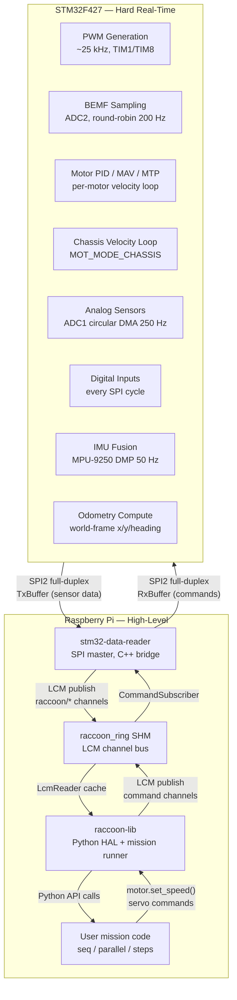

## Mental model

The Wombat robot uses a two-processor architecture. A Raspberry Pi handles high-level logic, vision, networking, and user code. An STM32F427 microcontroller handles everything that requires hard real-time guarantees: motor PWM generation, back-EMF sampling, closed-loop motor control, sensor ADC scanning, and IMU data acquisition.

This split is not optional. The Linux scheduler on the Pi cannot provide the microsecond-level timing that back-EMF based position tracking requires. Back-EMF measurement needs the motor briefly stopped for exactly 500 µs every 1250 µs — a cycle that must not be perturbed. The STM32 can guarantee this; Linux on the Pi cannot.

The data flows in both directions simultaneously over a single SPI2 full-duplex transfer. Every transfer delivers fresh sensor data from the STM32 while also sending the latest commands from the Pi.

## Reading order

If you are new to this section, read in this order:

1. [Architecture Overview](architecture/) — the responsibility split and startup sequence
2. [SPI Communication Protocol](spi-protocol/) — the wire contract that connects both sides
3. [Motor Control](motor-control/) — PWM, BEMF, PID, and the motor mode state machine
4. [Sensor Reading](sensors/) — analog, digital, IMU
5. [Data Pipeline](data-pipeline/) — the full path from physical signal to Python API, with timing budget
6. [Robot Services And systemd](robot-services-and-systemd/) — the Pi-side service topology and MotorWatchdog
7. [Build and Flash](build-flash/) — how to compile, flash, and deploy the firmware

## Source repositories

| Repository | Location |
|---|---|
| STM32 firmware | `stm32-data-reader/firmware/` |
| Pi-side SPI bridge | `stm32-data-reader/` |
| raccoon-transport (LCM wrapper) | `stm32-data-reader/raccoon-transport/` |
| Shared SPI protocol header | `stm32-data-reader/shared/spi/pi_buffer.h` |

> **Note:** The firmware previously lived in a separate `Firmware-Stp/` directory at the repository root. It has been merged into `stm32-data-reader/firmware/`. Any path references to `Firmware-Stp/` in older notes or scripts are stale and will not work.
