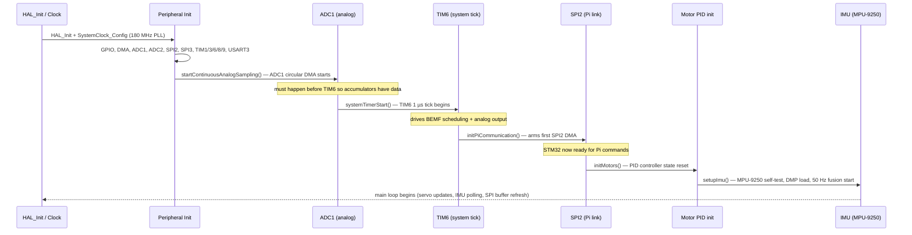

## Concept

The Wombat is not controlled by a single processor. Two processors collaborate: the Raspberry Pi handles everything a general-purpose operating system is good at (networking, vision, Python code, user interfaces), and the STM32 handles everything that Linux is *not* good at (deterministic microsecond-level timing for motor feedback loops).

The key insight is that back-EMF based position tracking imposes a strict real-time contract. Every 1250 µs, one motor must be stopped, the system must wait exactly 500 µs for the back-EMF signal to settle, and then the ADC must fire. If anything delays any step by even a few hundred microseconds, the ADC picks up PWM switching noise instead of the motor's actual back-EMF, and position tracking degrades. Linux cannot reliably meet that contract. The STM32 can.

The SPI link between them is the only shared boundary. The Pi is the SPI master: it initiates every transfer, sends commands, and reads sensor data. The STM32 is the SPI slave: it responds with its current sensor snapshot and applies the received commands in the next control cycle.

## Why Two Processors?

The Raspberry Pi runs Linux, which is a general-purpose preemptive operating system. Linux processes can be interrupted by the scheduler at any time. For most tasks — path planning, vision, networking, user code — this is fine. For motor control it is a problem.

Back-EMF based position tracking requires the STM32 to briefly stop every motor, wait exactly 500 µs for the motor back-EMF signal to stabilise, then sample the ADC. This cycle runs every 5000 µs (200 Hz). If any step in that cycle is delayed by even a few hundred microseconds, the BEMF reading picks up noise from the PWM switching rather than the actual back-EMF, and position tracking degrades or breaks entirely. Linux cannot reliably guarantee sub-millisecond scheduling latency without a real-time patch (PREEMPT-RT), which the Wombat image does not use.

The STM32 has no operating system. Its interrupt controller runs at known, deterministic latencies. Timer-triggered interrupts fire within nanoseconds of their programmed time.

## Responsibility Split

### STM32F427 (firmware, `stm32-data-reader/firmware/`)

The STM32 owns everything that touches physical hardware at high frequency:

- **PWM generation** for four DC motors (TIM1 and TIM8, ~25 kHz, 0–399 duty range)
- **PWM generation** for four servos (TIM3 and TIM9, 50 Hz, 600–2600 µs pulse width)
- **Back-EMF (BEMF) sampling** via ADC2 (eight channels, differential pair per motor)
- **Motor control loop** execution triggered by each BEMF completion (200 Hz)
- **Analog sensor ADC scanning** via ADC1 (six general-purpose ports + battery voltage)
- **Digital input scanning** (ten general-purpose pins + one on-board button)
- **IMU data acquisition and fusion** via SPI3 to the MPU-9250/AK8963
- **Position accumulation** (integrating BEMF ticks into an odometer)
- **Odometry computation** (velocity and position in world frame, if kinematics config is loaded)
- **SPI slave interface** to the Raspberry Pi (SPI2, DMA-driven, circular mode)

The STM32 does not run any user code. It executes only the firmware compiled from `stm32-data-reader/firmware/`.

### Raspberry Pi (user code, libstp, stm32-data-reader)

The Pi handles everything that is not timing-critical:

- Running the `stm32-data-reader` C++ process that drives the SPI master transaction, reads the `TxBuffer` from the STM32, writes the `RxBuffer` to the STM32, and republishes all sensor data as LCM messages
- Running `raccoon-transport` as an LCM message bus for inter-process communication
- Hosting libstp Python bindings that user code imports
- Running vision inference (YOLO), UI rendering, mission logic, calibration steps
- Computing high-level motion profiles, odometry integration from BEMF, kinematics

## Hardware

The STM32F427VIT6 is an ARM Cortex-M4F running at 180 MHz (HSI oscillator, PLL configured at PLLM=8, PLLN=180, PLLP=DIV2, with Over-Drive enabled). It provides an FPU with hardware single-precision float, which is used throughout the PID and BEMF processing code.

The MCU is connected to the Pi via:
- **SPI2** (slave, GPIO port B pins 12–15): the main communication channel
- **UART3** (GPIO port B pins 10–11): optional debug/log output read by the Pi

## Startup Sequence

When the STM32 powers on or resets:

1. `HAL_Init()` initialises the HAL tick (SysTick at 1 ms).
2. `SystemClock_Config()` configures the PLL for 180 MHz operation. Flash cache (instruction + data) is enabled; prefetch is disabled as recommended by ST application note AN4073 to reduce ADC noise from the Flash AHB bus.
3. All peripherals are initialised: GPIO, DMA, ADC1, ADC2, SPI2, SPI3, TIM1, TIM3, TIM6, TIM8, TIM9, and USART3 (the debug serial port to the Pi).
4. `startContinuousAnalogSampling()` kicks off continuous circular DMA mode on ADC1. This must happen **before** `systemTimerStart()` so the oversampling accumulators have data by the time the timer ISR fires for the first time.
5. `systemTimerStart()` starts TIM6 (the 1 µs system tick), which drives the BEMF and analog output scheduling.
6. `initPiCommunication()` arms the first SPI2 DMA transfer — from this point the STM32 is ready to receive commands and send sensor data.
7. `initMotors()` initialises all PID controller state.
8. `setupImu()` runs the MPU-9250 self-test to calibrate gyro/accel biases, initialises the InvenSense Motion Processing Library (MPL), loads the DMP firmware, and starts the sensor fusion pipeline at 50 Hz.

The main loop then runs forever, handling:
- Servo position updates (CCR writes are PWM-shadow-buffered, so the timing is fine even if the loop rate varies)
- PID gain updates from the `updateFlags` bitmask set by the SPI interrupt
- IMU calibration save requests (`PI_BUFFER_UPDATE_SAVE_IMU_CAL` flag — calls `cal_save_to_flash()`, currently a no-op)
- Kinematics config updates and odometry reset
- Motor position reset on-STM32 via `motorPositionReset` bitmask
- Feature flag updates (e.g., `FEATURE_BEMF_DISABLE`)
- IMU orientation matrix updates
- IMU polling (`readImu()`)
- SPI buffer refresh (`updatingMotorsInSpiBuffer()`) and odometry output

The motor control loop itself does **not** run in the main loop — it is triggered exclusively by the ADC2 conversion-complete interrupt (`HAL_ADC_ConvCpltCallback`) which fires after each BEMF sample.

The firmware prints a `[stp] hb #N` heartbeat line over UART3 every 5 seconds containing the current motor modes, positions, BEMF readings, and conversion count. The Pi-side `UartMonitor` tails this output and forwards it to the logger.

## Startup Sequence Diagram

## Related pages

- [SPI Communication Protocol](../spi-protocol/) — the wire format for the SPI link
- [Motor Control](../motor-control/) — what the firmware does inside each BEMF cycle
- [Data Pipeline](../data-pipeline/) — how sensor data travels from STM32 to Python
