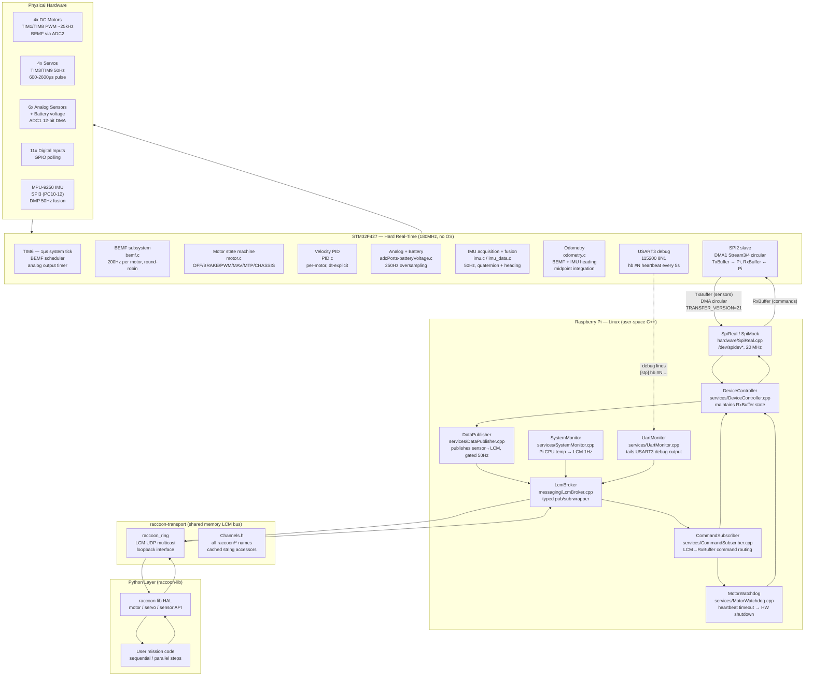
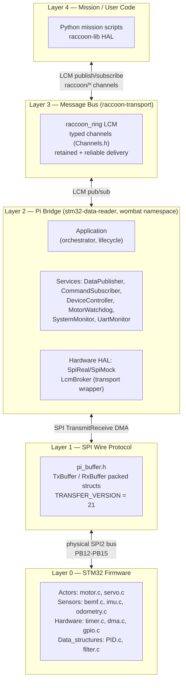
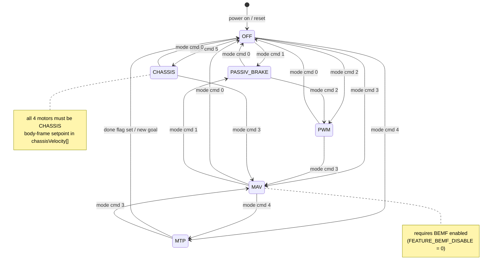

## Mental model — why two processors?

The Wombat robot is controlled by two processors working in a carefully defined partnership, not by one processor doing everything.

The **Raspberry Pi** is a Linux computer. Linux is excellent at networking, Python execution, vision inference, user interfaces, and any task where a few milliseconds of scheduling jitter is acceptable. It is fundamentally unsuited to hard real-time work: the scheduler can preempt any task at any moment, and even a high-priority process can be delayed by kernel activity, IRQ coalescing, or memory pressure.

The **STM32F427** is a bare-metal ARM Cortex-M4F microcontroller. It runs no operating system. Its NVIC interrupt controller fires timer and DMA interrupts within nanoseconds of their programmed time. It can make timing guarantees that Linux simply cannot.

The key constraint that makes this split mandatory is the back-EMF (BEMF) position tracking cycle. Every 1250 µs the firmware must stop one motor, wait exactly 500 µs for the back-EMF signal to settle (motor coasting, PWM switching noise dying), then trigger an ADC conversion. If any step in that sequence is delayed by even a few hundred microseconds, the ADC samples PWM switching noise rather than the true back-EMF, and position tracking degrades or breaks completely. The BEMF cycle is not a "nice to have" — it is the foundation of every closed-loop motor mode (MAV, MTP, chassis velocity). The STM32 guarantees it; Linux on the Pi cannot.

The only shared boundary between the two processors is the **SPI2 link**. The Pi is the SPI master: it initiates every transfer, writes commands into the `RxBuffer`, and reads sensor data out of the `TxBuffer`. The STM32 is the SPI slave: it fills `TxBuffer` continuously with the latest sensor snapshot and applies received `RxBuffer` commands in the next control cycle.

## End-to-end architecture



## Responsibility split

### What the STM32 owns

The STM32 owns everything that must happen at a precise time, every time, with no jitter.

| Responsibility | Rate | Source file | Peripheral |
|---|---|---|---|
| Motor PWM generation (4 motors) | ~25 kHz | `Actors/motor.c` | TIM1 ch1-3, TIM8 ch1 |
| Servo PWM generation (4 servos) | 50 Hz | `Actors/servo.c` | TIM3, TIM9 |
| BEMF round-robin sample cycle | 800 Hz (200 Hz/motor) | `Sensors/bemf.c` | ADC2, DMA1 |
| Motor PID control loop | 200 Hz (per motor, BEMF-triggered) | `Actors/motor.c`, `Data_structures/PID.c` | — |
| Analog sensor oversampling | 250 Hz output | `Sensors/adcPorts-batteryVoltage.c` | ADC1, DMA |
| Digital input scanning | Every SPI callback | `Sensors/digitalPorts.c` | GPIO |
| IMU acquisition + DMP fusion | 50 Hz | `Sensors/IMU/imu.c` | SPI3 |
| Odometry integration | ~200 Hz (BEMF-paced) | `Sensors/odometry.c` | — |
| SPI slave interface to Pi | Continuous DMA | `Communication/communication_with_pi.c` | SPI2 |
| Flash storage of IMU calibration | On-demand | `Storage/flash_cal.c` | Internal flash |

The STM32 does **not** run user code, path planning, or vision. Its job is sensor acquisition, actuator control, and data buffering.

### What the Pi owns

The Pi owns everything that is not timing-critical. It treats the STM32 as a peripheral.

| Responsibility | Service / file |
|---|---|
| SPI master transfer | `hardware/SpiReal.cpp` |
| Sensor data LCM publish | `services/DataPublisher.cpp` |
| Command routing (LCM → STM32) | `services/CommandSubscriber.cpp` |
| STM32 version probe on startup | `Application.cpp` (`spi_probe_version()`) |
| Motor watchdog (heartbeat timeout) | `services/MotorWatchdog.cpp` |
| STM32 UART debug log forwarding | `services/UartMonitor.cpp` |
| Pi CPU temperature publish | `services/SystemMonitor.cpp` |
| LCM message bus management | `messaging/LcmBroker.cpp` |
| User mission code execution | raccoon-lib Python API |
| Vision inference, kinematics planning | raccoon-lib |

## Layered architecture



The layering is strict: the Pi bridge layer (L2) is the only component that touches the SPI protocol (L1). raccoon-lib never reads the raw buffer; it always talks through LCM channels. This isolation means the SPI protocol can evolve (version number bumps) without touching user code.

## The SPI protocol boundary

The file `shared/spi/pi_buffer.h` is the **single source of truth** for the wire protocol. It is compiled into both the STM32 firmware and the Pi bridge; any change must be made exactly once and both sides must be reflashed/rebuilt together. The `TRANSFER_VERSION` field (currently `21`) is checked on every transfer — a mismatch is logged and triggers a reflash warning.

```
TxBuffer (STM32 → Pi):                   RxBuffer (Pi → STM32):
  transferVersion  uint8_t                 transferVersion  uint8_t
  updateTime       uint32_t (µs)           updates          uint32_t (flags)
  motor            MotorData               systemShutdown   uint8_t
    .bemf[4]       int32_t                 motorControlMode uint16_t (3 bits/motor)
    .position[4]   int32_t                 motorTarget[4]   int32_t
    .done          uint8_t (bitmask)       chassisVelocity[3] float
  analogSensor[6]  int16_t                 motorGoalPosition[4] int32_t
  batteryVoltage   int16_t                 servoMode        uint8_t
  digitalSensors   uint16_t               servoPos[4]      uint16_t
  imu              ImuData                 motorPidSettings MotorPidSettings
  odometry         OdometryData            kinematics       KinematicsConfig
                                           featureFlags     uint8_t
```

Both structs are `__attribute__((packed))`. The DMA transfer length is `max(sizeof(TxBuffer), sizeof(RxBuffer))` — the longer one dictates the transfer size so the SPI slave never under-reads. See the [SPI Protocol](../spi-protocol/) page for the full wire contract.

## Startup sequence

When the STM32 powers on:

```mermaid
sequenceDiagram
    participant Boot as Reset / HAL_Init
    participant Clk as SystemClock_Config
    participant Periph as Peripheral Init
    participant ADC1 as ADC1 (analog DMA)
    participant TIM6 as TIM6 (1µs tick)
    participant SPI2 as SPI2 slave DMA
    participant Motor as Motor PID init
    participant IMU as MPU-9250 + DMP

    Boot->>Clk: HAL_Init() → PLL 180MHz, flash cache ON, prefetch OFF (AN4073)
    Clk->>Periph: GPIO, DMA, ADC1, ADC2, SPI2, SPI3, TIM1/3/6/8/9, USART3
    Periph->>ADC1: startContinuousAnalogSampling() — ADC1 circular DMA starts
    Note over ADC1: must precede TIM6 so oversampling accumulators have data on first ISR
    ADC1->>TIM6: systemTimerStart() — TIM6 period=1µs, interrupts begin
    Note over TIM6: drives BEMF scheduler + analog output at 250Hz
    TIM6->>SPI2: initPiCommunication() — HAL_SPI_TransmitReceive_DMA armed
    Note over SPI2: STM32 now ready; first Pi transfer can occur
    SPI2->>Motor: initMotors() — PID state reset for all 4 channels
    Motor->>IMU: setupImu() — MPU-9250 self-test, bias calibration, DMP load, 50Hz fusion
    IMU-->>Boot: main() infinite loop begins
```

When the Pi-side `stm32-data-reader` process starts:

1. `LcmBroker` initializes — opens the LCM multicast socket.
2. `UartMonitor` opens `/dev/ttyAMA0` (or configured path) to capture STM32 boot output.
3. `spi_reset_stm32()` pulses the STM32 reset line and waits 1 s.
4. `UartMonitor::drainFor(2000 ms)` captures the boot banner.
5. `DeviceController::initialize()` opens the SPI file descriptor.
6. `spi_probe_version()` reads `TxBuffer.transferVersion` and compares with `TRANSFER_VERSION = 21`. A mismatch is logged.
7. `CommandSubscriber::initialize()` registers LCM subscriptions for all command channels.
8. Optional: startup `FEATURE_BEMF_DISABLE` flag is pushed to the STM32 on the very first transfer if `disableBemfOnStartup` is set in configuration.
9. `Application::run()` enters the main loop at `config_.mainLoopDelay` cadence.

## Main loop cadence

The Pi-side main loop runs approximately 200 Hz (driven by `config_.mainLoopDelay`). Each iteration:

1. `messageBroker_->processMessages()` — drains the LCM socket; any subscribed command handler fires synchronously here.
2. `motorWatchdog_.update()` — checks whether the raccoon-lib heartbeat (`raccoon/system/heartbeat_cmd`) has been received within the watchdog timeout. If not, `setShutdown(true)` is called.
3. `deviceController_->processUpdate()` — advances smooth servo trajectories, then calls `spi_->readSensorData()` to execute one SPI transfer and capture the returned `TxBuffer`.
4. `systemMonitor_->updateCpuTemperature()` — reads `/sys/class/thermal/thermal_zone0/temp` and publishes to `raccoon/cpu/temp/value` at 1 Hz.
5. `uartMonitor_->processUpdate()` — reads any pending bytes from USART3 and logs them.
6. `checkStm32Health()` — verifies `TxBuffer.updateTime` is changing; if it has not changed for 10 s the service shuts down fatally.
7. `publishCurrentData()` — calls `DataPublisher` to push sensor data to LCM if the timestamp changed.

The STM32's motor control loop runs **independently** of the Pi's main loop. It is triggered by the ADC2 conversion-complete interrupt (`HAL_ADC_ConvCpltCallback`), which fires approximately every 1250 µs per motor. The SPI transfer is therefore an asynchronous read of a continuously-updated snapshot, not a synchronous request/response.

## File and component map

### STM32 firmware (`stm32-data-reader/firmware/Firmware/src/`)

```
main.c                         — entry point, peripheral init sequence, main loop
stm32f4xx_it.c                 — ISR table (SPI, DMA, ADC callbacks)
stm32f4xx_hal_msp.c            — HAL MSP init/deinit (DMA channel wiring)

Actors/
  motor.c                      — motor state machine (OFF/BRAKE/PWM/MAV/MTP/CHASSIS)
  pid.c                        — velocity + position PID update (dt-explicit)
  servo.c                      — servo CCR update (50Hz shadow register)

Communication/
  communication_with_pi.c      — TxBuffer/RxBuffer globals, initPiCommunication()
  spi.c                        — SPI2 (Pi link) + SPI3 (IMU) init, TxRxCpltCallback
  usart.c                      — USART3 init (debug serial to Pi)

Data_structures/
  PID.c                        — PID controller struct + update function
  filter.c                     — lowPassFilter(), simple single-pole IIR

Hardware/
  dma.c                        — DMA controller init (channels + streams)
  gpio.c                       — all GPIO pin init (motor direction, SPI, IMU CS)
  timer.c                      — TIM6 ISR: BEMF scheduler, analog output timer
  timerInit.c                  — TIM1/3/6/8/9 hardware init

Sensors/
  adcInit.c                    — ADC1 (analog ports) + ADC2 (BEMF) hardware init
  adcPorts-batteryVoltage.c    — analog oversampling accumulator, 250Hz output
  bemf.c                       — BEMF acquisition: stop→wait 500µs→ADC→filter→integrate
  digitalPorts.c               — digital GPIO read, 11-bit mask
  odometry.c                   — dead-reckoning: BEMF velocity + IMU heading, slip detection
  IMU/
    imu.c                      — high-level IMU read/write + orientation matrix apply
    imu_calibration.c          — MPU-9250 self-test, bias computation
    imu_data.c                 — ImuData struct population from MPL output
    imu_setup.c                — DMP firmware load, MPL init, 50Hz sensor fusion
    MPU9250.c                  — SPI3 register read/write (raw driver)
    mpu9250_dmp.c              — DMP firmware blob management
    mpu9250_hal.c              — HAL SPI3 wrapper for MPU9250.c

Storage/
  flash_cal.c                  — IMU calibration save/load to internal flash sector 12

Utility/
  utillity.c                   — doEveryXuSeconds / doAfterXuSeconds macros
```

### Pi bridge (`stm32-data-reader/src/wombat/`)

```
Application.cpp                — top-level orchestrator: lifecycle, main loop, health check
core/
  Logger.cpp                   — spdlog wrapper; routes errors to LCM error channel
  Result.cpp                   — Result<T> success/failure monad

hardware/
  Spi.cpp                      — C-linkage SPI helpers: open, reset, probe version
  SpiReal.cpp                  — production: ioctl SPI_IOC_MESSAGE, 20 MHz
  SpiMock.cpp                  — unit-test: returns synthetic sensor data

messaging/
  LcmBroker.cpp                — typed publish/subscribe over raccoon-transport LCM

services/
  DataPublisher.cpp            — sensor→LCM publish; rate gates (50Hz) + noise epsilon
  CommandSubscriber.cpp        — LCM command channels → DeviceController calls
  DeviceController.cpp         — owns RxBuffer state, smooth servo interpolation
  MotorWatchdog.cpp            — heartbeat timeout → setShutdown; recovery on re-feed
  SystemMonitor.cpp            — Pi CPU temperature from sysfs → LCM
  UartMonitor.cpp              — tails USART3; detects [stp] hb heartbeat marker
```

### Shared protocol (`stm32-data-reader/shared/spi/`)

```
pi_buffer.h                    — TxBuffer, RxBuffer, all sub-structs, TRANSFER_VERSION,
                                 update flag bits, motor mode enum, feature flag bits
                                 (compiled into both firmware and Pi bridge)
```

### LCM transport (`raccoon-transport/cpp/include/raccoon/`)

```
Channels.h                     — all raccoon/* channel name constants
                                 cached per-port string accessors (avoids alloc at 200Hz)
```

## Motor control modes

The `motorControlMode` field in `RxBuffer` packs 3 bits per motor (motors 0–3 occupy bits 0–11). The `MOTOR_CMD_MODE` enum in `pi_buffer.h`:

| Value | Name | Description |
|---|---|---|
| `0b000` | `MOT_MODE_OFF` | Coast — both direction pins low, duty 0 |
| `0b001` | `MOT_MODE_PASSIV_BRAKE` | Passive short-brake — both direction pins high, duty 0 |
| `0b010` | `MOT_MODE_PWM` | Open-loop — duty from `motorTarget[]` (0–400 range) |
| `0b011` | `MOT_MODE_MAV` | Move At Velocity — velocity PID closed on filtered BEMF reading |
| `0b100` | `MOT_MODE_MTP` | Move To Position — sqrt decel profile → velocity PID → PWM |
| `0b101` | `MOT_MODE_CHASSIS` | Chassis velocity — body-frame `[vx,vy,wz]` → per-wheel MAV via forward kinematics |



On any mode transition, `motor_on_mode_change()` resets both PID controllers, the trapezoidal profile velocity, and the done flag. This prevents stale integral windup from the previous mode contaminating the new one.

## LCM channel taxonomy

All channels are defined in `raccoon::Channels` (`Channels.h`). The naming convention:
- Channels ending in `_cmd` or containing `/cmd/` carry **commands** (imperative, never deduplicated).
- All other channels carry **values / telemetry** (may be rate-limited or deduplicated).

Key channel groups:

| Group | Example channels | Direction |
|---|---|---|
| Motor telemetry | `raccoon/motor/N/power`, `/position`, `/done`, `raccoon/bemf/N/value` | STM32 → Pi → LCM |
| Motor commands | `raccoon/motor/N/power_cmd`, `/velocity_cmd`, `/position_cmd`, `/stop_cmd` | LCM → Pi → STM32 |
| Chassis | `raccoon/chassis/velocity_cmd` | LCM → Pi → STM32 |
| Servo | `raccoon/servo/N/position`, `/mode` | STM32 → Pi → LCM |
| Servo commands | `raccoon/servo/N/position_cmd`, `/mode_cmd`, `/smooth_cmd` | LCM → Pi → STM32 |
| IMU | `raccoon/gyro/value`, `/accel/value`, `/imu/quaternion`, `/imu/heading` | STM32 → LCM |
| Odometry | `raccoon/odometry/pos_x`, `/pos_y`, `/heading`, `/vx`, `/vy`, `/wz` | STM32 → LCM |
| Odometry cmds | `raccoon/odometry/reset_cmd`, `raccoon/kinematics/config_cmd` | LCM → Pi → STM32 |
| Analog/Digital | `raccoon/analog/N/value`, `raccoon/digital/N/value` | STM32 → LCM |
| System | `raccoon/system/heartbeat_cmd`, `/shutdown_cmd`, `/shutdown_status` | bidirectional |
| Feature flags | `raccoon/cmd/feature/bemf_enabled`, `raccoon/feature/bemf_enabled` | LCM ↔ Pi |

## Glossary

**BEMF (Back-EMF)**
The voltage a motor generates when it is freewheeling (not driven). Proportional to motor angular velocity. The firmware samples it by briefly stopping the motor, waiting 500 µs for settling, then running an ADC conversion. Used as the velocity feedback signal for MAV and MTP modes.

**TxBuffer**
The packed C struct (`pi_buffer.h`) that the STM32 DMA-streams to the Pi on every SPI transfer. Contains sensor readings: motor BEMF and position, analog sensors, battery voltage, digital inputs, IMU data, and odometry.

**RxBuffer**
The packed C struct that the Pi DMA-writes to the STM32 on every SPI transfer. Contains actuator commands: motor control modes and targets, servo positions, PID settings, kinematics config, and feature flags.

**TRANSFER_VERSION**
An 8-bit integer (`21` as of this writing) in both buffer headers. Checked by the STM32 SPI callback on every transfer and by the Pi reader on startup. A mismatch means the Pi binary and the STM32 firmware are from different protocol revisions and must be rebuilt together.

**`updateFlags`**
An 8-bit bitmask inside `RxBuffer.updates` (and mirrored into `volatile uint8_t updateFlags` in the STM32 firmware). Bits signal which fields of `RxBuffer` have been newly written and need to be processed by the STM32 main loop. Examples: `PI_BUFFER_UPDATE_KINEMATICS` (bit 4), `PI_BUFFER_UPDATE_ODOM_RESET` (bit 5).

**MAV (Move At Velocity)**
Motor control mode `0b011`. The Pi sets `motorTarget[ch]` to the desired BEMF velocity (raw ticks/s units). The STM32 runs a velocity PID loop using the filtered BEMF reading as feedback. Requires BEMF to be enabled.

**MTP (Move To Position)**
Motor control mode `0b100`. The Pi sets `motorGoalPosition[ch]` (BEMF tick count) and `motorTarget[ch]` (speed limit). The firmware generates a sqrt-deceleration velocity profile, feeds it through the velocity PID, and sets `motor_data.done` bit when within `MTP_DONE_THRESHOLD = 40` ticks of the goal.

**CHASSIS mode**
Motor control mode `0b101`. All four motors are set to this mode and the Pi writes a body-frame velocity command `[vx (m/s), vy (m/s), wz (rad/s)]` to `chassisVelocity[]`. The STM32 converts this to per-wheel rad/s using the stored `KinematicsConfig.fwd_matrix`, then runs the per-motor velocity PID. The chassis velocity loop closes entirely on-MCU, with no SPI round-trip in the control path.

**FEATURE_BEMF_DISABLE**
Feature flag bit 0 in `RxBuffer.featureFlags`. When set, the BEMF sampling cycle stops, BEMF values are zeroed, and MAV/CHASSIS modes are blocked at both the Pi guard (`setBemfEnabled`) and the firmware (`motor.c` BEMF-disable guard). PWM and MTP (position-based) modes remain usable. Called "speed mode" because it trades position accuracy for simpler open-loop operation.

**DMP (Digital Motion Processor)**
InvenSense's on-chip processor inside the MPU-9250 that runs sensor fusion (gyro + accel + compass) and produces a calibrated orientation quaternion at 50 Hz. The STM32 loads the DMP firmware blob over SPI3 during `setupImu()` and reads results via `readImu()` in the main loop.

**`raccoon_ring`**
The shared-memory LCM message bus on the Pi, configured as UDP multicast over the loopback interface. All processes (stm32-data-reader, raccoon-lib, vision, UI) subscribe and publish on this bus. The `lcm-loopback-multicast.service` systemd unit configures the multicast route.

**MotorWatchdog**
A Pi-side safety mechanism in `MotorWatchdog.cpp`. raccoon-lib publishes a heartbeat message to `raccoon/system/heartbeat_cmd` periodically. If the watchdog does not see a heartbeat within its timeout, it calls `setShutdown(true)`, which sets `RxBuffer.systemShutdown = SHUTDOWN_MOTOR | SHUTDOWN_SERVO` and pushes it to the STM32. The STM32 `sanitizeMotorCommandsForShutdown()` function (in `spi.c`) then zeroes all motor commands on the next SPI callback.

**`microSeconds`**
A `volatile uint32_t` incremented in the TIM6 ISR every 1 µs (`timer.c`). Used as the system timestamp throughout the firmware: BEMF scheduling (`doEveryXuSeconds`), PID dt measurement, odometry dt, and `TxBuffer.updateTime`.

**KinematicsConfig**
A struct sent once from raccoon-lib to the Pi reader to the STM32 at startup. Contains the 3×4 inverse kinematics matrix (wheel speeds → body velocity), the 4×3 forward kinematics matrix (body velocity → wheel speeds), per-motor `ticks_to_rad` calibration, and per-motor BEMF zero-offset `bemf_offset`. Required for CHASSIS mode and STM32-side odometry.

**`Result<T>`**
A success/failure monad used throughout the Pi bridge C++ code (`core/Result.h`). Every service function returns `Result<void>` or `Result<T>`. Failure values carry an error string. The `Application` main loop catches failures and either logs/continues or triggers a fatal shutdown.

## Related pages

- [Firmware Runtime and Scheduling](../firmware-runtime/) — interrupt hierarchy, TIM6 ISR, super-loop task table, real-time hazards
- [SPI Protocol](../spi-protocol/) — full wire format, struct fields, transfer timing
- [Data Pipeline](../data-pipeline/) — end-to-end timing from physical signal to Python
- [Pi Bridge Internals](../pi-bridge-internals/) — `Application` lifecycle, `SpiReal`/`SpiMock`, `DeviceController`, `raccoon_ring` SHM transport
- [Motor Control](../motor-control/) — BEMF cycle, PID internals, MTP profile, chassis loop
- [Sensor Reading](../sensors/) — ADC1, BEMF ADC2, IMU DMP pipeline, digital ports
- [IMU Stack](../imu/) — MPU-9250 hardware layer, DMP, eMPL fusion pipeline, orientation frames
- [Robot Services and systemd](../robot-services-and-systemd/) — MotorWatchdog, service topology
- [Build and Flash](../build-flash/) — compiling, flashing, and deploying
