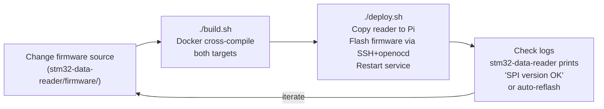

## Concept

The firmware and the Pi-side bridge are two separate compiled artifacts that must stay in sync via the `TRANSFER_VERSION` constant. When they are out of sync, the `stm32-data-reader` detects the mismatch on startup and automatically reflashes the STM32.

There are two distinct compilation targets:

1. **STM32 firmware** (`stm32-data-reader/firmware/`) — cross-compiled for Cortex-M4F with `arm-none-eabi-gcc`, produces `wombat.bin` / `wombat.elf`.
2. **stm32-data-reader** (`stm32-data-reader/`) — cross-compiled for aarch64 (Pi), a C++20 CMake project.

Both are built by the same top-level `build.sh` script. The recommended development workflow is:



If you only changed Python code, skip the build step — `raccoon sync` or `raccoon run` handles Python deployment without touching the firmware.

## Firmware Location

The STM32 firmware lives in `stm32-data-reader/firmware/` (merged from the old standalone `Firmware-Stp/` repository). The shared SPI protocol header at `stm32-data-reader/shared/spi/pi_buffer.h` is used by both the firmware and the Pi-side reader.

## Toolchain

The firmware is compiled with the **ARM Embedded GCC** toolchain targeting the Cortex-M4F with hardware floating-point:

| Tool | Package (Debian/Ubuntu) |
|---|---|
| Compiler | `arm-none-eabi-gcc` |
| Assembler | `arm-none-eabi-as` |
| Linker | `arm-none-eabi-ld` (via gcc) |
| Object copy | `arm-none-eabi-objcopy` |
| Size reporter | `arm-none-eabi-size` |

Install on Ubuntu/Debian:

```bash
sudo apt install gcc-arm-none-eabi binutils-arm-none-eabi
```

CMake >= 3.24 is also required.

## Build System

The firmware uses CMake. The top-level `CMakeLists.txt` is at `stm32-data-reader/firmware/CMakeLists.txt`. It sets the target MCU family (`STM32F427xx`), defines the HSE oscillator frequency (legacy define; the board uses the internal HSI oscillator), and links against:

- `stm32f4xx` — the STM32 HAL library
- `mpl_prebuilt` — the InvenSense Motion Processing Library (binary blob)
- `motion_driver` — the InvenSense MPU-9250 DMP firmware loader

The ARM toolchain file at `stm32-data-reader/firmware/CMake/GNU-ARM-Toolchain.cmake` sets the critical compiler flags:

```
-mcpu=cortex-m4       # Target CPU
-mthumb               # Thumb-2 instruction set
-mfloat-abi=hard      # Hardware FPU
-mfpu=fpv4-sp-d16     # VFPv4 single-precision
-Wall                 # All warnings
-g3 -gdwarf-2         # Debug information
--specs=nano.specs    # Newlib nano (reduces binary size)
--specs=nosys.specs   # No syscalls stub
```

The linker script is `stm32-data-reader/firmware/linker/STM32F427VITx_FLASH.ld`, which defines the memory regions (flash at `0x08000000`, RAM at `0x20000000`) and places the vector table at the flash origin.

## Building the Firmware

### Recommended: Docker build (no local toolchain needed)

The easiest path requires only Docker. The `build.sh` inside `firmware/` cross-compiles the firmware inside a pre-configured container:

```bash
cd stm32-data-reader/firmware
bash build.sh
```

The combined top-level `build.sh` builds **both** the reader and the firmware in a single step:

```bash
# From stm32-data-reader/ root:
./build.sh                   # reader (ARM64) + firmware (STM32)
SKIP_FIRMWARE=1 ./build.sh   # reader only (faster iteration)
CMAKE_BUILD_TYPE=Debug ./build.sh  # debug build
```

### Native build (toolchain installed locally)

If you have `arm-none-eabi-gcc` installed, build without Docker:

```bash
cd stm32-data-reader/firmware
mkdir -p build && cd build
cmake -G "Unix Makefiles" -DCMAKE_TOOLCHAIN_FILE=../CMake/GNU-ARM-Toolchain.cmake ..
cmake --build . -- -j$(nproc)
```

The output files are generated in `build/Firmware/`:

| File | Contents |
|---|---|
| `wombat.elf` | ELF binary with debug symbols |
| `wombat.bin` | Flat binary for flashing |
| `wombat.hex` | Intel HEX format |
| `wombat.map` | Linker map file |
| `wombat.lss` | Extended listing with interleaved source |

CMake also runs `arm-none-eabi-size -B wombat.elf` to report flash and RAM usage.

## Flashing

### Via ST-Link (recommended)

The Wombat board exposes an SWD (Serial Wire Debug) header. Use `openocd`:

```bash
openocd -f interface/stlink.cfg \
        -f target/stm32f4x.cfg \
        -c "program build/Firmware/wombat.elf verify reset exit"
```

Or with `st-flash`:

```bash
st-flash write build/Firmware/wombat.bin 0x08000000
```

### Via DFU (USB, no debugger needed)

The STM32F427 has a built-in USB DFU bootloader in system memory. To enter DFU mode, hold BOOT0 high at reset, then:

```bash
sudo apt install dfu-util
dfu-util -d 0483:df11 -a 0 -s 0x08000000:leave -D build/Firmware/wombat.bin
```

### Deploy to Pi (automated)

The `deploy.sh` script at the repo root builds both components, copies the reader binary to the Pi, flashes the firmware over the network (SSH + openocd), and starts the service:

```bash
# From stm32-data-reader/:
./deploy.sh                          # uses default Pi hostname
RPI_HOST=192.168.1.100 ./deploy.sh   # override target
```

### Verifying the Flash

After flashing, the firmware immediately prints boot messages over UART3 (PB10/PB11, 115200 baud). You can monitor them directly via a serial terminal, or enable the Pi-side `UartMonitor` by setting `uart.enabled = true` in the reader configuration. The `UartMonitor` routes STM32 output to the application log and also watches for the periodic `[stp] hb #N` heartbeat line.

A running STM32 can also be confirmed by observing the `stm32-data-reader` log: it prints the SPI protocol version match result at startup and logs IMU values every 500 SPI cycles via `imuLogCounter`. If `updateTime` in the `TxBuffer` increments, the STM32 is alive.

The reader also checks the protocol version at startup via `spi_probe_version()` and logs either `OK — no reflash needed` or `MISMATCH — firmware reflash will be triggered`.

## Building the stm32-data-reader (Pi-side bridge)

The `stm32-data-reader` is a C++20 CMake project that runs on the Raspberry Pi (aarch64).

### Cross-compile for ARM64 (production)

```bash
cd stm32-data-reader
./build.sh                              # Docker cross-compile, produces ARM64 binary
FORCE_RECONFIGURE=1 ./build.sh          # Force CMake reconfiguration
```

### Local development with mock SPI

For development without hardware, enable the SPI mock (generates synthetic sensor data, no `/dev/spidev` required):

```bash
cd stm32-data-reader
mkdir -p cmake-build-debug && cd cmake-build-debug
cmake .. -DUSE_SPI_MOCK=ON -DCMAKE_BUILD_TYPE=Debug
cmake --build . -j$(nproc)
```

The mock build produces the same binary interface as the real reader. You can use it to test command handling and data publishing logic on a development machine.

### Runtime flags

```bash
./stm32-data-reader --version   # Print STMREADER_VERSION and exit
```

The log level can be overridden at runtime without recompiling:

```bash
WOMBAT_LOG_LEVEL=debug ./stm32-data-reader   # valid: debug, info, warn, error
```

This sets the spdlog level immediately at startup before any service initialisation runs, so even early-init messages are visible at `debug`.

## Interrupt Priority Table

Understanding the interrupt priority hierarchy is important for debugging timing issues. A lower preempt number means higher priority and can interrupt a running ISR with a higher number.

| ISR | Preempt | Sub | Purpose |
|---|---|---|---|
| SPI2 | 0 | 0 | Pi SPI completion (safety-critical) |
| DMA1 Stream 3 (SPI2 RX) | 0 | 1 | SPI2 DMA RX |
| DMA1 Stream 4 (SPI2 TX) | 0 | 2 | SPI2 DMA TX |
| DMA1 Stream 0 (SPI3 RX) | 1 | 1 | IMU SPI3 DMA RX |
| SPI3 | 1 | 0 | IMU SPI completion |
| DMA1 Stream 5 (SPI3 TX) | 1 | 2 | IMU SPI3 DMA TX |
| ADC (ADC2) | 2 | 0 | BEMF ADC completion |
| ADC (ADC2) | 2 | 3 | BEMF DMA completion |
| ADC (ADC1) | 2 | 4 | Analog sensor completion |
| DMA2 Stream 0 (ADC1) | 2 | 1 | Analog sensor DMA |
| DMA2 Stream 2 (ADC2) | 2 | 0 | BEMF DMA |
| TIM6 | 3 | 0 | 1 µs system tick + scheduling |

The SPI2 completion ISR runs at the highest priority to ensure that new Pi commands are processed with minimum latency and the shutdown flag is enforced immediately. The BEMF ADC runs at lower priority so the SPI ISR can always preempt a BEMF processing routine if a new Pi command arrives during BEMF sampling.

## Modifying the Firmware

### Adding a New Sensor

1. Add ADC channel configuration in `adcInit.c` (for analog sensors) or GPIO initialisation in `gpio.c` (for digital sensors).
2. Add reading/processing logic in the appropriate `Sensors/` file.
3. Add a field to `TxBuffer` in the STM32-side struct and the corresponding field in the **shared header** `stm32-data-reader/shared/spi/pi_buffer.h`. Both sides of the SPI protocol use the same header — there is only one source of truth.
4. Populate the new field before the main loop calls the relevant SPI buffer update function.
5. In `stm32-data-reader`, unpack the field in `SpiReal::readSensorData()` and add a publish call in `DataPublisher`.
6. Increment `TRANSFER_VERSION` in `stm32-data-reader/shared/spi/pi_buffer.h`. This is the **single** definition — do not define it anywhere else.

### Changing PID Gains

Default gains are in `stm32-data-reader/firmware/Firmware/src/Actors/pid.c`:

```c
// dt-EXPLICIT gains (per-second units).
// kI was rescaled from the old dt-implicit default 0.045 by the nominal
// MAV rate (~200 Hz/motor): kI_explicit = 0.045 * 200 = 9.0.
// Both values produce identical closed-loop behaviour at 200 Hz, but the
// explicit form is correct when the BEMF cadence varies (watchdog skips,
// mode changes). Using 0.045 in per-second units would give 200× too little
// integral authority.
#define PID_DEFAULT_P  1.22f
#define PID_DEFAULT_I  9.0f
#define PID_DEFAULT_D  0.000f

// Position (outer) loop — pure proportional.
// The inner velocity PID already provides damping.
#define PID_POS_DEFAULT_P  1.0f
#define PID_POS_DEFAULT_I  0.0f
#define PID_POS_DEFAULT_D  0.0f
```

These apply at startup. They can be overridden at runtime via the SPI `updates` bitmask without reflashing. From raccoon-lib Python:

```python
motor.set_pid(kp=1.5, ki=9.0, kd=0.0)
```

Note that `ki` here is in **per-second units** (the same convention as the firmware default). A value of `9.0` at 200 Hz gives the same integral contribution per cycle as the old `0.045` dt-implicit value.

### Changing BEMF Timing

The BEMF timing constants are in `stm32-data-reader/firmware/Firmware/include/Sensors/bemf.h`:

```c
// Interval between individual motor measurements in µs.
// With 4 motors in round-robin, each motor is measured every 4 × 1250 = 5000 µs (200 Hz).
#define BEMF_SAMPLING_INTERVAL           1250  // µs

// Wait time after stopping a motor before starting the ADC conversion.
// Motor back-EMF needs ~500 µs to settle after PWM is cut.
#define BEMF_CONVERSION_START_DELAY_TIME  500  // µs

// Watchdog: abort a stuck ADC2 conversion after this many µs.
#define BEMF_WATCHDOG_TIMEOUT  (BEMF_SAMPLING_INTERVAL * 2)  // 2500 µs
```

Only one motor is stopped per cycle (round-robin), so the torque interruption at any moment is limited to one motor out of four. Reducing `BEMF_SAMPLING_INTERVAL` increases the per-motor update rate but also reduces effective torque on that motor. Reducing `BEMF_CONVERSION_START_DELAY_TIME` below 500 µs risks reading PWM switching noise instead of the true back-EMF.

## Related pages

- [SPI Communication Protocol](../spi-protocol/) — `TRANSFER_VERSION 21` and version mismatch behavior
- [Motor Control](../motor-control/) — the BEMF constants defined in `bemf.h` that you may need to change
- [Robot Services And systemd](../robot-services-and-systemd/) — how `stm32_data_reader.service` picks up the new binary after deploy
