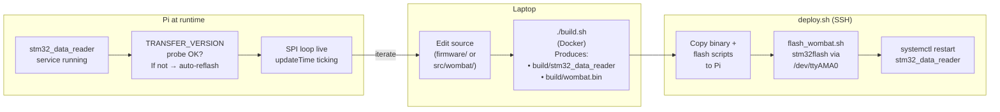
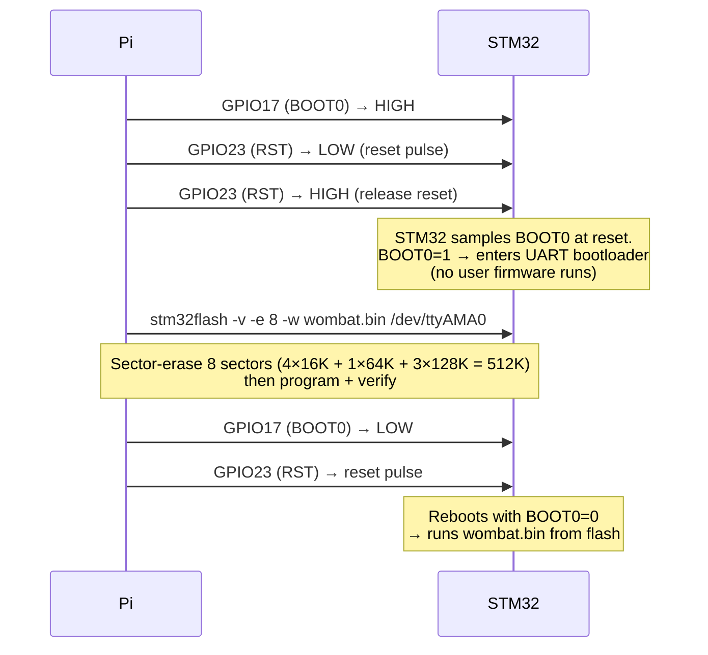
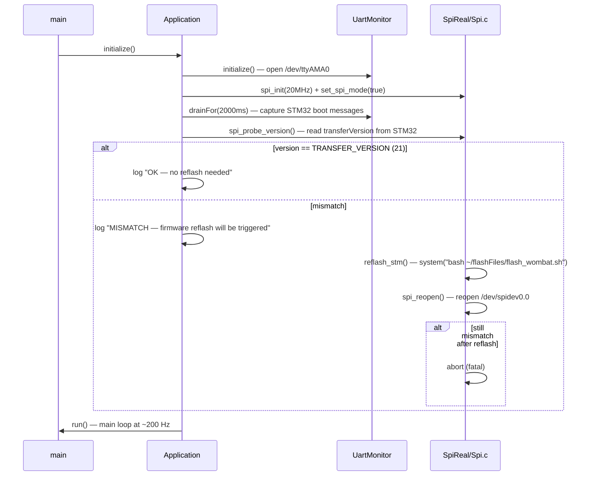

## Mental Model

The robot firmware stack is two distinct compiled artifacts that must always stay in sync:

1. **STM32 firmware** (`stm32-data-reader/firmware/`) — C/C++ cross-compiled for the Cortex-M4F inside the Wombat board. Produces `wombat.bin` / `wombat.elf`.
2. **Pi bridge** (`stm32-data-reader/`) — C++20 cross-compiled for the Raspberry Pi's aarch64 CPU. Binary is `stm32_data_reader`.

Both artifacts share a single header, `stm32-data-reader/shared/spi/pi_buffer.h`, that defines the SPI wire protocol and the `TRANSFER_VERSION` constant (currently **21**). If the two sides disagree on that version, the Pi bridge detects the mismatch at startup and automatically reflashes the STM32 via `~/flashFiles/flash_wombat.sh`.

The full build-to-run pipeline looks like this:



If you only changed Python code, skip the build step entirely — `raccoon sync` or `raccoon run` handles Python deployment without touching either compiled artifact.

---

## Repository Layout

```
stm32-data-reader/
├── firmware/                  # STM32 firmware (cross-compiled for Cortex-M4F)
│   ├── build.sh               # Firmware-only Docker build (docker compose up)
│   ├── Dockerfile             # Ubuntu + gcc-arm-none-eabi image
│   ├── docker-compose.yml     # Mounts firmware/ + shared/ into container
│   ├── CMakeLists.txt         # Top-level CMake; sets STM32F427xx target
│   ├── CMake/
│   │   └── GNU-ARM-Toolchain.cmake  # Toolchain file (compiler flags, sysroot)
│   ├── Firmware/
│   │   ├── CMakeLists.txt     # Collects sources, links libs, produces wombat.elf
│   │   └── src/               # All C/C++ firmware source
│   ├── linker/
│   │   └── STM32F427VITx_FLASH.ld  # Memory map
│   ├── libs/                  # HAL, CMSIS, InvenSense MPL
│   └── flashFiles/
│       ├── flash_wombat.sh    # Flashes via stm32flash over UART bootloader
│       ├── reset_coprocessor.sh
│       └── init_gpio.sh
├── shared/
│   └── spi/
│       └── pi_buffer.h        # Single source of truth: TRANSFER_VERSION + structs
├── src/wombat/                # Pi bridge C++20 source
├── include/wombat/            # Pi bridge headers
├── build.sh                   # Top-level: Pi bridge (Docker ARM64) + firmware
├── deploy.sh                  # build.sh + install.py
└── install.py                 # SCP + SSH: flash + install service on Pi
```

---

## Toolchain Details

### STM32 Firmware: GNU-ARM-Toolchain.cmake

The toolchain file at `firmware/CMake/GNU-ARM-Toolchain.cmake` configures CMake for a bare-metal cross-compile. Key settings:

| Variable | Value | Why |
|---|---|---|
| `CMAKE_SYSTEM_NAME` | `Generic` | No OS — bare metal |
| `CMAKE_SYSTEM_PROCESSOR` | `ARM` | Suppresses host-tool search |
| `CMAKE_C_COMPILER` | `arm-none-eabi-gcc` | GNU ARM Embedded |
| `CMAKE_CXX_COMPILER` | `arm-none-eabi-g++` | Same toolchain |
| `CMAKE_TRY_COMPILE_TARGET_TYPE` | `STATIC_LIBRARY` | Avoids link test on bare metal |

The core compiler flags applied to every translation unit:

```
-mthumb              # Thumb-2 instruction set (compact, efficient)
-mcpu=cortex-m4      # Enables M4-specific instructions (DSP, etc.)
-mlittle-endian      # STM32F4 is always LE
-mfpu=fpv4-sp-d16    # VFPv4 single-precision FPU (16 double registers)
-mfloat-abi=hard     # Pass float args in FPU registers (ABI compatible with libs)
-mthumb-interwork    # Allow ARM/Thumb interworking (needed by startup code)
--specs=nano.specs   # Newlib-nano: smaller printf/malloc footprint
--specs=nosys.specs  # Stub out syscalls (no OS)
```

C-specific additions (`CMAKE_C_FLAGS`):
```
-fno-builtin         # Prevent GCC from substituting e.g. memcpy with builtins
-Wall                # All warnings
-std=gnu99           # GNU C99 (needed for some HAL macros)
-fdata-sections      # Place each data object in its own section
-ffunction-sections  # Place each function in its own section
-g3 -gdwarf-2        # Full debug info (enables source-level GDB debugging)
```

C++ adds `-fno-rtti -fno-exceptions` to minimize binary size.

The linker strips dead code via `-Wl,--gc-sections` and produces a map file for section-size analysis.

### Memory Map (STM32F427VITx_FLASH.ld)

```
FLASH    (rx)  : ORIGIN = 0x08000000  LENGTH = 1024K   # Code (sectors 0-11, Bank 1)
CAL_DATA (rw)  : ORIGIN = 0x08100000  LENGTH = 16K     # Calibration (sector 12, Bank 2)
RAM      (xrw) : ORIGIN = 0x20000000  LENGTH = 192K    # SRAM1+SRAM2
CCMRAM   (xrw) : ORIGIN = 0x10000000  LENGTH = 64K     # Core-coupled memory
```

`CAL_DATA` is placed on Bank 2 deliberately: erasing sector 12 for a calibration save does not stall instruction fetch from Bank 1, which stays fully live during the write. This is why UART heartbeats can go silent during a flash-calibration write while SPI/DMA keeps running without interruption.

After a successful build, CMake runs `arm-none-eabi-size -B wombat.elf` to report flash and RAM usage.

### Pi Bridge: Docker Debian ARM64

The Pi bridge is built inside a `debian:13-slim` ARM64 container (see `stm32-data-reader/Dockerfile`). The container has:

- CMake + Ninja (build system)
- ccache (build cache, mounted as a Docker volume or host path)
- liblcm-dev, libspdlog-dev (system libraries)
- Clang + libclang (for any bindgen steps)

The container builds natively for `linux/arm64/v8` — no QEMU emulation. QEMU binfmt is only needed if you're building on a non-ARM host; on Apple Silicon or ARM workstations it runs at full speed.

---

## Building

### Path: Docker (recommended — no local toolchain needed)

**Firmware only** (if you only changed STM32 code):

```bash
cd stm32-data-reader/firmware
bash build.sh
# Output: firmware/build/Firmware/wombat.{elf,bin,hex,map,lss}
```

Internally this runs `docker compose up --build --exit-code-from build-wombat-firmware`, which builds the Ubuntu + `gcc-arm-none-eabi` image defined in `firmware/Dockerfile`, mounts `firmware/` and `../shared/` into the container, then executes `build.sh` (which deletes any old `build/` directory, re-runs CMake, and builds with `$(nproc)` parallel jobs).

**Pi bridge + firmware** (normal development cycle):

```bash
cd stm32-data-reader
./build.sh
```

This:
1. Builds the Pi bridge binary (`build/stm32_data_reader`) inside the ARM64 Debian container.
2. Then runs the firmware Docker Compose step (unless `SKIP_FIRMWARE=1`).
3. Copies `firmware/build/Firmware/wombat.bin` and `firmware/flashFiles/*` into `build/` so `install.py` finds them next to the reader binary.

Useful env var overrides:

```bash
SKIP_FIRMWARE=1 ./build.sh          # Pi bridge only (faster when firmware unchanged)
CMAKE_BUILD_TYPE=Debug ./build.sh   # Debug build (both artifacts)
FORCE_RECONFIGURE=1 ./build.sh      # Force CMake re-configure (after CMakeLists.txt changes)
REBUILD_IMAGE=1 ./build.sh          # Rebuild the Docker builder image
```

### Path: Native CMake (toolchain installed locally)

Install the toolchain on Debian/Ubuntu:

```bash
sudo apt install gcc-arm-none-eabi binutils-arm-none-eabi cmake
# cmake >= 3.24 is required
```

Build the firmware:

```bash
cd stm32-data-reader/firmware
mkdir -p build && cd build
cmake -G "Unix Makefiles" \
      -DCMAKE_TOOLCHAIN_FILE=../CMake/GNU-ARM-Toolchain.cmake \
      ..
cmake --build . -- -j$(nproc)
# Output in build/Firmware/:
#   wombat.elf   — ELF with DWARF debug symbols (use this with GDB)
#   wombat.bin   — flat binary for flashing
#   wombat.hex   — Intel HEX (alternative flash format)
#   wombat.map   — linker map (section sizes, symbol addresses)
#   wombat.lss   — interleaved source+disassembly listing
```

For the Pi bridge natively (only useful for unit-testing logic; produces an x86_64 binary with mock SPI):

```bash
cd stm32-data-reader
mkdir -p cmake-build-debug && cd cmake-build-debug
cmake .. -DUSE_SPI_MOCK=ON -DCMAKE_BUILD_TYPE=Debug
cmake --build . -j$(nproc)
# Binary: cmake-build-debug/stm32_data_reader
# No /dev/spidev0.0 needed — SpiMock generates synthetic sensor data
```

---

## Flashing the STM32

### How it works: UART bootloader via GPIO

The Wombat board does **not** use a hardware ST-Link or J-Link debugger probe. Instead the Raspberry Pi flashes the STM32 directly over the **STM32F427 built-in UART bootloader**, using:

- **`/dev/ttyAMA0`** — Pi's hardware UART connected to STM32 USART3 (PB10/PB11)
- **`stm32flash`** — open-source utility that speaks the STM32 bootloader protocol
- **GPIO 17 (BOOT0)** and **GPIO 23 (RST)** — Pi GPIOs that control the two bootloader entry pins

The entry sequence in `firmware/flashFiles/flash_wombat.sh`:



Why sector erase (`-e 8`) instead of mass erase: `stm32flash` 0.7 times out waiting for the ACK byte after the F4 mass-erase command, even though the chip eventually finishes. Eight sectors covers the entire 512 KB Bank 1 code area.

### Manual flash (from the Pi)

If `install.py` has already deployed the flash scripts:

```bash
ssh pi@<PI_IP>
cd ~/flashFiles
bash flash_wombat.sh              # flashes the wombat.bin already in ~/flashFiles
bash flash_wombat.sh /path/to/other.bin  # flash an alternative binary
```

To reset the STM32 without reflashing (normal boot):

```bash
bash ~/flashFiles/reset_coprocessor.sh
```

### Automated deploy from laptop

```bash
cd stm32-data-reader
./deploy.sh                          # build + deploy to default Pi (10.101.156.14)
RPI_HOST=192.168.1.100 ./deploy.sh   # override target IP
RPI_USER=ubuntu ./deploy.sh          # override SSH user (default: pi)
```

`deploy.sh` calls `build.sh` then `install.py`. `install.py` does (in order):

1. Tests SSH connectivity.
2. Stops `stm32_data_reader.service`.
3. Copies `wombat.bin`, `flash_wombat.sh`, `reset_coprocessor.sh`, `init_gpio.sh` to `~/flashFiles/` on the Pi.
4. Runs `flash_wombat.sh` over SSH.
5. Copies the Pi bridge binary to `/home/pi/stm32_data_reader/`.
6. Installs / reloads the systemd unit files.
7. Enables `loginctl linger` for the `pi` user (keeps `/dev/shm/raccoon_ring_*` files alive across SSH disconnects).
8. Starts `lcm-loopback-multicast.service` then `stm32_data_reader.service`.

---

## Running the Pi Bridge

### As a systemd service (production)

After `deploy.sh` completes, the reader runs as:

```
stm32_data_reader.service   (Requires: lcm-loopback-multicast.service)
WorkingDirectory: /home/pi/stm32_data_reader
ExecStart:        /home/pi/stm32_data_reader/stm32_data_reader
Restart=always    RestartSec=5
```

Check status:

```bash
ssh pi@<PI_IP> "sudo systemctl status stm32_data_reader"
ssh pi@<PI_IP> "sudo journalctl -u stm32_data_reader -f"
```

### Manually (for debugging)

```bash
ssh pi@<PI_IP>
# Stop the service first so both don't fight over /dev/spidev0.0
sudo systemctl stop stm32_data_reader
cd /home/pi/stm32_data_reader
WOMBAT_LOG_LEVEL=debug ./stm32_data_reader
```

### Runtime flags

```bash
./stm32_data_reader --version     # Print STMREADER_VERSION and exit
WOMBAT_LOG_LEVEL=debug ./stm32_data_reader    # Maximum verbosity
WOMBAT_LOG_LEVEL=warn  ./stm32_data_reader    # Warnings and errors only
```

Valid log levels: `debug`, `info`, `warn`, `error`. The env override is applied before any service initialisation, so even early-init messages (SPI open, GPIO init) are visible at `debug`.

Default configuration (from `include/wombat/core/Configuration.h`):

| Parameter | Default | Notes |
|---|---|---|
| SPI device | `/dev/spidev0.0` | Hardware SPI bus |
| SPI speed | 20 MHz | |
| UART device | `/dev/ttyAMA0` | STM32 USART3 debug output |
| UART baud | 115200 | 8N1 |
| UART enabled | `true` | Can disable if `/dev/ttyAMA0` conflicts |
| Main loop delay | 5 ms | ~200 Hz SPI polling rate |
| BEMF on startup | enabled | Set `disableBemfOnStartup=true` for open-loop PWM only |

---

## Startup Sequence and Version Check

On startup the application follows this sequence:



The version probe sends a dummy SPI transfer and reads `rx.transferVersion` — the firmware writes `TRANSFER_VERSION` (21) into this field on every SPI exchange. If the field doesn't match, the Pi side invokes `flash_wombat.sh` inline (blocking), reopens the SPI device, and retries once. A second mismatch after reflash is a fatal error.

---

## Debugging

### Checking if the STM32 is alive

**Primary liveness signal:** `updateTime` in `TxBuffer`. The firmware increments this on every SPI ISR. The reader's `checkStm32Health()` compares successive values — if `updateTime` does not change for more than **10 seconds**, the reader logs an error and shuts down with `fatalShutdown_ = true`. The systemd unit restarts it after 5 seconds.

**Periodic log lines** (even without debug-level logging) tell you the SPI loop is live:

```
# Every 500 SPI reads (~2.5s at 200 Hz):
[HH:MM:SS.mmm] [info] SPI rx gyro=[x,y,z] accel=[x,y,z] quat=[w,x,y,z] heading=N

# Every 200 SPI reads (~1s at 200 Hz):
[HH:MM:SS.mmm] [info] SPI rx bemf=[m0,m1,m2,m3] pos=[p0,p1,p2,p3]
```

If these lines are absent, SPI communication has stalled.

### Reading STM32 UART debug output

The STM32 firmware writes debug messages over USART3 (PB10 TX, PB11 RX) at 115200 baud 8N1. The Pi bridge reads this port via `UartMonitor` (config: `uart.devicePath = "/dev/ttyAMA0"`, `uart.enabled = true`).

All STM32 output is forwarded to the reader's spdlog log with the prefix `[STM32]`. Lines containing `[ERROR]`, `Error`, or `FAULT` are emitted at `error` level; lines containing `[WARN]` at `warn` level; everything else at `info`. You therefore see STM32 boot messages, sensor init status, and the heartbeat line in the same journal stream as the reader:

```bash
sudo journalctl -u stm32_data_reader -f
# ...
# [info]  [STM32] Starting firmware v1.4 ...
# [info]  [STM32] IMU init OK
# [info]  [STM32] [stp] hb #1
# [info]  [STM32] [stp] hb #2
```

The heartbeat line `[stp] hb #N` is emitted by the firmware in its main loop at a slow rate. The reader tracks the last heartbeat timestamp but treats it as a **diagnostic-only** signal — not a liveness kill-switch. The firmware periodically disables UART TX interrupts for up to ~12 seconds while writing IMU calibration to flash sector 12 (verified 2026-06-02). During this time `updateTime` still increments over SPI, so the reader stays up and only emits a rate-limited warning:

```
[warn] STM32 UART heartbeat silent for Ns (SPI still live; likely flash-write stall — not fatal)
```

If you want to monitor the UART directly without the reader running:

```bash
sudo systemctl stop stm32_data_reader
screen /dev/ttyAMA0 115200   # Ctrl-A \ to quit
# or:
minicom -D /dev/ttyAMA0 -b 115200
```

### Common failure modes

| Symptom | Likely cause | Fix |
|---|---|---|
| `spi_init() failed` | `/dev/spidev0.0` not present or wrong permissions | Check `ls -l /dev/spidev*`; SPI must be enabled in `raspi-config` |
| `STM32 health check failed: updateTime has not changed for >10s` | SPI bus stalled or firmware crashed | Check USART3 output for firmware fault; power-cycle Wombat |
| `Version check: MISMATCH` at startup, loop of reflash attempts | `wombat.bin` not present in `~/flashFiles/` | Re-run `deploy.sh` |
| `STM32 flash failed!` in install.py | `stm32flash` not installed on Pi, or wrong GPIO wiring | `sudo apt install stm32flash`; check GPIO 17/23 |
| UART heartbeats stop but SPI is live | Firmware writing calibration to flash | Normal; wait ~12s for recovery |
| Pi bridge crashes immediately after systemd restart | `/dev/shm/raccoon_ring_*` inode inconsistency | Do NOT wipe `/dev/shm` on restart; unit file deliberately omits `ExecStartPre` wipe |

### Inspecting build artifacts

```bash
# Check flash+RAM usage:
arm-none-eabi-size -B firmware/build/Firmware/wombat.elf

# Disassemble a function (e.g. pid_update):
arm-none-eabi-objdump -d firmware/build/Firmware/wombat.elf | grep -A 50 "<pid_update>"

# Find section addresses in the map file:
grep "pid_update\|motor_control\|SPI2_IRQHandler" firmware/build/Firmware/wombat.map

# Confirm binary target architecture:
file build/stm32_data_reader
# → ELF 64-bit LSB executable, ARM aarch64
```

---

## PID Default Gains (pid.c)

Default gains are defined in `firmware/Firmware/src/Actors/pid.c`. They apply at power-on and can be overridden at runtime via SPI without reflashing.

```c
// Velocity (inner) loop — dt-EXPLICIT gains (per-second units)
#define PID_DEFAULT_P  1.22f
#define PID_DEFAULT_I  9.0f     // = 0.045 (old implicit) × 200 Hz nominal rate
#define PID_DEFAULT_D  0.000f

// Position (outer) loop — pure proportional
#define PID_POS_DEFAULT_P  1.0f
#define PID_POS_DEFAULT_I  0.0f
#define PID_POS_DEFAULT_D  0.0f
```

The key point about `kI = 9.0`: the firmware's `pid_update()` multiplies `kI` by the real `dt` (seconds) on each call — it is **per-second** units. The old value `0.045` was implicit (multiplied directly without `dt`). To produce identical closed-loop behaviour at the nominal 200 Hz BEMF rate:

```
kI_explicit = kI_implicit × rate = 0.045 × 200 = 9.0
```

Using `0.045` in the new explicit form would give 200× too little integral authority. If you are tuning from first principles, start with `kI = 9.0` and adjust from there.

Override at runtime from Python (raccoon-lib):

```python
motor.set_pid(kp=1.22, ki=9.0, kd=0.0)   # ki is in per-second units
```

---

## Adding a New Sensor or Protocol Field

When you add a field to the SPI protocol:

1. Add the field to the appropriate struct (`TxBuffer` for STM32→Pi, `RxBuffer` for Pi→STM32) in `shared/spi/pi_buffer.h`. Both firmware and Pi bridge include this header directly — there is exactly one source of truth.
2. Populate the field in the firmware (in the relevant `Sensors/` file, before the main-loop SPI buffer update).
3. Unpack the field on the Pi side in `SpiReal::readSensorData()` (in `src/wombat/hardware/SpiReal.cpp`).
4. Publish it via `DataPublisher`.
5. Increment `TRANSFER_VERSION` in `pi_buffer.h`. The reader's startup probe will detect the new version and reflash automatically on first boot after deploy.

---

## Related Pages

- [SPI Communication Protocol](../spi-protocol/) — wire format, `TRANSFER_VERSION 21`, version mismatch behaviour
- [Firmware Runtime and Scheduling](../firmware-runtime/) — clock tree, timer inventory, and interrupt priorities that constrain firmware timing budgets
- [Pi Bridge Internals](../pi-bridge-internals/) — `SpiReal`/`SpiMock` switch, `USE_SPI_MOCK` build flag, and the `Application` startup sequence
- [Motor Control](../motor-control/) — BEMF timing constants, velocity PID loop details
- [Robot Services and systemd](../robot-services-and-systemd/) — `stm32_data_reader.service` lifecycle, linger, LCM multicast
