## Concept

Every sensor reading your Python code receives, and every motor command your Python code sends, travels through a five-stage pipeline that spans two processors, two buses, and three IPC mechanisms.

Understanding this pipeline helps you reason about **latency** (why sensor reads are always slightly stale), **reliability** (why retained channels exist), and **architecture** (why `from raccoon_transport import Transport` is the low-level API and `get_transport()` is what project services should use).

```mermaid
graph LR
    subgraph STM32["STM32F427"]
        HW["Physical sensor\nor motor"]
        ISR["ADC / GPIO / IMU ISR\n(µs latency)"]
        TX["txBuffer\n(volatile struct in RAM)"]
    end

    subgraph SPI["SPI2 Full-Duplex\n~5 ms cycle"]
        WIRE["DMA transfer\nTxBuffer ⇄ RxBuffer"]
    end

    subgraph Reader["stm32-data-reader (C++)"]
        UNPACK["SpiReal::readSensorData()\nunpack + unit convert"]
        PUB["DataPublisher\nserialise to LCM"]
    end

    subgraph Transport["raccoon_ring SHM\n(/dev/shm/raccoon_ring_*)"]
        RING["One ring file\nper channel"]
    end

    subgraph Lib["raccoon-lib (Python)"]
        LCMR["LcmReader\nbackground thread"]
        CACHE["mutex-protected cache"]
        API["motor.get_position()\nanalog.read()\nimu.heading()"]
    end

    HW --> ISR --> TX
    TX --> WIRE --> UNPACK --> PUB --> RING
    RING --> LCMR --> CACHE --> API
```



The reverse direction (Python command → motor output) follows the same path in reverse: Python publishes to a `raccoon/motor/N/power_cmd` LCM channel, the reader's `CommandSubscriber` picks it up, writes the `RxBuffer`, and the next SPI transfer delivers it to the STM32.

This page traces a complete data path from a physical sensor reading to a value accessed in user Python code, and a complete command path from Python code to motor movement.

## Sensor Data Path (STM32 → Python)

```
Physical sensor
      │
      ▼
STM32 ADC / GPIO / IMU
      │  (interrupt-driven, µs latency)
      ▼
txBuffer (volatile struct in STM32 RAM)
      │  (updated after each measurement cycle)
      ▼
SPI2 DMA transfer to Raspberry Pi
      │  (circular DMA, Pi polls at main-loop rate)
      ▼
stm32-data-reader: SpiReal::readSensorData()
      │  (spi_update() call in C, copies RxBuf → TxBuf,
      │   returns SensorData struct)
      ▼
stm32-data-reader: DataPublisher::publishSensorData()
      │  (serialises fields to LCM messages, publishes
      │   via raccoon::Transport using raccoon_ring SHM)
      ▼
raccoon_ring shared memory (/dev/shm/raccoon_ring_<channel>)
      │  (primary IPC; one ring-buffer file per channel)
      ▼
raccoon-lib: LcmReader (background thread in C++ process)
      │  (raccoon::Transport::spinOnce, updates caches)
      ▼
LcmReader caches (mutex-protected std::unordered_map
      │   / scalar fields)
      ▼
Python binding call (e.g., motor.get_position(),
      analog.read(), imu.heading())
```

### Step 1: STM32 Hardware Layer

**Analog sensors and battery:** ADC1 runs in **continuous circular DMA mode**, started once at boot by `startContinuousAnalogSampling()`. DMA streams results into an oversampling accumulator continuously. TIM6 fires at `ANALOG_OUTPUT_INTERVAL` (4000 µs = 250 Hz): the accumulator is snapshotted, averaged, VDDA-corrected, and written to `txBuffer`. There is no separate `ANALOG_SENSOR_SAMPLING_INTERVAL` constant.

**Digital sensors:** `readDigitalInputs()` is called directly from `HAL_SPI_TxRxCpltCallback` and the result written into `txBuffer.digitalSensors`. Digital sensors are updated on every single SPI transaction.

**BEMF and motor state:** TIM6 calls `stop_motors_for_bemf_conv()` every **1250 µs** (one motor at a time, round-robin). After 500 µs settle time, ADC2 DMA conversion runs for the current motor's two channels. On ADC2 completion, BEMF is processed through the two-stage filter (median-of-3 + IIR α=0.2), offset-corrected, dead-zone applied, and dt-aware position integration runs. The motor control loop re-applies the PWM command. `updatingMotorsInSpiBuffer()` copies `motor_data` into `txBuffer.motor` after confirming SPI2 is idle. Each motor is measured every 4 × 1250 = 5000 µs (200 Hz effective per motor).

**IMU:** Main loop calls `readImu()`. When the MPL has new fused data, `txBuffer.imu` is updated.

### Step 2: SPI Transfer

The Pi initiates SPI transactions by calling `spi_update()` in the C SPI layer (`stm32-data-reader/src/wombat/hardware/Spi.cpp`). This performs a synchronous `ioctl(SPI_IOC_MESSAGE)` on `/dev/spidev`. The Pi sends the current `RxBuffer` (commands) while simultaneously receiving the STM32's `TxBuffer` (sensor data) in a single full-duplex transfer.

The transfer length is always `BUFFER_LENGTH_DUPLEX_COMMUNICATION` — the larger of the two struct sizes. Both ends pad with whatever was last in the struct if the other side's struct is smaller.

The Pi's `stm32-data-reader` calls `spi_update()` on every main-loop iteration. The default `mainLoopDelay` is 5 ms.

### Step 3: stm32-data-reader → LCM

`SpiReal::readSensorData()` unpacks the raw `TxBuffer` into a C++ `SensorData` struct with named fields. Unit conversions that happen here:

- Battery voltage is converted from ADC counts to volts using the known 11× resistor divider and 3.3 V reference, then filtered with a 5% EMA.
- Analog sensor values are passed as raw `int16_t` counts. No physical conversion is applied in the SPI layer.
- Motor position reset is on-STM32 (via `motorPositionReset` bitmask + `PI_BUFFER_UPDATE_MOTOR_POS_RESET`); there are no Pi-side `positionOffsets_` in the current code.

`DataPublisher::publishSensorData()` serialises each field as an LCM message on the raccoon transport. All channel names use the **`raccoon/` prefix** — the old `libstp/` prefix is obsolete and will receive no data.

#### Publish-rate gating

Most IMU channels are capped to **50 Hz** with an L-infinity noise-floor epsilon to reduce transport traffic. The accelerometer is **intentionally ungated** (`publishForce`) so downstream calibration routines receive every raw frame even when consecutive values are identical.

| Channel class | Rate cap | Noise epsilon |
|---|---|---|
| Gyro | 50 Hz | 0.01 rad/s |
| Magnetometer | 50 Hz | 0.5 counts |
| Linear acceleration | 50 Hz | 0.05 m/s² |
| Accel velocity | 50 Hz | 0.05 m/s |
| DMP quaternion | 50 Hz | 0.001 (per-component) |
| Heading | 50 Hz | 0.05° |
| Temperature | 50 Hz | 0.1°C |
| Accelerometer | **ungated** | none |
| Odometry fields | 50 Hz | 0 (any change passes) |

#### LCM channel table

All topics below are on `raccoon::Transport` (raccoon_ring SHM primary, LCM UDP multicast loopback for setup). Message types are the LCM-generated `raccoon::` types.

| LCM channel | Message type | Content | Retained? |
|---|---|---|---|
| `raccoon/gyro/value` | `vector3f_t` | angular velocity (rad/s) | no |
| `raccoon/accel/value` | `vector3f_t` | acceleration (m/s²), ungated | no |
| `raccoon/linear_accel/value` | `vector3f_t` | gravity-removed accel (m/s²) | no |
| `raccoon/accel_velocity/value` | `vector3f_t` | integrated accel velocity (m/s, decay 0.998/cycle) | no |
| `raccoon/mag/value` | `vector3f_t` | magnetometer (raw counts) | no |
| `raccoon/imu/quaternion` | `quaternion_t` | DMP 6-axis orientation (w, x, y, z) | no |
| `raccoon/imu/heading` | `scalar_f_t` | degrees, mag-corrected when calibrated | yes |
| `raccoon/imu/temp/value` | `scalar_f_t` | IMU temperature (°C) | no |
| `raccoon/gyro/accuracy` | `scalar_i8_t` | gyro calibration accuracy 0–3 | no |
| `raccoon/accel/accuracy` | `scalar_i8_t` | accel calibration accuracy 0–3 | no |
| `raccoon/mag/accuracy` | `scalar_i8_t` | compass calibration accuracy 0–3 | no |
| `raccoon/imu/quaternion_accuracy` | `scalar_i8_t` | quaternion accuracy 0–3 | no |
| `raccoon/battery/voltage` | `scalar_f_t` | battery voltage (volts) | yes |
| `raccoon/analog/N/value` | `scalar_i32_t` | raw ADC counts for port N | no |
| `raccoon/digital/N/value` | `scalar_i32_t` | 0 or 1 for digital port N | no |
| `raccoon/bemf/N/value` | `scalar_i32_t` | filtered + offset-corrected BEMF ticks | yes |
| `raccoon/motor/N/power` | `scalar_i32_t` | last commanded duty (−399 to +399) | yes |
| `raccoon/motor/N/position` | `scalar_i32_t` | accumulated BEMF ticks (dt-aware) | yes |
| `raccoon/motor/N/done` | `scalar_i32_t` | 0 or 1 (MTP done flag) | yes |
| `raccoon/servo/N/mode` | `scalar_i8_t` | servo mode state (reader→UI, not commands) | yes |
| `raccoon/servo/N/position` | `scalar_f_t` | servo position (degrees) | yes |
| `raccoon/odometry/pos_x` | `scalar_f_t` | world-frame x (meters) | yes |
| `raccoon/odometry/pos_y` | `scalar_f_t` | world-frame y (meters) | yes |
| `raccoon/odometry/heading` | `scalar_f_t` | heading (radians, CCW+) | yes |
| `raccoon/odometry/vx` | `scalar_f_t` | body-frame vx (m/s) | yes |
| `raccoon/odometry/vy` | `scalar_f_t` | body-frame vy (m/s) | yes |
| `raccoon/odometry/wz` | `scalar_f_t` | body-frame wz (rad/s) | yes |
| `raccoon/feature/bemf_enabled` | `scalar_i32_t` | BEMF enable state (0 or 1) | yes |
| `raccoon/system/shutdown_status` | `scalar_i32_t` | shutdown bitmask (bits: servo, motor, watchdog-source) | yes |
| `raccoon/errors` | `string_t` | STM32 UART error messages | no |
| `raccoon/cpu/temp/value` | `scalar_f_t` | Pi CPU temperature (°C) | no |

"Retained" channels use `publishRetained()`. A new subscriber that calls `subscribeWithRetain` immediately receives the last published value without waiting for the next SPI cycle. This is important for motor position, done flag, and battery voltage, where a late subscriber must not block waiting for the next update.

IMU accuracy channels (`gyro/accuracy`, `accel/accuracy`, `mag/accuracy`, `imu/quaternion_accuracy`) are published only when the accuracy value changes, not on every loop.

### Step 4: raccoon-transport (IPC layer)

The raccoon-transport is a C++ wrapper around LCM with two transport backends:

**Primary: `raccoon_ring` shared memory.** Each channel has a single `/dev/shm/raccoon_ring_<channel>` file. The writer initialises or re-initialises the header on startup; subscribers detect a `producer_seq` reset and resync automatically. This means `stm32-data-reader` restarts are transparent to running subscribers — no re-connection or file unlink required.

The `stm32_data_reader.service` unit file explicitly sets `PrivateTmp=false` to ensure `/dev/shm` files are visible to all processes on the host. Mount namespaces (from `ProtectSystem=`, `ProtectHome=`, or `PrivateTmp=true`) would isolate `/dev/shm` to the service and make all ring files invisible to raccoon-lib and BotUI.

**Secondary: LCM UDP multicast.** The `lcm-loopback-multicast.service` remains required. It configures the loopback interface for multicast so LCM can function; some transport paths still use UDP. However, the primary data path for sensor readings and commands uses raccoon_ring SHM, not UDP.

### Step 5: raccoon-lib HAL

`LcmReader` runs as a singleton with a background `listenLoop` thread. This thread calls `transport_.spinOnce(0)` continuously and updates mutex-protected caches. Each HAL class (Motor, Analog, Digital, IMU) calls the appropriate `LcmReader::read*()` method which takes the lock and returns the cached value. Sensor reads in user code are non-blocking and always return the most recently observed value.

## Command Path (Python → STM32)

```
Python: motor.set_speed(50)
      │
      ▼
raccoon-lib::hal::motor::Motor::setSpeed()
      │  (maps percent to signed duty, applies inversion)
      ▼
LcmDataWriter::setMotor(port, duty)
      │  (publishes scalar_i32_t to raccoon/motor/N/power_cmd)
      ▼
raccoon_ring SHM → LCM multicast (loopback)
      │
      ▼
stm32-data-reader: CommandSubscriber::onMotorPowerCommand()
      │  (maps percent → duty: duty = percent × 4)
      ▼
DeviceController::setMotorPwm()
      │
      ▼
SpiReal::setMotorPwm()
      │  (calls C API: set_motor_pwm(port, duty))
      ▼
C SPI layer: updates rxBuffer in Pi's memory
      │
      ▼
Next spi_update() call: Pi sends updated rxBuffer to STM32
      │  (full-duplex SPI transaction)
      ▼
STM32: rxBuffer updated by DMA
      │  (SPI completion callback fires)
      ▼
HAL_SPI_TxRxCpltCallback validates version
      │
      ▼
Next BEMF cycle (≤ 1250 µs): update_motor() reads motorControlMode
      │  and motorTarget, calls motor_setDutycycle()
      ▼
TIM1/TIM8 compare register updated
      │
      ▼
Motor PWM changes
```

### LCM command channels

| Channel | Message type | Reliable? | Purpose |
|---|---|---|---|
| `raccoon/motor/N/power_cmd` | `scalar_i32_t` | no | open-loop PWM (−100 to +100%) |
| `raccoon/motor/N/velocity_cmd` | `scalar_i32_t` | no | MAV velocity setpoint (BEMF ticks/s) |
| `raccoon/motor/N/position_cmd` | `vector3f_t` | yes | MTP: x=speed_limit, y=goal_position |
| `raccoon/motor/N/relative_cmd` | `vector3f_t` | yes | relative move: adds delta to current position |
| `raccoon/motor/N/position_reset_cmd` | `scalar_i32_t` | yes | reset motor N position on STM32 |
| `raccoon/motor/N/stop_cmd` | `scalar_i32_t` | yes | stop motor N (passive brake) |
| `raccoon/motor/N/mode_cmd` | `scalar_i32_t` | yes | set raw motor control mode |
| `raccoon/motor/N/pid_cmd` | `vector3f_t` | yes | override PID: x=kp, y=ki, z=kd |
| `raccoon/chassis/velocity_cmd` | `vector3f_t` | no | chassis velocity: x=vx, y=vy, z=wz |
| `raccoon/servo/N/mode_cmd` | `scalar_i8_t` | yes | servo mode (separate from state channel) |
| `raccoon/servo/N/position_cmd` | `scalar_f_t` | yes | servo target angle (degrees) |
| `raccoon/servo/N/smooth_cmd` | `vector3f_t` | yes | smooth servo: x=angle, y=speed, z=easing |
| `raccoon/odometry/reset_cmd` | `scalar_i32_t` | yes | reset odometry |
| `raccoon/kinematics/config_cmd` | (kinematics type) | yes | send KinematicsConfig to STM32 |
| `raccoon/system/heartbeat_cmd` | `scalar_i32_t` | no | MotorWatchdog heartbeat |
| `raccoon/system/shutdown_cmd` | `scalar_i32_t` | yes | system shutdown command |
| `raccoon/cmd/feature/bemf_enabled` | `scalar_i32_t` | yes | enable/disable BEMF at runtime |

**Servo mode vs. servo mode command:** The servo mode channel is split into two: `raccoon/servo/N/mode` (state, reader publishes) and `raccoon/servo/N/mode_cmd` (command, raccoon-lib publishes). This prevents the reader from subscribing to its own publishes, which previously caused a ~5 ms internal latency floor.

**Motor relative move:** `raccoon/motor/N/relative_cmd` carries a delta (BEMF ticks) relative to the motor's current position. `CommandSubscriber::onMotorRelativeCommand` reads the current position, adds the delta, and issues an absolute MTP command. The payload is `vector3f_t` matching the position command format: `x=speed_limit, y=delta_ticks`.

### Reliable Commands

Commands that must not be lost (position targets, PID configuration, servo mode changes, shutdown, position resets) are subscribed with `reliableOpts` (`SubscribeOptions{.reliable = true}`). Reliable delivery is a transport-level option implemented in `raccoon::Transport`; there is no separate `ReliablePublisher` class. The reliable path adds a sequence number envelope and retransmits until an ACK is received.

Continuous commands (motor power percentage, motor velocity) are sent without reliable delivery to avoid queuing stale commands. If a power command is dropped, the next iteration of the user's control loop sends a fresh one.

### Timestamp-Based Deduplication

The `CommandSubscriber` tracks the timestamp of the most recently applied command per channel. If a message arrives with a timestamp older than the last applied message (possible if LCM delivers messages out of order), it is silently dropped. This is the `isTimestampNewer()` check.

## Timing Budget

| Stage | Typical latency |
|---|---|
| Sensor measurement to txBuffer | 0–5 ms (BEMF-dominated) |
| SPI transfer | < 1 ms |
| stm32-data-reader main loop | < 5 ms (mainLoopDelay = 5 ms) |
| raccoon_ring SHM delivery | < 0.1 ms |
| LcmReader cache update | < 0.1 ms |
| Python read call | < 0.1 ms (non-blocking) |
| **Total sensor→Python** | **< 12 ms** |

Command latency follows the same path in reverse; the dominant factor is the BEMF cycle (up to 1250 µs per motor in round-robin, up to one full 4-motor rotation = 5 ms in worst case) from when the STM32 receives the new command to when the motor output actually changes.

## Related pages

- [SPI Communication Protocol](../spi-protocol/) — the wire format and all LCM channel names
- [Motor Control](../motor-control/) — what happens inside each BEMF cycle
- [Robot Services And systemd](../robot-services-and-systemd/) — how `stm32_data_reader.service` fits into the full service topology
