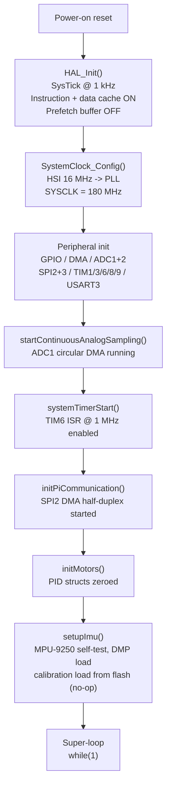
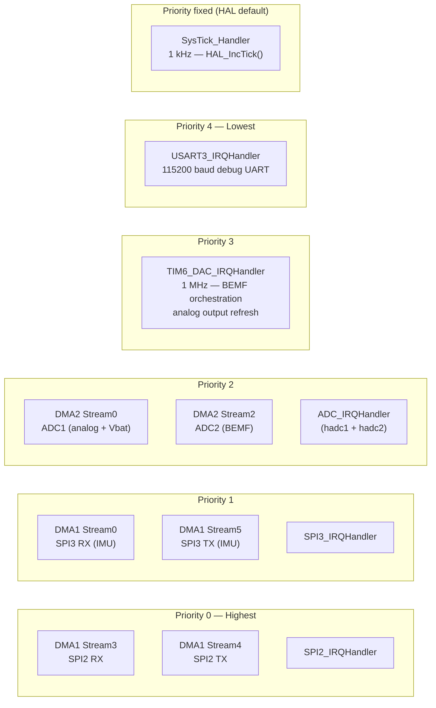
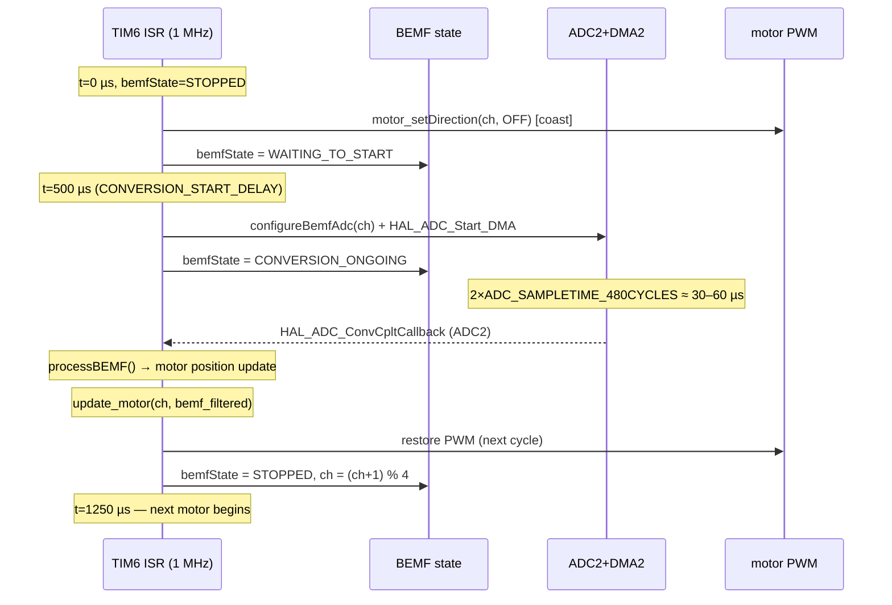
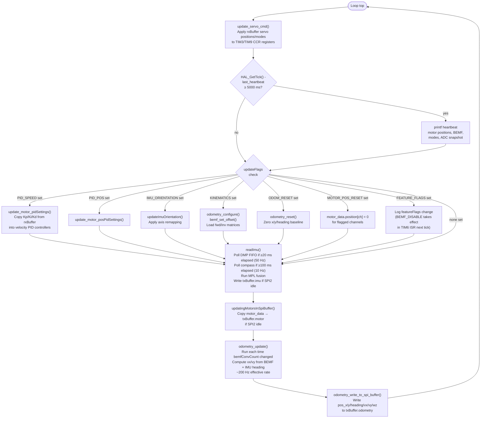

## Mental model

The STM32F427 firmware has no real-time operating system. It runs a bare-metal super-loop: a single `while(1)` in `main.c` that spins as fast as the CPU allows, interleaved with interrupts that fire on fixed hardware schedules. Understanding which code runs where — in the loop versus in an ISR — is the key to understanding the entire runtime.

The firmware has two scheduling tiers:

- **Interrupt-driven (deterministic):** The TIM6 ISR fires every 1 µs and owns all time-critical BEMF orchestration. ADC DMA completion callbacks process raw samples and drive the motor control law. SPI DMA callbacks exchange Pi buffers. These all run at hardware priority and cannot be delayed by the main loop.
- **Super-loop (best-effort):** The main loop handles tasks that can tolerate millisecond-scale jitter: reading the IMU FIFO, updating servo PWM, refreshing the SPI output buffer, processing one-shot configuration flags from the Pi, and printing a 5-second heartbeat over UART.



---

## Clock tree and derived rates

The PLL is configured in `main.c → SystemClock_Config()`:

```
HSI 16 MHz → /PLLM 8 → 2 MHz → ×PLLN 180 → 360 MHz → /PLLP 2 → SYSCLK 180 MHz
```

Over-Drive mode is enabled so the core can sustain 180 MHz at Voltage Scale 1.
Flash latency is set to 5 wait states as required at this frequency.

| Bus | Divider | Clock |
|-----|---------|-------|
| AHB (HCLK) | /1 | 180 MHz |
| APB1 (PCLK1) | /4 | 45 MHz |
| APB2 (PCLK2) | /2 | 90 MHz |

Timers on a bus whose APB divider is not 1 receive 2× the APB clock:

| Bus | APB clock | Timer clock |
|-----|-----------|-------------|
| APB1 (TIM3, TIM6) | 45 MHz | 90 MHz |
| APB2 (TIM1, TIM8, TIM9) | 90 MHz | 180 MHz |

---

## Timer inventory

Five hardware timers are active during normal operation.

### TIM6 — 1 µs system timebase (`timerInit.c`, `timer.c`)

TIM6 is a simple up-counter with no output channels. It generates the system timebase used by all timed tasks.

```
TIM6 input clock: 90 MHz
Prescaler register: 9 - 1 = 8  →  90 MHz / 9 = 10 MHz
Period register:   10 - 1 = 9  →  10 MHz / 10 = 1 MHz overflow
```

The TIM6 update ISR (`TIM6_DAC_IRQHandler` → `HAL_TIM_PeriodElapsedCallback`) runs at **1 MHz** (every 1 µs). It increments the global `volatile uint32_t microSeconds` counter and then performs BEMF orchestration (see below).

NVIC priority for TIM6: group 3, sub-priority 0 — lower than SPI and DMA, so SPI transfers are never delayed by the BEMF state machine.

### TIM1 — Motor PWM for motors 0, 1, 2 (`timerInit.c`)

```
TIM1 input clock: 180 MHz
Prescaler: 18 - 1 = 17  →  180 MHz / 18 = 10 MHz
Period:   400 - 1 = 399  →  10 MHz / 400 = 25 kHz PWM
Max CCR:  399  (= MOTOR_MAX_DUTYCYCLE)
```

Channels: CH1 → PA8 (Motor 0 PWM), CH2 → PA9 (Motor 1 PWM), CH3 → PA10 (Motor 2 PWM).
Direction (CW/CCW/OFF/SHORT\_BREAK) is set via GPIO D0/D1 pins per motor.

### TIM8 — Motor PWM for motor 3 (`timerInit.c`)

Identical prescaler and period to TIM1 (same 25 kHz rate). CH1 → PC6 (Motor 3 PWM).

### TIM3 — Servo PWM for servos 0, 1 (`timerInit.c`)

```
TIM3 input clock: 90 MHz
Prescaler: 89  →  90 MHz / 90 = 1 MHz (1 µs per tick)
Period:    20000  →  1 MHz / 20000 = 50 Hz (20 ms period)
```

CH2 → PC7 (S1), CH3 → PC8 (S0). Both channels use `OCxPE = 1` (preload enabled), so CCR register writes are buffered and only take effect at the next PWM period boundary — no mid-period glitches even if `update_servo_cmd()` fires mid-cycle.

### TIM9 — Servo PWM for servos 2, 3 (`timerInit.c`)

```
TIM9 input clock: 180 MHz
Prescaler: 179  →  180 MHz / 180 = 1 MHz (1 µs per tick)
Period:    20000  →  1 MHz / 20000 = 50 Hz (20 ms period)
```

CH1 → PE5 (S3), CH2 → PE6 (S2). Same preload buffering as TIM3.

---

## Interrupt structure



Key design decisions visible in `interupt_prioryty.h`:

- **SPI2 DMA is priority 0** — the Pi-to-STM32 command transfer and the STM32-to-Pi sensor data transfer must never stall. A delayed SPI transaction causes the Pi to read stale data or miss a command window.
- **TIM6 is priority 3** — lower than all DMA and SPI handlers. The 1 µs BEMF orchestration tick is safe to miss by a few microseconds; the real-time constraint is the total BEMF sampling interval (1250 µs), not each individual tick.
- **UART is priority 4** — `printf` in the super-loop calls `HAL_UART_Transmit` with a blocking transmit at 115200 baud. This is intentionally the lowest-priority interrupt source. UART is debug-only and must never interfere with motor control.

### SysTick

`SysTick_Handler` calls `HAL_IncTick()`, maintaining the 1 ms wall-clock used by `HAL_GetTick()` and `HAL_Delay()`. The super-loop uses `HAL_GetTick()` for the 5-second heartbeat. **`HAL_Delay()` must never be called from the super-loop** during normal operation — it blocks for milliseconds at a time, delaying BEMF processing callbacks that depend on the super-loop completing quickly enough to re-arm.

---

## The TIM6 ISR — BEMF orchestration and analog refresh

This is the most important ISR in the system. Every 1 µs it:

1. Increments `microSeconds`.
2. If BEMF is enabled, calls `bemf_watchdog_check(microSeconds)` — aborts any stuck BEMF cycle that has been running longer than `BEMF_WATCHDOG_TIMEOUT` (2500 µs = 2× the sampling interval).
3. Every `BEMF_SAMPLING_INTERVAL` (1250 µs): calls `stop_motors_for_bemf_conv()` to coast the current motor and transition `bemfState` to `WAITING_TO_START`.
4. Once `BEMF_CONVERSION_START_DELAY_TIME` (500 µs) has elapsed since the coast began: calls `startBemfReading()`, which reconfigures ADC2 for the two BEMF channels of the current motor and starts a DMA-driven two-sample conversion.
5. Every `ANALOG_OUTPUT_INTERVAL` (4000 µs): calls `updatingAnalogValuesInSpiBuffer()`, which averages the ADC1 oversampling buffer and writes the result into `txBuffer`.



The round-robin over 4 motors means each motor is measured at 1250 µs × 4 = **5000 µs intervals (200 Hz per motor)**. Globally, a BEMF conversion fires every 1250 µs (**800 Hz aggregate throughput**, though only 200 Hz for any given motor).

If BEMF is disabled via `featureFlags & FEATURE_BEMF_DISABLE`, the TIM6 ISR instead runs a synthetic `update_motor()` refresh at the same 1250 µs cadence so that PWM-mode setSpeed commands from the Pi still reach the hardware. `motor_data.bemf[]` is zeroed in this mode.

---

## ADC architecture

Two ADC instances run independently with different profiles:

| ADC | Purpose | Mode | DMA | Effective rate |
|-----|---------|------|-----|----------------|
| ADC1 | Analog ports (×6), Vbat, VREFINT | Continuous circular | DMA2 Stream0 | Free-running; averaged to 250 Hz in TIM6 ISR |
| ADC2 | BEMF: 2 channels per motor | Single-shot, reconfigured per motor | DMA2 Stream2 | Triggered by TIM6 ISR every 1250 µs |

**ADC1** scans 8 channels (ranks 1–8, `ADC_SAMPLETIME_112CYCLES` for sensors, `ADC_SAMPLETIME_480CYCLES` for Vbat and VREFINT) in continuous mode with circular DMA. Each full scan's results accumulate into `adcAccum[]`; the TIM6 ISR averages and writes them to `txBuffer` every 4000 µs (250 Hz). VREFINT (rank 8) is used to compute `vddaScale` — a correction factor that normalises all ADC readings for VDDA drift.

**ADC2** is reconfigured by `configureBemfAdc(motor)` before each BEMF measurement. It scans exactly two channels (the low and high BEMF pins for the current motor) at `ADC_SAMPLETIME_480CYCLES`. The DMA completes into `adc_dma_bemf_buffer[2]`, fires `HAL_ADC_ConvCpltCallback`, which calls `processBEMF()` and then `update_motor()`.

---

## Motor control loop

`update_motor(channel, bemf_filtered)` is called from the ADC2 completion callback — never from the main loop (its header comment explicitly forbids this). It runs once per motor per BEMF cycle, giving a real update rate of ~200 Hz per channel.

The function computes `pidDt` from `microSeconds` (actual elapsed time since the last call for that channel), making the PID arithmetic immune to jitter. The motor state machine dispatches on `motorControlMode`:

| Mode | Value | Behaviour |
|------|-------|-----------|
| `MOT_MODE_OFF` | 0 | Coast (D0=D1=0, duty=0) |
| `MOT_MODE_PASSIV_BRAKE` | 1 | Short brake (D0=D1=1, duty=0) |
| `MOT_MODE_PWM` | 2 | Open-loop: apply `motorTarget` directly as duty |
| `MOT_MODE_MAV` | 3 | Velocity PID: setpoint = `motorTarget`, feedback = BEMF |
| `MOT_MODE_MTP` | 4 | Position control: sqrt decel profile → velocity PID |
| `MOT_MODE_CHASSIS` | 5 | Body-frame velocity → per-wheel setpoint via `fwd_matrix` → velocity PID |

Motor control mode per channel is packed into `rxBuffer.motorControlMode` as 3 bits per channel (bits 0–2 = motor 0, bits 3–5 = motor 1, etc.).

---

## The main super-loop

The super-loop in `main()` runs continuously with no explicit sleep or delay. Its body executes these tasks on every iteration, in order:



### What runs at what effective rate

| Task | Mechanism | Effective rate |
|------|-----------|----------------|
| BEMF sampling (per motor) | TIM6 ISR → ADC2 DMA → callback | 200 Hz per motor |
| Motor PWM update (`update_motor`) | ADC2 DMA callback, inside ISR | 200 Hz per motor |
| Analog sensor SPI output | TIM6 ISR, `doEveryXuSeconds` | 250 Hz |
| `update_servo_cmd()` | Super-loop, unbounded rate | > 1 kHz (main loop) |
| Servo PWM update (hardware) | TIM3/TIM9 CCR preload | 50 Hz (PWM period boundary) |
| `readImu()` gyro poll | Super-loop, software timer | 50 Hz |
| `readImu()` compass poll | Super-loop, software timer | 10 Hz |
| `odometry_update()` | Super-loop, gates on `bemfConvCount` | ~200 Hz |
| SPI buffer copy (motor data) | Super-loop, each iteration | > 1 kHz (best effort) |
| UART heartbeat | Super-loop, HAL_GetTick() | 0.2 Hz (every 5 s) |

---

## Boot and init sequence

The `main()` function executes the following steps before entering the super-loop:

1. **`HAL_Init()`** — resets all peripherals via RCC, configures the Flash interface, enables the SysTick interrupt at 1 kHz, and sets the NVIC priority grouping.
2. **Flash cache** — instruction and data caches are enabled; prefetch is explicitly disabled. This follows STM32 AN4073 guidance for reducing Flash-generated digital noise coupling into ADC conversions on STM32F427.
3. **`SystemClock_Config()`** — starts HSI, configures the PLL (PLLM=8, PLLN=180, PLLP=2), enables Over-Drive mode, and switches SYSCLK to the PLL output. The AHB, APB1, and APB2 dividers are set at this point.
4. **Peripheral init** — `MX_GPIO_Init()` → `MX_DMA_Init()` → `MX_ADC1_Init()` / `MX_ADC2_Init()` → `MX_SPI2_Init()` / `MX_SPI3_Init()` → `MX_TIM1_Init()` / `MX_TIM3_Init()` / `MX_TIM6_Init()` / `MX_TIM8_Init()` / `MX_TIM9_Init()` → `MX_USART3_UART_Init()`. DMA must be initialised before ADC and SPI because `HAL_ADC_Init` and `HAL_SPI_Init` link their DMA handles.
5. **`startContinuousAnalogSampling()`** — kicks off the ADC1 circular DMA. From this point the `adcAccum[]` oversampling buffers begin filling.
6. **`systemTimerStart()`** — clears `microSeconds` to 0 and enables the TIM6 update interrupt. From this point the 1 µs timebase is live and all `doEveryXuSeconds` macros are active.
7. **UART boot message** — the OPTCR register value is printed via USART3 (115200 baud, PB10 TX). This is the first visible sign of life.
8. **`initPiCommunication()`** — waits for SPI2 to be ready, then arms `HAL_SPI_TransmitReceive_DMA` for the first Pi↔STM32 transfer. The SPI2 DMA runs in circular mode so subsequent transactions automatically restart.
9. **`initMotors()`** — zeroes all PID controller state (`pid_init` for all 4 velocity and 4 position PID instances).
10. **`setupImu()`** — the longest blocking call in init. Sequence: SPI3 baud rate set to prescaler 64 (≈ 700 kHz for IMU reliability during init), MPU-9250 self-test, `mpu_init`, `inv_init_mpl`, enable MPL features (quaternion, fast-no-motion, gyro TC, auto-calibration, heading from gyro), attempt `cal_load_from_flash` (currently a no-op returning `INV_ERROR_CALIBRATION_LOAD`), `inv_start_mpl`, configure sensor rates (gyro+accel @ 50 Hz, compass @ 10 Hz), upload DMP firmware, configure orientation. This step takes several seconds due to SPI transactions and MPL setup.
11. **Super-loop begins.**

---

## Real-time considerations and hazards

### What must not block

**`printf` / UART transmit blocks the super-loop.** `__io_putchar` calls `HAL_UART_Transmit` with `HAL_MAX_DELAY`. At 115200 baud each byte takes ~87 µs. A 100-character log line blocks for ~8.7 ms. During that time `readImu()` and `odometry_update()` are delayed but the BEMF ISR and SPI DMA continue unaffected.

**Consequence:** Keep log lines short. The heartbeat (`printf` every 5 s) is acceptable. Adding per-loop `printf` calls will degrade IMU update latency and odometry freshness. Never add `printf` inside the motor mode handlers (which run inside the ADC ISR) without extreme care — those functions run in interrupt context.

**`cal_save_to_flash()` was the most dangerous blocking call.** It previously blocked the super-loop for minutes by running a Flash erase inside the loop. It is now a no-op — the calibration save is intentionally disabled (see `flash_cal.c` for the full rationale). If Flash persistence is re-enabled in the future, it must use the interrupt-driven erase/program path (`HAL_FLASH_Program_IT`, `HAL_FLASHEx_Erase_IT`) to avoid stalling the loop.

**`spi2_wait_idle()`** is called before any write to `txBuffer` from the super-loop. It spins on `SPI2->SR & SPI_SR_BSY` with a DWT cycle-count timeout. If SPI2 is stuck it returns `false` and the update is skipped rather than blocking. The timeout is `SPI2_WAIT_TIMEOUT_CYCLES` cycles.

### `updateFlags` — the Pi-to-STM32 configuration channel

The `rxBuffer.updates` byte is a bitmask of one-shot configuration requests set by the Pi and cleared by the super-loop after processing. The SPI2 completion callback (`HAL_SPI_TxRxCpltCallback`) ORs incoming `rxBuffer.updates` into `updateFlags`. The super-loop processes each bit and clears it atomically (read-modify-write with `&= ~flag`). This is safe because the flag is set by the ISR and cleared by the loop — there is no window where both simultaneously write the same bit.

Defined flags:

| Bit | Constant | Action in super-loop |
|-----|----------|----------------------|
| 0x01 | `PI_BUFFER_UPDATE_MOTOR_PID_SPEED` | Copy `rxBuffer.motorPidSettings` → velocity PID controllers |
| 0x02 | `PI_BUFFER_UPDATE_MOTOR_PID_POS` | Copy `rxBuffer.motorPidSettings` → position PID controllers |
| 0x04 | `PI_BUFFER_UPDATE_IMU_ORIENTATION` | Apply axis remapping from `rxBuffer.imuGyroOrientation` |
| 0x08 | `PI_BUFFER_UPDATE_SAVE_IMU_CAL` | Call `cal_save_to_flash()` (currently no-op) |
| 0x10 | `PI_BUFFER_UPDATE_KINEMATICS` | Load kinematics config, set BEMF offsets |
| 0x20 | `PI_BUFFER_UPDATE_ODOM_RESET` | Reset odometry x/y/heading to zero |
| 0x40 | `PI_BUFFER_UPDATE_MOTOR_POS_RESET` | Zero position counters for flagged motors |
| 0x80 | `PI_BUFFER_UPDATE_FEATURE_FLAGS` | Log the updated `featureFlags` byte |

### Jitter sources

The super-loop has no fixed period. Iteration time varies with:

- Whether any `updateFlags` are set (most add only a few µs each, but kinematics reconfiguration copies a full struct)
- Whether `readImu()` fires a gyro poll on this iteration (FIFO read over SPI3 DMA takes variable time)
- Whether `updatingMotorsInSpiBuffer()` has to spin on `spi2_wait_idle()`
- UART transmission time if a heartbeat or mode-change `printf` fires

Typical loop iteration time (no flags, no UART, no IMU poll): < 10 µs.
With an IMU gyro poll: ~500 µs–2 ms (SPI3 DMA to MPU-9250 FIFO + MPL fusion).
With a UART heartbeat: + 8–20 ms for the `printf`.

Because motor control (`update_motor`) runs inside the ADC2 callback at interrupt priority 2, it is completely decoupled from super-loop jitter. Motor PWM updates happen on time regardless of what the super-loop is doing.

### Motor shutdown guard

The `rxBuffer.systemShutdown` byte has two bits:
- Bit 0 (`SHUTDOWN_SERVO`): cuts all servo PWM and disables the 6V servo rail.
- Bit 1 (`SHUTDOWN_MOTOR`): forces all motors to coast (`motor_setDirection(OFF)`), zeroes duty, suppresses all BEMF sampling, and clears motor-related updateFlags.

The shutdown check is enforced in three places: the SPI2 completion callback (`sanitizeMotorCommandsForShutdown`), the TIM6 ISR (suppresses BEMF when `SHUTDOWN_MOTOR` is set), and the top of `update_motor()`. Defense in depth.

### Error handler

`Error_Handler()` disables all interrupts, then blinks the user LED (PE active-low logic) at 1 Hz with `HAL_Delay`. It is called on any HAL init failure. The LED blinking is implemented in the stopped-interrupt context so it works even if the super-loop never runs.

---

## SPI2 circular DMA — the Pi communication channel

`initPiCommunication()` arms `HAL_SPI_TransmitReceive_DMA(&hspi2, txBuffer, rxBuffer, BUFFER_LENGTH_DUPLEX_COMMUNICATION)`. SPI2 is configured as a **slave** (the Pi drives the clock). DMA1 Stream3 (SPI2 RX, priority 0/1) and DMA1 Stream4 (SPI2 TX, priority 0/2) are both in **circular** mode, so each time the Pi asserts NSS and clocks a full transfer, the DMA automatically re-arms for the next one.

On each transfer completion the SPI2 IRQ fires `HAL_SPI_TxRxCpltCallback`:
- Timestamps the transfer: `txBuffer.updateTime = microSeconds`.
- Reads digital inputs and updates `txBuffer.digitalSensors`.
- Checks `rxBuffer.transferVersion == TRANSFER_VERSION` (21). If mismatched, no commands are applied.
- ORs `rxBuffer.updates` into `updateFlags` for super-loop processing.
- Calls `sanitizeMotorCommandsForShutdown()` if the motor shutdown bit is set.

The critical constraint: **nothing in the super-loop may write to `txBuffer` while SPI2 is clocking a transfer**. This is why every super-loop write is guarded by `spi2_wait_idle()`.

---

## Summary: task-to-context mapping

| Task | Context | Rate / trigger |
|------|---------|----------------|
| BEMF orchestration (stop motor, start ADC) | TIM6 ISR (priority 3) | 1 MHz tick; BEMF fire every 1250 µs |
| Motor control law (`update_motor`) | ADC2 DMA callback (priority 2) | 200 Hz per motor |
| Analog sensor averaging | TIM6 ISR (priority 3) | 250 Hz |
| SPI2 Pi buffer exchange | DMA1 priority 0 ISR | Pi-driven (typically 100–200 Hz) |
| Servo PWM value update | Super-loop | > 1 kHz (hardware latches at 50 Hz) |
| IMU FIFO read + MPL fusion | Super-loop | 50 Hz gyro, 10 Hz compass |
| Odometry integration | Super-loop | ~200 Hz (gates on `bemfConvCount`) |
| Pi configuration flags | Super-loop | On-demand, one-shot per flag set |
| UART debug heartbeat | Super-loop | 0.2 Hz (every 5 s) |

## Related pages

- [Architecture Overview](../architecture/) — two-processor rationale and full component map
- [SPI Communication Protocol](../spi-protocol/) — `TxBuffer`/`RxBuffer` wire format, DMA circular mode, `TRANSFER_VERSION 21`
- [Motor Control](../motor-control/) — BEMF signal chain, PID internals, MTP profile, and the `update_motor()` function called from the ADC2 callback
- [Sensor Reading](../sensors/) — ADC1 oversampling and VDDA correction details
- [IMU Stack](../imu/) — how `readImu()` interacts with the super-loop and MPL fusion pipeline
