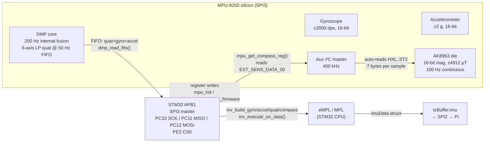
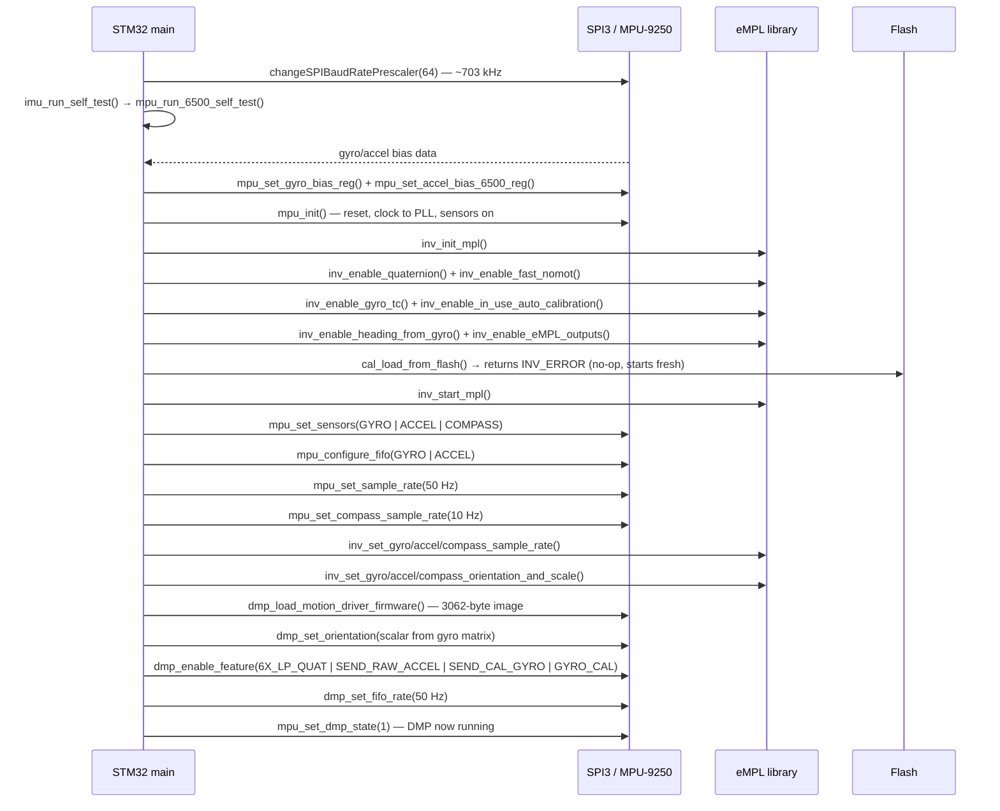
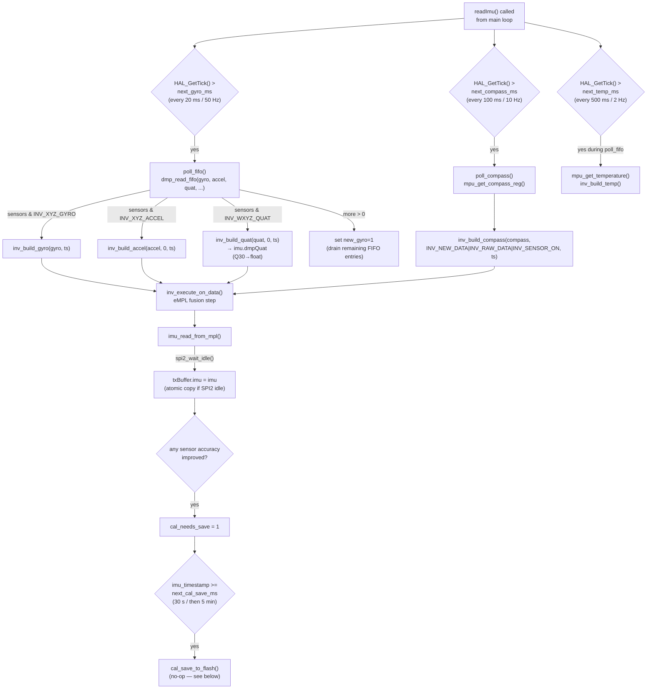
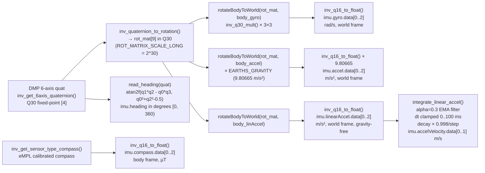
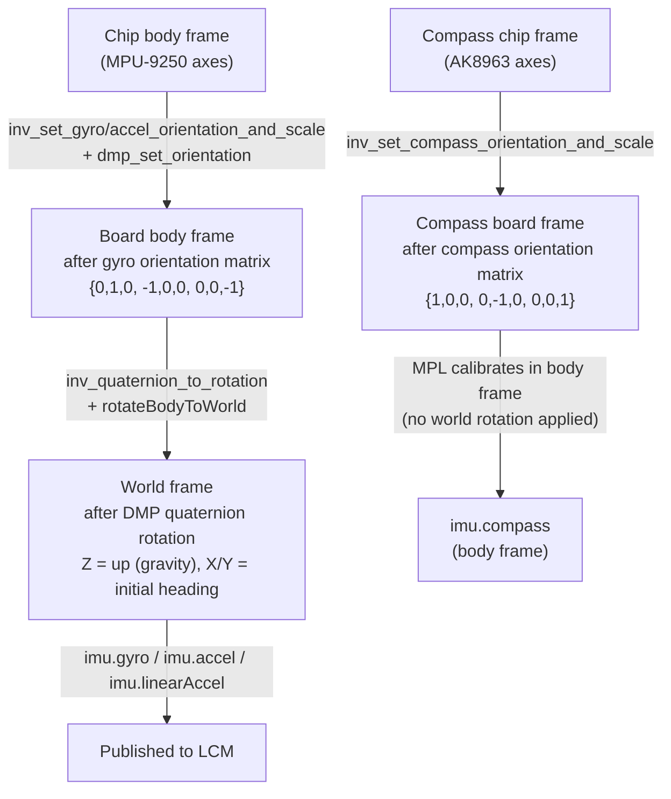

## Mental model

The robot has a single inertial measurement unit (IMU): an InvenSense **MPU-9250**, which integrates three sensors in one package — a 3-axis MEMS gyroscope, a 3-axis MEMS accelerometer, and an AK8963 3-axis magnetometer. The gyroscope and accelerometer are on the MPU-9250 die itself. The AK8963 is a separate die inside the same package, connected via a private (auxiliary) I²C bus. The STM32 only ever talks to the MPU-9250 die; it reaches the AK8963 indirectly through the MPU-9250's built-in I²C master.

The raw sensor signals are noisy and biased. Alone, a gyroscope drifts; alone, an accelerometer is sensitive to vibration. The firmware therefore runs two layers of signal processing on top of the raw hardware:

1. **The DMP (Digital Motion Processor)** — a small ARM core embedded in the MPU-9250 silicon itself, programmed with a 3 kB firmware image from InvenSense. The DMP fuses the gyroscope and accelerometer at 200 Hz internally and delivers a pre-computed 6-axis quaternion into the MPU-9250's FIFO at the rate the firmware requests (50 Hz in this build). This off-loads the fusion math from the STM32 CPU and guarantees consistent gyro-integration timing independent of main-loop jitter.

2. **The eMPL / MPL (embedded Motion Processing Library)** — the InvenSense C library that runs on the STM32 CPU. It takes the DMP's outputs plus the magnetometer and applies calibration, sensor fusion, and orientation tracking. The firmware uses the MPL to obtain calibrated, world-frame vectors for gyro, accel, linear acceleration, and the compass heading.

The result — the `ImuData` struct — is written to `txBuffer.imu` every 20 ms and shipped to the Pi on the next SPI transfer.



## Hardware layer: MPU-9250 on SPI3

### Pin assignments

| Signal | GPIO | Alternate function |
|--------|------|--------------------|
| SPI3_SCK | PC10 | AF6 |
| SPI3_MISO | PC11 | AF6 |
| SPI3_MOSI | PC12 | AF6 |
| CS0 (chip select) | PE2 | GPIO output |

Source: `Communication/spi.c`, `MX_SPI3_Init()` and `HAL_SPI_MspInit()`.

### SPI3 bus speed

The STM32 runs at 180 MHz SYSCLK (HSI 16 MHz, PLL ×180 / 2). SPI3 is on APB1, which runs at SYSCLK/4 = **45 MHz**.

| Phase | Prescaler | SPI3 clock |
|-------|-----------|-----------|
| Default (init, startup) | 256 | ~176 kHz |
| After `setupImu()` starts | 64 | ~703 kHz |

The MPU-9250 datasheet allows up to 1 MHz for register configuration (the default 256 prescaler is safely below this) and up to 20 MHz for bulk read. The firmware stays conservative: `setupImu()` calls `changeSPIBaudRatePrescaler(&hspi3, SPI_BAUDRATEPRESCALER_64)` at the top, giving ~703 kHz for the entire init sequence and all subsequent FIFO reads.

### SPI protocol (MPU-9250 register interface)

The MPU-9250 uses a standard SPI register protocol:

- **Write**: assert CS, send `register_address` (bit 7 = 0), send data bytes, deassert CS.
- **Read**: assert CS, send `register_address | 0x80` (bit 7 = 1), clock in data bytes, deassert CS.

This is implemented in `MPU_SPI_Write()` and `MPU_SPI_Read()` in `MPU9250.c`. Every transaction uses `HAL_SPI_TransmitReceive` for the address byte (`SPIx_WriteRead`), and `HAL_SPI_Transmit` / `HAL_SPI_Receive` for the data phase.

The InvenSense eMPL library has its own HAL interface (`motion_driver_hal.h`) which expects I²C-style `hal_i2c_write` / `hal_i2c_read` callbacks. The file `mpu9250_hal.c` implements these callbacks by forwarding to `MPU_SPI_Write()` / `MPU_SPI_Read()`, completely hiding the SPI transport from the library. The I²C slave address parameter is silently ignored.

### AK8963 magnetometer via aux I²C

The AK8963 is not directly accessible on SPI3. Instead, the MPU-9250 has an internal I²C master (running at 400 kHz, configured via `I2C_MST_CTRL = 0x0D`) that owns the AK8963 on a private bus. The firmware programs the MPU-9250's I²C slave 0 registers to schedule periodic reads from the AK8963:

```c
// Direct access path (used during init for mode changes):
writeAK8963Register(AK8963_CNTL1, <mode>);   // writes via I2C_SLV0_ADDR + I2C_SLV0_REG + I2C_SLV0_DO
readAK8963Registers(AK8963_HXL, 7, _buffer); // reads via EXT_SENS_DATA_00..06
```

The AK8963 is set to **16-bit continuous measurement mode 2 (100 Hz)** (`AK8963_CNTL1 = 0x16`), corresponding to `AK8963_CNT_MEAS2` with a scale factor of 0.15 µT/LSB.

During `MPU9250_Init()`, the AK8963's factory sensitivity adjustment (ASA) registers are read from its internal FUSE ROM. These three bytes encode per-axis gain corrections. The firmware applies them:

```c
mag_adjust[axis] = (asa[axis] - 128) / 256.0f + 1.0f;
// Range: typically 1.0 ± ~0.1
```

Every magnetic reading from `MPU9250_GetData()` is then multiplied element-wise by `mag_adjust[]` before being scaled by `magnetoScale` (0.15 µT/LSB for 16-bit mode).

**Important:** once the DMP is active (which it is in normal operation), data acquisition is driven through the eMPL/MPL path (`mpu_get_compass_reg()`), not through `MPU9250_GetData()`. The `MPU9250.c` layer is used only during initialization.

## Initialization sequence

`setupImu()` in `imu_setup.c` runs once at startup. It proceeds in this exact order:



Key numbers after setup:

| Parameter | Value | Source |
|-----------|-------|--------|
| Gyro FSR | ±2000 dps | `IMU_DEFAULT_GYRO_FSR` in `mpu9250_config.h` |
| Accel FSR | ±2 g | `IMU_DEFAULT_ACCEL_FSR` |
| LPF | 42 Hz | `IMU_DEFAULT_LPF` |
| DMP FIFO rate | 50 Hz | `DEFAULT_MPU_HZ` in `imu_setup.c` / `imu.c` |
| Compass rate | 10 Hz | `1000 / COMPASS_READ_MS` (100 ms period) |
| Temperature rate | 2 Hz | `1000 / TEMP_READ_MS` (500 ms period) |

## The DMP (Digital Motion Processor)

The DMP is a small, fixed-function processor built into the MPU-9250 silicon. Its purpose is to run gyroscope integration at the internal sensor rate (up to 200 Hz) rather than waiting for the STM32 to poll. This matters because gyroscope integration for attitude tracking is sensitive to the exact time interval between samples. If the STM32 main loop has variable latency (e.g., due to SPI2 transfers to the Pi), the DMP ensures the integration interval is exactly controlled by hardware.

The DMP firmware is a 3062-byte binary image (`dmp_load_motion_driver_firmware()`) provided by InvenSense and loaded into the MPU-9250's SRAM via SPI at startup.

### DMP features enabled

The firmware enables these features (set via `dmp_enable_feature()`):

| Feature flag | Value | Effect |
|---|---|---|
| `DMP_FEATURE_6X_LP_QUAT` | `0x010` | 6-axis low-power quaternion (gyro + accel, no mag) |
| `DMP_FEATURE_GYRO_CAL` | `0x020` | Auto-zeroes gyro bias after 8 s of no-motion |
| `DMP_FEATURE_SEND_RAW_ACCEL` | `0x040` | Puts raw accel data in FIFO |
| `DMP_FEATURE_SEND_CAL_GYRO` | `0x100` | Puts calibrated gyro data in FIFO |

`DMP_FEATURE_TAP` is also forced on by `MPU9250_dmpEnableFeatures()` as a workaround for a known InvenSense bug where the FIFO sample rate is incorrect unless tap detection is enabled.

### The 6-axis quaternion

The DMP's `DMP_FEATURE_6X_LP_QUAT` output is a unit quaternion (w, x, y, z) representing the rotation that takes vectors from the sensor body frame to the world frame. It fuses only gyroscope and accelerometer — no magnetometer. This means:

- Roll and pitch are accurate and drift-free (accelerometer corrects for gyro drift).
- Yaw drifts over time (no absolute reference without magnetometer or GPS).
- For a ground robot that cannot roll or pitch more than a few degrees, yaw drift is the main concern.

Quaternion components from the DMP FIFO are in Q30 fixed-point format (30 fractional bits). The conversion to float is:

```c
float inv_q30_to_float(long q30) { return (float)q30 / (float)(1L << 30); }
```

These are stored in `imu.dmpQuat.data[0..3]` (w, x, y, z) by `poll_fifo()` in `imu.c`.

## The eMPL / MPL sensor fusion pipeline

The eMPL library provides a software pipeline on the STM32 CPU that takes the DMP's outputs and the raw magnetometer and applies additional calibration and fusion. The main loop calls `readImu()` which drives the pipeline.

### Data acquisition loop



The `more` flag from `dmp_read_fifo()` is significant: if the FIFO built up more than one entry (because the main loop ran slower than 50 Hz), the loop sets `new_gyro = 1` and processes entries on successive iterations until the FIFO is drained.

### Fusion pipeline in `imu_read_from_mpl()`

After `inv_execute_on_data()` runs the MPL's internal update step, `imu_read_from_mpl()` (`imu_data.c`) extracts calibrated, world-frame values from the MPL:



The rotation matrix `rot_mat` is initialised as the identity (diagonal = `ROT_MATRIX_SCALE_LONG = 1<<30 = 1073741824`) and overwritten by `inv_quaternion_to_rotation()`. The matrix multiplication `rotateBodyToWorld()` uses `inv_q30_mult()` for Q30-format saturating multiply.

### Fixed-point number formats

The InvenSense library uses several Q-format integers:

| Format | Scale | Range | Used for |
|--------|-------|-------|----------|
| Q30 | ÷ 2³⁰ | ±1.0 | Quaternion components, rotation matrix elements |
| Q29 | ÷ 2²⁹ | ±1.0 | Intermediate heading computation (`inv_q29_mult`) |
| Q16 | ÷ 2¹⁶ | ±32768 | Sensor values after MPL calibration (gyro rad/s, accel m/s²) |

## Sensor units and frames

### Body frame vs. world frame

Every vector that leaves `imu_read_from_mpl()` has been rotated from the **chip body frame** to the **world frame** using the 6-axis DMP quaternion. "World frame" here means a fixed frame where Z points up (aligned with gravity) and X/Y are the orientation at the moment the quaternion reference was last corrected (roughly, the direction the robot was facing when the DMP's gyro calibration last zeroed).

The exception is `imu.compass`: compass data is returned in the **body frame** from `inv_get_sensor_type_compass()`. This is intentional — the MPL calibrates the compass in body frame and the firmware does not rotate it further.

`imu.dmpQuat` is the DMP 6-axis quaternion itself, expressing the rotation from body to world, stored as (w, x, y, z) in float.

### Gyroscope units

`imu.gyro.data[0..2]` is in **rad/s** in the world frame. This is the MPL output after calibration and bias removal; the bias is continuously updated by `inv_enable_in_use_auto_calibration()`.

The raw DMP gyro data passed to `inv_build_gyro()` is in **LSB units** (raw 16-bit counts). The MPL converts to deg/s or rad/s using the gyro FSR (±2000 dps, configured at startup via `inv_set_gyro_orientation_and_scale(..., (long)gyro_fsr << 15)`). The app does not need to apply any manual scaling.

For comparison: the lower-level `MPU9250.c` `MPU9250_GetData()` function divides by `gyroLsb = 16.4f` (the LSB/dps sensitivity for ±2000 dps range) to get **deg/s** directly. That path is used only during non-DMP polling and is not part of the normal data flow.

### Accelerometer units

`imu.accel.data[0..2]` is in **m/s²** in the world frame. The raw Q16 value from the MPL is multiplied by `EARTHS_GRAVITY = 9.80665f` m/s².

`imu.linearAccel.data[0..2]` is gravity-subtracted acceleration in **m/s²** in the world frame, produced by the MPL's gravity estimation from the quaternion.

### Compass units

`imu.compass.data[0..2]` is in µT (microtesla) in the **body frame**, calibrated by the MPL's in-use auto-calibration. For AK8963 in 16-bit mode the raw sensitivity is 0.15 µT/LSB; the MPL's Q16 output scales this correctly.

`imu.heading` is in **degrees**, [0, 360), derived from the DMP 6-axis quaternion (not from the magnetometer directly) by `read_heading()`.

### Velocity integration

`imu.accelVelocity.data[0..2]` is an **experimental** velocity estimate in m/s produced by integrating `imu.linearAccel` over time in the X/Y plane only (index 2 is not integrated). A first-order EMA pre-filter (α = 0.3) smooths the linear acceleration before integration. The integrator applies a 0.998 decay factor per cycle to prevent unbounded drift (the equivalent of a high-pass filter on velocity). Integration is skipped if `dt > 100 ms` to avoid large steps after sleep or stall. Because there is no absolute velocity reference, this estimate drifts significantly over seconds; it is intended for short-term motion detection, not dead-reckoning.

## Orientation matrices

The MPU-9250 chip axes may not align with the robot body frame. Two 3×3 signed-char rotation matrices map chip axes to board axes:

```c
// mpu9250_config.h — default values

// Gyro + accel: chip X → board +Y, chip Y → board −X, chip Z → board −Z
#define IMU_GYRO_ORIENTATION_MATRIX  { 0, 1, 0,  -1, 0, 0,  0, 0, -1 }

// Compass (AK8963)
#define IMU_COMPASS_ORIENTATION_MATRIX { 1, 0, 0,  0, -1, 0,  0, 0, 1 }
```

Each row of the matrix maps one output axis to the corresponding chip axis. These are applied to the MPL via `inv_set_gyro_orientation_and_scale()` (which calls `inv_orientation_matrix_to_scalar()` internally) and also to the DMP via `dmp_set_orientation()`.

The Pi can override both matrices at runtime by writing new 9-byte signed-char arrays to `rxBuffer.imuGyroOrientation` and `rxBuffer.imuCompassOrientation` with the `PI_BUFFER_UPDATE_IMU_ORIENTATION` flag set in `rxBuffer.updates`. The STM32 main loop then calls `updateImuOrientation()` in `imu_calibration.c`, which re-applies the matrices to all three layers (gyro MPL scale, accel MPL scale, compass MPL scale, DMP orientation scalar).

### Frame relationships



## IMU calibration and flash persistence

### Self-test bias correction

The very first thing `setupImu()` does is run a hardware self-test via `mpu_run_6500_self_test()`. If both the gyroscope and accelerometer pass (result bitmask bits 0 and 1 set), the measured factory biases are scaled and loaded into the hardware offset registers:

```c
// imu_calibration.c — imu_run_self_test()
for (int i = 0; i < 3; ++i) {
    gyro[i]  = (long)(gyro[i]  * 32.8f);    // scale to ±1000 dps register units
    accel[i] = (long)(accel[i] * 2048.f);   // scale to ±16 g register units
    accel[i] >>= 16;
    gyro[i]  >>= 16;
}
mpu_set_gyro_bias_reg(gyro);
mpu_set_accel_bias_6500_reg(accel);
```

These hardware offsets are subtracted by the MPU-9250 before the data ever reaches the FIFO, giving the MPL a head start on calibration.

### In-use auto-calibration

`inv_enable_in_use_auto_calibration()` enables the MPL's continuous calibration algorithm. As the robot moves, the library identifies still periods and refines its estimate of the gyro bias and accelerometer offset. Accuracy is tracked on a 0–3 scale for each sensor:

- **0**: uncalibrated / unreliable
- **1**: low accuracy (initial convergence)
- **2**: medium accuracy
- **3**: high accuracy (fully calibrated)

The `imu.c` loop watches these accuracy levels and sets a `cal_needs_save` flag whenever any sensor improves. The intention is to persist the converged calibration to Flash.

### Flash persistence: currently disabled

The SPI protocol defines a `PI_BUFFER_UPDATE_SAVE_IMU_CAL` flag (bitmask `0x08` in `rxBuffer.updates`). When the Pi sets this flag, the firmware calls `cal_save_to_flash()` in `Storage/flash_cal.c`.

**`cal_save_to_flash()` is currently a no-op.** It returns `INV_SUCCESS` immediately without writing anything. The comment in `flash_cal.c` explains the reason: on the STM32F427VI, erasing and reprogramming Flash sector 12 (the 16 KiB block in Bank 2 used for calibration data) blocks the entire main loop for multiple minutes in practice. During that window, servo PWM registers never update, causing servos to freeze. The polling-mode HAL Flash API was the root cause.

The auto-save path in `imu.c` is also effectively disabled:

```c
if (cal_needs_save && imu_timestamp >= next_cal_save_ms) {
    cal_needs_save = 0;
    next_cal_save_ms = imu_timestamp + CAL_PERIODIC_SAVE_MS; // 5 min
    cal_save_to_flash();  // no-op
}
```

The first save attempt happens 30 s after any accuracy improvement (`CAL_SAVE_INTERVAL_MS = 30000`); subsequent re-saves happen every 5 minutes (`CAL_PERIODIC_SAVE_MS = 300000`). These timers run normally but the actual Flash write is skipped.

`cal_load_from_flash()` always returns `INV_ERROR_CALIBRATION_LOAD`, so `setupImu()` always starts fresh on boot. Calibration converges within 2–3 minutes of normal motion with `inv_enable_fast_nomot()` active.

**If you need to re-enable Flash persistence:** the `flash_cal.c` comment recommends switching to interrupt-driven Flash programming (`HAL_FLASH_Program_IT` / `HAL_FLASHEx_Erase_IT`) and driving it from a low-priority background task that yields between sectors, ensuring the SysTick and PWM timers remain above the Flash IRQ in the NVIC priority group.

## `ImuData` struct and SPI fields

The complete IMU state transmitted to the Pi on every SPI transfer (protocol version 21) is:

```c
// shared/spi/pi_buffer.h

typedef struct __attribute__ ((packed)) {
    float data[3];   // x, y, z
    int8_t accuracy; // 0 (worst) to 3 (best)
} SensorData;

typedef struct __attribute__ ((packed)) {
    float data[4];   // w, x, y, z
    int8_t accuracy;
} QuaternionData;

typedef struct __attribute__ ((packed)) {
    SensorData    gyro;         // rad/s, world frame
    SensorData    accel;        // m/s², world frame
    SensorData    compass;      // µT, body frame
    SensorData    linearAccel;  // m/s², world frame, gravity-free
    SensorData    accelVelocity;// m/s, world frame XY only, drifting
    QuaternionData dmpQuat;     // 6-axis DMP quaternion, body→world
    float         heading;      // degrees [0, 360), from DMP quat
    float         temperature;  // degrees C
} ImuData;
```

All floats are IEEE 754 single-precision, little-endian (matching the STM32F4 and Raspberry Pi 4 ABI).

The `accuracy` field is the MPL's 0–3 accuracy metric for that sensor. Code consuming IMU data should treat accuracy 0 as unreliable. Typical convergence times after cold boot: gyro reaches 1 within ~10 s of motion, accel within ~30 s, compass within ~2 min.

## Related pages

- [Firmware Runtime and Scheduling](../firmware-runtime/) — super-loop scheduling of `readImu()`, SPI2 idle guard for `txBuffer.imu` writes, and interrupt priority context
- [Sensor Reading](../sensors/) — analog and digital sensor paths alongside the IMU overview
- [Data Pipeline](../data-pipeline/) — how `txBuffer.imu` fields travel to `imu.heading()`, `imu.quaternion()`, and other Python API calls
- [Pi Bridge Internals](../pi-bridge-internals/) — `DataPublisher` IMU channel gate logic and `raccoon/gyro`, `raccoon/imu/*` publish rates
- [SPI Communication Protocol](../spi-protocol/) — complete `TxBuffer` layout and LCM channel names for all IMU fields
- [Architecture Overview](../architecture/) — interrupt priorities and how the IMU main loop interleaves with motor control
