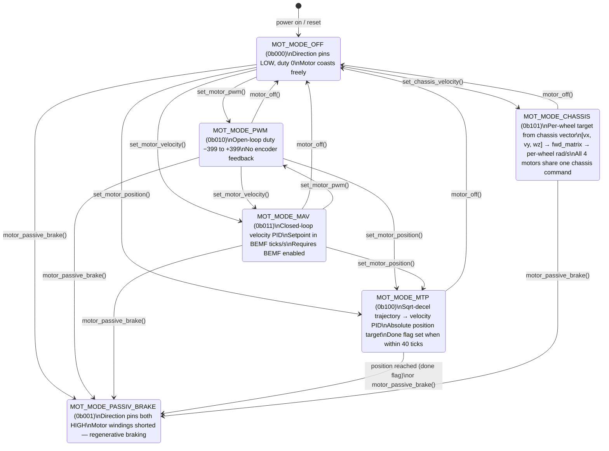

## Concept

The STM32 runs a **hierarchical control loop** for each motor. At the bottom is open-loop PWM generation (~25 kHz). Above that is a back-EMF velocity measurement loop (200 Hz per motor in round-robin). Above that is a closed-loop velocity PID. Above that is a position trajectory generator. The Pi selects which level to engage by writing a 3-bit mode field into the SPI `RxBuffer`.

The key insight behind the motor control design is that **all closed-loop work happens on the STM32**, not on the Pi. The Pi sends high-level commands (velocity setpoint, position target, chassis velocity vector) and the STM32 closes the loop within a single BEMF cycle (≤ 1250 µs). By the time the Pi's next SPI transfer arrives (5 ms later), the motor has already been updated four times.

### Motor mode state machine



On every mode change, the firmware resets both PID controllers (zeroes `prevErr` and `iErr`), resets the trapezoidal profile velocity to 0, and clears the done flag. This prevents integral windup from a previous mode from affecting the new one.

## PWM Generation

Each DC motor is driven by an H-bridge. The STM32 generates a PWM signal for the enable pin of the H-bridge and drives two direction pins (D0, D1) to control direction.

Four timer peripherals generate the PWM signals:

| Timer | Motors | Channels | PWM frequency |
|---|---|---|---|
| TIM1 | Motor 0 (CH1), Motor 1 (CH2), Motor 2 (CH3) | PA8, PA9, PA10 | ~25 kHz |
| TIM8 | Motor 3 (CH1) | PC6 | ~25 kHz |

**PWM frequency calculation for TIM1/TIM8:**

- APB2 clock = 90 MHz (HCLK/2)
- TIM1/TIM8 input clock = 180 MHz (2× APB2 because APB2 prescaler ≠ 1)
- Prescaler = 18 − 1 = 17
- Timer frequency = 180 MHz / 18 = 10 MHz
- Period = 400 − 1 = 399
- PWM frequency = 10 MHz / 400 = **25 kHz**

The compare register (`__HAL_TIM_SET_COMPARE`) accepts values from 0 (always off) to 399 (always on). This is `MOTOR_MAX_DUTYCYCLE`. The PWM duty cycle in percent is `(duty / 399) × 100`.

**Direction control:**

The H-bridge direction pins map as follows:

| D0 | D1 | Effect |
|---|---|---|
| LOW | LOW | Coast (motor floats) |
| HIGH | LOW | Counter-clockwise (CCW) |
| LOW | HIGH | Clockwise (CW) |
| HIGH | HIGH | Short brake (motor windings shorted) |

Direction is set by `motor_setDirection()` which writes to the GPIO pins directly using HAL. Changing direction does not automatically stop the motor; the duty cycle remains unchanged until explicitly set.

## Back-EMF (BEMF) Measurement

The Wombat uses back-EMF rather than quadrature encoders for position feedback. When a brushed DC motor spins, it generates a voltage proportional to speed (back-EMF). By briefly stopping the PWM and sampling the voltage across the motor terminals, the STM32 can measure motor velocity.

Each motor has two dedicated ADC pins connected to the motor terminals (the high and low sides of the H-bridge output). Back-EMF is the differential: `BEMF = ADC_high − ADC_low`.

### Round-Robin BEMF Architecture

The current BEMF implementation measures **one motor per cycle** in a round-robin fashion. This is a significant architectural change from older designs that stopped all four motors simultaneously. With round-robin, only one motor is ever stopped at a time, which reduces torque interruption from 4× simultaneous stops to a single brief stop that rotates across motors.

**Timing:**

- `BEMF_SAMPLING_INTERVAL` = **1250 µs** — the inter-measurement interval (one motor per cycle)
- Each individual motor is therefore measured every **4 × 1250 = 5000 µs = 200 Hz**
- `BEMF_CONVERSION_START_DELAY_TIME` = 500 µs — settle time after cutting PWM before ADC starts
- `BEMF_WATCHDOG_TIMEOUT` = `2 × BEMF_SAMPLING_INTERVAL` = 2500 µs — hardware watchdog that force-aborts a stuck ADC2 conversion

**ADC2 channel pairs (per motor, low + high):**

| Motor | ADC Channel (low) | ADC Channel (high) |
|---|---|---|
| Motor 0 | ADC2_CH2 | ADC2_CH3 |
| Motor 1 | ADC2_CH0 | ADC2_CH1 |
| Motor 2 | ADC2_CH6 | ADC2_CH7 |
| Motor 3 | ADC2_CH4 | ADC2_CH5 |

ADC2 is **dynamically reconfigured** each cycle to scan only the two channels for `bemfCurrentMotor`. The DMA buffer holds just 2 elements: `buf[0]` = low channel, `buf[1]` = high channel. Sample time is `ADC_SAMPLETIME_480CYCLES` (maximum) per channel.

### BEMF Measurement Cycle

Each cycle runs as a state machine driven by TIM6 (`HAL_TIM_PeriodElapsedCallback`):

1. Every 1250 µs, `stop_motors_for_bemf_conv()` cuts PWM for `bemfCurrentMotor` (direction pins set to OFF) and transitions to `WAITING_TO_START`.
2. After 500 µs, `startBemfReading()` calls `configureBemfAdc(bemfCurrentMotor)` to reconfigure ADC2 for just this motor's two channels, then starts DMA.
3. ADC2 completes, `HAL_ADC_ConvCpltCallback` fires and sets state to `CONVERSION_DONE`.
4. `processBEMF()` runs the full signal chain (see below), then advances `bemfCurrentMotor = (bemfCurrentMotor + 1) % 4`.

### BEMF Signal Processing Pipeline

```c
// Step 1: Raw differential, VDDA-normalized
float raw = (buf[1] - buf[0]) * vddaScale;  // high - low

// Step 2: Median-of-3 pre-filter (per-motor circular buffer, 3 samples)
medianBuf[ch][medianIdx[ch]] = raw;
medianIdx[ch] = (medianIdx[ch] + 1) % 3;
float median = median3(medianBuf[ch][0], medianBuf[ch][1], medianBuf[ch][2]);

// Step 3: IIR low-pass (alpha = 0.2)
filtered = BEMF_FILTER_ALPHA * median + (1.0f - BEMF_FILTER_ALPHA) * prev;
//  BEMF_FILTER_ALPHA = 0.2f

// Step 4: Sanity guard — discard if |filtered| > MAX_BEMF_READING (2000)
if (filtered > MAX_BEMF_READING || filtered < -MAX_BEMF_READING) { skip; }

// Step 5: Offset correction + dead zone
float corrected = filtered - bemf_offset_cfg[ch];  // Pi-calibrated per-motor offset
if (corrected < BEMF_DEADZONE && corrected > -BEMF_DEADZONE)
    corrected = 0.0f;
//  BEMF_DEADZONE = 25.0f counts

motor_data.bemf[ch] = (int32_t)corrected;
```

The two-stage filter (median-of-3 then IIR) rejects impulse noise (switching spikes, DMA glitches) in the first stage, then smooths the signal in the second. The dead zone of ±25 counts is applied after offset subtraction, not to the raw reading.

**Key constants (from `bemf.h` / `bemf.c`):**

| Constant | Value | Meaning |
|---|---|---|
| `BEMF_SAMPLING_INTERVAL` | 1250 µs | interval between individual motor measurements |
| `BEMF_CONVERSION_START_DELAY_TIME` | 500 µs | settle time before ADC starts |
| `BEMF_WATCHDOG_TIMEOUT` | 2500 µs | force-abort stuck ADC after this |
| `BEMF_FILTER_ALPHA` | 0.2 | IIR weight for new sample |
| `MAX_BEMF_READING` | 2000 | sanity guard — discard if exceeded |
| `BEMF_DEADZONE` | 25.0 counts | dead band applied after offset subtraction |

### BEMF Watchdog

`bemf_watchdog_check()` is called from TIM6 each tick. If the BEMF state machine is not in `STOPPED` and the cycle has been running longer than `BEMF_WATCHDOG_TIMEOUT` (2500 µs), the watchdog:

1. Calls `HAL_ADC_Stop_DMA()` to abort the stuck conversion
2. Clears the DMA buffer
3. Advances `bemfCurrentMotor` to skip the stuck motor
4. Returns the state machine to `STOPPED`

This prevents a single bad ADC conversion from stalling all motor updates indefinitely.

### Position Accumulation (dt-aware)

Position is accumulated using the **actual elapsed time** between samples for each motor, not a fixed tick increment. This makes position a true time-integral of velocity (`∫ω dt`), immune to round-robin cadence jitter and watchdog skips:

```c
const uint32_t now_us = microSeconds;
if (bemf_last_us[ch] != 0)
{
    const float dt_s = (float)(now_us - bemf_last_us[ch]) * 1e-6f;
    positionAccum[ch] += corrected * dt_s;
}
bemf_last_us[ch] = now_us;

// Extract whole ticks, keep fractional remainder
int32_t whole = (int32_t)positionAccum[ch];
if (whole != 0)
{
    motor_data.position[ch] += whole;
    positionAccum[ch] -= (float)whole;
}
```

**Important:** this rescales position units compared to a naive `position += bemf` approach. The `KinematicsConfig.ticks_to_rad[4]` calibration factor must be determined empirically against this dt-aware accumulation.

### Position Reset (on-STM32)

Motor position counters are reset on the STM32 directly, not by Pi-side software offsets. The Pi sets bit N of `rxBuffer.motorPositionReset` and sets the `PI_BUFFER_UPDATE_MOTOR_POS_RESET` update flag. On the next SPI transaction, the STM32 main loop sets `motor_data.position[ch] = 0` for each bit that is set, then clears `motorPositionReset`.

From Python (raccoon-lib):

```python
from raccoon_transport import Transport
from raccoon_transport.types.raccoon import scalar_i32_t

t = Transport()
msg = scalar_i32_t()
msg.value = 1  # non-zero triggers reset
t.publish(Channels.motor_position_reset_command(port), msg.encode(), reliable=True)
```

After sending the reset, wait ~300–500 ms before reading the position or sending a new move command.

## PID Control

The firmware implements a discrete-time PID controller with **dt-explicit gains**. The `PidController` structure holds state for one motor:

```c
typedef struct {
    float kP;
    float kI;      // per-second units
    float kD;      // per-second units
    float iMax;    // maximum integral contribution
    float outMax;  // output saturation limit
    float prevErr;
    float iErr;    // integral accumulator (error × dt, not raw error)
} PidController;
```

### dt-Explicit `pid_update()`

The update function signature takes an explicit `dt` argument:

```c
int32_t pid_update(PidController* pid, int32_t goal, int32_t current, float dt);
```

`dt` is the elapsed time in seconds since this controller's previous update. Using explicit dt makes gains physically consistent: if the BEMF cycle fires late (watchdog skip, OS jitter), the integral and derivative automatically compensate. A fallback value of `PID_NOMINAL_DT = 1.0/200.0` (5 ms) is used if `dt` is zero, negative, or unreasonably large (> 100 ms).

```c
// Integral: accumulates error × dt (units: error·seconds)
pid->iErr += pErr * dt;

// Derivative: rate of error change per second
float dErr = (pErr - pid->prevErr) / dt;

// Integral anti-windup (clamp contribution, back-calculate accumulator)
float iTerm = pid->kI * pid->iErr;
if (iTerm > pid->iMax)  { iTerm = pid->iMax;  pid->iErr = pid->iMax  / pid->kI; }
if (iTerm < -pid->iMax) { iTerm = -pid->iMax; pid->iErr = -pid->iMax / pid->kI; }

float cmd = pid->kP * pErr + iTerm + pid->kD * dErr;
cmd = clamp(cmd, -pid->outMax, pid->outMax);
```

### Default PID Gains

**Default velocity PID gains** (`pid_init()`):

| Gain | Value | Notes |
|---|---|---|
| `kP` | 1.22 | |
| `kI` | **9.0** | dt-explicit per-second; equivalent to the old 0.045 at 200 Hz (9.0 = 0.045 × 200) |
| `kD` | 0.0 | |
| `iMax` | 399 | full duty |
| `outMax` | 399 | |

**Default position PID gains** (`pid_init_position()`):

| Gain | Value | Notes |
|---|---|---|
| `kP` | 1.0 | |
| `kI` | 0.0 | |
| `kD` | 0.0 | |
| `iMax` | 399 | |
| `outMax` | 399 | |

These are starting points. The optimal values depend on the motor, load, and battery voltage. The Pi can override them at any time via the `motorPidSettings` block in the `RxBuffer` combined with the appropriate update flag. From LCM, publish a `vector3f_t` (`x=kp, y=ki, z=kd`) to `raccoon/motor/N/pid_cmd` with `reliable=True`.

**When tuning `kI`, always use per-second units.** A value of 1.0 means the integral term grows by 1.0 × (error × 1 second). The old implicit-dt convention (where kI was scaled by the loop rate) no longer applies.

## Motor Operating Modes

`update_motor()` is called once per motor per BEMF cycle (one motor at a time, round-robin). It reads `rxBuffer.motorControlMode`, extracts the 3-bit mode for the relevant channel, and dispatches to the corresponding handler.

### `MOT_MODE_OFF` (0b000)
Direction pins both LOW, duty cycle 0. Motor coasts.

### `MOT_MODE_PASSIV_BRAKE` (0b001)
Direction pins both HIGH, duty cycle 0. Both motor terminals are shorted through the H-bridge, providing regenerative braking.

### `MOT_MODE_PWM` (0b010)
Direct open-loop PWM. `motorTarget[ch]` is the signed duty cycle (negative = reverse). The duty is passed to `applyMotorOutput()` which sets direction and calls `motor_setDutycycle()`. The range is −399 to +399.

### `MOT_MODE_MAV` — Move At Velocity (0b011)
Closed-loop velocity control using the velocity PID. The offset-corrected, dead-zone-filtered BEMF reading is the process variable; `motorTarget[ch]` is the velocity setpoint (in BEMF ticks per second, with dt-explicit units). The PID output is the signed PWM duty.

```c
int32_t pidOut = pid_update(&pidControllers[ch], target, bemf_filtered, pidDt);
applyMotorOutput(ch, pidOut);
```

This mode requires BEMF to be enabled. If `FEATURE_BEMF_DISABLE` is set, the STM32 holds the motor off in this mode.

### `MOT_MODE_CHASSIS` — On-MCU Chassis Velocity (0b101)
Derives a per-wheel velocity setpoint from `rxBuffer.chassisVelocity[3]` via forward kinematics, then runs the same velocity PID as MAV:

```c
const int32_t chassisTarget = odometry_chassis_wheel_target(
    ch,
    rxBuffer.chassisVelocity[0],  // vx m/s
    rxBuffer.chassisVelocity[1],  // vy m/s
    rxBuffer.chassisVelocity[2]); // wz rad/s
int32_t pidOut = pid_update(&pidControllers[ch], chassisTarget, bemf_filtered, pidDt);
applyMotorOutput(ch, pidOut);
```

See the SPI protocol page for full details. `motorTarget` is ignored in this mode.

### `MOT_MODE_MTP` — Move To Position (0b100)
Moves to an absolute position target (`motorGoalPosition[ch]`) using a **sqrt deceleration + trapezoidal acceleration profile** feeding the velocity PID:

```
profile velocity → velocity PID → PWM duty
```

The profile works as follows:

1. **Deceleration curve**: desired velocity = `sqrt(2 × MTP_DECEL_FACTOR × distance_to_goal)`, clamped to a minimum crawl velocity (`MTP_MIN_VEL = 15`) so static friction is overcome near the goal.
2. **Speed limit**: `motorTarget[ch]` is the maximum profile velocity (the speed limit). If ≤ 0, defaults to 300.
3. **Trapezoidal acceleration**: the profile velocity ramps up at most `MTP_ACCEL_PER_TICK = 150` per update cycle. Deceleration is allowed to happen instantly (follows the sqrt curve immediately without rate-limiting), and the velocity PID integral is flushed during deceleration to prevent windup fighting the brake.
4. **Done detection**: when `|goalPos − currentPos| ≤ MTP_DONE_THRESHOLD` (40 ticks), the motor actively brakes (SHORT_BREAK), bit N of `motor_data.done` is set, and the done state is sticky until the goal position changes or the mode changes.

**Note:** `posPidControllers` is declared and initialized, but is **not used** in MTP mode in the current implementation. The position loop is handled by the sqrt profile, not a PD outer controller. The `posPidControllers` array is kept for API compatibility (the `PI_BUFFER_UPDATE_MOTOR_PID_POS` update flag writes to it).

**Key MTP constants:**

| Constant | Value | Meaning |
|---|---|---|
| `MTP_DONE_THRESHOLD` | 40 | position error deadband for "done" (BEMF ticks) |
| `MTP_MIN_VEL` | 15 | minimum crawl velocity near goal |
| `MTP_ACCEL_PER_TICK` | 150 | max velocity increase per update cycle |
| `MTP_DECEL_FACTOR` | 10 | deceleration factor in sqrt curve |

### Mode Change Handling

When the control mode changes between BEMF cycles, both PID controllers for that motor are reset (`prevErr = 0, iErr = 0`), the trapezoidal profile velocity is reset to 0, and the done flag for that motor is cleared. The firmware also logs the transition via UART3 (`[stp] mot{N} mode {prev}->{new} pos={pos}`).

## Servo Control

Four servo outputs are generated by TIM3 and TIM9. These timers run at 1 MHz (prescaler value = N−1 per HAL convention: TIM3 uses `Prescaler = 89`, TIM9 uses `Prescaler = 179`) with period 20 000, giving a 50 Hz PWM with 1 µs resolution — exactly the standard RC servo signal.

| Timer | Servos | GPIO pins |
|---|---|---|
| TIM3 CH2 | Servo 1 | PC7 |
| TIM3 CH3 | Servo 0 | PC8 |
| TIM9 CH1 | Servo 3 | PE5 |
| TIM9 CH2 | Servo 2 | PE6 |

A dedicated 6 V regulator powers the servo rail. The firmware controls the regulator's enable pin (`SERVO_6V0_ENABLE_Pin`, PE10). When all servos are fully disabled, the 6 V supply is cut. When any servo transitions to enabled state, the supply is first raised, then the PWM channel is started.

The `update_servo_cmd()` function runs at 10 Hz from the main loop. Servo position is specified in timer ticks (600 = 0°, 2600 = 180°, 600 + degrees × 10 = position). The `stm32-data-reader` converts user-facing degrees to this scale before writing to `rxBuffer.servoPos[port]`.

The 10 Hz update rate is deliberately slow. Updating servos every millisecond can cause jitter when the SPI bus is transferring large buffers and the timer compare register is written mid-cycle.

## Related pages

- [SPI Communication Protocol](../spi-protocol/) — how motor modes and targets are carried over the wire
- [Data Pipeline](../data-pipeline/) — the full command path from Python `motor.set_speed()` to H-bridge output
- [Build and Flash](../build-flash/) — how to change PID defaults and reflash the firmware
