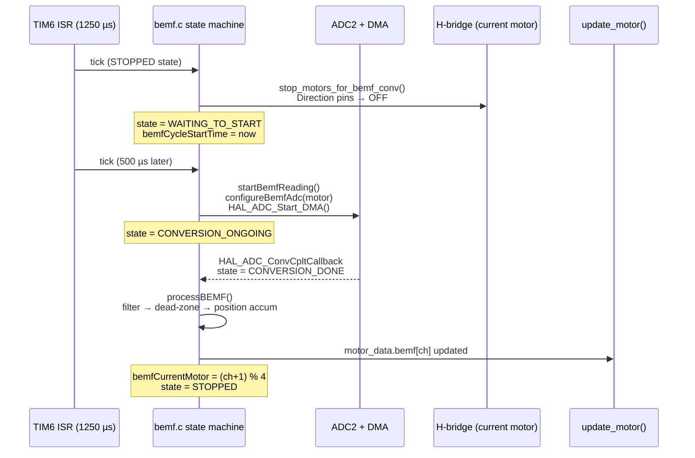
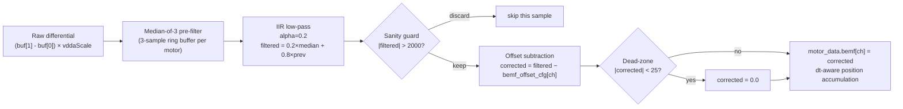
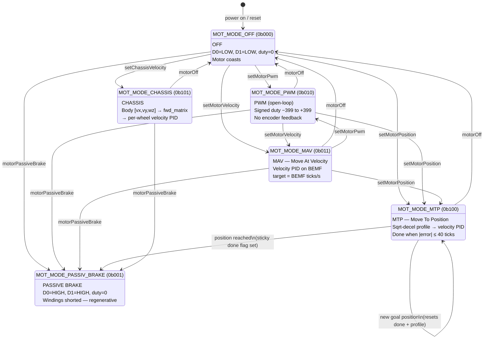
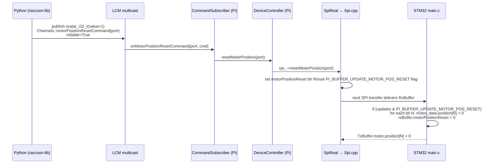
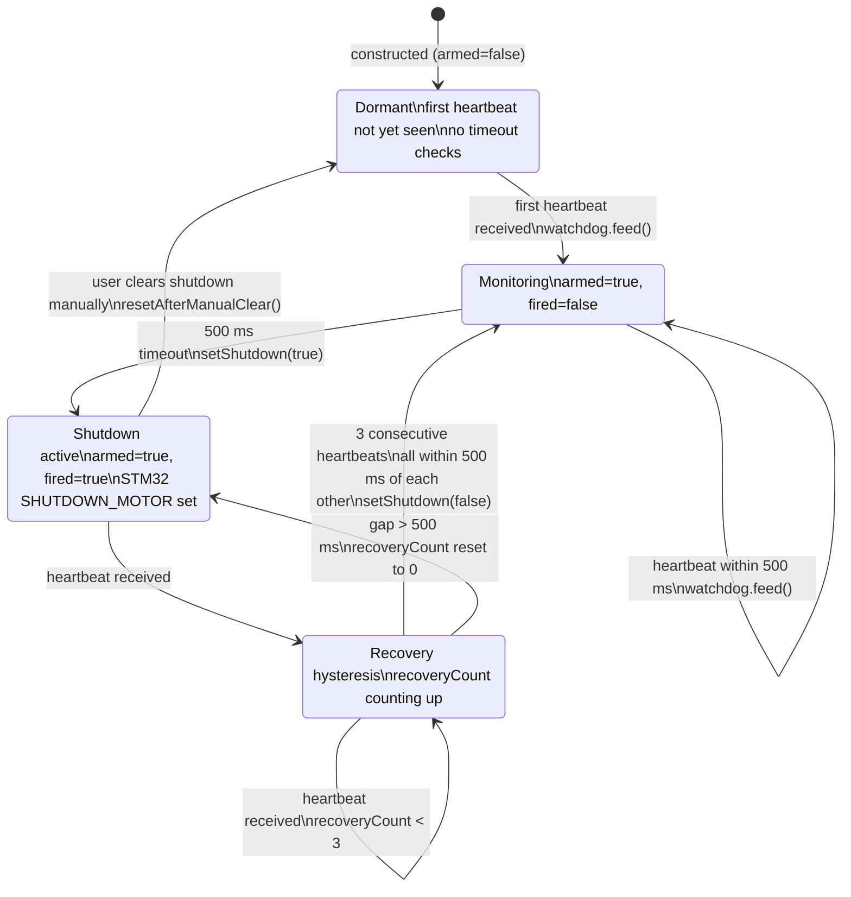

## Mental model — why the hierarchy exists

The STM32 runs a **four-level control hierarchy** for each motor. Understanding which level is active, and which levels are bypassed, is the key to understanding every motor mode.

```
Level 4 (highest):  Chassis kinematics   →  body-frame [vx, vy, wz] → per-wheel velocity
Level 3:            Position trajectory   →  sqrt-decel profile → velocity setpoint
Level 2:            Velocity PID          →  BEMF feedback → PWM duty setpoint
Level 1 (lowest):   PWM generation        →  H-bridge enable pin, 25 kHz
```

The Pi always commands at the *highest* level it needs. For simple open-loop testing, it commands Level 1 directly (PWM mode). For a move-to-position command, it commands Level 3 and lets the firmware run Levels 3, 2, and 1 independently on the STM32. By the time the next SPI transfer arrives (~5 ms), each motor has already been updated four times at the BEMF rate.

**The key insight:** all closed-loop work happens on the STM32, not on the Pi. The Pi's SPI bus is not in any feedback loop.

---

## PWM Generation (Level 1)

Each DC motor is driven by an H-bridge. The STM32 generates a PWM signal on the H-bridge enable pin and drives two direction pins (D0, D1) to set rotation direction.

### Timer assignment

The `motors[]` array in `motor.c` maps logical software port numbers to physical timers and channels. Note the deliberate reordering — the array comment says "motor 0 and 1 as well as 2 and 3 are switched to get right sequence of motor ports":

| Software port | Physical motor | Timer | TIM Channel | GPIO (PWM) |
|---|---|---|---|---|
| 0 | MOT1 hardware | TIM1 | CH2 | MOT1_PWM_Pin |
| 1 | MOT0 hardware | TIM1 | CH1 | MOT0_PWM_Pin |
| 2 | MOT3 hardware | TIM8 | CH1 | MOT3_PWM_Pin |
| 3 | MOT2 hardware | TIM1 | CH3 | MOT2_PWM_Pin |

This cross-mapping is transparent to higher layers — all firmware code (BEMF, PID, MTP) uses the software port index consistently.

### PWM frequency

TIM1 and TIM8 are APB2-clocked timers. With the STM32F4 configured at 180 MHz HCLK and an APB2 prescaler of 2:

| Parameter | Value |
|---|---|
| APB2 clock | 90 MHz |
| TIM1/TIM8 input clock | 180 MHz (×2 because APB2 prescaler ≠ 1) |
| Prescaler register | 17 (value = N−1 = 18−1) |
| Timer tick frequency | 180 MHz / 18 = **10 MHz** |
| Auto-reload register | 399 (period = 400 ticks) |
| PWM frequency | 10 MHz / 400 = **25 kHz** |

The compare register (`__HAL_TIM_SET_COMPARE`) accepts 0–399. `MOTOR_MAX_DUTYCYCLE = 399`. Duty cycle in percent = `(duty / 399) × 100`.

### H-bridge direction encoding

`motor_setDirection()` in `motor.c` writes the D0 and D1 GPIO pins:

| D0 | D1 | `MOTOR_DIRECTION_CTL` enum | Effect |
|---|---|---|---|
| LOW | LOW | `OFF` | Motor coasts freely |
| HIGH | LOW | `CCW` | Counter-clockwise |
| LOW | HIGH | `CW` | Clockwise |
| HIGH | HIGH | `SHORT_BREAK` | Both terminals shorted — regenerative braking |

`applyMotorOutput(ch, motor_cmd)` combines sign-to-direction decoding with `motor_setDutycycle()`. Positive `motor_cmd` → CW; negative → CCW; magnitude → duty cycle.

---

## Back-EMF Velocity Measurement (Level 2 sensor)

### Why BEMF instead of encoders

The Wombat uses back-EMF rather than quadrature encoders. When a brushed DC motor spins, it generates a voltage proportional to speed across its terminals. By briefly cutting the PWM and measuring the differential voltage, the STM32 derives wheel velocity without separate encoder hardware.

Each motor has two dedicated ADC pins connected to the motor terminals (high and low sides of the H-bridge output). The raw BEMF voltage is `ADC_high − ADC_low`.

### Round-robin architecture

The BEMF implementation measures **one motor per cycle** in round-robin, cycling 0→1→2→3→0. Only one motor is ever stopped at a time, reducing torque interruption compared to stopping all four simultaneously.



**Timing constants (from `bemf.h`):**

| Constant | Value | Meaning |
|---|---|---|
| `BEMF_SAMPLING_INTERVAL` | 1250 µs | Inter-measurement interval (one motor per cycle) |
| `BEMF_CONVERSION_START_DELAY_TIME` | 500 µs | Settle time after cutting PWM before ADC starts |
| `BEMF_WATCHDOG_TIMEOUT` | 2500 µs (= 2 × 1250 µs) | Force-abort a stuck ADC conversion |

Each motor is measured every **4 × 1250 µs = 5 ms → 200 Hz**.

### ADC2 channel pairs

ADC2 is dynamically reconfigured each cycle to scan only the two channels for `bemfCurrentMotor`. `ADC_SAMPLETIME_480CYCLES` is used for both channels. The DMA buffer holds exactly 2 elements: `buf[0]` = low channel, `buf[1]` = high channel.

| Software motor port | ADC Channel (low, rank 1) | ADC Channel (high, rank 2) |
|---|---|---|
| 0 | ADC_CHANNEL_2 | ADC_CHANNEL_3 |
| 1 | ADC_CHANNEL_0 | ADC_CHANNEL_1 |
| 2 | ADC_CHANNEL_6 | ADC_CHANNEL_7 |
| 3 | ADC_CHANNEL_4 | ADC_CHANNEL_5 |

### BEMF signal processing pipeline

`processBEMF()` runs the following chain on each completed conversion:



**Two-stage filter rationale:** The median-of-3 stage rejects impulse noise (switching transients, DMA glitches) that a pure IIR would smear. The IIR then smooths the burst-free signal. The dead zone of ±25 counts is applied *after* offset subtraction, not to the raw reading.

**Key signal-processing constants (from `bemf.c`):**

| Constant | Value | Meaning |
|---|---|---|
| `BEMF_FILTER_ALPHA` | 0.2 | IIR weight for the new sample |
| `MAX_BEMF_READING` | 2000 | Sanity ceiling — readings beyond this are discarded |
| `BEMF_DEADZONE` | 25.0 counts | Dead band applied after offset subtraction |
| `MEDIAN_WINDOW` | 3 | Samples in the median pre-filter ring buffer |

### BEMF zero-offset calibration

The differential BEMF reading has a per-motor DC offset (~20–40 ADC counts) caused by amplifier and ADC settling artifacts. Integrating this offset accumulates phantom ticks that grow with time, worst at low speed. The Pi calibrates the per-motor offset via the kinematics config (`KinematicsConfig.bemf_offset[4]`), which is sent once at startup over the `KINEMATICS_CONFIG_CMD` LCM channel. The firmware stores the offsets in `bemf_offset_cfg[]` via `bemf_set_offset()` and subtracts them before the dead-zone check.

### BEMF hardware watchdog

`bemf_watchdog_check(now)` is called from TIM6 each tick. If the state machine is not `STOPPED` and the cycle has been running longer than `BEMF_WATCHDOG_TIMEOUT` (2500 µs), the watchdog:

1. Calls `HAL_ADC_Stop_DMA()` to abort the stuck conversion
2. Clears the DMA buffer with `memset` to prevent stale data leaking
3. Advances `bemfCurrentMotor = (bemfCurrentMotor + 1) % 4` to skip the stuck motor
4. Returns state to `STOPPED`

This prevents a single bad ADC conversion from stalling all motor updates.

### dt-aware position accumulation

Position is accumulated using the **actual elapsed time** between BEMF samples for each motor, not a fixed 1250 µs tick. This makes position a true time-integral of velocity (`∫ω dt`):

```c
// bemf.c — inside processBEMF(), after corrected is computed
const uint32_t now_us = microSeconds;
if (bemf_last_us[ch] != 0)
{
    const float dt_s = (float)(now_us - bemf_last_us[ch]) * 1e-6f;
    positionAccum[ch] += corrected * dt_s;
}
bemf_last_us[ch] = now_us;

// Transfer whole ticks to the integer counter, keep the fractional remainder
int32_t whole = (int32_t)positionAccum[ch];
if (whole != 0)
{
    motor_data.position[ch] += whole;
    positionAccum[ch] -= (float)whole;
}
```

The unsigned subtraction `now_us - bemf_last_us[ch]` wraps correctly on the 32-bit `microSeconds` counter. The first sample only seeds the timestamp (no position update). The `positionAccum[]` float accumulator preserves sub-tick fractional position between updates.

**Consequence:** `KinematicsConfig.ticks_to_rad[4]` must be calibrated empirically against this dt-aware accumulation. The units are "accumulated (BEMF-count × seconds) ticks", not raw BEMF counts.

---

## Motor Mode State Machine

`update_motor()` is called once per motor per BEMF cycle. The control mode is 3 bits wide, packed into `rxBuffer.motorControlMode` at bit offset `3 × channel`:

```c
const uint8_t ctlMode = (rxBuffer.motorControlMode >> (3 * channel)) & 0x07;
```



### Mode-change invariant

When `ctlMode != prevControlMode[channel]`, `motor_on_mode_change()` fires before the new handler runs. It:

1. Logs the transition via UART3: `[stp] mot{N} mode {prev}->{new} pos={pos}`
2. Calls `pid_reset()` on both `pidControllers[ch]` and `posPidControllers[ch]` (zeroes `prevErr` and `iErr`)
3. Sets `profileVel[ch] = 0` (resets the trapezoidal ramp)
4. Clears bit N of `motor_data.done`

This prevents integral windup from a previous mode from contaminating the new one, and ensures MTP always starts from a stationary profile regardless of prior motion.

### Shutdown guard

Before the mode dispatch, `update_motor()` checks `rxBuffer.systemShutdown & SHUTDOWN_MOTOR`. If set, it forces D0=LOW, D1=LOW, duty=0 and returns immediately, bypassing all mode logic. This is the firmware-level safety interlock driven by the Pi-side `MotorWatchdog`.

### BEMF-disable guard

If `FEATURE_BEMF_DISABLE` is set in `rxBuffer.featureFlags`, MAV and CHASSIS modes are blocked — the motor is held off and the function returns. PWM and MTP modes are unaffected by this flag (MTP uses position accumulated before BEMF was disabled; PWM is fully open-loop).

---

## Mode Reference

### `MOT_MODE_OFF` (0b000)

`motor_mode_off()` — D0=LOW, D1=LOW, duty=0. The motor coasts; the H-bridge outputs are open.

### `MOT_MODE_PASSIV_BRAKE` (0b001)

`motor_mode_brake()` — D0=HIGH, D1=HIGH, duty=0. Both motor terminals are shorted through the H-bridge, creating a back-EMF braking path. The motor decelerates regeneratively; stopping time depends on load and motor back-EMF constant.

### `MOT_MODE_PWM` (0b010)

`motor_mode_pwm()` — Passes `rxBuffer.motorTarget[ch]` directly to `applyMotorOutput()`. Signed range −399 to +399. Positive = CW; negative = CCW. No encoder feedback of any kind.

**LCM command:** `scalar_i32_t` on `Channels::motorPowerCommand(port)`. The Pi-side converts a −100…+100 percentage to a −400…+400 duty value (factor of 4), so the firmware sees the rescaled value. **No `reliable=True`** — this is a continuous stream.

### `MOT_MODE_MAV` — Move At Velocity (0b011)

`motor_mode_mav()` — Closed-loop velocity control using the velocity PID. The BEMF reading after dead-zone filtering is the process variable; `rxBuffer.motorTarget[ch]` is the setpoint in BEMF ticks per second.

```c
int32_t pidOut = pid_update(&pidControllers[ch], target, bemf_filtered, pidDt);
applyMotorOutput(ch, pidOut);
```

The velocity PID output is the signed PWM duty (−399…+399), passed directly to `applyMotorOutput`. This mode requires BEMF to be enabled; if `FEATURE_BEMF_DISABLE` is set, the STM32 holds the motor off.

**LCM command:** `scalar_i32_t` on `Channels::motorVelocityCommand(port)`. **No `reliable=True`** — continuous stream.

### `MOT_MODE_CHASSIS` — On-MCU Chassis Velocity (0b101)

`motor_mode_chassis()` — Derives a per-wheel velocity setpoint from `rxBuffer.chassisVelocity[3]` via the forward kinematics matrix, then runs the same velocity PID as MAV:

```c
const int32_t chassisTarget = odometry_chassis_wheel_target(
    ch,
    rxBuffer.chassisVelocity[0],  // vx m/s, body frame
    rxBuffer.chassisVelocity[1],  // vy m/s, body frame
    rxBuffer.chassisVelocity[2]); // wz rad/s, body frame
int32_t pidOut = pid_update(&pidControllers[ch], chassisTarget, bemf_filtered, pidDt);
applyMotorOutput(ch, pidOut);
```

`rxBuffer.motorTarget[ch]` is ignored in this mode. All four motors must be set to CHASSIS mode independently. The chassis velocity loop closes entirely on-MCU — no SPI round-trip is in the feedback path, making it deterministic.

**LCM command:** `vector3f_t` (x=vx, y=vy, z=wz) on `Channels::CHASSIS_VELOCITY_CMD`. **No `reliable=True`** — continuous stream.

### `MOT_MODE_MTP` — Move To Position (0b100)

`motor_mode_mtp()` — Moves to an absolute position target (`rxBuffer.motorGoalPosition[ch]`) using a sqrt-deceleration plus trapezoidal acceleration profile feeding the velocity PID.

**LCM command:** `vector3f_t` (x=speed_limit, y=goal_position) on `Channels::motorPositionCommand(port)`. Use `reliable=True`.

See the dedicated section below for the full profile description.

---

## PID Control (Level 2)

### Data structure

```c
// Actors/pid.h
typedef struct {
    float kP;
    float kI;      // per-second units (dt-explicit)
    float kD;      // per-second units (dt-explicit)
    float iMax;    // maximum integral contribution (duty counts)
    float outMax;  // output saturation limit (duty counts)
    float prevErr;
    float iErr;    // integral accumulator (error × elapsed seconds)
} PidController;
```

One `pidControllers[4]` instance serves as the velocity (inner) loop for all four motors. A second `posPidControllers[4]` array exists but is currently unused in MTP mode — it is kept for API compatibility with the `PI_BUFFER_UPDATE_MOTOR_PID_POS` update flag.

### dt-explicit `pid_update()`

```c
int32_t pid_update(PidController* pid, int32_t goal, int32_t current, float dt);
```

`dt` is the measured elapsed seconds since this motor's previous PID invocation, derived from the `microSeconds` hardware counter. If `dt` is out of range (`<= 0` or `> 0.1 s`), it falls back to the nominal 200 Hz period:

```c
// pid.c
#define PID_NOMINAL_DT (1.0f / 200.0f)   // 5 ms fallback
if (dt <= 0.0f || dt > 0.1f) dt = PID_NOMINAL_DT;
```

The full update:

```c
float pErr = (float)(goal - current);

// Integral: accumulates error × dt
pid->iErr += pErr * dt;

// Derivative: rate of error change per second
float dErr = (pErr - pid->prevErr) / dt;
pid->prevErr = pErr;

// Anti-windup: clamp the contribution, then back-calculate accumulator
float iTerm = pid->kI * pid->iErr;
if (pid->kI > 0.0f) {
    if (iTerm > pid->iMax) { iTerm = pid->iMax; pid->iErr = pid->iMax / pid->kI; }
    else if (iTerm < -pid->iMax) { iTerm = -pid->iMax; pid->iErr = -pid->iMax / pid->kI; }
}

float cmd = pid->kP * pErr + iTerm + pid->kD * dErr;
cmd = clamp(cmd, -pid->outMax, pid->outMax);
```

**Why dt-explicit matters:** if the BEMF watchdog skips a cycle, `dt` automatically grows to reflect the gap. The integral accumulates `error × actual_seconds` and the derivative uses the actual rate, so the controller remains physically consistent regardless of timing jitter.

### Default gains (`pid.c`)

```c
#define PID_DEFAULT_P  1.22f
#define PID_DEFAULT_I  9.0f    // rescaled from old implicit 0.045 × 200 Hz = 9.0
#define PID_DEFAULT_D  0.000f
```

These are loaded by `pid_init()` at startup:

| Gain | `pid_init()` (velocity) | `pid_init_position()` (unused outer) |
|---|---|---|
| `kP` | **1.22** | 1.0 |
| `kI` | **9.0** (dt-explicit) | 0.0 |
| `kD` | **0.0** | 0.0 |
| `iMax` | 399 (full duty) | 399 |
| `outMax` | 399 | 399 |

**When tuning `kI`, always use per-second units.** A `kI = 9.0` means the integral term grows by 9.0 counts per (error × 1 second). The old convention (where `kI` was implicitly divided by the loop rate) no longer applies.

### Runtime PID update (via SPI)

The Pi can push new gains at any time by writing `rxBuffer.motorPidSettings` and setting `PI_BUFFER_UPDATE_MOTOR_PID_SPEED` (0x01) in `rxBuffer.updates`. The firmware calls `update_motor_pidSettings()`, which copies `pids[port].Kp/Ki/Kd` into `pidControllers[]` and applies `limMaxInt` / `limMax` as the new `iMax` / `outMax` if non-zero.

**LCM command:** `vector3f_t` (x=kp, y=ki, z=kd) on `Channels::motorPidCommand(port)`. Use `reliable=True`.

---

## MTP: Move-To-Position Mode (Level 3)

MTP is the most complex motor mode. It does not use a position PID outer loop; instead, it uses a **sqrt-deceleration profile** to generate a velocity setpoint, then runs the velocity PID as the inner loop.

```mermaid
flowchart TD
    A[MTP invoked for channel ch] --> B{Goal changed?}
    B -- yes --> C[Clear done flag\nReset profileVel to 0\nReset PID integral\nStore new prevGoalPos]
    B -- no --> D{Done flag set?}
    C --> D
    D -- yes --> E[SHORT_BREAK active\nreturn]
    D -- no --> F[Compute posError = goalPos − currentPos]
    F --> G{absError ≤ 40?}
    G -- yes --> H[Set done flag\nSHORT_BRAKE\nreturn]
    G -- no --> I[Compute sqrt-decel velocity\nvDecel = sqrt(2 × 10 × absError)]
    I --> J[Clamp: vDecel ≥ MTP_MIN_VEL=15\nvDecel ≤ speedLimit (default 300)]
    J --> K[Apply direction sign]
    K --> L{Accelerating?\nabs(desired) ≥ abs(profileVel)?}
    L -- yes --> M[Rate-limit:\nΔvel ≤ ±150 per update]
    L -- no --> N[Follow curve directly\nClear PID iErr]
    M --> O[profileVel updated]
    N --> O
    O --> P[pid_update(profileVel, bemf_filtered, dt)]
    P --> Q[applyMotorOutput]
```

### Sqrt-deceleration curve

The desired velocity at distance `d` from the goal is:

```
vDecel = sqrt(2 × MTP_DECEL_FACTOR × d)
       = sqrt(2 × 10 × d)
       = sqrt(20d)
```

This matches the kinematics of constant-deceleration: if the motor decelerates at constant rate `a`, the velocity at distance `d` is `sqrt(2ad)`. A smaller `MTP_DECEL_FACTOR` means earlier, gentler deceleration; a larger factor means later, more aggressive braking.

The firmware computes integer square root without FPU via a 16-bit binary search loop:

```c
// motor.c — inside motor_mode_mtp()
uint32_t val = 2u * MTP_DECEL_FACTOR * (uint32_t)absError;
uint32_t r = 0;
for (int b = 15; b >= 0; b--) {
    uint32_t test = r | (1u << b);
    if (test * test <= val) r = test;
}
vDecel = r;
```

### Trapezoidal acceleration / instant deceleration

When the profile velocity is **increasing** (moving away from target or picking up speed), acceleration is rate-limited to `MTP_ACCEL_PER_TICK = 150` counts per BEMF update. When the profile velocity is **decreasing** (braking toward target), the profile follows the sqrt curve immediately without rate-limiting, and the PID integral is cleared to prevent the accumulation from the acceleration phase from fighting the brake:

```c
// Decelerating — follow curve directly
profileVel[ch] = desiredVel;
pidControllers[ch].iErr = 0.0f;  // flush windup
```

### Done detection and sticky flag

When `|goalPos − currentPos| ≤ MTP_DONE_THRESHOLD (40 ticks)`:

1. `profileVel[ch] = 0`
2. `motor_data.done |= (1u << ch)` — bit N in the 8-bit `done` bitmask is set
3. The motor is actively braked: `SHORT_BREAK` direction, duty = 0
4. The done state is **sticky**: subsequent calls return immediately until either the goal changes or the mode changes

The Pi reads `motor_data.done` via `TxBuffer.motor.done`. In Python:

```python
# Subscribe to Channels.motor_done(port); decode as scalar_i32_t
# .value is non-zero when done
```

**Key MTP constants (all in `motor.c`):**

| Constant | Value | Meaning |
|---|---|---|
| `MTP_DONE_THRESHOLD` | 40 ticks | Position error deadband for "done" |
| `MTP_MIN_VEL` | 15 counts/s | Minimum crawl velocity to overcome static friction |
| `MTP_ACCEL_PER_TICK` | 150 counts/update | Maximum acceleration step per BEMF update |
| `MTP_DECEL_FACTOR` | 10 | Deceleration shape factor in sqrt curve |

### `posPidControllers` — present but unused

`posPidControllers[4]` is declared and initialized in `motor.c`. In the current implementation, MTP does **not** call `pid_update(&posPidControllers[ch], ...)`. The sqrt profile directly generates the velocity setpoint. The array is kept so the `PI_BUFFER_UPDATE_MOTOR_PID_POS` (0x02) update flag and `update_motor_posPidSettings()` have a valid destination and remain API-compatible.

---

## Position Reset

Motor position counters are reset on the STM32 directly, not by a Pi-side software offset. The reset path:



The `value` field of the `scalar_i32_t` message must be non-zero; a zero value is silently ignored by `CommandSubscriber::onMotorPositionResetCommand()`. After sending the reset, allow 300–500 ms before reading the position counter or issuing a new move command, to ensure the SPI exchange has completed.

Also note: the `positionAccum[]` float remainder in `bemf.c` is **not** cleared by the reset. In practice this is negligible (< 1 tick), but be aware that the first tick after a reset may include a small fractional carry-over.

---

## MotorWatchdog (Pi-side safety layer)

The `MotorWatchdog` class in `MotorWatchdog.cpp` provides a Pi-side heartbeat watchdog that enforces hardware shutdown when the user program becomes unresponsive.



**Parameters (from `MotorWatchdog.h`):**

| Parameter | Default | Meaning |
|---|---|---|
| `timeout_` | 500 ms | Heartbeat deadline. Python sends heartbeats every ~100 ms. |
| `recoverFeeds_` | 3 | Consecutive heartbeats required to clear shutdown after firing |

The watchdog is **dormant** until the first heartbeat arrives via `Channels::HEARTBEAT_CMD`, so the robot can boot and wait for the start light without being killed. Once armed, it fires `DeviceController::setShutdown(true)` (which sets `SHUTDOWN_MOTOR | SHUTDOWN_SERVO` in `rxBuffer.systemShutdown`) and publishes `kShutdownByWatchdog = 0x07` on the shutdown status channel.

**Interaction with firmware:** the STM32 checks `rxBuffer.systemShutdown & SHUTDOWN_MOTOR` at the top of `update_motor()` before any mode logic. If set, it forces all H-bridge direction pins to OFF and returns immediately — this happens every 1250 µs regardless of what the Pi is doing.

---

## Servo Control

Four servo outputs are generated by TIM3 and TIM9. Both timers run at 1 MHz (1 µs resolution) with a 20 000-tick period, producing a **50 Hz RC servo signal**.

### Timer assignment

| Software servo port | Timer | TIM Channel | GPIO |
|---|---|---|---|
| 0 | TIM3 | CH3 | S0_PWM_Pin (PC8) |
| 1 | TIM3 | CH2 | S1_PWM_Pin (PC7) |
| 2 | TIM9 | CH2 | S2_PWM_Pin (PE6) |
| 3 | TIM9 | CH1 | S3_PWM_Pin (PE5) |

### Timer frequency calculation

TIM3 is an APB1 timer; TIM9 is an APB2 timer. Both are configured to run at 1 MHz:

- TIM3: APB1 clock = 45 MHz → input = 90 MHz → prescaler = 89 (N−1) → tick = 1 MHz
- TIM9: APB2 clock = 90 MHz → input = 180 MHz → prescaler = 179 (N−1) → tick = 1 MHz
- Period = 20 000 → PWM frequency = 1 MHz / 20 000 = **50 Hz**
- Resolution: 1 µs per timer tick (standard RC servo)

### Pulse width → angle mapping

The Pi-side `SpiReal::setServoState()` converts user-facing degrees to timer compare values:

```c
// SpiReal.cpp
const float computedPulse = 600.0f + st.position * 10.0f;
const auto microseconds = static_cast<uint16_t>(
    std::clamp(std::isfinite(computedPulse) ? std::round(computedPulse) : 0.0f,
               0.0f, 20000.0f));
set_servo_pos(port, microseconds);
```

| Degrees | Compare value (µs) |
|---|---|
| 0° | 600 |
| 90° | 1500 |
| 180° | 2600 |
| N° | 600 + N × 10 |

The firmware's `servo_set_compare()` clamps the compare value to the timer auto-reload register (20 000) as a safety guard against out-of-range values received over SPI.

### Servo mode bitmask

`rxBuffer.servoMode` is an 8-bit field packed with 2 bits per servo (bits `2*port` and `2*port+1`):

```c
// servo.c — update_servo_cmd()
const uint8_t mode = (rxBuffer.servoMode >> (2 * servoPort)) & 0x03;
```

| Value | `ServoMode` enum | Effect |
|---|---|---|
| 0 | `SERVO_FULLY_DISABLED` | PWM channel stopped; rail may be cut |
| 1 | `SERVO_DISABLED` | PWM channel stopped; rail may be cut |
| 2 | `SERVO_ENABLED` | PWM running; compare register updated from `servoPos[]` |

### 6 V rail management

A dedicated 6 V regulator powers the servo rail. `update_servo_cmd()` checks whether any servo is in `SERVO_ENABLED` mode before writing `servo_set_rail()`:

```c
uint8_t anyEnabled = 0;
for (int servoPort = 0; servoPort < NUM_SERVOS; servoPort++) {
    if (mode == SERVO_ENABLED) anyEnabled = 1;
}
servo_set_rail(anyEnabled);
```

`servo_set_rail()` writes `SERVO_6V0_ENABLE_Pin` (PE10) and adds a `delayus(10)` settling time. When the last servo is disabled, the 6 V supply is cut automatically. The rail change is logged: `[servo] rail on/off`.

### Shutdown handling

If `rxBuffer.systemShutdown & SHUTDOWN_SERVO` is set, `update_servo_cmd()` calls `servo_fullyDisable()` (all PWM channels stopped + rail off) and sets all port modes to `SERVO_FULLY_DISABLED`. A log message is printed only on the first cycle: `[servo] shutdown active, disabling all PWM channels`.

### Smooth servo (Pi-side trajectory)

The Pi bridge provides a Pi-side smooth trajectory interpolator (`DeviceController::startSmoothServo()`). It accepts a target angle, a speed in degrees/second, and an easing type, then calls `spi_->setServoState()` on each `processUpdate()` tick:

```c
const float elapsed = std::chrono::duration<float>(now - s.startTime).count();
const float t = std::min(elapsed / s.durationSec, 1.0f);
const float eased = applyEasing(t, s.easingType);
const float pos = s.startAngle + (s.targetAngle - s.startAngle) * eased;
spi_->setServoState(port, {ServoMode::Enabled, pos});
```

**LCM command:** `vector3f_t` (x=target_angle_deg, y=speed_deg_per_sec, z=easing_type) on `Channels::servoSmoothPositionCommand(port)`. Use `reliable=True`. The trajectory runs on the Pi; each intermediate position update is written to the STM32 via SPI.

**Update rate:** `update_servo_cmd()` is called from the STM32 main loop (effectively when BEMF is idle), which runs at ~200 Hz for the motor path. The servo command is processed at the rate the main loop delivers it — there is no dedicated servo timer interrupt. The smooth interpolation rate is limited by `DeviceController::processUpdate()`, which runs at the Pi's main loop rate.

### Servo LCM commands summary

| Command | LCM type | Channel | `reliable` | Field meaning |
|---|---|---|---|---|
| Set position | `scalar_f_t` | `servoPositionCommand(port)` | Yes | `value` = degrees |
| Set mode | `scalar_i8_t` | `servoModeCommand(port)` | Yes | `dir` = ServoMode enum |
| Smooth move | `vector3f_t` | `servoSmoothPositionCommand(port)` | Yes | x=target°, y=speed°/s, z=easing |

---

## Related pages

- [Firmware Runtime and Scheduling](../firmware-runtime/) — TIM6 ISR orchestration, ADC2 callback context, interrupt priorities, and the `update_motor()` call chain
- [SPI Communication Protocol](../spi-protocol/) — how motor modes and targets are carried over the wire
- [Data Pipeline](../data-pipeline/) — the full command path from Python `motor.set_speed()` to H-bridge output
- [Pi Bridge Internals](../pi-bridge-internals/) — `CommandSubscriber` motor power/velocity routing and `DeviceController` idempotent writes
- [Build and Flash](../build-flash/) — how to change PID defaults and reflash the firmware
