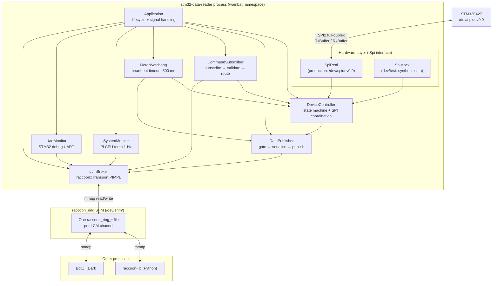
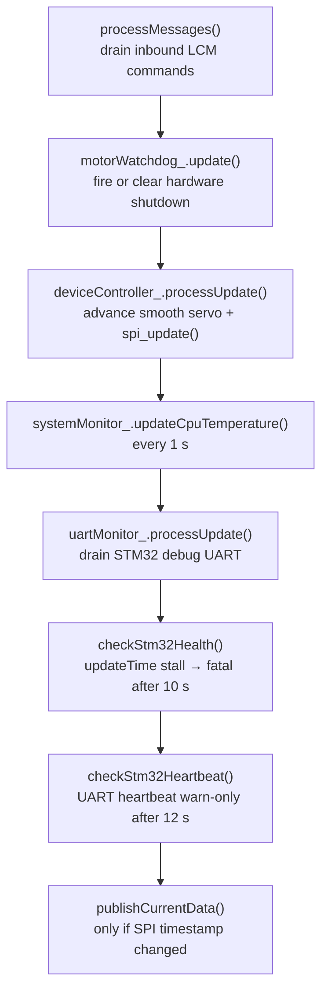
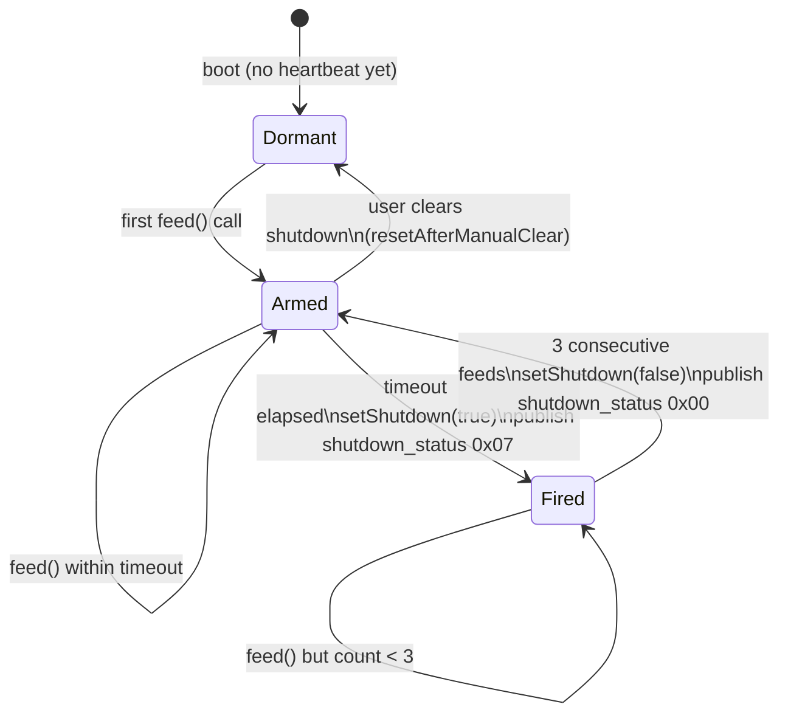
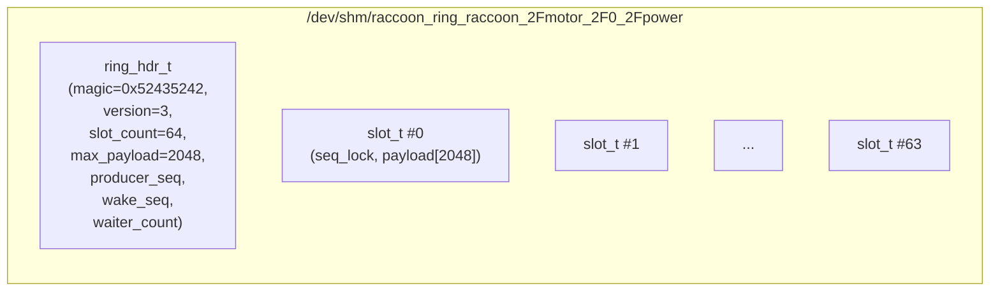
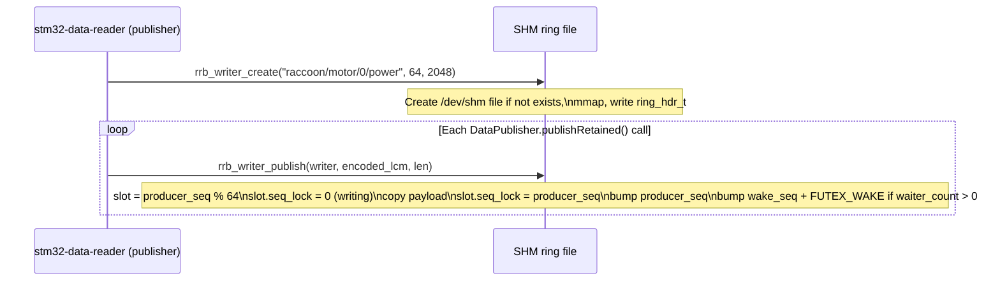
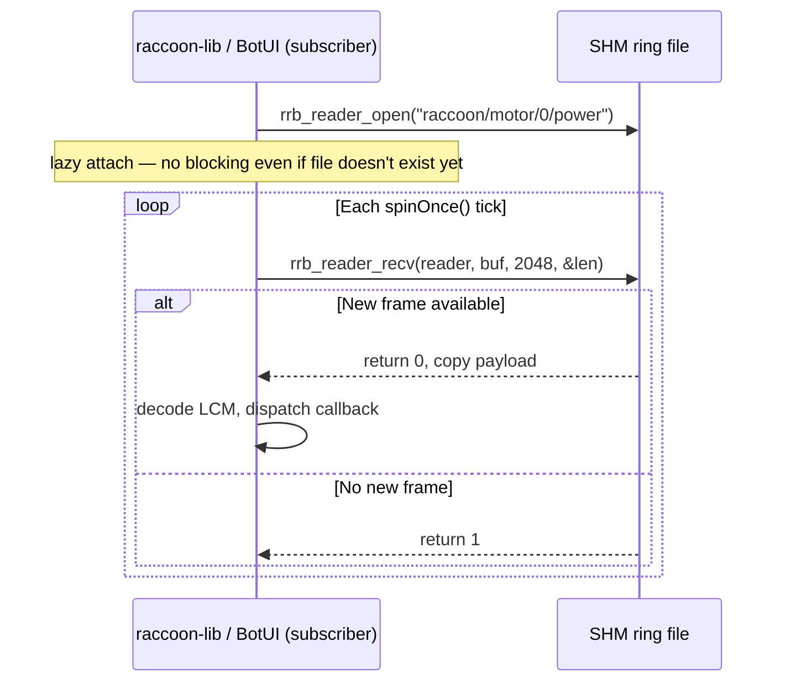

## Mental model

The `stm32-data-reader` is a C++20 daemon that lives entirely on the Raspberry Pi and acts as the translation layer between the STM32 coprocessor and the rest of the robot software stack. Think of it as a protocol gateway with three faces:

- **Toward the STM32:** speaks SPI binary protocol, translates packed C structs into typed C++ objects.
- **Toward user code and services:** speaks LCM publish/subscribe over `raccoon_ring` shared memory, presenting well-named `raccoon/*` channels.
- **Toward the system:** owns the hardware safety watchdog, resets the STM32 on startup, monitors health.

Understanding the bridge means understanding exactly what runs in one process, what the main loop does on each iteration, and how the hardware abstraction layer lets the same binary run against either real SPI hardware or a software simulator.



## Application lifecycle

`Application` (`src/wombat/Application.cpp`) is the root object. It owns all services as `shared_ptr` or `unique_ptr` members and coordinates their lifecycle in a fixed sequence.

### Initialization sequence

The `Application::initialize()` → `Application::initializeServices()` chain runs these steps in order:

1. **Logger** is created first so all subsequent steps can log.
2. **LcmBroker** is instantiated and connected to the logger so it can publish error messages to `raccoon/errors`.
3. **SPI hardware** (`SpiReal` or `SpiMock`) is constructed and wrapped in `DeviceController`.
4. **DataPublisher**, **CommandSubscriber**, **SystemMonitor**, and optionally **UartMonitor** are created.
5. **LcmBroker is initialized** — this opens the `raccoon::Transport` and connects to the SHM ring backend. Must complete before any publish or subscribe call.
6. **UartMonitor is initialized** (if enabled) before the STM32 reset so the Pi captures boot UART output.
7. **STM32 reset** is triggered via `spi_reset_stm32()` (calls a shell reset script and waits 1 s). The UART monitor then drains boot output for 2 s.
8. **DeviceController is initialized** — this calls `spi_->initialize()` which opens `/dev/spidev0.0` at 20 MHz and sets SPI mode, then initializes all motor and servo ports to safe defaults.
9. **Protocol version probe** — `spi_probe_version()` reads `TRANSFER_VERSION` (21) from the live STM32. A mismatch logs a warning and triggers automatic firmware reflash on the next SPI update.
10. **CommandSubscriber is initialized** — registers all LCM subscriptions (see below).
11. **Startup feature flags** — if `disableBemfOnStartup` is set in config, `FEATURE_BEMF_DISABLE` is written to `RxBuffer.featureFlags` immediately, enabling speed mode from the first SPI transfer.

### Main loop

`Application::run()` calls `processMainLoop()` every `mainLoopDelay` (default **5 ms**). Each iteration:



**Health checks:** `checkStm32Health()` watches the `updateTime` field in `TxBuffer`. If this 32-bit timestamp has not changed for more than 10 seconds, the bridge shuts down with a fatal error — this is the authoritative SPI liveness check. The UART heartbeat (`checkStm32Heartbeat()`) is diagnostic-only; it emits a warning after 12 s of silence but never kills the process, because the STM32 firmware intentionally disables UART TX interrupts for over 12 s while writing IMU calibration to flash.

**Publish deduplication:** `publishCurrentData()` compares `sensorData.lastUpdate` to `lastPublishedTimestamp_`. If the timestamp has not changed since the last loop, the entire publish block is skipped. This is distinct from the per-channel gate logic inside `DataPublisher`.

### Shutdown sequence

`Application::shutdown()` tears down in reverse initialization order: UartMonitor → CommandSubscriber → DeviceController → LcmBroker. DeviceController sets the firmware shutdown flag (`setShutdown(true)`) before closing the SPI file descriptor, so the STM32 cuts PWM output before the Pi loses the SPI link.

Signal handling registers `SIGINT` / `SIGTERM` handlers via a global `Application*` pointer that sets `shouldShutdown_`.

## SpiReal vs SpiMock

The bridge is built with a `ISpi` interface (`include/wombat/hardware/ISpi.h`) that both implementations satisfy:

```cpp
class ISpi {
    virtual Result<SensorData> readSensorData() = 0;
    virtual Result<void> setMotorState(PortId port, const MotorState& state) = 0;
    virtual Result<void> setChassisVelocity(float vx, float vy, float wz) = 0;
    // ... and so on for all actuation and telemetry
};
```

The concrete implementation is selected at compile time with `USE_SPI_MOCK`:

```bash
# Production (cross-compiled for the Pi)
./build.sh

# Host development (runs on any Linux x86_64 machine)
cmake .. -DUSE_SPI_MOCK=ON -DCMAKE_BUILD_TYPE=Debug
```

### SpiReal (`src/wombat/hardware/SpiReal.cpp`)

`SpiReal::initialize()` calls `spi_init(speedHz)` (defaults to **20 MHz**) and `set_spi_mode(true)`. The C layer opens `/dev/spidev0.0` with `ioctl(SPI_IOC_WR_*)` calls to configure speed, mode, and bits-per-word.

`SpiReal::readSensorData()` calls `spi_update()`, which performs a **synchronous `ioctl(SPI_IOC_MESSAGE)`** for one full-duplex transfer of `BUFFER_LENGTH_DUPLEX_COMMUNICATION` bytes. After return it reads `get_rx_buffer()` (a pointer to the Pi's local copy of `TxBuffer`) and unpacks every field into a `SensorData` C++ struct:

- **Battery voltage:** raw `int16_t` ADC count → volts via `count × 3.3 × 11 / 4096`, then 5% EMA filtered (`alpha = 0.05`).
- **Analog values:** copied as raw `int16_t` counts; no physical unit conversion in the SPI layer.
- **Motor telemetry:** `bemf[4]`, `position[4]`, and the `done` bitmask unpacked per motor.
- **Odometry:** `pos_x`, `pos_y`, `heading`, `vx`, `vy`, `wz` copied directly from `OdometryData`.
- **IMU:** all fields from `ImuData` (gyro, accel, compass, linearAccel, accelVelocity, dmpQuat, heading, temperature and per-sensor accuracy).

Write operations (motor modes, servo positions, PID gains, kinematics config, feature flags) call the corresponding C API (`set_motor_pwm`, `set_servo_pos`, `set_kinematics_config`, etc.) which update `RxBuffer` in Pi memory. The updated buffer is sent to the STM32 on the **next** `spi_update()` call.

### SpiMock (`src/wombat/hardware/SpiMock.cpp`)

`SpiMock` replaces the SPI hardware with a time-based signal generator. On each `readSensorData()` call it accumulates elapsed seconds and computes:

- **Gyro:** three-axis sinusoids at 0.2 Hz base frequency.
- **Accelerometer:** gentle tilt simulation plus 1.0 g on Z.
- **IMU heading:** 180° ± 90° sinusoidal sweep.
- **Battery:** slow linear drain from 12.3 V to 10.5 V, then reset (with 2 Hz ripple).
- **Analog:** per-port deterministic base value (800, 900, ... 1300 ADC counts) with sinusoidal wobble.
- **Digital:** rotating single-bit pattern across the 16-bit field.
- **Motor BEMF/position:** toy proportional model — BEMF = `target / 4`, position = `target`. All motors report `done = true`.

Motor and servo write calls update an internal `motors_[4]` / `servos_[4]` array with no SPI interaction, so the round-trip from command to feedback is instantaneous in mock mode.

**Why this matters for development:** Mock mode enables running the full bridge process (LcmBroker, DataPublisher, CommandSubscriber, MotorWatchdog, SystemMonitor) on any development laptop without any robot hardware. All `raccoon/*` LCM channels are published with synthetic but structurally valid data. Tools like BotUI, raccoon-lib, and integration tests can be exercised end-to-end.

## DeviceController

`DeviceController` (`src/wombat/services/DeviceController.cpp`) sits between the SPI hardware and the service layer. Its roles are:

1. **State caching:** maintains `motorStates_[MAX_MOTOR_PORTS]` and `servoCommands_[MAX_SERVO_PORTS]` so it can detect duplicate commands before touching SPI.
2. **Idempotent writes:** `setMotorState()` calls `hasSameCommand(state)` and skips the SPI call if the command is unchanged, preventing unnecessary SPI traffic.
3. **Smooth servo interpolation:** `startSmoothServo()` records a start angle, target angle, duration (= `|delta| / speed`), and easing type. Each `processUpdate()` call advances the trajectory and writes the interpolated position to SPI. `applyEasing()` supports five types: linear (0), ease-in (1), ease-out (2), smooth-step (3), cosine (4).
4. **Sensor data snapshot:** after `spi_->readSensorData()` completes, the result is stored in `lastSensorData_`. `getCurrentSensorData()` returns a copy of this snapshot without touching SPI.
5. **Chassis velocity:** `setChassisVelocity(vx, vy, wz)` first sets all four motors to `MotorControlMode::Chassis` (idempotently) then calls `spi_->setChassisVelocity()` to stage the body-frame setpoint in `RxBuffer.chassisVelocity`.

## DataPublisher

`DataPublisher` (`src/wombat/services/DataPublisher.cpp`) converts `SensorData` and `MotorState` structs into LCM messages and publishes them on named `raccoon/*` channels.

### Publish variants

`LcmBroker` exposes three publish variants, each with different delivery semantics:

| Broker method | Dedup? | Retained? | When used |
|---|---|---|---|
| `publish<T>()` | yes | no | Most sensor channels (gyro, accel, analog, digital, temperature) |
| `publishForce<T>()` | no | no | Accelerometer (every frame must go through) |
| `publishRetained<T>()` | yes | yes | Battery, motor state, servo state, odometry, feature flags |

**Deduplication** is byte-level: the transport compares the encoded LCM payload of the new message to the last published value for that channel. Command channels (names ending in `_cmd` or containing `/cmd/`) are always skipped by dedup regardless of the flag, because repeating the same command is semantically meaningful.

**Retained** means a late subscriber that calls `subscribeWithRetain` immediately receives the last published value from the ring without waiting for a new publish cycle. The ring implementation stores the latest frame in the slot at `producer_seq % slot_count` and `rrb_reader_seek_to_latest()` positions a new reader there directly.

### Rate gating

Most IMU channels are capped to **50 Hz** by a `PublishGate<T>` template. Each gate tracks `lastTime` and `lastValue`. A new sample passes the gate only if:

- At least `minInterval` (20 ms = 50 Hz) has elapsed since the last publish, AND
- The L-infinity distance (maximum absolute per-component difference) to `lastValue` exceeds `noiseEpsilon`.

Gate configuration from the constructor:

| Channel | `minInterval` | `noiseEpsilon` |
|---|---|---|
| Gyro | 20 ms | 0.01 rad/s |
| Magnetometer | 20 ms | 0.5 counts |
| Linear acceleration | 20 ms | 0.05 m/s² |
| Accel velocity | 20 ms | 0.05 m/s |
| DMP quaternion | 20 ms | 0.001 per-component |
| Heading | 20 ms | 0.05° |
| IMU temperature | 20 ms | 0.1°C |
| Odometry (all fields) | 20 ms | 0 (any change passes) |
| Accelerometer | **none** | **none** (publishForce) |

IMU accuracy channels (gyro, accel, compass, quaternion) use a change-detector instead of a gate: they are published only when the accuracy value differs from the previously published value.

### Per-channel publish summary

| Channel | Type | Gate | Retained |
|---|---|---|---|
| `raccoon/gyro/value` | `vector3f_t` | 50 Hz + 0.01 rad/s eps | no |
| `raccoon/accel/value` | `vector3f_t` | none (force) | no |
| `raccoon/linear_accel/value` | `vector3f_t` | 50 Hz + 0.05 m/s² eps | no |
| `raccoon/accel_velocity/value` | `vector3f_t` | 50 Hz + 0.05 m/s eps | no |
| `raccoon/mag/value` | `vector3f_t` | 50 Hz + 0.5 count eps | no |
| `raccoon/imu/quaternion` | `quaternion_t` | 50 Hz + 0.001 eps | no |
| `raccoon/imu/heading` | `scalar_f_t` | 50 Hz + 0.05° eps | yes |
| `raccoon/imu/temp/value` | `scalar_f_t` | 50 Hz + 0.1°C eps | no |
| `raccoon/gyro/accuracy` | `scalar_i8_t` | on-change only | no |
| `raccoon/accel/accuracy` | `scalar_i8_t` | on-change only | no |
| `raccoon/mag/accuracy` | `scalar_i8_t` | on-change only | no |
| `raccoon/imu/quaternion_accuracy` | `scalar_i8_t` | on-change only | no |
| `raccoon/battery/voltage` | `scalar_f_t` | dedup only (broker) | yes |
| `raccoon/analog/N/value` | `scalar_i32_t` | dedup only | no |
| `raccoon/digital/N/value` | `scalar_i32_t` | dedup only | no |
| `raccoon/bemf/N/value` | `scalar_i32_t` | dedup only | yes |
| `raccoon/motor/N/power` | `scalar_i32_t` | dedup only | yes |
| `raccoon/motor/N/position` | `scalar_i32_t` | dedup only | yes |
| `raccoon/motor/N/done` | `scalar_i32_t` | dedup only | yes |
| `raccoon/servo/N/mode` | `scalar_i8_t` | dedup only | yes |
| `raccoon/servo/N/position` | `scalar_f_t` | dedup only | yes |
| `raccoon/odometry/pos_x` | `scalar_f_t` | 50 Hz, no eps | yes |
| `raccoon/odometry/pos_y` | `scalar_f_t` | 50 Hz, no eps | yes |
| `raccoon/odometry/heading` | `scalar_f_t` | 50 Hz, no eps | yes |
| `raccoon/odometry/vx` | `scalar_f_t` | 50 Hz, no eps | yes |
| `raccoon/odometry/vy` | `scalar_f_t` | 50 Hz, no eps | yes |
| `raccoon/odometry/wz` | `scalar_f_t` | 50 Hz, no eps | yes |
| `raccoon/feature/bemf_enabled` | `scalar_i32_t` | dedup only | yes |
| `raccoon/system/shutdown_status` | `scalar_i32_t` | dedup only | yes |
| `raccoon/errors` | `string_t` | none (force) | no |
| `raccoon/cpu/temp/value` | `scalar_f_t` | 1 Hz (SystemMonitor) | no |

## CommandSubscriber

`CommandSubscriber` (`src/wombat/services/CommandSubscriber.cpp`) subscribes to all inbound command channels and routes each message to the appropriate `DeviceController` method.

### Subscription categories

**Continuous commands (best-effort delivery):** Motor power (`raccoon/motor/N/power_cmd`) and motor velocity (`raccoon/motor/N/velocity_cmd`) and chassis velocity (`raccoon/chassis/velocity_cmd`) are subscribed without reliable delivery. A dropped frame is acceptable because the user's control loop sends a fresh command on the next iteration. Queuing stale commands would be worse than dropping.

**Reliable commands:** Everything that changes discrete state — position targets, stop, mode changes, PID overrides, servo commands, odometry/position resets, kinematics config, shutdown, BEMF toggle — uses `SubscribeOptions{.reliable = true}`. The transport adds a sequence number envelope and retransmits until an ACK is received.

### Timestamp-based deduplication

Every handler calls `isTimestampNewer(channel, command.timestamp)` before acting. This check maintains a `latestTimestamps_` map from channel name to the last-applied timestamp. If the incoming timestamp is not strictly greater than the stored value, the message is silently dropped with a debug log. This prevents a late LCM delivery (possible with UDP out-of-order delivery) from re-applying a stale command after a newer one already took effect.

### Motor power mapping

`onMotorPowerCommand()` converts the Python API's percent range (−100 to +100) to the STM32's duty range (−400 to +400) with `duty = percent × 4`. Zero maps to zero — it means open-loop off, not velocity-PID hold.

### Relative position moves

`onMotorRelativeCommand()` is the only handler that reads state before writing. It calls `deviceController_->getMotorPosition(port)` to fetch the current BEMF tick counter, adds the commanded delta (encoded in `vector3f_t.y`), and issues an absolute MTP command. The speed limit is `vector3f_t.x`.

### BEMF enable/disable

`onBemfEnabledCommand()` calls `deviceController_->setBemfEnabled()`, which toggles the `FEATURE_BEMF_DISABLE` bit in `featureFlags_` and pushes the byte to `RxBuffer.featureFlags` via `spi_->setFeatureFlags()`. It then calls `dataPublisher_->publishBemfEnabled()` to post an ACK on the retained `raccoon/feature/bemf_enabled` channel so the UI and raccoon-lib see the confirmed state.

When BEMF is disabled, the MAV (velocity PID) mode is rejected with a `std::runtime_error` thrown inside the SPI guard. The Application's main loop catches this, logs the rejection, and forces all motors to OFF.

### Heartbeat

`onHeartbeatCommand()` calls `motorWatchdog_.feed()`. No validation or rate limiting — every heartbeat is forwarded directly.

## MotorWatchdog

`MotorWatchdog` (`src/wombat/services/MotorWatchdog.cpp`, `include/wombat/services/MotorWatchdog.h`) provides hardware-enforced motor safety independent of user code correctness.

**Concept:** raccoon-lib publishes a heartbeat message to `raccoon/system/heartbeat_cmd` (carrying the sender's PID as `scalar_i32_t.value`) while a mission is running. If heartbeats stop arriving — because the Python process hung, crashed, or exited — the watchdog fires a hardware shutdown within one timeout window.

**Parameters:**
- Timeout: **500 ms** (default, set in `MotorWatchdog` constructor)
- Recovery feeds required: **3** consecutive heartbeats, each arriving within the timeout window

**State machine:**



The watchdog is **dormant** until the first heartbeat arrives. This allows the robot to sit powered and idle (e.g. waiting for the start light) without triggering a spurious shutdown. Once armed, a 500 ms gap triggers the shutdown. Recovery requires exactly 3 consecutive heartbeats each within 500 ms of the previous; a gap during recovery resets the count.

On fire: `DeviceController::setShutdown(true)` is called, which sets `SHUTDOWN_MOTOR_FLAG | SHUTDOWN_SERVO_FLAG` in `RxBuffer.systemShutdown` and zeroes all motor and servo state. `DataPublisher::publishShutdownStatus(0x07)` broadcasts the bitmask (bit 0 = servo, bit 1 = motor, bit 2 = watchdog source) on the retained `raccoon/system/shutdown_status` channel.

A user clearing the shutdown via BotUI calls `commandSubscriber_->onShutdownCommand()` with `value=0`, which also calls `watchdog_.resetAfterManualClear()` so the watchdog drops back to Dormant and can re-arm on the next heartbeat.

## LcmBroker

`LcmBroker` (`src/wombat/messaging/LcmBroker.cpp`) is the publish/subscribe facade that wraps `raccoon::Transport`. It uses a PIMPL (`LcmBroker::Impl`) to hide the transport details from all callers.

### Message processing

`processMessages()` drains pending inbound messages by calling `transport_->spinOnce(1)` (1 ms spin slice, cheap atomic load per channel) in a tight loop until it returns 0 (no more messages). Each `spinOnce` advances reliability timers and dispatches any subscriber callbacks inline.

At every 100th call the broker logs a performance report: messages per call, loop rate (Hz), inbound latency statistics (min/avg/p99/max), publish deduplication count, and a per-channel handler timing breakdown (top-8 channels by message count, showing average and peak handler time plus share of total CPU).

### Latency alerting

If the p99 inbound latency exceeds **20 ms** (`kLatencyAlertThresholdUs = 20_000`), the broker logs an error and publishes the alert message to `raccoon/errors` via `publishForce`. Repeated alerts are rate-limited to every 10 occurrences.

### Per-subscription timing instrumentation

Every subscriber callback is wrapped in a lambda that records start and elapsed microseconds into a `ChannelTimingStats` struct keyed by channel name. This powers the per-channel performance report and is the source of the "share" percentage shown in the logs.

## raccoon_ring shared memory transport

All bridge ↔ client communication goes through `raccoon_ring`, a minimal single-producer multi-consumer shared memory ring buffer implemented in `raccoon-transport/cpp/include/raccoon/raccoon_ring.h`.

### Why raccoon_ring

The project previously used iceoryx2 for IPC. Under production load (the reader publishing on ~100 channels), new iceoryx2 nodes failed at `NodeBuilder::create()` and frame delivery became unreliable. raccoon_ring was written to replace it with a deliberately simple design that has no service daemon, no per-channel handshake, and no global state.

### Layout



Each channel maps to exactly one file under `/dev/shm/`. Forward slashes in the channel name are URL-encoded to `_2F` so the filename stays a flat file (no subdirectories). For example, `raccoon/motor/0/power` becomes `/dev/shm/raccoon_ring_raccoon_2Fmotor_2F0_2Fpower`.

Default sizing: **64 slots × 2 KiB payload** per channel, totalling ~130 KiB of SHM per channel. Large channels (screen render, camera frames) can be opened with a bigger `max_payload`.

### Write path (producer)



The SeqLock on each slot ensures readers detect in-progress writes: a slot is marked `seq = 0` (being written) then stamped with the sequence number after the copy. A reader that sees `seq = 0` after copying the payload knows it raced the producer and must retry or skip.

### Read path (subscriber)



For retained channels, `rrb_reader_seek_to_latest()` is called on new subscriptions. This positions the reader's cursor at `producer_seq % slot_count`, so the first `rrb_reader_recv()` immediately returns the most recent frame rather than waiting for the next publish.

### Event-driven receive

`rrb_reader_recv_wait_many()` parks a thread across multiple channels simultaneously using the kernel's `futex_waitv` syscall (Linux 5.16+). The Transport uses this in its `spinOnce()` path to avoid busy-polling: it sleeps until any producer publishes, or until an internal control word changes (used to wake the spin thread when subscriber lists change). This is how the bridge achieves ~1 ms p50 inbound command latency without burning CPU.

**Producer wake optimization:** The `waiter_count` field in the ring header is incremented by readers before parking and decremented on wake. The producer checks `waiter_count > 0` before issuing `FUTEX_WAKE`. At typical sensor publish rates (~200 Hz across telemetry channels), most publishes find zero parked waiters and skip the syscall entirely, cutting CPU overhead significantly.

### Producer restart transparency

When `stm32-data-reader` restarts, it calls `rrb_writer_create()` on the existing SHM files. The writer reinitializes the header (bumping `producer_seq` to start a new epoch) and continues writing. Existing reader processes detect the `producer_seq` reset and resync automatically — they see the new producer's frames without any reconnection or file deletion. This is why `stm32_data_reader.service` can be restarted without requiring BotUI or raccoon-lib to restart too.

### Namespace isolation

The service unit sets `PrivateTmp=false` explicitly. If this were omitted and another security option (like `ProtectSystem=strict` or `PrivateTmp=true`) created a mount namespace for the service, the `/dev/shm` files would be invisible to all other processes on the host. `PrivateTmp=false` ensures the ring files are in the global `/dev/shm/` visible to raccoon-lib, BotUI, and any diagnostic tool.

## Related pages

- [Data Pipeline](../data-pipeline/) — end-to-end latency from sensor to Python, including timing budget
- [SPI Communication Protocol](../spi-protocol/) — the `TxBuffer`/`RxBuffer` wire format (`TRANSFER_VERSION 21`)
- [Firmware Runtime and Scheduling](../firmware-runtime/) — the STM32 side of the SPI link: circular DMA, `HAL_SPI_TxRxCpltCallback`, `updateFlags` dispatch
- [Robot Services and systemd](../robot-services-and-systemd/) — how `stm32_data_reader.service` fits into the full service topology
- [Motor Control](../motor-control/) — what happens on the STM32 side after commands arrive
- [IMU Stack](../imu/) — how `ImuData` fields published on `raccoon/gyro/*`, `raccoon/imu/*` channels are produced
