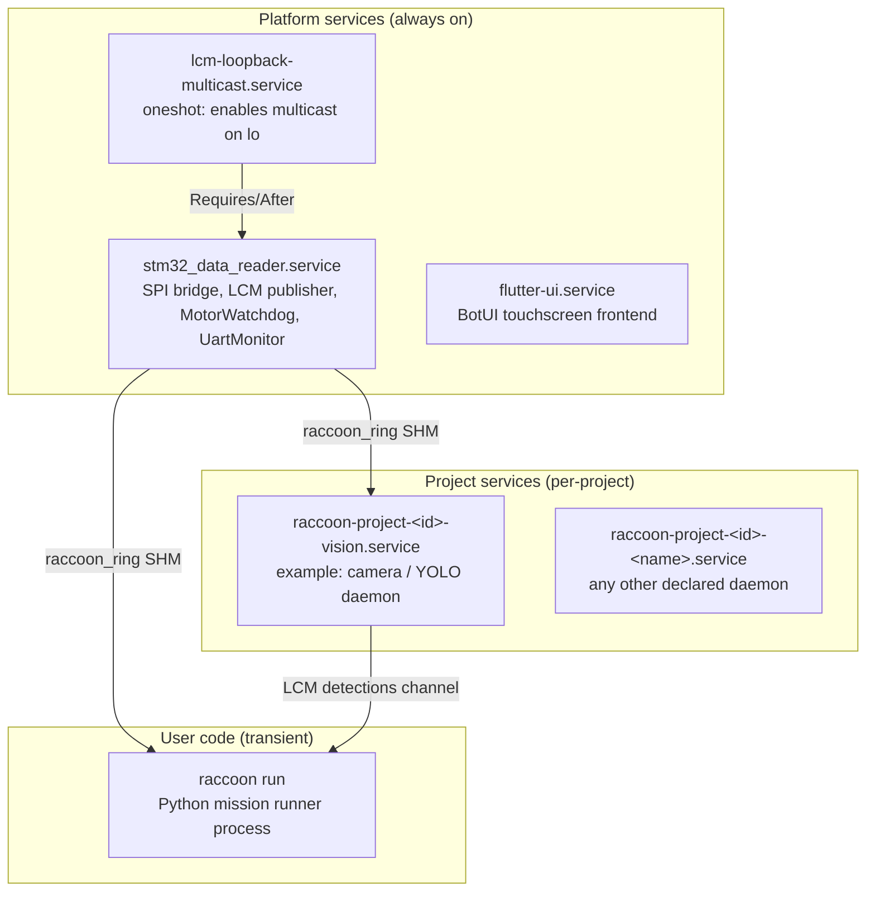

# Robot Services And systemd

## Concept

The robot is not just "your Python program." Several long-lived processes and systemd units exist underneath it, and understanding them is critical when debugging startup, sensors, or background daemons.

The service topology has three layers:



The platform services run regardless of what project is loaded. The `stm32_data_reader.service` is always-on infrastructure — it maintains the SHM ring files so that any process that subscribes to `raccoon/*` channels sees live sensor data without any setup. The MotorWatchdog runs inside this process, not in user code, so it cannot be accidentally omitted.

Project services are declared in `raccoon.project.yml` under `services:` and are deployed by the toolchain when you sync a project. The vision daemon in drumbot is a real example of this pattern: the camera daemon survives robot-program restarts, avoiding the multi-second warm-up cost of reopening `/dev/video0` on every run.

This page documents the units that are actually shipped in this repo and the service-layer components layered on top of them.

Sources of truth in the repository:

- `stm32-data-reader/systemd/stm32_data_reader.service`
- `stm32-data-reader/systemd/lcm-loopback-multicast.service`
- `botui/systemd/flutter-ui.service`
- `stm32-data-reader/include/wombat/services/MotorWatchdog.h`
- `stm32-data-reader/include/wombat/services/UartMonitor.h`
- `toolchain/raccoon_cli/project_services.py`

## The baseline service model

There are two kinds of services to think about:

- **Platform services** shipped as part of the robot software stack — they keep the hardware interface alive regardless of what user program is running.
- **Project-owned services** declared inside `raccoon.project.yml` — deployed by the toolchain for a specific project, e.g. a vision helper.

## `stm32_data_reader.service`

This is the Pi-side bridge process that talks to the STM32 over SPI and publishes/consumes runtime data over LCM.

Unit characteristics:

- runs as user `pi`, group `pi`
- working directory `/home/pi/stm32_data_reader`
- executable `/home/pi/stm32_data_reader/stm32_data_reader`
- restart policy `always`
- restart delay `5s`
- explicitly requires `lcm-loopback-multicast.service`

Why it matters:

- if this unit is not healthy, motor, sensor, and firmware-facing runtime behaviour is broken
- many "robot is alive but hardware is dead" failures reduce to this service not running

### Why `PrivateTmp=false` is explicitly set

This unit disables `PrivateTmp` — and also explicitly avoids `ProtectSystem=` and `ProtectHome=` — on purpose.

The reason, as documented in the unit file comment, is the `raccoon_ring` shared-memory transport. The `raccoon::Transport` library creates one `/dev/shm/raccoon_ring_<channel>` file per LCM channel. Any systemd sandboxing option that builds a private mount namespace (including `PrivateTmp=true`, `ProtectSystem=`, or `ProtectHome=`) causes systemd to create an `MS_SLAVE` bind mount over `/dev/shm` for that service. Any `/dev/shm/raccoon_ring_*` files the reader creates under that namespace are then invisible to every other process on the host. Python code calling `libstp.probe()` sees an empty `/dev/shm` and times out waiting for IMU heading, BEMF, and battery data.

Additionally, after a watchdog-triggered reader restart, writing a fresh ring file to the old inode is safe — subscribers detect the `producer_seq` reset and resync automatically. Wiping the `/dev/shm/raccoon_ring_*` files before restart (as an earlier version of this unit did) kills every subscriber that has the file `mmap`'d, because the new file is a different inode the old subscriber can never see.

**Do not add `PrivateTmp=true` or any mount-namespace sandboxing to this unit.**

> **Historical note:** An earlier version of this doc stated that `PrivateTmp=false` was needed for iceoryx2 service discovery at `/tmp/iceoryx2/`. That is stale — iceoryx2 was replaced by the `raccoon_ring` SHM library. The actual reason is the `/dev/shm` visibility requirement described above.

### STM32 health check

The reader monitors the `txBuffer.updateTime` field from the STM32. If this timestamp does not change for more than 10 seconds, the reader logs a fatal error and terminates (systemd then restarts it with the 5 s delay). This is the authoritative liveness signal — not the UART heartbeat.

### Runtime flags and log level

The reader accepts one CLI flag:

```bash
stm32_data_reader --version   # print version and exit
```

The log level can be overridden at runtime via an environment variable without recompiling or editing the unit file:

```bash
# Override in a shell (development / SSH debugging):
WOMBAT_LOG_LEVEL=debug /home/pi/stm32_data_reader/stm32_data_reader
```

Valid values: `debug`, `info`, `warn` (or `warning`), `error` (or `err`). The environment variable is read once at startup before any service initialisation.

To set the level persistently, add an `Environment=` line to the unit's override file:

```ini
# /etc/systemd/system/stm32_data_reader.service.d/override.conf
[Service]
Environment=WOMBAT_LOG_LEVEL=debug
```

Then run `sudo systemctl daemon-reload && sudo systemctl restart stm32_data_reader.service`.

## `lcm-loopback-multicast.service`

This is a `oneshot` networking helper that makes LCM multicast work on the loopback interface.

It does two things:

1. Enables multicast on `lo`
2. Installs a route for `224.0.0.0/4` via `lo`

Why it matters:

- `stm32_data_reader.service` explicitly requires it (via `Requires=` and `After=`)
- local publish/subscribe behaviour fails in non-obvious ways if this loopback multicast setup is missing

If transport appears broken locally on the robot, check this unit ran before investigating application code:

```bash
systemctl status lcm-loopback-multicast.service
```

## `flutter-ui.service`

This is the BotUI / touchscreen frontend unit.

Unit characteristics:

- starts `flutter-pi` with the built app from `/home/pi/stp-velox/`
- restart policy `always`
- restart delay `2s`
- logs to journald (`StandardOutput=journal`, `StandardError=journal`)

Why it matters:

- a dead UI does not necessarily imply a dead robot runtime
- UI packaging and deployment are their own operational surface
- UI failure mode is typically a crash in `flutter-pi` or a missing/corrupt app bundle, not an STM32 issue

## MotorWatchdog (Pi-side safety service)

The `MotorWatchdog` is a safety-critical component embedded inside the `stm32_data_reader` process. It is not a separate systemd unit — it runs on every main loop tick of the reader.

### Purpose

Python code running a mission must send a heartbeat message on the `raccoon/system/heartbeat_cmd` LCM channel at least every **500 ms** while the mission is active. If no heartbeat arrives within that window, the watchdog fires: it calls `DeviceController::setShutdown(true)`, which sets the firmware-level hardware shutdown flag via SPI. All motors and servos stop immediately, even if the Python process is hanging or in an infinite loop.

### Why it exists

Without a watchdog, a crashed or stuck user program leaves motors running at their last commanded speed. The watchdog provides an automatic hardware kill that does not depend on the user program cleaning up correctly.

### Behaviour details

The watchdog is **dormant** until the first heartbeat is received. This allows the robot to boot and sit at the start line (waiting for a light signal) without triggering a shutdown. Once armed:

- If heartbeat gap > 500 ms → fires: sets hardware shutdown, publishes `SHUTDOWN_STATUS` bitmask `0x07` (servo shutdown + motor shutdown + watchdog source) to the LCM `raccoon/shutdown/status` channel.
- While fired, counts recovery heartbeats. Three consecutive on-time heartbeats (each within the 500 ms timeout) clear the shutdown and re-arm the watchdog. A single late heartbeat during recovery resets the counter.

The `SHUTDOWN_STATUS` bitmask format:

| Bit | Mask | Meaning |
|---|---|---|
| 0 | `0x01` | Servo shutdown active |
| 1 | `0x02` | Motor shutdown active |
| 2 | `0x04` | Source = watchdog (vs. user-initiated shutdown) |

The BotUI subscribes to `raccoon/shutdown/status` and displays the shutdown reason so operators can see whether the robot stopped due to a watchdog or a deliberate stop command.

### Sending heartbeats from Python

```python
from raccoon_transport import Transport
from raccoon_transport.channels import Channels
from raccoon_transport.types.raccoon import scalar_i32_t
import time

transport = Transport()
hb = scalar_i32_t()
hb.value = 1

while mission_running:
    transport.publish(Channels.HEARTBEAT_CMD, hb)
    # ... do mission work ...
    time.sleep(0.1)  # heartbeat every 100 ms; watchdog fires at 500 ms
```

Send heartbeats from whatever loop drives your mission. The raccoon-lib runtime wrapper handles this automatically for programs run via `raccoon run` — manual heartbeating is only necessary if you are driving the transport layer directly.

### Manual watchdog clear

The UI can manually clear a watchdog-triggered shutdown (e.g., after the user acknowledges the stop reason). This calls `MotorWatchdog::resetAfterManualClear()`, which drops the watchdog back to dormant state. The watchdog re-arms automatically on the next heartbeat.

## UartMonitor (STM32 debug output)

The `UartMonitor` is another component that runs inside the `stm32_data_reader` process. It opens `/dev/ttyAMA0` at 115200 baud (8N1, non-blocking) and tails UART3 output from the STM32 firmware.

### What it does

Every line the STM32 prints over UART3 is routed to the Pi-side logger:

- Lines containing `[ERROR]`, `Error`, or `FAULT` are logged at **error** level, which publishes them to the `raccoon/errors` LCM channel.
- Lines containing `[WARN]` are logged at **warn** level.
- All other lines (including `[stp] hb #N` heartbeat lines) are logged at **info** level.

This means STM32 errors appear in the robot application log and in the BotUI error feed without any extra tooling.

### UART heartbeat vs. SPI liveness

The STM32 prints a `[stp] hb #N` marker every 5 seconds. The `UartMonitor` records the timestamp of each heartbeat. If the UART heartbeat stops, the reader emits a **warning** but never terminates.

This is intentional. The STM32 goes silent on UART for more than 12 seconds when `cal_save_to_flash()` is called (even though flash writes are currently no-ops, the comment remains accurate for any future reinstatement). During that window the SPI DMA transfers continue normally — the authoritative liveness signal is `txBuffer.updateTime` checked by `checkStm32Health()`, not the UART heartbeat.

### Enabling or disabling

UART monitoring is enabled by default (`uart.enabled = true` in `wombat::Configuration`). To disable it (e.g., if `/dev/ttyAMA0` is used for another purpose), set `uart.enabled = false` in the reader configuration. The `UartMonitor` degrades gracefully: if the device cannot be opened, it logs a warning and continues with `isOpen_ = false`.

### Configuration

| Field | Default | Description |
|---|---|---|
| `uart.devicePath` | `/dev/ttyAMA0` | Serial device node |
| `uart.baudRate` | `115200` | Baud rate (must match STM32 UART3 config) |
| `uart.enabled` | `true` | Whether to open the device at all |

## Project-owned services

Projects can declare their own daemons in `raccoon.project.yml` under `services:`. The following is a complete real example adapted from the drumbot competition project, which runs a long-lived camera/YOLO daemon as a project service:

```yaml
# config/services.yml (drumbot, adapted)
vision:
  module: src.daemons.vision     # Python module to run as daemon
  restart: always                 # always restart on crash
  restart_sec: 1                  # wait 1 s before restart
  after_sync: restart_if_changed  # only restart when watched files changed
  required_for_run: true          # abort 'raccoon run' if this daemon fails
  watch:
    - src/daemons/vision.py
    - src/hardware/usb_camera.py
    - src/service/color_detection_service.py
```

The key design: the daemon owns the camera (`/dev/video0`). The robot mission program is a thin client that subscribes to the daemon's LCM detection channel. Restarting the robot program does not tear down the camera and does not cause the multi-second warm-up required to re-initialize the sensor. Use this pattern for any hardware that has a significant startup cost or that must not be exclusively opened twice.

### `watch:` and `after_sync` interaction

The `watch:` field and `after_sync: restart_if_changed` work together:

- Without `watch:`: the toolchain hashes the entire project. Any file sync may trigger a restart.
- With `watch: [file1, file2]`: the toolchain hashes only those listed files. The daemon only restarts if one of those files changed since the last sync.

This is essential for a camera daemon. Without `watch:`, every `raccoon run` (which syncs Python mission files) would restart the camera, blowing the warm-up budget.

### `required_for_run`

When `required_for_run: true`, the toolchain checks that the service is healthy before allowing `raccoon run` to proceed. If the daemon crashed or failed to start, the run is aborted with an error. Do not ignore `required_for_run` failures — they mean a dependency your missions need is not ready.

Important schema rules enforced by the current implementation:

- service names must match `[a-zA-Z0-9][a-zA-Z0-9_-]{0,63}`
- each service must define exactly one of `module` or `command`
- `env` must be a mapping
- `watch` must be a string or list of strings

## How project services are deployed

For each declared service, the toolchain:

1. Normalizes the config into a `ProjectService`
2. Renders a systemd unit
3. Computes a content digest
4. Compares that digest against the previous deployment
5. Decides whether to start, restart, or leave the service alone

The generated systemd unit:

- runs under the project path as `WorkingDirectory`
- defaults to `User=pi`
- sets `PYTHONUNBUFFERED=1`
- logs to journald
- uses a service name like `raccoon-project-<project-id>-<service>.service`

## `after_sync` behaviour

| Value | Effect |
|---|---|
| `restart` | Always restart after sync |
| `restart_if_changed` | Restart only if the rendered unit or watched files changed |
| `leave_running` | Do not restart automatically after sync |

If `watch` is omitted, the toolchain uses the whole project fingerprint. Any synced project change can trigger a restart.

## `required_for_run`

Setting `required_for_run: true` marks a service as part of the runnable project. If such a service is unhealthy, the project is not in a healthy run state. Do not treat a required service crash as "just a background daemon issue."

## CLI visibility into project services

```bash
raccoon logs services
raccoon logs services show <service-name>
```

The service list includes: active state, sub-state, main PID, restart count, activation timestamp, and whether the service is required for run.

## LCM transport from project services: `get_transport()`

Project daemons and `RobotService` subclasses that need to publish or subscribe to LCM channels should use `get_transport()` from the `raccoon` package — not the low-level `raccoon_transport.Transport` class directly.

```python
from raccoon import RobotService, get_transport

class ColorDetectionService(RobotService):
    def start_camera(self):
        # get_transport() returns the shared transport singleton.
        # Do not construct a new Transport() — that creates a second connection.
        self._transport = get_transport()
        self._transport.subscribe("raccoon/cam/detections", self._on_detections)
        self._transport.subscribe("raccoon/cam/status", self._on_status)
```

`get_transport()` is exported directly from `raccoon` (confirmed: `raccoon/__init__.py` line 114). Using it ensures the daemon and the mission runner share the same transport instance and the same raccoon_ring SHM files. Constructing a separate `Transport()` object can create duplicate subscriptions and ring-file conflicts.

This is how the drumbot vision daemon and its `ColorDetectionService` client communicate across the process boundary: the daemon publishes detections; `ColorDetectionService` subscribes in the same robot process that runs missions.

## Practical debugging workflow

When a subsystem looks dead, narrow it by layer:

| Symptom | Check |
|---|---|
| Motors / sensors dead | `systemctl status stm32_data_reader.service` |
| Local transport broken | `systemctl status lcm-loopback-multicast.service` |
| UI missing but runtime alive | `systemctl status flutter-ui.service` |
| Robot stopped unexpectedly mid-run | Check `raccoon/shutdown/status` channel — was it the MotorWatchdog? |
| STM32 errors in application log | Comes from UartMonitor via UART3 — check STM32 firmware state |
| Project daemon broken | `raccoon logs services show <service-name>` |

## Why this architecture exists

The engineering shape here is deliberate:

- Hard realtime stays on the STM32.
- The Pi-side bridge (`stm32_data_reader`) is always-on infrastructure — it restarts automatically and maintains the SHM ring files so subscribers never lose their channel connections.
- Safety (MotorWatchdog) is baked into the bridge process rather than user code, so it cannot be accidentally omitted.
- Debug output (UartMonitor) is forwarded automatically — developers never need to attach a serial terminal for routine operation.
- Project daemons are first-class deployable services instead of ad-hoc shell hacks.

That separation makes the platform debuggable. A robot can fail partially instead of failing as one giant opaque process.

## Related pages

- [Data Pipeline](../data-pipeline/) — how `stm32_data_reader.service` fits into the sensor data path
- [Build and Flash](../build-flash/) — how to build and deploy the `stm32-data-reader` binary
- [Architecture Overview](../architecture/) — the full responsibility split between STM32 and Pi
