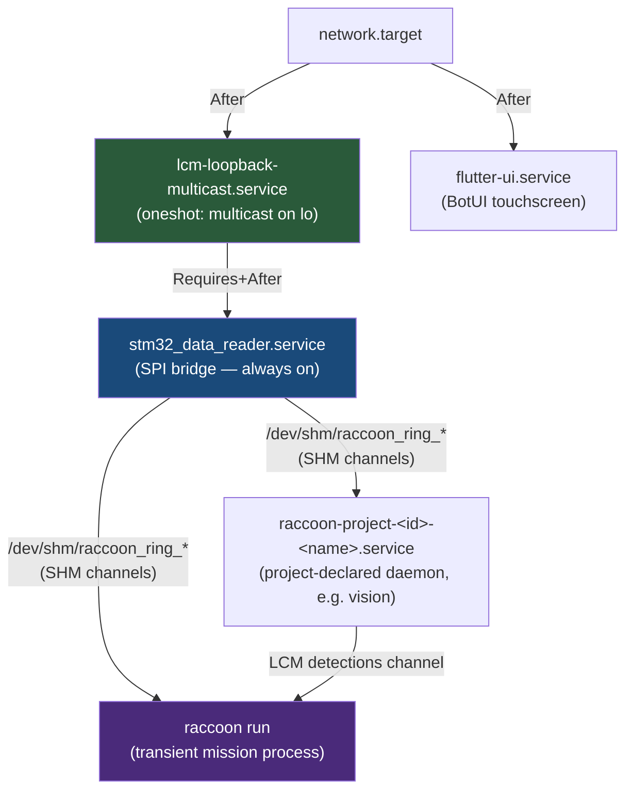
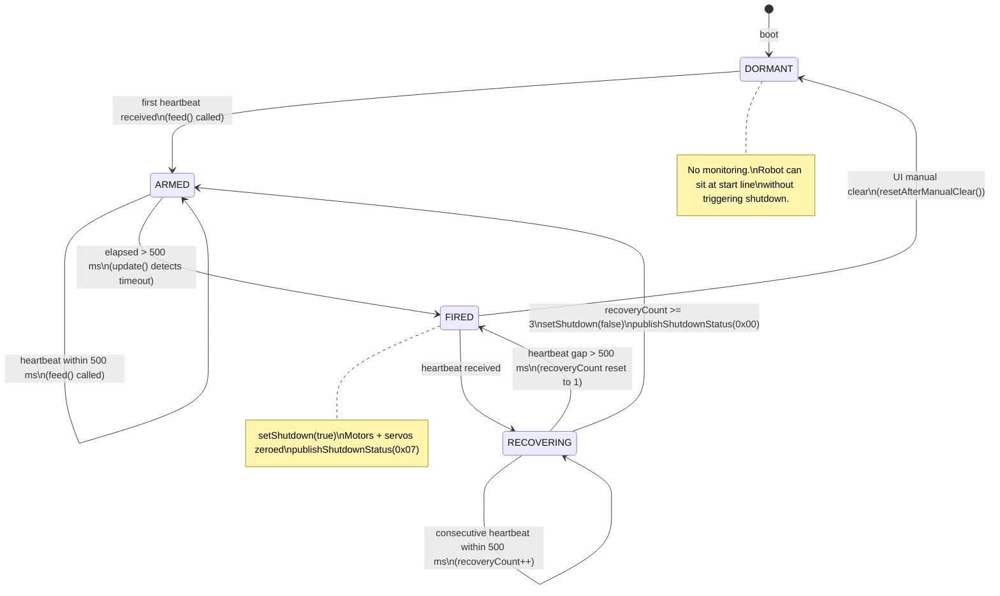
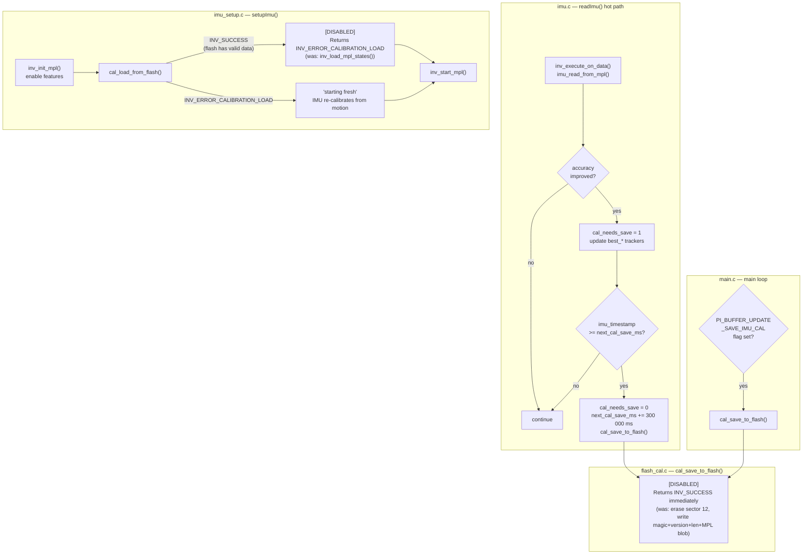
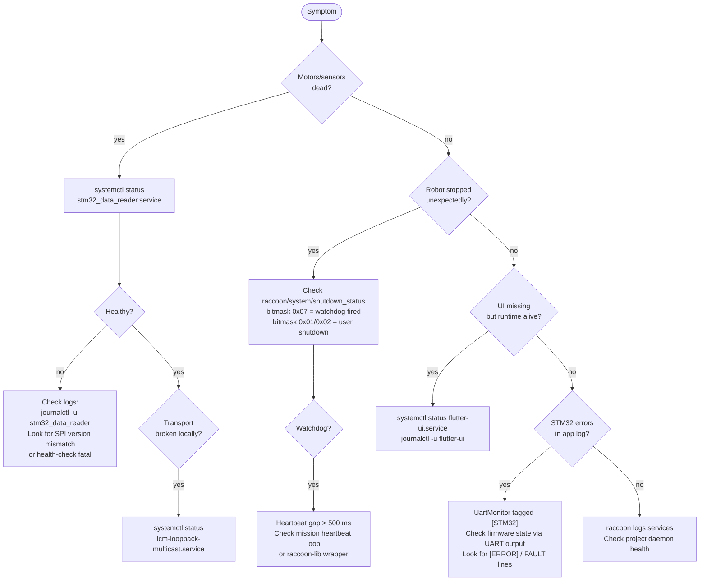

# Robot Services And systemd

## Mental model: what is actually running on the robot

The robot is not just "your Python program." Several long-lived processes and systemd units exist underneath it. Understanding their topology is essential when debugging startup, sensor failures, or unexpected motor stops.

The service layer has three tiers. Platform services (always on, independent of project) sit at the bottom. Project-owned services are deployed per-project by the toolchain. User code — the mission runner — is the transient top layer.



**Key insight:** `stm32_data_reader` is always-on infrastructure, not part of user code. It holds the SPI connection to the STM32, publishes all sensor data, and runs the MotorWatchdog and UartMonitor internally. If it is not healthy, hardware is dead. Many "robot is alive but motors/sensors are dead" failures reduce to this single unit.

Sources of truth in the repository:

- `stm32-data-reader/systemd/stm32_data_reader.service`
- `stm32-data-reader/systemd/lcm-loopback-multicast.service`
- `botui/systemd/flutter-ui.service`
- `stm32-data-reader/src/wombat/Application.cpp`
- `stm32-data-reader/include/wombat/services/MotorWatchdog.h`
- `stm32-data-reader/include/wombat/services/SystemMonitor.h`
- `stm32-data-reader/include/wombat/services/UartMonitor.h`
- `stm32-data-reader/firmware/Firmware/src/Storage/flash_cal.c`
- `stm32-data-reader/firmware/Firmware/include/Storage/flash_cal.h`

---

## `lcm-loopback-multicast.service`

This is a `oneshot` networking helper. It runs once at boot and stays "active" via `RemainAfterExit=yes`. The unit executes exactly two commands:

```ini
ExecStart=/sbin/ip link set lo multicast on
ExecStart=/sbin/ip route replace 224.0.0.0/4 dev lo
```

LCM uses multicast UDP. Without the route `224.0.0.0/4 via lo`, local publish/subscribe fails in non-obvious ways — messages appear to send, but no subscriber receives them. `stm32_data_reader.service` declares `Requires=lcm-loopback-multicast.service` and `After=lcm-loopback-multicast.service`, so systemd guarantees the route exists before the reader starts.

The unit declares `After=network.target` but has no ordering relationship with `flutter-ui.service`.

```bash
# Verify it ran successfully:
systemctl status lcm-loopback-multicast.service
```

If this unit is in a failed state, fix it before investigating any application-level transport issues.

---

## `stm32_data_reader.service`

### What it is

This is the Pi-side bridge process. It owns the SPI connection to the STM32 and is the single publisher of all hardware state to the LCM transport ring. Every Python mission process, the BotUI, and all project daemons consume data it puts on `/dev/shm/raccoon_ring_*` files.

### Unit characteristics

| Property | Value |
|---|---|
| `User` / `Group` | `pi` / `pi` |
| `WorkingDirectory` | `/home/pi/stm32_data_reader` |
| `ExecStart` | `/home/pi/stm32_data_reader/stm32_data_reader` |
| `Restart` | `always` |
| `RestartSec` | `5` (seconds) |
| `Requires` + `After` | `lcm-loopback-multicast.service` |
| `NoNewPrivileges` | `true` |
| `PrivateTmp` | `false` (explicit — see below) |
| `ProtectSystem` | not set |
| `ProtectHome` | not set |

### The raccoon_ring SHM constraint: why `PrivateTmp=false` is mandatory

`raccoon::Transport` creates one `/dev/shm/raccoon_ring_<channel>` file per LCM channel. All inter-process communication on the robot goes through these shared-memory ring files: the reader writes, the BotUI and Python mission read.

Any systemd sandboxing directive that builds a private mount namespace — including `PrivateTmp=true`, `ProtectSystem=`, or `ProtectHome=` — causes systemd to create an `MS_SLAVE` bind mount over `/dev/shm` for the service. The ring files the reader creates under that namespace are then invisible to every other process on the host. From the perspective of a Python mission, the `/dev/shm` directory is empty and `raccoon_transport` channel subscriptions time out waiting for IMU heading, BEMF, and battery data.

Additionally, wiping the `/dev/shm/raccoon_ring_*` files before a watchdog-triggered restart (as an earlier version of this unit did) kills every subscriber that has the file `mmap`'d. The new file after restart has a different inode; the old subscriber's `mmap` becomes an unreachable anonymous region it can never recover from. The current unit does not wipe those files — a restarted reader calls `rrb_writer_create`, which reinitialises the existing header in the same inode, and subscribers detect the `producer_seq` reset and resync automatically.

> **Do not add `PrivateTmp=true`, `ProtectSystem=`, or `ProtectHome=` to this unit.**
>
> This was verified on 2026-06-02: dropping `ProtectSystem+ProtectHome` turned a 100 % probe-fail rate to a working Pi within 0.1 s.

### STM32 health check (the authoritative liveness signal)

The reader checks `txBuffer.updateTime` on every main loop tick (`Application::checkStm32Health()`). If this timestamp has not changed for more than **10 seconds**, the reader logs a fatal error and sets `shouldShutdown_ = true`, which exits the main loop and causes systemd to restart it after the 5 s delay.

```
STM32 health check failed: updateTime has not changed for >10s — shutting down
```

This is the primary liveness signal. The UART heartbeat is secondary and warn-only (see UartMonitor section).

### Startup sequence

The application initialises services in a specific order to capture early boot output and verify protocol compatibility:

1. Logger, LCM broker, SPI abstraction, DeviceController, DataPublisher, SystemMonitor, CommandSubscriber
2. UartMonitor initialised before STM32 reset so UART boot output is captured
3. `spi_reset_stm32()` — triggers hardware reset, sleeps 1 s
4. `uartMonitor_->drainFor(2000 ms)` — captures IMU self-test and `[IMU] step:` boot log
5. DeviceController initialises (opens SPI fd)
6. `spi_probe_version()` — reads `transferVersion` from STM32; must equal `TRANSFER_VERSION 21`; mismatch logs a warning and triggers firmware reflash on the next `deploy.sh`
7. CommandSubscriber subscribes to all LCM command channels

### Runtime log level override

```bash
# One-shot override in the shell:
WOMBAT_LOG_LEVEL=debug /home/pi/stm32_data_reader/stm32_data_reader

# Persistent override via drop-in:
# /etc/systemd/system/stm32_data_reader.service.d/override.conf
[Service]
Environment=WOMBAT_LOG_LEVEL=debug
```

Valid values: `debug`, `info`, `warn` (or `warning`), `error` (or `err`). Reload and restart after editing the drop-in:

```bash
sudo systemctl daemon-reload && sudo systemctl restart stm32_data_reader.service
```

---

## MotorWatchdog (Pi-side hardware safety)

### Why it exists

Without a watchdog, a crashed or hung Python process leaves motors running at their last commanded speed indefinitely. The MotorWatchdog provides an automatic hardware kill that does not depend on the user program cleaning up correctly. It runs inside `stm32_data_reader`, not in user code, so it cannot be accidentally omitted or disabled by a mission programmer.

### Architecture

`MotorWatchdog` is a member of `Application` (not a separate thread or process). Its `update()` method is called on every main loop tick. `CommandSubscriber` calls `feed()` whenever it receives a heartbeat message on `raccoon/system/heartbeat_cmd`.

```
Python mission (raccoon-lib)
  └─ publishes heartbeat_cmd every ~100 ms
       └─ CommandSubscriber::onHeartbeat()
            └─ MotorWatchdog::feed()

Application main loop (every tick)
  └─ MotorWatchdog::update(controller, publisher)
       ├─ if elapsed > 500 ms → fire: setShutdown(true)
       └─ if 3 consecutive feeds within 500 ms → clear: setShutdown(false)
```

### State machine



### Configuration (source-verified)

| Parameter | Default | Description |
|---|---|---|
| `timeout_` | `500 ms` | Maximum allowed gap between heartbeats |
| `recoverFeeds_` | `3` | Consecutive on-time heartbeats required to clear shutdown |

Both are constructor parameters of `MotorWatchdog(Duration timeout, int recoverFeeds)`. They are not runtime-configurable — changing them requires a recompile.

### What "fired" means at the hardware level

When `fired_` transitions from `false` to `true`, `update()` calls:

1. `DeviceController::setShutdown(true)` — this in turn:
   - Sets all four `motorStates_[port]` to `MotorState{}` (zeroed) and pushes them to the SPI buffer
   - Sets all four servo commands to 0 and mode to `ServoMode::Disabled`
   - Writes `rxBuffer.systemShutdown = SHUTDOWN_SERVO | SHUTDOWN_MOTOR` via SPI
2. `DataPublisher::publishShutdownStatus(0x07)` — publishes the bitmask to `raccoon/system/shutdown_status`

### SHUTDOWN_STATUS bitmask

| Bit | Mask | Meaning |
|---|---|---|
| 0 | `0x01` | Servo shutdown active |
| 1 | `0x02` | Motor shutdown active |
| 2 | `0x04` | Source = watchdog (vs. user-initiated `shutdown_cmd`) |

`0x07` = all three bits set = watchdog fired. `0x00` = shutdown cleared.

The BotUI subscribes to `raccoon/system/shutdown_status` and displays the shutdown reason so operators can distinguish a watchdog stop from a deliberate stop command.

### Sending heartbeats from Python

Python missions using `raccoon run` get heartbeating automatically via raccoon-lib. If you are driving the transport layer directly:

```python
from raccoon_transport import Transport
from raccoon_transport.channels import Channels
from raccoon_transport.types.raccoon import scalar_i32_t
import time

transport = Transport()
hb = scalar_i32_t()
hb.value = 1

while mission_running:
    transport.publish(Channels.HEARTBEAT_CMD, hb)
    # ... mission work ...
    time.sleep(0.1)  # 100 ms cadence; watchdog fires at 500 ms
```

### Manual watchdog clear

The BotUI calls `MotorWatchdog::resetAfterManualClear()` when the operator acknowledges the shutdown. This sets `fired_ = false`, `recoveryCount_ = 0`, and also sets `armed_ = false` — returning the watchdog to the dormant state. It will re-arm automatically on the next heartbeat from the next mission run.

---

## SystemMonitor (Pi CPU temperature)

### What it does

`SystemMonitor` reads the Raspberry Pi's CPU temperature from the Linux thermal subsystem and publishes it to the `raccoon/cpu/temp/value` LCM channel. It does not monitor RAM, load average, or any other metric — only CPU temperature.

### Implementation

`SystemMonitor::updateCpuTemperature()` is called on every main loop tick with a `publishInterval` argument of `1000 ms`. The method rate-limits itself using `lastCpuTempPublishTime_` and only reads the sensor when the interval has elapsed.

Temperature is read from `/sys/class/thermal/thermal_zone0/temp`, which returns an integer in millidegrees Celsius (e.g., `52000` = 52.0 °C). The monitor divides by 1000 and validates the range `[-40.0, +125.0]` °C before publishing. Values outside that range are treated as read errors.

```
/sys/class/thermal/thermal_zone0/temp
   → raw integer (millidegrees)
   ÷ 1000
   → float °C
   → broker_->publish(Channels::CPU_TEMPERATURE, scalar_f_t{temp})
```

### Failure handling

If the thermal file cannot be opened or the value is out of range, `updateCpuTemperature()` returns a `Result::failure`. The Application logs the failure at `debug` level and continues — a missing thermal sensor is not fatal.

### Subscribing to CPU temperature

```python
from raccoon_transport import Transport
from raccoon_transport.channels import Channels
from raccoon_transport.types.raccoon import scalar_f_t

transport = Transport()

def on_cpu_temp(channel, data):
    msg = scalar_f_t.decode(data)
    print(f"Pi CPU: {msg.value:.1f} °C")

transport.subscribe(Channels.CPU_TEMPERATURE, on_cpu_temp)
```

The channel name is `raccoon/cpu/temp/value` (from `raccoon::Channels::CPU_TEMPERATURE`).

---

## UartMonitor (STM32 debug output forwarding)

### What it is

`UartMonitor` opens `/dev/ttyAMA0` in read-only, non-blocking raw mode and tails the STM32's UART3 debug output during the main loop. Every line the STM32 prints becomes a Pi-side log entry tagged `[STM32]`. Error lines additionally reach the `raccoon/errors` LCM channel (via the logger's LCM broker sink), which means STM32 faults appear in the BotUI error feed without any extra tooling.

### Initialization details

The monitor opens the device with `O_RDONLY | O_NOCTTY | O_NONBLOCK`, configures it for **8N1** at **115200 baud** using termios raw mode (`cfmakeraw`), sets `VMIN=0 / VTIME=0` (non-blocking), and flushes stale data with `tcflush(TCIFLUSH)` before use.

Internal buffers:
- `READ_BUFFER_SIZE = 256` bytes per `read()` call
- `MAX_LINE_BUFFER = 4096` bytes line accumulator (cleared on overflow with a warning)

If the device cannot be opened, the monitor logs a warning and sets `isOpen_ = false`. All subsequent `processUpdate()` calls return immediately — the service degrades gracefully.

### Log level routing

```cpp
// UartMonitor::processLine() — exact logic from source
if (line contains "[ERROR]" or "Error" or "FAULT")
    logger_->error("[STM32] " + line);   // → raccoon/errors channel
else if (line contains "[WARN]")
    logger_->warn("[STM32] " + line);
else
    logger_->info("[STM32] " + line);    // includes heartbeat lines
```

This is a substring scan, not a prefix check. A line containing `Error` anywhere (e.g., `Invensense Error code 5`) triggers the error path.

### STM32 UART heartbeat — warn-only

The STM32 firmware prints a `[stp] hb #N` marker every **5 seconds** (`HEARTBEAT_INTERVAL 5000` ms, `main.c:44`). The `UartMonitor` records the timestamp of each heartbeat via `noteLoopTime()`.

The heartbeat check (`Application::checkStm32Heartbeat()`) emits a warning if no heartbeat has been seen for more than **12 seconds**, and re-warns at most every **30 seconds**. It **never terminates the reader**. This is intentional:

> The STM32 goes silent on UART for extended periods when `cal_save_to_flash()` is called from `main.c`. Even though the function is currently a no-op, the comment in `Application.cpp` records that the original implementation blocked UART TX interrupts for over 12 seconds per flash write. During that window, SPI/DMA transfers continued normally. Killing the reader for a silent UART during a flash write would cascade into a probe-fail in the Python mission program even though all sensors are live.

The authoritative liveness signal is `txBuffer.updateTime` checked by `checkStm32Health()`. The UART heartbeat is a diagnostic indicator only.

### What appears in the STM32 heartbeat line

```
[stp] hb #42 t=210s conv=5829 st=2 bemfMot=3 adc=[1024,987]
      modes=[3,3,0,0] pos=[1200,−830,0,0] bemf=[12,−8,0,0] done=0
```

Fields (from `main.c`):
- `#N` — heartbeat counter
- `t=Xs` — STM32 uptime in seconds (`HAL_GetTick() / 1000`)
- `conv=N` — BEMF ADC conversion count
- `st=N` — BEMF state machine state
- `bemfMot=N` — which motor is currently being measured
- `adc=[a,b]` — raw ADC readings for BEMF channels 0 and 1
- `modes=[m0,m1,m2,m3]` — motor control mode (0=OFF, 1=PASSIVE_BRAKE, 2=PWM, 3=MAV, 4=MTP, 5=CHASSIS)
- `pos=[p0..p3]` — motor position in BEMF ticks
- `bemf=[b0..b3]` — filtered BEMF readings
- `done=bitmask` — bit N set when motor N reached its position goal

### Configuration

| Field | Default | Description |
|---|---|---|
| `uart.devicePath` | `/dev/ttyAMA0` | Serial device node |
| `uart.baudRate` | `115200` | Baud rate (must match STM32 UART3) |
| `uart.enabled` | `true` | Whether to open the device |

Setting `uart.enabled = false` in the reader configuration skips `UartMonitor` construction entirely. The `drainFor()` branch in startup also falls back to a plain `sleep_for(2000 ms)` when the monitor is absent.

---

## Flash-based calibration storage: design, layout, and current status

### What was persisted

The STM32 MPL (Motion Processing Library) maintains internal bias estimates for gyroscope, accelerometer, and magnetometer via `inv_enable_in_use_auto_calibration()`. The flash storage API persisted a serialised snapshot of this MPL state so the IMU could start with previously-computed biases on the next boot rather than re-converging from zero.

### Flash layout (from `flash_cal.h`)

```
STM32F427VI flash memory — 2 MB, dual-bank (DB1M=1)
Bank 1: 0x08000000 – 0x080FFFFF  (firmware, executing)
Bank 2: 0x08100000 – 0x081FFFFF  (calibration + data)

Calibration occupies sector 12 (first 16 KiB of Bank 2):
  0x08100000  [4 bytes]  CAL_FLASH_MAGIC = 0xCA1BDA7A  ("CALBDATA")
  0x08100004  [4 bytes]  CAL_VERSION = 2
                           v2: 6-axis DMP quaternion + MPL compass calibration
  0x08100008  [4 bytes]  data_len  (number of MPL state bytes following)
  0x0810000C  [≤4096 B]  MPL calibration state blob

#define CAL_FLASH_SECTOR  12
#define CAL_FLASH_ADDR    0x08100000U
#define CAL_FLASH_MAGIC   0xCA1BDA7AU
#define CAL_VERSION       2
#define CAL_MAX_SIZE      4096
```

`CAL_VERSION` guards against loading stale data after IMU configuration changes (e.g., switching from 6-axis to 9-axis fusion). A version mismatch causes `cal_load_from_flash()` to reject the stored data silently.

The dual-bank layout (DB1M option byte = 1, factory default on 2 MB STM32F427VI) allows Bank 2 to be erased while the CPU fetches instructions from Bank 1. Without DB1M, any flash erase stalls the entire core.

### Auto-save triggers in imu.c

The old implementation triggered `cal_save_to_flash()` in two situations, both still present in the call graph (the calls are now no-ops):

1. **Accuracy improvement** (`imu.c`): whenever any sensor's accuracy value (`gyro.accuracy`, `accel.accuracy`, `compass.accuracy`) exceeded the previously recorded best, `cal_needs_save` was set. The actual save was deferred until `imu_timestamp >= next_cal_save_ms` — initially `CAL_SAVE_INTERVAL_MS = 30,000 ms` after boot, then every `CAL_PERIODIC_SAVE_MS = 300,000 ms` (5 minutes) thereafter.

2. **Pi-triggered save** (`main.c`): the Pi can set `PI_BUFFER_UPDATE_SAVE_IMU_CAL (0x08)` in `rxBuffer.updates`; the firmware's main loop handles this flag and calls `cal_save_to_flash()`. The BotUI or a toolchain command can request this explicitly.

### Save and load flow (original design, now no-ops)



### Why it was disabled — and why that was the right call

The previous implementation used polling-mode flash operations (`HAL_FLASH_Program` / `HAL_FLASHEx_Erase`). On the actual STM32F427VI parts used in the robot:

- Erasing a 16 KiB sector freezes the main loop for multiple minutes in practice — heartbeat counter `hb #N` froze, UART went silent for up to 9 minutes wallclock time
- SPI/DMA ISRs continued normally during the erase (they run from SRAM), so sensor data kept flowing to the Pi
- However, the PWM update path (servo `update_servo_cmd()` in the main loop) was not running, so servo position commands received over SPI were not applied — servos appeared to stop responding

The current state of the three public functions:

```c
inv_error_t cal_save_to_flash(void) { return INV_SUCCESS; }
inv_error_t cal_load_from_flash(void) { return INV_ERROR_CALIBRATION_LOAD; }
int cal_has_saved_data(void) { return 0; }
```

These are deliberate no-ops. The IMU runs `inv_enable_in_use_auto_calibration()` and `inv_enable_fast_nomot()` on every boot and converges to a usable bias within 2–3 minutes of normal motion. Persisting that across boots only mattered if a cold-start IMU needed to be accurate in the first seconds — which is not required because the robot always re-calibrates during `M000SetupMission` anyway.

### If flash persistence is ever reinstated

The source comment documents the correct approach:

> Use `HAL_FLASH_Program_IT` / `HAL_FLASHEx_Erase_IT` (interrupt-mode variants), drive them from a low-priority background task that yields between sectors, and ensure SysTick + PWM-update timers remain in a higher NVIC priority group than the flash IRQ. Do not use the polling variants.

The UART silence during a save is what caused the Pi-side `checkStm32Heartbeat()` to log warnings (those warnings still exist, with the 12 s threshold chosen to absorb the historical flash-write window). Reinstating flash persistence without interrupt-mode writes would reproduce the servo-freeze bug.

---

## `flutter-ui.service`

The BotUI touchscreen frontend runs as a dedicated service separate from the reader.

| Property | Value |
|---|---|
| `ExecStart` | `flutter-pi -r 0 --videomode 800x480 --release /home/pi/stp-velox/` |
| `WorkingDirectory` | `/home/pi` |
| `User` / `Group` | `pi` / `pi` |
| `Restart` | `always` |
| `RestartSec` | `2` |
| `StandardOutput/Error` | `journal` |

The 2 s restart delay is intentionally short: the BotUI contains a `FrameStallWatchdog` that self-exits when the render pipeline wedges. A fast restart recovers the UI within seconds.

A dead UI does **not** imply a dead robot runtime. The `stm32_data_reader` and the mission process are completely independent of `flutter-ui.service`. If the UI is gone but the robot should be running, check the reader and the mission process first.

---

## Project-owned services

Projects can declare long-lived daemons in `raccoon.project.yml`. These are deployed by the toolchain as `raccoon-project-<project-id>-<service>.service` units. See the complete example from the drumbot vision daemon:

```yaml
vision:
  module: src.daemons.vision
  restart: always
  restart_sec: 1
  after_sync: restart_if_changed
  required_for_run: true
  watch:
    - src/daemons/vision.py
    - src/hardware/usb_camera.py
    - src/service/color_detection_service.py
```

The canonical use case: the daemon owns `/dev/video0`. The mission is a thin subscriber. Restarting the mission does not tear down the camera and does not pay the multi-second warm-up cost of reopening the device.

### `after_sync` values

| Value | Effect |
|---|---|
| `restart` | Always restart after sync |
| `restart_if_changed` | Restart only if rendered unit or watched files changed |
| `leave_running` | Do not restart automatically after sync |

### `required_for_run`

When `true`, the toolchain checks service health before allowing `raccoon run`. If the daemon has crashed, the run is aborted with an error. Treat `required_for_run` failures as hard preconditions — the daemon is not optional.

### CLI visibility

```bash
raccoon logs services
raccoon logs services show <service-name>
```

Fields in the output: active state, sub-state, main PID, restart count, activation timestamp, whether the service is `required_for_run`.

### LCM transport from project daemons

Use `get_transport()` from the `raccoon` package, not `raccoon_transport.Transport()` directly. Constructing a separate `Transport` creates duplicate subscriptions and ring-file conflicts.

```python
from raccoon import RobotService, get_transport

class VisionService(RobotService):
    def start(self):
        self._transport = get_transport()
        self._transport.subscribe("raccoon/cam/detections", self._on_detections)
```

---

## Practical debugging workflow



| Symptom | First check |
|---|---|
| Motors or sensors dead | `systemctl status stm32_data_reader.service` |
| LCM transport dead locally | `systemctl status lcm-loopback-multicast.service` |
| Robot stopped unexpectedly mid-run | `raccoon/system/shutdown_status` — bitmask `0x07` means watchdog |
| UI missing but hardware alive | `systemctl status flutter-ui.service` |
| STM32 errors in application log | UartMonitor forwarded them — check firmware state |
| Project daemon broken | `raccoon logs services show <service-name>` |
| UART heartbeat warnings in log | Not fatal — likely flash-write stall; verify SPI is still live |

---

## Why this architecture is shaped this way

- **Hard realtime stays on the STM32.** The Pi is general-purpose Linux; it cannot give timing guarantees to PWM signals or encoder reads.
- **The SPI bridge is always-on infrastructure.** It restarts automatically, maintains the SHM ring files so subscribers never lose their channel connections, and publishes safety status even when no mission is running.
- **Safety (MotorWatchdog) is baked into the bridge, not user code.** A mission programmer cannot forget to wire in the watchdog — it runs unconditionally in `stm32_data_reader`.
- **Debug output (UartMonitor) is forwarded automatically.** Operators never need a serial terminal for routine operation. STM32 faults appear in the same log and UI error feed as Pi-side errors.
- **Project daemons are first-class systemd units.** They survive mission restarts, own their hardware resources, and are health-checked before a mission can run.

That separation makes the platform debuggable: a robot can fail partially and be diagnosed by layer, rather than failing as one opaque process.

---

## Related pages

- [Pi Bridge Internals](../pi-bridge-internals/) — deep dive into `Application` lifecycle, `MotorWatchdog` state machine, `raccoon_ring` SHM transport, and `PrivateTmp` constraints
- [Data Pipeline](../data-pipeline/) — how `stm32_data_reader.service` fits into the full sensor data path
- [Build and Flash](../build-flash/) — how to build and deploy the `stm32-data-reader` binary
- [Architecture Overview](../architecture/) — the full responsibility split between STM32 and Pi
