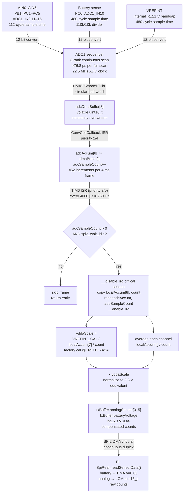
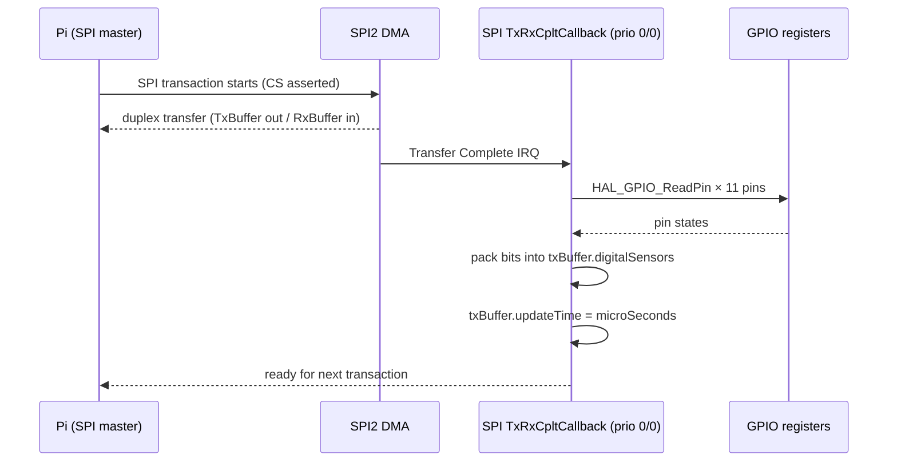
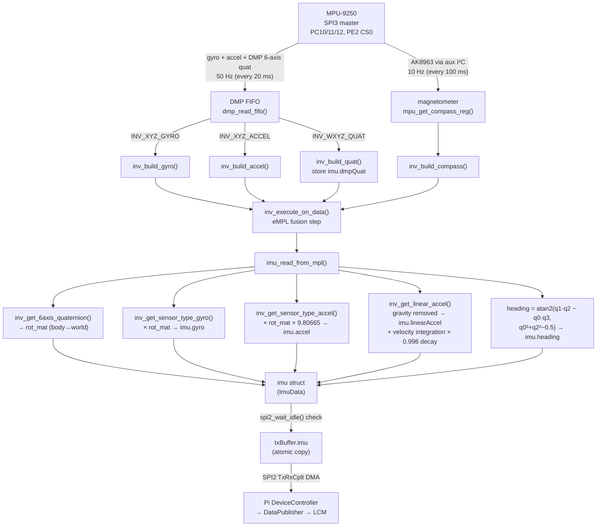

## Mental Model

The STM32 reads three distinct categories of sensor, each with a deliberately different timing and filtering strategy:

- **Analog sensors (AIN0–AIN5) and battery voltage** — scanned continuously by ADC1 via circular DMA, accumulated across many raw samples (oversampling), VDDA-compensated, and written to `txBuffer` at exactly 250 Hz.
- **Digital inputs (DIN0–DIN9 + button)** — read directly inside the SPI completion ISR so they always reflect the state at the moment the Pi receives the packet. No averaging or buffering.
- **IMU (MPU-9250)** — fused by the on-chip DMP at 50 Hz. The main loop polls the DMP FIFO; the IMU has its own page. See [IMU section](#imu-mpu-9250--ak8963) below or the dedicated IMU page for full detail.

All three paths converge in `TxBuffer` (defined in `shared/spi/pi_buffer.h`, `TRANSFER_VERSION` 21), which is shipped to the Pi on every SPI2 transfer. The Pi's `DataPublisher` then serialises each field to the corresponding LCM channel.

The key insight governing the analog design is that the STM32F427 ADC1 runs free-running and continuously, accumulating samples into a software accumulator. No timer triggers the ADC. The output rate is instead throttled entirely in software by the TIM6 1 MHz system timer ISR, which calls `updatingAnalogValuesInSpiBuffer()` every 4000 µs. Everything between those calls is pure oversampling — the more samples accumulated, the lower the quantization noise floor.

---

## Analog Sensor Ports

### GPIO pin assignments

The Wombat exposes six general-purpose analog input ports (AIN0–AIN5) plus a battery voltage sense input, all on GPIOB and GPIOC. All are configured `GPIO_MODE_ANALOG` / `GPIO_NOPULL` — no internal pull-up or pull-down; these pins float to whatever the external sensor drives.

| Port | GPIO pin | ADC1 channel | Rank | Sample time |
|---|---|---|---|---|
| AIN0 | PB1 | ADC1_IN9 | 1 | 112 cycles |
| AIN1 | PC1 | ADC1_IN11 | 2 | 112 cycles |
| AIN2 | PC2 | ADC1_IN12 | 3 | 112 cycles |
| AIN3 | PC3 | ADC1_IN13 | 4 | 112 cycles |
| AIN4 | PC4 | ADC1_IN14 | 5 | 112 cycles |
| AIN5 | PC5 | ADC1_IN15 | 6 | 112 cycles |
| Battery | PC0 | ADC1_IN10 | 7 | 480 cycles |
| VREFINT | internal | ADC_CHANNEL_VREFINT | 8 | 480 cycles |

Notice that rank 7 (battery) skips ADC1_IN10 in sequence — the channel numbers are not monotonic because the analog port pins are not on contiguous ADC channels. This is purely a hardware routing constraint on the PCB; the firmware sets each rank explicitly. `ANALOG_SENSOR_COUNT` is defined as **8** in `adcPorts-batteryVoltage.h`.

### ADC clock and sample-time arithmetic

The STM32F427 system clock runs at **180 MHz** (HSI 16 MHz → PLL: M=8, N=180, P=2, overdrive enabled). APB2 is configured as SYSCLK/2 = 90 MHz. ADC1 uses the synchronous clock prescaler `ADC_CLOCK_SYNC_PCLK_DIV4`, giving:

```
ADC clock = 90 MHz / 4 = 22.5 MHz
```

A 12-bit conversion on the STM32F4 ADC requires 12 conversion clock cycles plus the programmed sample time. Each channel therefore takes:

| Channel type | Sample cycles | Conversion cycles | Total cycles | Time |
|---|---|---|---|---|
| AIN0–AIN5 | 112 | 12 | 124 | 5.51 µs |
| Battery | 480 | 12 | 492 | 21.87 µs |
| VREFINT | 480 | 12 | 492 | 21.87 µs |

One complete 8-channel scan (ranks 1–8) takes:

```
6 × 124 + 2 × 492 = 744 + 984 = 1728 ADC clock cycles
= 1728 / 22.5 MHz ≈ 76.8 µs per scan
```

At the 250 Hz output rate (one `updatingAnalogValuesInSpiBuffer()` call every 4000 µs), the number of complete DMA cycles accumulated before each output frame is approximately:

```
4000 µs / 76.8 µs ≈ 52 complete scans per frame
```

This is the natural oversampling ratio. The battery and VREFINT channels were deliberately assigned the maximum 480-cycle sample time because they have high source impedance (battery through a 110 kΩ/10 kΩ voltage divider; VREFINT is an internal bandgap reference that needs settling time). The sensor inputs at 112 cycles suit the lower source impedances typical of analog sensors with op-amp outputs.

**Why not use ADC hardware oversampling?** The STM32F427 ADC hardware does not include an oversampling accumulator (that feature appeared on STM32L4/G4). The firmware implements software oversampling instead: accumulate into 32-bit integers in `adcAccum[]`, divide by count at output time.

### Continuous oversampling with circular DMA

ADC1 is configured for:
- `ContinuousConvMode = ENABLE` — restarts immediately after the last rank
- `ScanConvMode = ENABLE` — all 8 ranks converted in sequence
- `DMAContinuousRequests = ENABLE` — re-issues DMA requests without CPU intervention
- DMA2 Stream0 Channel0 — circular mode, half-word transfers (`DMA_MDATAALIGN_HALFWORD`)

`startContinuousAnalogSampling()` (called once at boot from `main.c`) fires `HAL_ADC_Start_DMA(&hadc1, (uint32_t*)adcDmaBuffer, ANALOG_SENSOR_COUNT)`. After that, the ADC-DMA machine runs entirely autonomously. After each complete 8-channel scan the DMA issues a Transfer Complete interrupt, invoking `HAL_ADC_ConvCpltCallback()`:

```c
// adcPorts-batteryVoltage.c
void HAL_ADC_ConvCpltCallback(ADC_HandleTypeDef* hadc)
{
    if (hadc->Instance == ADC1)
    {
        for (int i = 0; i < ANALOG_SENSOR_COUNT; i++)
            adcAccum[i] += adcDmaBuffer[i];
        adcSampleCount++;
    }
    // ADC2 branch handles BEMF — see motor docs
}
```

The accumulator is `volatile uint32_t adcAccum[8]`. With ~52 samples per 4 ms frame and 12-bit ADC values (max 4095), the maximum accumulator value is approximately 52 × 4095 ≈ 212 940 — well within uint32_t range. Even at the theoretical limit of 4000 µs / 76.8 µs ≈ 52 scans, overflow is impossible.

### The TIM6 scheduling mechanism

The system timer TIM6 is configured as a 1 MHz interrupt source:

```
TIM6 prescaler = 9 − 1, Period = 10 − 1
APB1 timer clock = 90 MHz → TIM6 input = 90 MHz
TIM6 tick rate = 90 MHz / 9 / 10 = 1 MHz (1 µs per tick)
```

Inside `HAL_TIM_PeriodElapsedCallback()` (priority 3/0 — lowest of all sensor ISRs), the macro `doEveryXuSeconds` gates the analog output call:

```c
static uint32_t analogOutputLastStart = 0;
doEveryXuSeconds(updatingAnalogValuesInSpiBuffer(), ANALOG_OUTPUT_INTERVAL, analogOutputLastStart);
// ANALOG_OUTPUT_INTERVAL = 4000 µs → 250 Hz
```

This is a lightweight elapsed-time gate — not a real scheduled callback. The macro checks `microSeconds - analogOutputLastStart >= interval`, then calls the function and updates `analogOutputLastStart`. Jitter is at most one TIM6 tick (1 µs), which is negligible at 250 Hz.

### The atomic snapshot and accumulator reset

`updatingAnalogValuesInSpiBuffer()` must read and reset `adcAccum[]` and `adcSampleCount` without letting the ADC1 DMA callback fire in the middle. It uses a global interrupt disable critical section:

```c
__disable_irq();
uint32_t count = adcSampleCount;
uint32_t localAccum[ANALOG_SENSOR_COUNT];
memcpy(localAccum, (void*)adcAccum, sizeof(localAccum));
memset((void*)adcAccum, 0, sizeof(adcAccum));
adcSampleCount = 0;
__enable_irq();
```

The critical section is intentionally minimal — only memory copies and clears, no computation — to minimise the time that SPI2 and TIM6 ISRs are held off. If `adcSampleCount == 0` on entry the function returns early (code 2) without touching the buffer; this guard prevents a divide-by-zero on the first call after boot.

The function also checks `spi2_wait_idle()` before writing to `txBuffer`. If SPI2 DMA is mid-transfer, the update is skipped entirely (returns code 1) rather than producing a torn write. The Pi will simply see the previous frame's values for that 4 ms window, which is harmless.

### VDDA compensation with the VREFINT factory calibration

The STM32F4 ADC measures voltages referenced to VDDA (the analog supply). In a real system VDDA dips when motors draw heavy current, which would make all ADC readings appear lower than reality. The firmware corrects for this using the on-chip VREFINT channel (rank 8, ADC_CHANNEL_VREFINT).

**Physical principle:** VREFINT is a temperature-compensated bandgap reference inside the STM32. Its voltage is approximately 1.21 V regardless of VDDA. The ADC converts it as:

```
raw_vrefint = VREFINT_voltage × 4095 / VDDA
```

If VDDA drops from 3.3 V to 3.0 V, `raw_vrefint` rises proportionally — the same absolute voltage now occupies a larger fraction of the ADC range.

**Factory calibration:** STMicroelectronics measures each chip at exactly VDDA = 3.3 V and 30 °C and stores the resulting 12-bit VREFINT reading in internal Flash at address `0x1FFF7A2A`:

```c
#define VREFINT_CAL (*(volatile uint16_t*)0x1FFF7A2AU)
```

`VREFINT_CAL` is chip-specific, but typically around 1500–1650 counts (≈ 1.21 V × 4095 / 3.3 V ≈ 1502).

**Runtime compensation:** Every 4 ms output frame updates `vddaScale` from the oversampled VREFINT average:

```c
uint32_t vrefintAvg = localAccum[7] / count;  // index 7 = rank 8 (VREFINT)
if (vrefintAvg > 0)
    vddaScale = (float)VREFINT_CAL / (float)vrefintAvg;
```

When VDDA = 3.3 V, `vrefintAvg ≈ VREFINT_CAL`, so `vddaScale ≈ 1.0`. When VDDA sags to 3.0 V, `vrefintAvg` rises to approximately `VREFINT_CAL × 3.3 / 3.0`, so `vddaScale ≈ 3.0 / 3.3 ≈ 0.91`. All sensor readings are then multiplied by this factor, bringing them back to the equivalent count at 3.3 V. The compensated values therefore represent millivolts or sensor units at a nominal 3.3 V supply regardless of actual VDDA.

```c
// Apply compensation and write to SPI buffer
float scale = vddaScale;
for (int i = 0; i < 6; i++)
    txBuffer.analogSensor[i] = (int16_t)((float)(localAccum[i] / count) * scale);
txBuffer.batteryVoltage = (int16_t)((float)(localAccum[6] / count) * scale);
```

`vddaScale` is also read by the BEMF subsystem for the same normalization.

### Oversampling noise reduction

The firmware averages N samples per output frame, which reduces quantization noise by a factor of √N (equivalent to gaining 0.5 log₂(N) effective bits). With the natural ~52 samples per 4 ms frame:

```
Effective bits gained ≈ 0.5 × log₂(52) ≈ 2.85 bits
Effective resolution ≈ 12 + 2.85 ≈ 14.85 bits
```

This benefit only applies to quantization noise; it does not remove correlated noise (e.g., switching noise from motor PWM coupling into the analog supply). The 480-cycle sample time for the battery channel helps here too — more time for the RC input filter on the ADC pin to settle.

### Full pipeline diagram



### Battery voltage: two-stage filtering

The battery voltage goes through two separate filtering stages:

**Stage 1 — STM32 oversampling (hardware-assisted):** The same ~52-sample average applied to all analog channels. Applied in firmware at 250 Hz before `txBuffer.batteryVoltage` is written.

**Stage 2 — Pi-side exponential moving average (software):** In `SpiReal::readSensorData()` (C++):

```cpp
const float stmVoltage = 3.3f;
const float voltageDividerFactor = 11.0f;   // 110 kΩ + 10 kΩ resistor divider
const float adcResolution = 4096.0f;
const float rawVoltage = static_cast<float>(rx->batteryVoltage)
                         * stmVoltage * voltageDividerFactor / adcResolution;

constexpr float alpha = 0.05f;
if (filteredBatteryVoltage_ == 0.0f)
    filteredBatteryVoltage_ = rawVoltage;    // cold-start initialisation
else
    filteredBatteryVoltage_ = filteredBatteryVoltage_ * (1.0f - alpha) + rawVoltage * alpha;
```

The EMA with α = 0.05 has a time constant of approximately:

```
τ = −Δt / ln(1 − α) ≈ Δt / α   (first-order approximation)
```

At the SPI polling rate (~200 Hz on the Pi), Δt ≈ 5 ms, so τ ≈ 5 ms / 0.05 = 100 ms. This is intentionally sluggish — battery voltage changes slowly and the heavy EMA eliminates high-frequency ripple from motor switching without any audible impact on the displayed value.

The voltage divider factor of 11 accounts for a 110 kΩ + 10 kΩ resistor divider: V_bat = V_pc0 × (110 + 10) / 10 = V_pc0 × 11. This allows batteries up to approximately 3.3 V × 11 = 36.3 V to be measured safely.

### Raw ADC values on the Pi

`txBuffer.analogSensor[0..5]` contains VDDA-compensated 12-bit-equivalent counts stored as `int16_t`. The Pi copies them verbatim into `d.analogValues[i]` (as `uint16_t`) and publishes them to LCM. Conversion to physical units (volts, reflectance, distance) is the responsibility of user code or raccoon-lib sensor wrappers. The count range is 0–4095 at VDDA = 3.3 V; values slightly outside this range are theoretically possible if vddaScale > 1 (VDDA below 3.3 V) and the raw reading was already near full-scale.

---

## Digital Input Ports

### Concept and hardware convention

All digital inputs use internal pull-up resistors (`DIGITAL_INPUT_PULL_STATE = GPIO_PULLUP`, defined in `Hardware/gpio.h`). This means the default (unconnected or high-impedance) state is logic HIGH. Typical digital sensors (microswitches, TOF sensors with open-drain outputs, bump switches) pull the line LOW when active.

The firmware deliberately inverts the polarity when packing bits: `GPIO_PIN_RESET` (pin LOW, sensor active) maps to bit = **1** in the result word. This means "bit set = sensor triggered", which is the natural convention for user code.

The on-board button (PB0) has reversed hardware wiring relative to the sensor ports — it drives the pin HIGH when pressed — so the code reads it with normal polarity (`GPIO_PIN_SET` → bit set).

### GPIO pin assignments

| Port | GPIO | Notes |
|---|---|---|
| DIN0 | PD12 | Pull-up, active-low |
| DIN1 | PD13 | Pull-up, active-low |
| DIN2 | PD14 | Pull-up, active-low |
| DIN3 | PD15 | Pull-up, active-low |
| DIN4 | PB9 | Pull-up, active-low |
| DIN5 | PB8 | Pull-up, active-low |
| DIN6 | PC9 | Pull-up, active-low |
| DIN7 | PE0 | Pull-up, active-low |
| DIN8 | PE1 | Pull-up, active-low |
| DIN9 | PE4 | Pull-up, active-low |
| Button | PB0 | Pull-up, active-HIGH (reversed) |

### Sampling and packing

`readDigitalInputs()` in `digitalPorts.c` iterates over two fixed arrays (one for pin bitmasks, one for GPIO port pointers) and packs results into a `uint16_t`:

```c
uint16_t readDigitalInputs(void)
{
    uint16_t DIN_Pins[10]  = { DIN0_Pin, DIN1_Pin, ..., DIN9_Pin };
    GPIO_TypeDef* DIN_Ports[10] = { DIN0_GPIO_Port, ..., DIN9_GPIO_Port };
    uint16_t result = 0;

    for (uint8_t i = 0; i < 10; i++)
    {
        if (HAL_GPIO_ReadPin(DIN_Ports[i], DIN_Pins[i]) == GPIO_PIN_RESET)
            result |= (1 << i);   // active-low: LOW → bit set
    }

    if (HAL_GPIO_ReadPin(Button_GPIO_Port, Button_Pin) == GPIO_PIN_SET)
        result |= (1 << 10);      // active-high button
    return result;
}
```

Bits 0–9 correspond to DIN0–DIN9; bit 10 is the on-board button. Bits 11–15 are always zero. The word is written directly to `txBuffer.digitalSensors` (a `uint16_t` in `TxBuffer`).

### When it is read

`readDigitalInputs()` is called from `HAL_SPI_TxRxCpltCallback()` — the SPI2 DMA transfer-complete ISR (priority 0/0, highest in the system). This means digital inputs are always sampled at the moment the Pi's SPI transaction completes and are never stale by more than one SPI transfer period. No separate timer or buffer is involved.

```c
void HAL_SPI_TxRxCpltCallback(SPI_HandleTypeDef* hspi)
{
    if (hspi->Instance == SPI2)
    {
        txBuffer.updateTime = microSeconds;
        txBuffer.digitalSensors = readDigitalInputs();  // fresh sample every transfer
        // ... version check, update flags ...
    }
}
```

### Digital input state machine (read sequence)



On the Pi side, `SpiReal::readSensorData()` copies `rx->digitalSensors` into `d.digitalBits` and `DataPublisher` publishes individual bits to LCM.

---

## Generic Filter Module

The firmware provides a single generic filter primitive in `Data_structures/filter.h`:

```c
inline float lowPassFilter(float newValue, float previousValue, float alpha)
{
    return alpha * newValue + (1.0f - alpha) * previousValue;
}
```

This is a first-order infinite impulse response (IIR) low-pass filter — identical in structure to the exponential moving average (EMA). The parameter `alpha` (0 < α ≤ 1) controls the trade-off between responsiveness and noise rejection:

- **α = 1.0** — no filtering; output equals input immediately
- **α = 0.5** — 50/50 mix; effective time constant τ ≈ Δt / α = 2Δt
- **α → 0** — very slow response; heavy smoothing

The function is `inline` so the compiler folds it directly into the call site with no function-call overhead — important for ISR contexts. The implementation in `filter.c` contains only the `#include "Data_structures/filter.h"` directive; all code lives in the header to enforce inlining across translation units.

**Usage in the codebase:**

| Call site | Alpha | Purpose |
|---|---|---|
| `SpiReal.cpp` (Pi, battery voltage) | 0.05 | Heavy smoothing of battery voltage (~100 ms time constant at 200 Hz poll rate) |
| Motor / BEMF subsystem | configurable | BEMF velocity smoothing (see motor documentation) |

The analog port raw values (`txBuffer.analogSensor[0..5]`) and battery voltage (`txBuffer.batteryVoltage`) are **not** passed through `lowPassFilter` on the STM32. They use oversampling (averaging) instead, which is a linear FIR filter rather than IIR. Sensor smoothing for AIN0–AIN5 is left to application code.

---

## IMU (MPU-9250 / AK8963)

The IMU is documented separately. See the [IMU section](#imu-mpu-9250--ak8963) below for the DMP-based fusion pipeline, calibration storage, and SPI3 configuration. The key interactions with the sensor layer are:

- `imu.c` calls `spi2_wait_idle()` before writing to `txBuffer.imu` to avoid tearing
- IMU data does **not** use the ADC or the filter module
- VDDA compensation from `vddaScale` (computed by the analog sensor pipeline) is consumed by the BEMF subsystem but not directly by the IMU

---

## Interrupt Priority Summary

Understanding interrupt priorities is essential to understanding why the sensor pipeline is correct. Lower NVIC priority numbers preempt higher numbers on Cortex-M4. All priorities here use the HAL 4-bit preempt / 4-bit sub-priority scheme.

| ISR | Peripheral | Preempt / Sub | Rationale |
|---|---|---|---|
| SPI2 TxRxCplt | SPI2 DMA (Pi link) | 0 / 0 | Highest: Pi transaction must complete atomically; reads digital inputs here |
| SPI2 Rx DMA | DMA1 Stream3 | 0 / 1 | Must not be preempted during Pi SPI receive |
| SPI2 Tx DMA | DMA1 Stream4 | 0 / 2 | Must not be preempted during Pi SPI transmit |
| SPI3 Rx DMA | DMA1 Stream0 (IMU) | 1 / 1 | IMU SPI reads; lower than Pi link |
| SPI3 Tx DMA | DMA1 Stream5 (IMU) | 1 / 2 | |
| ADC1/2 IRQ | shared ADC IRQ | 2 / 3–4 | Accumulates analog samples; below SPI to avoid interfering with Pi link |
| ADC1 DMA | DMA2 Stream0 | 2 / 1 | Circular buffer DMA for analog channels |
| ADC2 DMA | DMA2 Stream2 | 2 / 0 | BEMF single-shot DMA; slightly higher sub-priority |
| TIM6 | System timer | 3 / 0 | Schedules analog output (250 Hz) and BEMF timing; lowest sensor priority |
| UART3 | Debug USART | 4 / 0 | Lowest; heartbeat printf only |

**Critical ordering rule:** `startContinuousAnalogSampling()` must be called **before** `systemTimerStart()` in `main.c`. TIM6 begins firing 1 µs after `systemTimerStart()`, and its first invocation calls `updatingAnalogValuesInSpiBuffer()`. If ADC1 DMA has not started, `adcSampleCount` is 0 and the function returns early safely — but the ADC handle `hadc1` must be fully initialised before TIM6 can reference it indirectly. The current `main.c` boot sequence is: GPIO → DMA → ADC1 → ADC2 → SPI → Timers → `startContinuousAnalogSampling()` → `systemTimerStart()`.

---

## IMU (MPU-9250 / AK8963)

The IMU is an InvenSense MPU-9250, which integrates a 3-axis gyroscope, 3-axis accelerometer, and a 3-axis AK8963 magnetometer. It is connected to the STM32 via SPI3 (PC10 SCK, PC11 MISO, PC12 MOSI, PE2 CS0).

The firmware uses the InvenSense **eMPL** (embedded Motion Processing Library) and the MPU-9250 DMP (Digital Motion Processor) to perform sensor fusion on-chip. The DMP outputs a 6-axis quaternion (gyro + accelerometer, no magnetometer) at 50 Hz.

### Self-Test and Bias Calibration

On startup, `runImuSelfTest()` calls `mpu_run_6500_self_test()` to run the factory self-test routine. If the gyro and accelerometer pass (result bits 0 and 1 set), the function extracts the measured factory biases and pushes them into the hardware offset registers (`mpu_set_gyro_bias_reg`, `mpu_set_accel_bias_6500_reg`). This eliminates the static offset that every IMU chip has from manufacturing variation.

Note: the magnetometer self-test is not performed. The InvenSense library was originally written for I²C; the SPI HAL shim (`mpu9250_hal.c`) maps the library's `hal_i2c_write`/`hal_i2c_read` calls to the SPI driver. The AK8963 is on an auxiliary I²C bus inside the MPU-9250 package and is accessed through the MPU-9250's I²C master mode regardless of whether the STM32→MPU-9250 bus is I²C or SPI.

### MPL Configuration

The MPL is initialised with:

| Feature | Setting |
|---|---|
| Quaternion | Enabled (6-axis, DMP) |
| 9-axis fusion | Disabled (commented out) |
| Gyro temperature compensation | Enabled |
| Fast no-motion detection | Enabled |
| In-use auto-calibration | Enabled |
| Heading from gyro | Enabled |
| Sample rate | 50 Hz (20 ms period) |
| Compass rate | 10 Hz (100 ms period) |
| Gyro FSR | ±2000 dps (configured in `mpu9250_config.h`) |
| Accel FSR | ±2 g |
| Low-pass filter | 42 Hz |

The DMP is loaded with the firmware from InvenSense (`dmp_load_motion_driver_firmware()`), then configured to output 6-axis LP quaternion, raw accelerometer, and calibrated gyro at 50 Hz.

### Orientation Matrices

The IMU chip axes may not align with the robot body frame. The orientation matrix remaps chip axes to board axes. The default matrices in `mpu9250_config.h` are:

```c
// Gyro/accel: chip X = +E, chip Y = −N, chip Z = +D
#define IMU_GYRO_ORIENTATION_MATRIX  { 0, 1, 0,  -1, 0, 0,  0, 0, -1 }

// Compass
#define IMU_COMPASS_ORIENTATION_MATRIX { 1, 0, 0,  0, -1, 0,  0, 0, 1 }
```

The Pi can override these at runtime by setting new 3×3 signed-char matrices in `rxBuffer.imuGyroOrientation` and `rxBuffer.imuCompassOrientation` with the `PI_BUFFER_UPDATE_IMU_ORIENTATION` flag. The firmware calls `updateImuOrientation()` which re-applies the matrices to the MPL via `inv_set_gyro_orientation_and_scale` and `dmp_set_orientation`.

### Data Acquisition Loop

`readImu()` is called on every main-loop iteration. It checks whether 20 ms have elapsed since the last gyro read and 100 ms since the last compass read, then:

1. Reads raw data from the DMP FIFO (`dmp_read_fifo`), which gives gyro, accelerometer, and quaternion data as integer arrays.
2. Pushes data into the MPL (`inv_build_gyro`, `inv_build_accel`, `inv_build_quat`).
3. Reads the magnetometer separately via `mpu_get_compass_reg` and stores raw counts (compass is not fed into the MPL fusion in the current build).
4. Calls `inv_execute_on_data()` to run the MPL fusion step.
5. Calls `read_from_mpl()` to extract fused outputs.

`read_from_mpl()` computes:
- **Quaternion** (w, x, y, z) via `inv_get_quaternion_set`
- **Rotation matrix** from quaternion (for body→world transform)
- **Gyro vector** in world frame (body gyro rotated by quaternion)
- **Accelerometer vector** in world frame (scaled to m/s² by × 9.80665)
- **Linear acceleration** (gravity removed) via `inv_get_linear_accel`
- **Velocity** from integrated linear acceleration (experimental — decays with factor 0.998 per cycle to limit drift)
- **Heading** in degrees derived from the quaternion: `atan2(q1*q2 - q0*q3, q0^2 + q2^2 - 0.5)` (uses q30 fixed-point intermediate values)

When new data is available and the SPI bus is not busy, `txBuffer.imu` is updated atomically from the local `imu` struct.

*Figure — IMU data acquisition loop: DMP FIFO → MPL fusion → `txBuffer.imu`.*



### Flash-based IMU Calibration Storage

The SPI protocol includes a `PI_BUFFER_UPDATE_SAVE_IMU_CAL` update flag (bitmask `0x08`). When the Pi sets this flag in the `RxBuffer.updates` field, the STM32 main loop calls `cal_save_to_flash()`.

**Current behaviour: `cal_save_to_flash()` is a no-op.** It returns `INV_SUCCESS` immediately without writing anything to Flash. The reason is a confirmed hardware issue: on the STM32F427VI used in the Wombat, erasing and reprogramming Flash sector 12 (Bank 2) blocks the firmware main loop for multiple minutes in practice — PWM registers stop updating and servos freeze. The comment in `flash_cal.c` explains this in detail.

IMU calibration is therefore ephemeral: the MPL `inv_enable_in_use_auto_calibration` feature re-runs on every boot and converges within 2–3 minutes of normal motion. The robot re-calibrates during `M000SetupMission` anyway, so cold-start accuracy in the first seconds is not a concern.

The API is preserved so that:

- Pi-side code can call `save_imu_calibration()` without checking a capability flag.
- `cal_load_from_flash()` returns `INV_ERROR_CALIBRATION_LOAD` so the startup code takes the "starting fresh" branch.
- `cal_has_saved_data()` always returns `0`.

If this feature is reinstated in the future, the note in `flash_cal.c` recommends using the HAL interrupt-based Flash programming variants and a low-priority background task.

### SPI3 Configuration

SPI3 is configured as master at startup with prescaler 64 (giving ~1.4 MHz), then changed to prescaler 256 during the IMU initialisation to stay within the MPU-9250's configuration register speed limit. After DMP load it can run faster, but the `changeSPIBaudRatePrescaler` call to restore a higher rate is commented out in the current code.

The SPI3 DMA (DMA1 stream 0/5) runs in normal (not circular) mode — each transaction is explicitly started by the MPU-9250 driver and completes with an interrupt.

---

## Related pages

- [Firmware Runtime and Scheduling](../firmware-runtime/) — ADC architecture, TIM6 ISR analog refresh, ADC2 BEMF orchestration, and interrupt priorities
- [IMU Stack](../imu/) — full MPU-9250 hardware layer, DMP firmware, eMPL fusion pipeline, orientation matrices, and calibration persistence design
- [Data Pipeline](../data-pipeline/) — how sensor values travel from `txBuffer` to `analog.read()` and `imu.heading()`
- [SPI Communication Protocol](../spi-protocol/) — the full `TxBuffer` layout and all `raccoon/` channel names
- [Architecture Overview](../architecture/) — interrupt priorities and why ADC1 must start before TIM6
