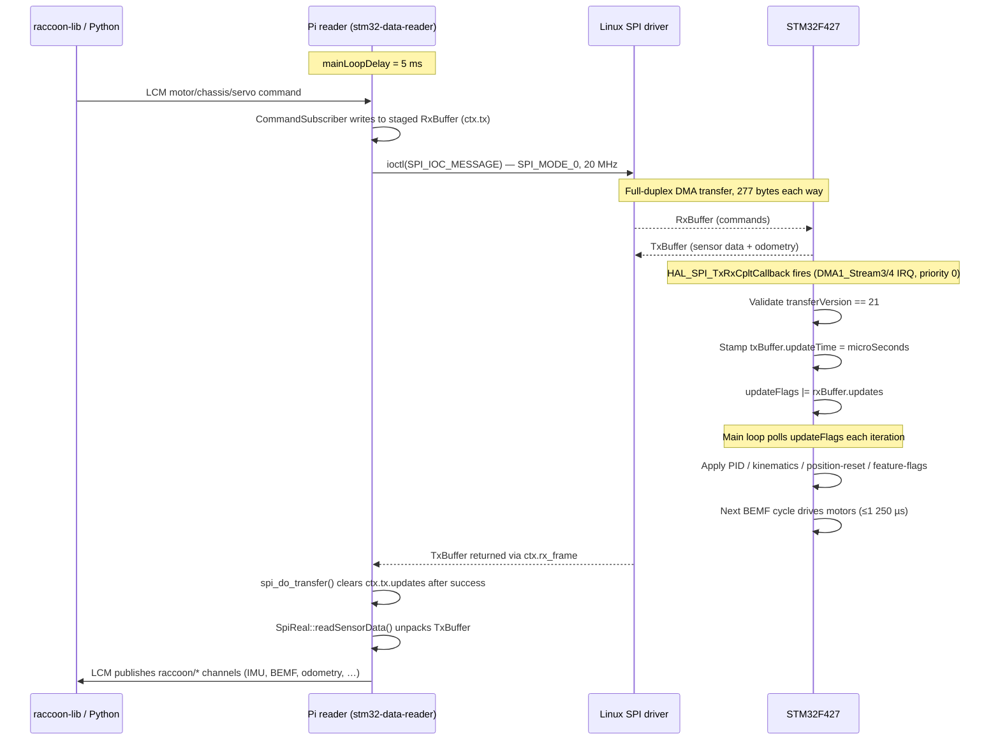
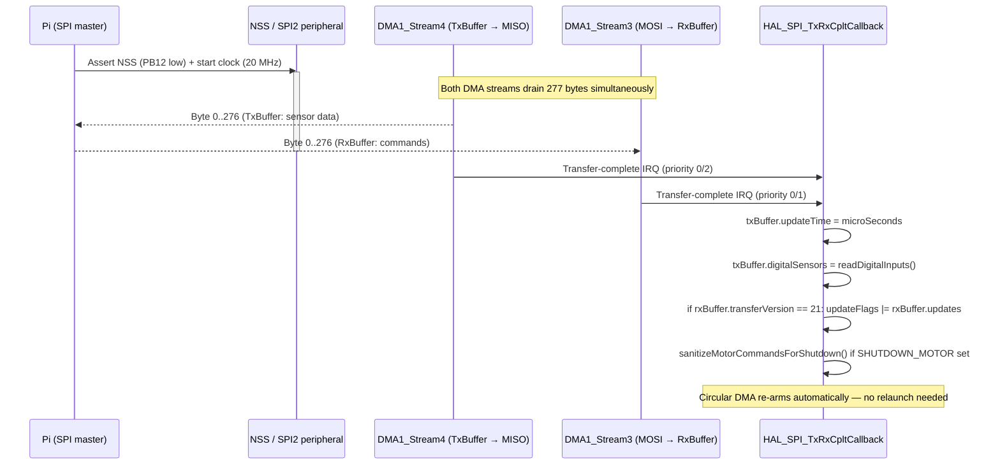
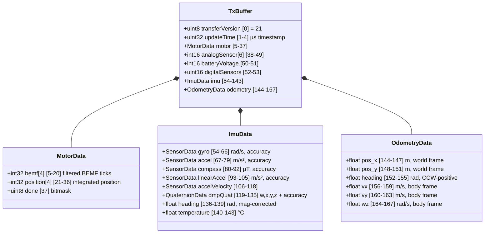
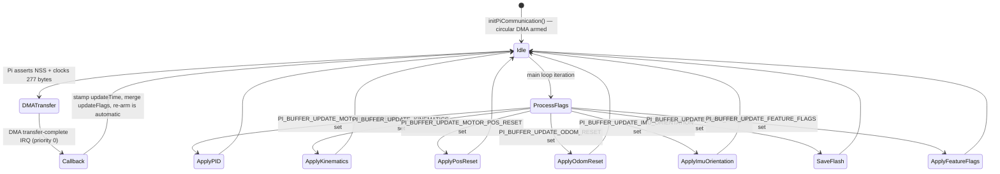
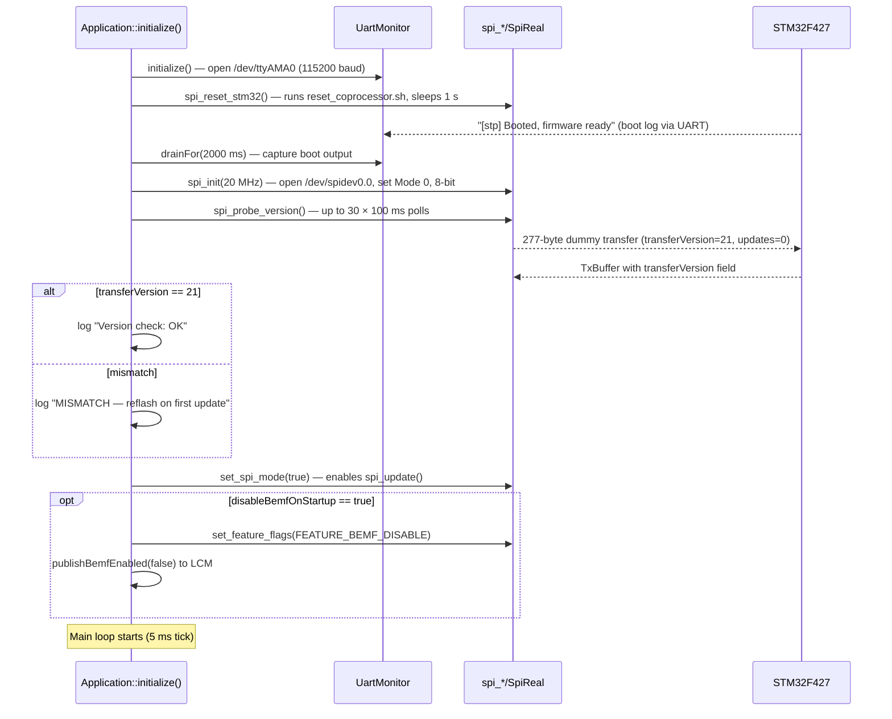

# SPI Communication Protocol

## Mental model: why this design

The Raspberry Pi runs Linux with a real-time process (`stm32-data-reader`) and an LCM message bus. The STM32F427 runs bare-metal firmware that controls motors, reads sensors, and computes odometry at deterministic rates. There is no Linux scheduler, no TCP/IP, no protobuf negotiation — just two microprocessors sharing a four-wire SPI bus.

The protocol makes one deliberate trade-off: **all communication happens in a single fixed-size, full-duplex packed-struct exchange** with no framing overhead. The Pi always drives the clock (master); the STM32 listens and responds simultaneously (slave). Every exchange is exactly 277 bytes in each direction. The Pi sends a `RxBuffer` (commands) while simultaneously receiving a `TxBuffer` (sensor data). Both structs are packed with `__attribute__ ((packed))` and both sides include the same `shared/spi/pi_buffer.h` header — there is no separate copy on either side.

This gives three properties that matter for robotics:

1. **Deterministic latency.** A motor command written to `RxBuffer` on the Pi is on the wire in less than one main-loop iteration (5 ms). The STM32's DMA interrupt fires on completion and applies the command within the next BEMF cycle (1 250 µs per motor).
2. **No serialisation cost.** The raw struct bytes are the wire bytes. `memcpy` is the only serialisation step.
3. **Single point of truth.** `pi_buffer.h` is included by both the STM32 firmware and the Pi reader. A version field (`TRANSFER_VERSION 21`) detects any drift between the two. A mismatch is treated as a repairable deployment fault, not a silent error.



---

## Hardware mapping

SPI2 is the Pi–STM32 link. SPI3 is the internal IMU link. Both use DMA.

| Signal | Pin | Direction | Notes |
|--------|-----|-----------|-------|
| SPI2_NSS | PB12 | Pi → STM | Hard-NSS (hardware CS, not GPIO-toggled) |
| SPI2_SCK | PB13 | Pi → STM | Clock, CPOL=0, CPHA=0 (Mode 0) |
| SPI2_MISO | PB14 | STM → Pi | TxBuffer bytes |
| SPI2_MOSI | PB15 | Pi → STM | RxBuffer bytes |

SPI configuration (`spi.c`, `MX_SPI2_Init`):
- Mode: **slave**, direction: 2-lines full-duplex, 8-bit data
- NSS: hard input (asserted by Pi's Linux SPI driver)
- Clock: polarity low, phase 1st edge (SPI Mode 0)
- No CRC, no TI-mode
- Pi-side speed: **20 MHz** (`ctx.speed_hz = 20'000'000` in `Spi.cpp`)

DMA channels for SPI2 (`spi.c`, `HAL_SPI_MspInit`):

| Stream | Channel | Direction | Mode | Priority |
|--------|---------|-----------|------|----------|
| DMA1_Stream3 | CH0 | PERIPH → MEM (RX) | **Circular** | Very High |
| DMA1_Stream4 | CH0 | MEM → PERIPH (TX) | **Circular** | Very High |

Both streams are configured as `DMA_CIRCULAR`, meaning the DMA controller automatically re-arms itself after each transfer completes. The STM32 never calls `HAL_SPI_TransmitReceive_DMA` again after `initPiCommunication()` — a single call at startup is sufficient. The circular DMA re-uses the same `txBuffer` and `rxBuffer` memory regions on every subsequent NSS assertion by the Pi.

**IRQ priorities** (`interupt_prioryty.h`):
- SPI2 IRQ: preempt 0, sub 0 (highest in the system)
- DMA1_Stream3 (SPI2 RX): preempt 0, sub 1
- DMA1_Stream4 (SPI2 TX): preempt 0, sub 2

SPI2 and its DMA interrupts sit above every other interrupt in the system, guaranteeing that the completion callback fires as soon as the last byte is clocked in.

---

## DMA circular transfer: how it works

Most embedded SPI slave drivers re-arm the DMA on every transfer. RaccoonOS uses a different approach: one `HAL_SPI_TransmitReceive_DMA` call with circular DMA, and then the peripheral self-restarts every time the Pi asserts NSS and clocks bytes. This is why `initPiCommunication()` in `communication_with_pi.c` is a one-liner:

```c
HAL_SPI_TransmitReceive_DMA(&hspi2,
    (uint8_t*)&txBuffer,
    (uint8_t*)&rxBuffer,
    BUFFER_LENGTH_DUPLEX_COMMUNICATION);   // 277 bytes
```

The workflow on every Pi-initiated transfer:

1. Pi calls `ioctl(SPI_IOC_MESSAGE(1), &tr)` with `tr.len = 277`.
2. Pi Linux SPI driver asserts NSS (PB12 low) and starts clocking at 20 MHz.
3. DMA1_Stream4 pushes `txBuffer` bytes from STM32 memory → SPI2 DR.
4. DMA1_Stream3 pulls bytes from SPI2 DR → `rxBuffer` memory.
5. After 277 bytes, DMA transfer-complete fires on both streams.
6. HAL calls `HAL_SPI_TxRxCpltCallback` (SPI2_IRQHandler path, priority 0).
7. Callback stamps `txBuffer.updateTime`, reads digital sensors, merges update flags.
8. Circular DMA re-arms automatically — no software re-arm needed.
9. Pi de-asserts NSS; `ioctl` returns with `rx_frame` populated.



**Key consequence for firmware authors**: `rxBuffer` and `txBuffer` are `volatile` globals that are written by DMA while the main loop reads them. The main loop must always treat these as potentially-changing at any moment. The update-flag dispatch in `main.c` copies the flag and clears it atomically before acting, so each flag is processed exactly once per set.

---

## Transfer version and mismatch recovery

Both ends of the link include the same constant:

```c
#define TRANSFER_VERSION 21   // pi_buffer.h
```

The STM32 sets `txBuffer.transferVersion = TRANSFER_VERSION` at initialisation (`communication_with_pi.c`). The Pi sets `ctx.tx.transferVersion = TRANSFER_VERSION` when the SPI fd is opened (`Spi.cpp`, `spi_reopen`).

On every transfer, `spi_do_transfer` checks:

```c
return ctx.rx.transferVersion == TRANSFER_VERSION;
```

If `false`, `spi_update` treats it as a firmware mismatch and triggers the recovery sequence:

1. Print `"version mismatch – reflashing firmware"` to stderr.
2. Run `bash ~/flashFiles/flash_wombat.sh` (blocks 2 s after success).
3. Call `spi_reopen()` to re-open `/dev/spidev0.0`.
4. Retry `spi_do_transfer()`.
5. If still mismatched: print fatal error and `exit(EXIT_FAILURE)`.

This makes firmware-version mismatch a self-healing deployment fault rather than a silent bad-data condition. The `spi_probe_version()` function performs this check at startup (polling up to 30 × 100 ms = 3 s for the STM32 to boot) and logs the result before any motor command is accepted.

---

## Wire frame sizing

```c
#define BUFFER_LENGTH_DUPLEX_COMMUNICATION \
  ((sizeof(TxBuffer) < sizeof(RxBuffer)) ? sizeof(RxBuffer) : sizeof(TxBuffer))
```

Actual sizes (computed from `pi_buffer.h` with `__attribute__ ((packed))`):

| Struct | Bytes |
|--------|-------|
| `TxBuffer` | 168 |
| `RxBuffer` | 277 |
| Wire frame | **277** |

Every SPI transaction is 277 bytes in each direction regardless of how many fields are actively used. The trailing 109 bytes of the STM32's TX frame are always zero-padded.

---

## `TxBuffer` — STM32 → Pi (168 bytes)

The naming is from the STM32's perspective: this is what it *transmits*. The Pi calls its local copy `ctx.rx`.



### Complete TxBuffer byte map

| Offset | Bytes | Field | Type | Notes |
|--------|-------|-------|------|-------|
| 0 | 1 | `transferVersion` | `uint8_t` | Always 21 |
| 1 | 4 | `updateTime` | `uint32_t` | µs since boot (`microSeconds` timer), stamped in `HAL_SPI_TxRxCpltCallback` |
| 5 | 16 | `motor.bemf[4]` | `int32_t[4]` | Offset-corrected, dead-zone-applied, IIR-filtered BEMF ticks per motor |
| 21 | 16 | `motor.position[4]` | `int32_t[4]` | dt-weighted integrated position in BEMF ticks |
| 37 | 1 | `motor.done` | `uint8_t` | Bit N = motor N reached goal (MTP done threshold = 40 ticks) |
| 38 | 12 | `analogSensor[6]` | `int16_t[6]` | 12-bit ADC counts on sensor ports 0–5 |
| 50 | 2 | `batteryVoltage` | `int16_t` | Raw 12-bit ADC; Pi converts: `V = adc × 3.3 × 11 / 4096` (11× divider) |
| 52 | 2 | `digitalSensors` | `uint16_t` | Bits 0–9 = digital ports, bit 10 = built-in button; read in callback |
| 54 | 13 | `imu.gyro` | `SensorData` | `{float[3] data, int8 accuracy}` — rad/s, BNO080 accuracy 0–3 |
| 67 | 13 | `imu.accel` | `SensorData` | m/s² |
| 80 | 13 | `imu.compass` | `SensorData` | µT |
| 93 | 13 | `imu.linearAccel` | `SensorData` | m/s², gravity-compensated |
| 106 | 13 | `imu.accelVelocity` | `SensorData` | integrated accel velocity |
| 119 | 17 | `imu.dmpQuat` | `QuaternionData` | `{float[4] {w,x,y,z}, int8 accuracy}` — DMP 6-axis (gyro+accel) |
| 136 | 4 | `imu.heading` | `float` | Mag-corrected heading when calibrated, otherwise gyro-only |
| 140 | 4 | `imu.temperature` | `float` | °C |
| 144 | 4 | `odometry.pos_x` | `float` | Metres, world frame, STM32-computed from BEMF + kinematics |
| 148 | 4 | `odometry.pos_y` | `float` | Metres, world frame |
| 152 | 4 | `odometry.heading` | `float` | Radians, CCW-positive (ENU) |
| 156 | 4 | `odometry.vx` | `float` | m/s, body frame |
| 160 | 4 | `odometry.vy` | `float` | m/s, body frame |
| 164 | 4 | `odometry.wz` | `float` | rad/s, body frame |

### MotorData detail

`motor.bemf[N]` is the instantaneous reading after the full signal chain: median-of-3 oversampling, IIR low-pass, `bemf_offset[N]` subtraction, dead-zone gating. The value is zero when the wheel is stationary (or nearly so, within dead-zone limits). See the Motor Control page for the complete pipeline.

`motor.position[N]` is the time-weighted integral: each BEMF cycle adds `corrected_bemf × dt_s` rather than a fixed-weight tick. This keeps position units physically consistent across variable BEMF cycle rates.

`motor.done` is a sticky bitmask. Bit N is set when `|position[N] - goalPosition[N]| < 40` ticks (MTP_DONE_THRESHOLD). It stays set until the motor's goal position or mode changes.

### `updateTime` as liveness signal

The Pi health monitor in `Application.cpp` (`checkStm32Health`) watches `updateTime`. If it does not change for 10 seconds, the Pi reader exits fatally. Since `updateTime` is stamped in the DMA completion callback on every transfer, a frozen value is a reliable sign the STM32 has crashed or the SPI link is broken. The UART heartbeat (logged every 5 s by the STM32 main loop) is explicitly _not_ the liveness signal — the STM32 silences UART during flash writes but SPI continues.

---

## `RxBuffer` — Pi → STM32 (277 bytes)

This is what the Pi *transmits* to the STM32. The Pi's local copy is `ctx.tx`; the STM32's is `rxBuffer`.

### Complete RxBuffer byte map

| Offset | Bytes | Field | Type | Notes |
|--------|-------|-------|------|-------|
| 0 | 1 | `transferVersion` | `uint8_t` | Must equal 21; STM32 ignores the buffer if mismatched |
| 1 | 4 | `updates` | `uint32_t` | Bitmask of which fields are new (see Update flags table) |
| 5 | 1 | `systemShutdown` | `uint8_t` | Bitmask: `0x01`=servo off, `0x02`=motor off |
| 6 | 2 | `motorControlMode` | `uint16_t` | 3 bits per motor: motors 0–3 packed at bits [2:0],[5:3],[8:6],[11:9] |
| 8 | 16 | `motorTarget[4]` | `int32_t[4]` | PWM: duty 0–400; MAV: velocity setpoint; MTP: speed limit |
| 24 | 12 | `chassisVelocity[3]` | `float[3]` | Body-frame setpoint `[vx m/s, vy m/s, wz rad/s]` for MOT_MODE_CHASSIS |
| 36 | 16 | `motorGoalPosition[4]` | `int32_t[4]` | Target position in BEMF ticks for MTP mode |
| 52 | 1 | `motorPositionReset` | `uint8_t` | Bitmask: bit N = reset motor N counter to 0 on STM32 |
| 53 | 1 | `servoMode` | `uint8_t` | 2 bits per servo: servos 0–3 packed at bits [1:0],[3:2],[5:4],[7:6] |
| 54 | 8 | `servoPos[4]` | `uint16_t[4]` | Servo PWM pulse width in µs (600 µs + degrees × 10) |
| 62 | 68 | `motorPidSettings` | `MotorPidSettings` | Global clamps + per-motor Kp/Ki/Kd (see PID section) |
| 130 | 9 | `imuGyroOrientation[9]` | `int8_t[9]` | 3×3 row-major chip-to-board mapping, values −1/0/+1 |
| 139 | 9 | `imuCompassOrientation[9]` | `int8_t[9]` | Same format for compass chip |
| 148 | 128 | `kinematics` | `KinematicsConfig` | inv_matrix[3][4] + ticks_to_rad[4] + bemf_offset[4] + fwd_matrix[4][3] |
| 276 | 1 | `featureFlags` | `uint8_t` | Bit 0: `FEATURE_BEMF_DISABLE` = speed mode |

### Update flags (`updates` bitmask)

The `updates` field tells the STM32 which fields in the `RxBuffer` contain new data that should be acted on. Fields without their bit set are silently ignored by the STM32 main loop, even if their bytes changed. The Pi clears `ctx.tx.updates = 0` after each successful transfer so subsequent sensor-only polls do not re-trigger actuator updates.

| Bit | Hex | Constant | What the STM32 does when set |
|-----|-----|----------|------------------------------|
| 0 | `0x01` | `PI_BUFFER_UPDATE_MOTOR_PID_SPEED` | Calls `update_motor_pidSettings()`, applies `motorPidSettings` to velocity PID |
| 1 | `0x02` | `PI_BUFFER_UPDATE_MOTOR_PID_POS` | Calls `update_motor_posPidSettings()`, applies `motorPidSettings` to position PID |
| 2 | `0x04` | `PI_BUFFER_UPDATE_IMU_ORIENTATION` | Calls `updateImuOrientation()` with both orientation matrices |
| 3 | `0x08` | `PI_BUFFER_UPDATE_SAVE_IMU_CAL` | Calls `cal_save_to_flash()` — writes calibration to flash sector 12 |
| 4 | `0x10` | `PI_BUFFER_UPDATE_KINEMATICS` | Calls `odometry_configure()` and `bemf_set_offset()` |
| 5 | `0x20` | `PI_BUFFER_UPDATE_ODOM_RESET` | Calls `odometry_reset()` — zeroes pos_x, pos_y, heading |
| 6 | `0x40` | `PI_BUFFER_UPDATE_MOTOR_POS_RESET` | For each bit in `motorPositionReset`, sets `motor_data.position[N] = 0` |
| 7 | `0x80` | `PI_BUFFER_UPDATE_FEATURE_FLAGS` | Prints feature flag state to UART; STM32 reads `featureFlags` live on each transfer |

**Important**: `motorControlMode`, `motorTarget`, `chassisVelocity`, `motorGoalPosition`, `servoMode`, and `servoPos` do **not** use update flags — they are consumed on every transfer. The STM32 applies them immediately (motor commands via `updatingMotorsInSpiBuffer()` each main loop iteration, servo commands via `update_servo_cmd()`). The update-flag mechanism is reserved for heavier, one-shot operations (PID config, kinematics, calibration save).

### Motor control mode packing

`motorControlMode` packs four 3-bit modes into one `uint16_t`:

```
bit: 15 14 13 12 11 10  9  8  7  6  5  4  3  2  1  0
      –  –  –  –  [M3   ]  [M2   ]  [M1   ]  [M0   ]
```

Motor N's mode = `(motorControlMode >> (N × 3)) & 0x07`.

| Value | Constant | Meaning |
|-------|----------|---------|
| `0b000` | `MOT_MODE_OFF` | Coast — all switches open |
| `0b001` | `MOT_MODE_PASSIV_BRAKE` | Passive brake — motor terminals shorted |
| `0b010` | `MOT_MODE_PWM` | Open-loop duty cycle (`motorTarget` = 0–400) |
| `0b011` | `MOT_MODE_MAV` | Velocity PID — `motorTarget` = ticks/s setpoint |
| `0b100` | `MOT_MODE_MTP` | Position — `motorTarget` = speed limit, `motorGoalPosition` = target ticks |
| `0b101` | `MOT_MODE_CHASSIS` | On-MCU chassis loop — `chassisVelocity` used, `motorTarget` ignored |

The Pi-side helper `set_motor_control_mode(port, mode)` in `Spi.cpp` masks and shifts correctly:

```c
uint16_t mask = (uint16_t)((1u << MOTOR_CONTR_MOD_LENGTH) - 1) << (port * MOTOR_CONTR_MOD_LENGTH);
ctx.tx.motorControlMode = (ctx.tx.motorControlMode & ~mask) | ((uint16_t)mode << (port * MOTOR_CONTR_MOD_LENGTH));
```

### `chassisVelocity[3]` — on-MCU chassis velocity loop

`chassisVelocity` sits at byte offset 24 of RxBuffer, between `motorTarget` and `motorGoalPosition`. It is easy to miscount, and older decoders that only handle up to `motorTarget` will misalign every subsequent field.

When all four motors are in `MOT_MODE_CHASSIS` (value `0b101`):

1. The Pi writes `[vx m/s, vy m/s, wz rad/s]` to `chassisVelocity`.
2. The STM32 computes per-wheel setpoints: `w_i = fwd_matrix[i][0]×vx + fwd_matrix[i][1]×vy + fwd_matrix[i][2]×wz`.
3. Each per-wheel setpoint is converted from rad/s to BEMF ticks via `ticks_to_rad[i]`.
4. The per-motor MAV (velocity) PID runs against the BEMF reading.

`motorTarget` is ignored in this mode. This closes the full chassis velocity loop on the MCU, removing the SPI round-trip from the control path. Loop latency is one BEMF cycle (1 250 µs), not 5 ms.

The Pi-side call path: `raccoon/chassis/velocity_cmd` LCM channel → `CommandSubscriber` → `DeviceController::setChassisVelocity` → `SpiReal::setChassisVelocity` → `set_chassis_velocity(vx, vy, wz)` → writes `ctx.tx.chassisVelocity` and calls `spi_force_update()`.

No `PI_BUFFER_UPDATE_*` flag is needed for `chassisVelocity` — the STM32 reads it on every transfer while any motor is in `MOT_MODE_CHASSIS`.

### `motorPositionReset` — hardware-side position reset

`motorPositionReset` at byte 52 is a bitmask. Bit N, when set, causes the STM32 main loop to zero `motor_data.position[N]` directly:

```c
// main.c — PI_BUFFER_UPDATE_MOTOR_POS_RESET handler
for (int ch = 0; ch < MOTOR_COUNT; ch++) {
    if (rxBuffer.motorPositionReset & (1u << ch))
        motor_data.position[ch] = 0;
}
rxBuffer.motorPositionReset = 0;
```

The Pi side (`reset_motor_position_on_stm32` in `Spi.cpp`):

```c
ctx.tx.motorPositionReset |= (1u << port);
ctx.tx.updates |= PI_BUFFER_UPDATE_MOTOR_POS_RESET;
spi_force_update();
```

There are no Pi-side software position offsets. The zero happens in STM32 firmware, and the Pi will see `motor.position[N] = 0` in the next `TxBuffer`.

### `MotorPidSettings` — PID gain payload

`motorPidSettings` occupies bytes 62–129 of RxBuffer (68 bytes total):

```
[62] limMin     (4)
[66] limMax     (4)
[70] limMinInt  (4)   integral clamp lower
[74] limMaxInt  (4)   integral clamp upper
[78] tau        (4)   reserved
[82] pids[0].Kp (4)
[86] pids[0].Ki (4)
[90] pids[0].Kd (4)
[94] pids[1].Kp (4)
...
[118] pids[3].Kd (4) — ends at byte 129
```

Gains are in **dt-explicit per-second units**. The firmware `pid_update(float dt)` multiplies `Ki` by `dt`, so gains are physically consistent regardless of BEMF cadence. Triggered by `PI_BUFFER_UPDATE_MOTOR_PID_SPEED` (velocity PID) or `PI_BUFFER_UPDATE_MOTOR_PID_POS` (position PID).

To update gains at runtime: write `motorPidSettings`, set the appropriate update flag, and call `spi_force_update()`. From LCM, publish a `vector3f_t` (`x=Kp, y=Ki, z=Kd`) to `raccoon/motor/N/pid_cmd`.

### `KinematicsConfig` — geometry and calibration (128 bytes at offset 148)

```
[148]  inv_matrix[3][4]   48 bytes   wheel-speeds → [vx, vy, wz]
[196]  ticks_to_rad[4]    16 bytes   rad per BEMF tick, per motor
[212]  bemf_offset[4]     16 bytes   ADC-count zero-offset, per motor
[228]  fwd_matrix[4][3]   48 bytes   [vx, vy, wz] → per-wheel rad/s
```

Triggered by `PI_BUFFER_UPDATE_KINEMATICS`. The STM32 handler:

```c
// main.c
odometry_configure(&rxBuffer.kinematics);  // stores inv_matrix + ticks_to_rad
bemf_set_offset(rxBuffer.kinematics.bemf_offset);  // stores per-motor offsets
```

**`bemf_offset[4]` in detail.** At standstill the BEMF ADC measures a non-zero coast offset (~20–40 ADC counts, motor-specific) due to H-bridge settling and amplifier artifacts. Without correction, this offset is integrated into `motor.position` each cycle and causes odometry to drift when stationary. The Pi calibrates these offsets via `auto_tune_bemf_velocity` and stores them in the kinematics config. Each BEMF cycle the firmware subtracts the offset before the dead-zone check and position integration:

```c
float corrected = bemfLastReadings[ch] - bemf_offset_cfg[ch];
if (corrected < BEMF_DEADZONE && corrected > -BEMF_DEADZONE)
    corrected = 0.0f;
motor_data.bemf[ch] = (int32_t)corrected;
// … then dt-aware integration into motor_data.position[ch]
```

Until `PI_BUFFER_UPDATE_KINEMATICS` is received, all offsets default to `0.0f` (no correction).

---

## Update flags state machine

The `updateFlags` byte in the STM32 is a software latch between the DMA callback (ISR context, priority 0) and the main loop (thread context). The callback ORs new flags in; the main loop clears each flag before acting on it. Because the Cortex-M4 does not have lock-free atomics for 8-bit variables, the strict priority model (main loop has no priority; IRQ priority 0 preempts everything) makes this safe without a mutex.



---

## Feature flags and speed mode

`featureFlags` at byte 276 of RxBuffer is a runtime opt-in bitmask applied when `PI_BUFFER_UPDATE_FEATURE_FLAGS` is set:

| Bit | Constant | Effect |
|-----|----------|--------|
| 0 | `FEATURE_BEMF_DISABLE` | STM32 outputs zeros for all BEMF readings; Pi-side guard rejects MAV/CHASSIS commands |

**Speed mode** (`FEATURE_BEMF_DISABLE` active):

- The Pi reader's `spi_do_transfer()` checks `ctx.tx.featureFlags & FEATURE_BEMF_DISABLE` before every transfer. If any motor is in `MOT_MODE_MAV`, it throws `std::runtime_error` and `Application::processMainLoop` forces all motors to `MOT_MODE_OFF`.
- Only `MOT_MODE_PWM`, `MOT_MODE_OFF`, and `MOT_MODE_PASSIV_BRAKE` are valid.
- The `raccoon/feature/bemf_enabled` channel is published as `0`.

Enable at startup via `disableBemfOnStartup: true` in the reader configuration (default: `false`). Use for open-loop PWM profiles where the brief per-motor BEMF measurement window introduces unacceptable jitter.

---

## Pi-side startup sequence



---

## Shutdown sequence

`systemShutdown` at byte 5 of RxBuffer carries bitmask shutdown signals:

| Bit | Constant | STM32 action |
|-----|----------|-------------|
| 0 | `SHUTDOWN_SERVO` (`0x01`) | Servo subsystem disabled |
| 1 | `SHUTDOWN_MOTOR` (`0x02`) | Motor commands zeroed in `sanitizeMotorCommandsForShutdown()` |

When `SHUTDOWN_MOTOR` is set, the `HAL_SPI_TxRxCpltCallback` calls `sanitizeMotorCommandsForShutdown()`, which:

1. Zeros `rxBuffer.motorControlMode` (all motors to `MOT_MODE_OFF`).
2. Zeros all `motorTarget` and `motorGoalPosition` entries.
3. Clears PID update flags so no new gains are applied.
4. Calls `motors_forceOff()`.

This ensures motors are stopped even if the Pi crashes mid-command without re-sending an explicit OFF command.

---

## Timing summary

| Parameter | Value | Source |
|-----------|-------|--------|
| Pi main loop period | 5 ms | `config_.mainLoopDelay = 5ms` (`Configuration.h`) |
| SPI clock | 20 MHz | `ctx.speed_hz = 20'000'000` (`Spi.cpp`) |
| Wire transfer size | 277 bytes | `BUFFER_LENGTH_DUPLEX_COMMUNICATION` |
| Wire transfer time | ~111 µs | 277 × 8 bits ÷ 20 MHz |
| DMA completion IRQ priority | 0 (highest) | `interupt_prioryty.h` |
| STM32 BEMF cycle (per motor) | 1 250 µs | Motor control page |
| STM32 heartbeat interval | 5 000 ms | `HEARTBEAT_INTERVAL` in `main.c` |
| Pi health watchdog | 10 s | `kTimeout` in `Application.cpp` |
| spi_probe_version timeout | 3 s (30 × 100 ms) | `spi_probe_version()` in `Spi.cpp` |
| Post-reflash delay | 2 s | `reflash_stm()` in `Spi.cpp` |
| Transfer version | 21 | `TRANSFER_VERSION` in `pi_buffer.h` |

---

## Related files

| File | Role |
|------|------|
| `shared/spi/pi_buffer.h` | **Authoritative** struct definitions, version constant, update-flag constants |
| `firmware/Firmware/src/Communication/spi.c` | DMA init, `HAL_SPI_TxRxCpltCallback`, `sanitizeMotorCommandsForShutdown` |
| `firmware/Firmware/src/Communication/communication_with_pi.c` | Buffer globals, `initPiCommunication()` |
| `firmware/Firmware/src/main.c` | Main loop, all `updateFlags` dispatch handlers |
| `firmware/Firmware/include/Hardware/interupt_prioryty.h` | IRQ priority table |
| `src/wombat/hardware/Spi.cpp` | Pi C API: `spi_update`, `spi_do_transfer`, all setters, recovery |
| `src/wombat/hardware/SpiReal.cpp` | C++ wrapper: `readSensorData`, `setMotorState`, `setChassisVelocity` |
| `src/wombat/Application.cpp` | Startup probe sequence, STM32 health watchdog, main loop |
| `include/wombat/core/Configuration.h` | `mainLoopDelay`, `speedHz`, `disableBemfOnStartup` |
| `raccoon-transport/cpp/include/raccoon/Channels.h` | All LCM channel name constants |

## Related pages

- [Firmware Runtime and Scheduling](../firmware-runtime/) — TIM6 ISR, interrupt priorities, SPI2 DMA circular mode, `spi2_wait_idle()` guard
- [Motor Control](../motor-control/) — BEMF signal chain, PID implementation, MTP/MAV/Chassis mode
- [Data Pipeline](../data-pipeline/) — from SPI TxBuffer through LCM to Python consumer
- [Pi Bridge Internals](../pi-bridge-internals/) — `SpiReal` unpack logic, `DeviceController`, `CommandSubscriber` timestamp deduplication
