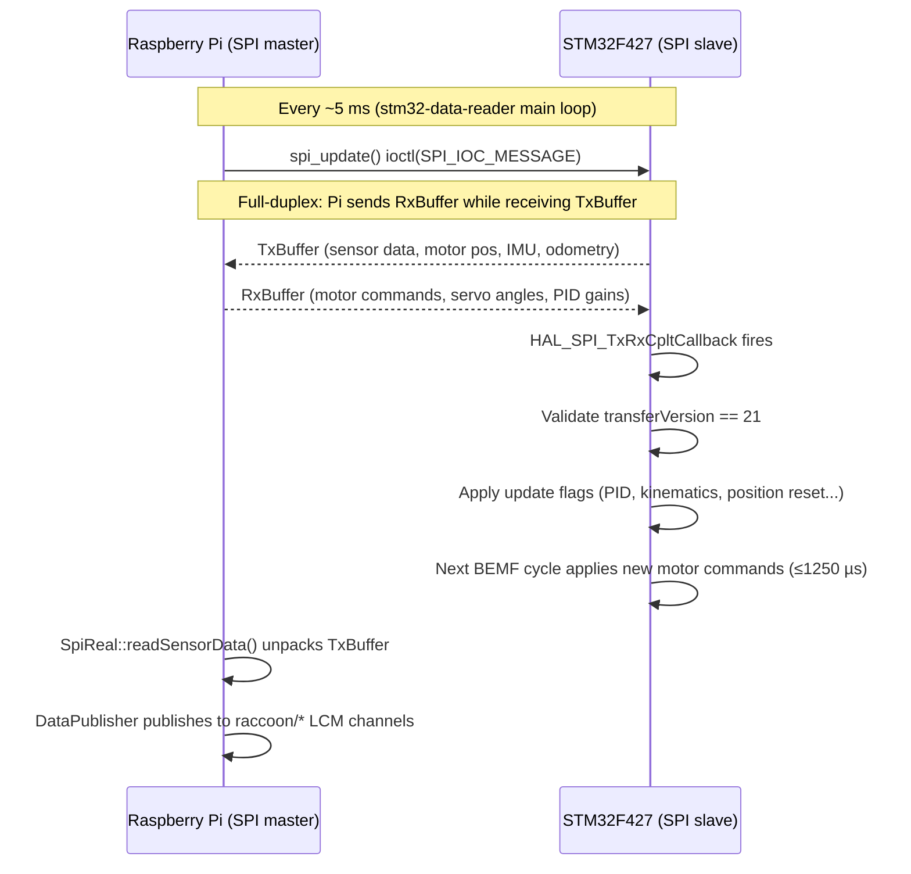

# SPI Communication Protocol

## Concept

The SPI link is the only shared boundary between the Raspberry Pi and the STM32. Everything the Pi knows about motors, sensors, and the IMU comes from this link. Every command the Pi sends to the STM32 goes through it.

The protocol is a single full-duplex packed struct exchange. There is no framing, no handshake, no length negotiation — just two fixed-size structs, one going in each direction simultaneously, every ~5 ms. The Pi is always the master; the STM32 is always the slave.

The naming convention is from the STM32's perspective:
- **`TxBuffer`** — what the STM32 *transmits* to the Pi (sensor data, motor telemetry, IMU, odometry)
- **`RxBuffer`** — what the STM32 *receives* from the Pi (motor commands, servo positions, PID gains, kinematics config)



A version mismatch (`TRANSFER_VERSION` in the received `TxBuffer` does not equal 21) triggers an automatic firmware reflash and retry on the Pi side — it is treated as a repairable deployment problem, not a silent ignore.

The canonical SPI protocol definition lives in:

```text
stm32-data-reader/shared/spi/pi_buffer.h
```

That header is the real source of truth for the wire contract between the Pi-side `stm32-data-reader` process and the STM32 firmware. Both sides of the link include the same file — there is no separate `communication_with_pi.h` copy of the version constant.

## Core model

Every SPI exchange is full duplex:

- the Pi sends an `RxBuffer` to the STM32
- the Pi simultaneously receives a `TxBuffer` from the STM32

The naming is from the STM32's perspective:

- `RxBuffer`: what the STM32 receives from the Pi
- `TxBuffer`: what the STM32 transmits back

The buffers are packed structs with no framing or length prefix. The protocol relies on struct agreement and a shared transfer version.

## Current transfer version

The current shared header defines:

```c
#define TRANSFER_VERSION 21
```

If you see docs or code comments talking about `19` or `15`, they are stale.

On startup, `stm32-data-reader` probes the firmware version with `spi_probe_version()` before sending any command. The result is logged as either `SPI version OK` or `SPI version MISMATCH`. A mismatch triggers automatic firmware reflash and a retry (see Version mismatch behavior below).

## Version mismatch behavior

This is not just a passive compatibility check.

Current Pi-side behavior in `Spi.cpp`:

- if a transfer returns the wrong `transferVersion`
- the Pi logs the mismatch
- then automatically runs the firmware reflash script
- reopens SPI
- retries the transfer
- exits fatally only if mismatch persists after reflash

That means protocol mismatch is treated as a repairable deployment problem first, not just as a silent ignore case.

## Frame sizing

The wire transfer length is:

```c
#define BUFFER_LENGTH_DUPLEX_COMMUNICATION \
  ((sizeof(TxBuffer) < sizeof(RxBuffer)) ? sizeof(RxBuffer) : sizeof(TxBuffer))
```

So each transaction always transfers the size of the larger buffer, regardless of which direction owns more data.

## `TxBuffer` (STM32 → Pi)

Current layout:

```c
typedef struct __attribute__ ((packed)) TxBuffer_tag
{
    uint8_t transferVersion;
    uint32_t updateTime;
    MotorData motor;
    int16_t analogSensor[6];
    int16_t batteryVoltage;
    uint16_t digitalSensors;
    ImuData imu;
    OdometryData odometry;
} TxBuffer;
```

High-level meaning:

- transfer version and timing
- motor telemetry
- analog and digital sensor state
- IMU data
- STM32-computed odometry

## `MotorData`

```c
typedef struct __attribute__ ((packed))
{
    int32_t bemf[4];     // Instantaneous filtered BEMF reading per motor
    int32_t position[4]; // Motor position (accumulated BEMF ticks)
    uint8_t done;        // Bit N set when motor N reached position goal
} MotorData;
```

Meaning:

- `bemf[4]`: offset-corrected, dead-zone-applied BEMF reading after the two-stage filter (median-of-3 + IIR). See `motor-control.md` for the full signal chain.
- `position[4]`: dt-aware integrated position in BEMF ticks. Unit rescaling: position increments by `corrected × dt_s` each BEMF cycle, not by raw ticks, so `ticks_to_rad` must be calibrated against this convention.
- `done`: bit `N` set when motor `N` has reached its position target (within `MTP_DONE_THRESHOLD = 40` ticks). Sticky until goal position changes or mode changes.

## `ImuData`

Current layout includes:

- `gyro`
- `accel`
- `compass`
- `linearAccel`
- `accelVelocity`
- `dmpQuat`
- `heading`
- `temperature`

The shared header is the authoritative field order and should be consulted directly when changing bindings or decoders.

## `OdometryData`

```c
typedef struct __attribute__ ((packed))
{
    float pos_x;    // meters, world frame
    float pos_y;    // meters, world frame
    float heading;  // radians, CCW-positive
    float vx;       // m/s, body frame
    float vy;       // m/s, body frame
    float wz;       // rad/s, body frame
} OdometryData;
```

Conventions in the shared header:

- `pos_x`, `pos_y`: meters in world frame
- `heading`: radians, CCW-positive
- `vx`, `vy`, `wz`: body-frame velocity (also published as individual `raccoon/odometry/vx`, `raccoon/odometry/vy`, `raccoon/odometry/wz` channels)

## `RxBuffer` (Pi → STM32)

Current layout:

```c
typedef struct __attribute__ ((packed))
{
    uint8_t transferVersion;
    uint32_t updates;
    uint8_t systemShutdown;
    uint16_t motorControlMode;
    int32_t motorTarget[4];
    float chassisVelocity[3];   // for MOT_MODE_CHASSIS: [vx (m/s), vy (m/s), wz (rad/s)]
    int32_t motorGoalPosition[4];
    uint8_t motorPositionReset;
    uint8_t servoMode;
    uint16_t servoPos[4];
    MotorPidSettings motorPidSettings;
    int8_t imuGyroOrientation[9];
    int8_t imuCompassOrientation[9];
    KinematicsConfig kinematics;
    uint8_t featureFlags;
} RxBuffer;
```

Notable fields that older docs often omit:

- `chassisVelocity[3]`: carries the body-frame setpoint `[vx, vy, wz]` for `MOT_MODE_CHASSIS`. The STM32 maps this to per-wheel velocity via `kinematics.fwd_matrix` and runs the per-motor MAV PID entirely on-chip. `motorTarget` is **ignored** when all motors are in `MOT_MODE_CHASSIS`.
- `motorPositionReset`: bitmask — bit N = reset motor N position counter to zero on the STM32. The Pi calls `reset_motor_position_on_stm32()` which sets this bitmask and sets the `PI_BUFFER_UPDATE_MOTOR_POS_RESET` update flag. There are no Pi-side software position offsets; the reset is hardware-side.
- `featureFlags`: runtime opt-in toggles (see Feature flags section).

## Update flags

Current `updates` bitmask constants:

| Bit | Constant | Purpose |
|---|---|---|
| `0x01` | `PI_BUFFER_UPDATE_MOTOR_PID_SPEED` | Update motor velocity PID settings |
| `0x02` | `PI_BUFFER_UPDATE_MOTOR_PID_POS` | Update motor position PID settings |
| `0x04` | `PI_BUFFER_UPDATE_IMU_ORIENTATION` | Apply IMU orientation matrices |
| `0x08` | `PI_BUFFER_UPDATE_SAVE_IMU_CAL` | Save IMU calibration to flash |
| `0x10` | `PI_BUFFER_UPDATE_KINEMATICS` | Apply kinematics config (including `bemf_offset`) |
| `0x20` | `PI_BUFFER_UPDATE_ODOM_RESET` | Reset odometry |
| `0x40` | `PI_BUFFER_UPDATE_MOTOR_POS_RESET` | Reset motor position counters (via `motorPositionReset` bitmask) |
| `0x80` | `PI_BUFFER_UPDATE_FEATURE_FLAGS` | Apply runtime feature flags |

## Shutdown flags

Current shutdown bits:

| Bit | Constant | Meaning |
|---|---|---|
| `0x01` | `SHUTDOWN_SERVO` | shutdown servo subsystem |
| `0x02` | `SHUTDOWN_MOTOR` | shutdown motor subsystem |

## Feature flags

Current runtime opt-in feature flags:

| Bit | Constant | Meaning |
|---|---|---|
| `0x01` | `FEATURE_BEMF_DISABLE` | disable BEMF-based feedback, used for Speed Mode |

This is operationally important because it changes what motor command modes are valid. When `FEATURE_BEMF_DISABLE` is set:

- the STM32 surfaces zeros for all BEMF readings instead of stale values
- `MOT_MODE_MAV` and `MOT_MODE_CHASSIS` are blocked firmware-side (defense in depth; the Pi reader is the primary guard)
- only `MOT_MODE_PWM`, `MOT_MODE_OFF`, and `MOT_MODE_PASSIV_BRAKE` are valid

### `disableBemfOnStartup` configuration key

The `stm32-data-reader` configuration struct exposes:

```cpp
// wombat::Configuration (include/wombat/core/Configuration.h)
bool disableBemfOnStartup{false};
```

When `true`, the reader pushes `FEATURE_BEMF_DISABLE` on the **first SPI transfer** after initialization, before accepting any motor command from LCM. The `raccoon/feature/bemf_enabled` channel is published as `0` to notify all subscribers (raccoon-lib, BotUI) that the robot is in speed mode.

Set this flag in the reader's configuration file when running open-loop (PWM-only) profiles where encoder feedback is not needed and the performance cost of stopping each motor briefly per BEMF cycle is unacceptable.

## Motor control mode packing

The shared header defines:

```c
#define MOTOR_CONTR_MOD_LENGTH 3
```

So `motorControlMode` packs four 3-bit motor modes into one 16-bit word. Motor N's mode is at bits `[3N+2 : 3N]`.

Current modes:

| Value | Constant | Meaning |
|---|---|---|
| `0b000` | `MOT_MODE_OFF` | motor off (coasts) |
| `0b001` | `MOT_MODE_PASSIV_BRAKE` | passive brake (motor terminals shorted) |
| `0b010` | `MOT_MODE_PWM` | explicit open-loop PWM duty |
| `0b011` | `MOT_MODE_MAV` | move at velocity (closed-loop velocity PID) |
| `0b100` | `MOT_MODE_MTP` | move to position (sqrt decel + velocity PID) |
| `0b101` | `MOT_MODE_CHASSIS` | on-MCU chassis velocity loop (see below) |

### `MOT_MODE_CHASSIS` — on-MCU chassis velocity loop

`MOT_MODE_CHASSIS` (value `0b101`) enables a fully on-chip closed-loop chassis velocity controller. The workflow is:

1. Set all four motors to `MOT_MODE_CHASSIS` in `motorControlMode`.
2. Write the body-frame setpoint to `chassisVelocity[3]`:
   - `chassisVelocity[0]` = vx (m/s, forward)
   - `chassisVelocity[1]` = vy (m/s, lateral — zero for differential-drive robots)
   - `chassisVelocity[2]` = wz (rad/s, CCW-positive)
3. Set the `PI_BUFFER_UPDATE_KINEMATICS` flag (once at startup) so the STM32 has the forward kinematics matrix.

The STM32 derives the per-wheel velocity setpoint as `w_i = fwd_matrix[i] · [vx, vy, wz]`, converts to BEMF units via `ticks_to_rad`, then runs the per-motor velocity PID against the BEMF reading. `motorTarget` is ignored in this mode.

This closes the chassis velocity loop entirely on the MCU, which eliminates the SPI round-trip from the control path and makes the loop latency deterministic (one BEMF cycle = 1250 µs per motor).

The `raccoon/chassis/velocity_cmd` LCM channel carries the body-frame setpoint (`vector3f_t`). The Pi-side `CommandSubscriber` routes this to `setChassisVelocity()` which writes `chassisVelocity` and sets all four motor modes to `MOT_MODE_CHASSIS` in one SPI update.

## `MotorPidSettings` struct

The velocity and position PID gains for all four motors are carried in the `RxBuffer` as a single struct:

```c
typedef struct __attribute__ ((packed))
{
    float Kp;
    float Ki;
    float Kd;
} BasicPidSettings;

typedef struct __attribute__ ((packed))
{
    // Global output clamps (applied to all four motors)
    float limMin;
    float limMax;
    float limMinInt;   // integral contribution clamp (lower)
    float limMaxInt;   // integral contribution clamp (upper)
    float tau;         // reserved / derivative filter time constant

    // Per-motor gains (capitalized field names)
    BasicPidSettings pids[4];
} MotorPidSettings;
```

The gains in `pids[N]` are **dt-explicit per-second units**. The firmware `pid_update()` function takes a `float dt` argument and multiplies `Ki` by `dt` in the integral accumulator, so the gains are physically consistent regardless of the BEMF cadence. The default boot value is `kI = 9.0`, which is equivalent to the old `kI = 0.045` at 200 Hz (9.0 = 0.045 × 200).

To override PID gains at runtime, write the new gains into `motorPidSettings` and set `PI_BUFFER_UPDATE_MOTOR_PID_SPEED` (velocity PID) or `PI_BUFFER_UPDATE_MOTOR_PID_POS` (position PID) in the `updates` field. From LCM, send a `vector3f_t` (`x=kp, y=ki, z=kd`) to `raccoon/motor/N/pid_cmd`.

## Kinematics payload

`KinematicsConfig` contains:

```c
typedef struct __attribute__ ((packed))
{
    float inv_matrix[3][4];   // inverse kinematics: wheel speeds → [vx, vy, wz]
    float ticks_to_rad[4];    // per-motor: radians per BEMF tick (encoder calibration)
    float bemf_offset[4];     // per-motor: ADC-count offset subtracted before integration
    float fwd_matrix[4][3];   // forward kinematics: [vx, vy, wz] → per-wheel rad/s
} KinematicsConfig;
```

The full struct is transmitted as one SPI payload when `PI_BUFFER_UPDATE_KINEMATICS` is set.

### `bemf_offset[4]` — per-motor BEMF zero-offset

The differential BEMF reading is not perfectly proportional to wheel speed through the origin. At standstill or low speed, the ADC measures a non-zero "coast offset" (~20–40 counts, motor-specific) caused by H-bridge settling and amplifier artifacts. If this offset is integrated each BEMF cycle without correction it adds phantom position ticks, causing odometry to drift even when the robot is stationary.

The Pi calibrates this offset using the calibration board (`auto_tune_bemf_velocity`) and stores it in `KinematicsConfig.bemf_offset[4]`. When the kinematics config is applied (via `PI_BUFFER_UPDATE_KINEMATICS`), the STM32 calls `bemf_set_offset()` which stores the values in `bemf_offset_cfg[4]`. Each BEMF cycle, the offset is subtracted from the filtered reading before it is compared to the dead zone and accumulated into position:

```c
float corrected = bemfLastReadings[ch] - bemf_offset_cfg[ch];
if (corrected < BEMF_DEADZONE && corrected > -BEMF_DEADZONE)
    corrected = 0.0f;
motor_data.bemf[ch] = (int32_t)corrected;
// … then dt-aware integration into motor_data.position[ch]
```

Until `bemf_offset` is configured (or on a fresh flash), the values default to 0.0f (no correction — original behavior).

## Speed Mode interaction

`Spi.cpp` contains a safety guard:

- if `FEATURE_BEMF_DISABLE` is active
- and a motor is commanded in `MOT_MODE_MAV` or `MOT_MODE_CHASSIS`
- the Pi side rejects that command and throws

Reason: with BEMF disabled, the firmware has no encoder-tick feedback, so velocity PID and chassis loop cannot safely close in that mode.

Speed Mode is not just a higher-level library flag. It changes which SPI command combinations are legal.

## Practical implications

- protocol docs must be derived from `pi_buffer.h`, not from memory
- transfer-version mismatch now triggers auto-reflash behavior; current version is **21**
- `chassisVelocity[3]` is a live wire-protocol field — any SPI decoder must account for its position between `motorTarget[4]` and `motorGoalPosition[4]`
- `KinematicsConfig.bemf_offset[4]` must be calibrated per robot; defaults to zero (no correction)
- `updates` is a true feature/update bitmask in the current shared header
- runtime feature flags are part of the live wire contract
- speed mode changes valid motor-command semantics at the SPI boundary
- motor position reset is on-STM32 via the `motorPositionReset` bitmask; there are no Pi-side software position offsets

## Related files and pages

- Shared header: `stm32-data-reader/shared/spi/pi_buffer.h` — the authoritative source of truth for all struct layouts
- Pi SPI implementation: `stm32-data-reader/src/wombat/hardware/Spi.cpp`
- BEMF offset calibration: `stm32-data-reader/firmware/Firmware/src/Sensors/bemf.c`
- [Motor Control](../motor-control/) — how motor modes and PID are applied once commands arrive
- [Data Pipeline](../data-pipeline/) — how sensor data flows from SPI through LCM to Python
